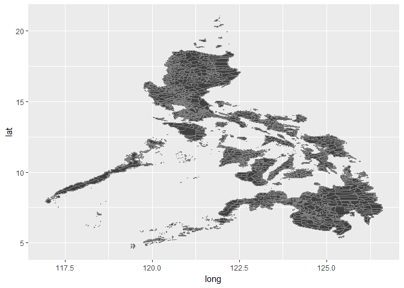
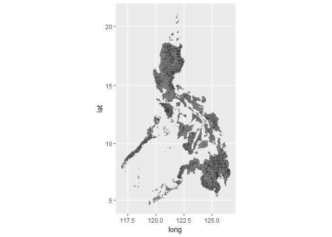
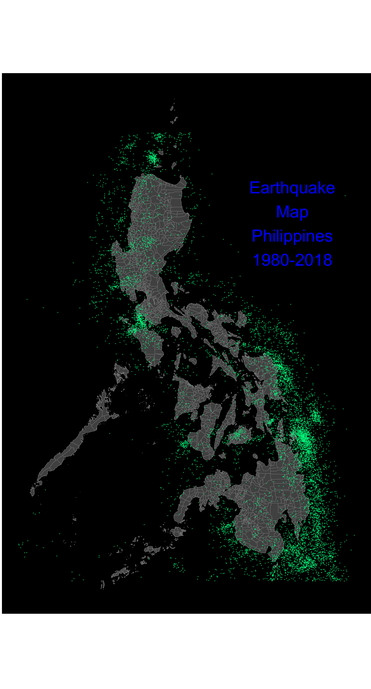

# Earthquakes 1980-2018, Philippines

## Synopsis

After making the project Hurricanes 1999-2010, Philippines, I was left wondering whether the island of Mindanao was not only blessed with having fewer storms compared to the other 2 main islands of the Philippines, Luzon and Visayas, but also blessed with having fewer earthquake episodes in the past.  In this project, I will use the visualization tools I have learned to illustrate where earthquakes have occurred in the Philippines between 1980 - 2018. 


```r
library(lubridate)
library(dplyr)
library(ggplot2)
library(rmarkdown)
library(knitr)
```

# The data

<br>

The data we will be using comes from the [US Geological Survey](https://earthquake.usgs.gov/). They have a web service where you can input certain parameters and obtain the data you need. To use the service, click on this link https://earthquake.usgs.gov/earthquakes/search/

In keeping with the principle of making a presentation reproducible, the parameters I used for searching for the data are the following:

|     Parameter      |    Value             |
| :----------------: | :--------------------|
|  Magnitude (min)   | 4.5                  |
|  Magnitude (max)   | 9.0                  |
|  Start(UTC)        | 1980-03-27 23:59:59  |
|   End(UTC)         | 2018-03-27 23:59:59  |
|  Latitude (min)    | 4.888                |
|  Latitude (max)    | 19.973               |
|  Longitude (min)   | 116.543              |
|  Longitude (max)   | 128.408              |

The minimum and maximum latitude and longitude values were arrived at by drawing a rectangle on the Philippine map. The data was downloaded on March 27, 2018 9:20 am Philippine Time.

<br>

# Reading in the data

<br>

We have 22 variables that describes the time, location, and other characteristics of the earthquake. We have 8,646 rows, each row representing an earthquake occurence with a magnitude greater than or eaqual to 4.0. Earthquakes with a magnitude less than 4 were filtered from the data when the parameters for the search were specified in [USGS](https://earthquake.usgs.gov/earthquakes/search/).


```r
earthq <- read.csv("query.csv", stringsAsFactors = FALSE)
glimpse(earthq)
```

```
## Observations: 8,646
## Variables: 22
## $ time            <chr> "2018-03-24T10:34:37.590Z", "2018-03-23T10:41:...
## $ latitude        <dbl> 10.1301, 5.4021, 4.9389, 6.5957, 10.4157, 8.07...
## $ longitude       <dbl> 126.0434, 126.4825, 126.9442, 123.6176, 126.01...
## $ depth           <dbl> 80.94, 47.51, 78.30, 610.95, 35.00, 10.00, 10....
## $ mag             <dbl> 5.1, 4.7, 4.9, 4.6, 4.5, 5.0, 5.2, 4.8, 4.6, 5...
## $ magType         <chr> "mb", "mb", "mb", "mb", "mb", "mb", "mww", "mb...
## $ nst             <int> NA, NA, NA, NA, NA, NA, NA, NA, NA, NA, NA, NA...
## $ gap             <dbl> 102, 96, 74, 47, 153, 109, 92, 96, 100, 69, 12...
## $ dmin            <dbl> 3.075, 1.884, 2.514, 2.003, 3.353, 1.302, 0.38...
## $ rms             <dbl> 0.87, 0.87, 0.69, 0.86, 0.47, 0.59, 1.24, 0.68...
## $ net             <chr> "us", "us", "us", "us", "us", "us", "us", "us"...
## $ id              <chr> "us1000d8k1", "us1000d7yl", "us1000d7yh", "us1...
## $ updated         <chr> "2018-03-24T11:24:37.457Z", "2018-03-23T11:06:...
## $ place           <chr> "12km N of Santa Monica, Philippines", "109km ...
## $ type            <chr> "earthquake", "earthquake", "earthquake", "ear...
## $ horizontalError <dbl> 9.1, 4.3, 5.7, 9.6, 15.3, 8.3, 5.3, 3.9, 10.7,...
## $ depthError      <dbl> 6.4, 7.7, 6.9, 8.5, 2.0, 1.9, 1.6, 7.0, 7.5, 1...
## $ magError        <dbl> 0.043, 0.090, 0.059, 0.049, 0.221, 0.067, 0.07...
## $ magNst          <int> 176, 37, 90, 124, 6, 70, 18, 189, 73, 43, 42, ...
## $ status          <chr> "reviewed", "reviewed", "reviewed", "reviewed"...
## $ locationSource  <chr> "us", "us", "us", "us", "us", "us", "us", "us"...
## $ magSource       <chr> "us", "us", "us", "us", "us", "us", "us", "us"...
```

<br>

We are only interested in the variables: `date_time`, `mag`, `latitude`, `longitude`, and `place`. We will select this variables and create new ones which might prove useful later on in manipulating our dataframe for plotting.

<br>


```r
earthq <- earthq %>% 
        select(time,
               latitude,
               longitude,
               mag,
               place) %>%
        mutate(date_time = ymd_hms(time,                     ### create new time variable of class POSIXct
                                   tz = "Asia/Taipei")) %>%  ### Convert from UTC to Asia/Taipei
        mutate(date = date(date_time),                       ### create date variable
               hr = hour(date_time),                         ### create hour variable
               mins = minute(date_time),                     ### create minutes variable
               secs = second(date_time)) %>%                 ### create seconds varaible
        select(date_time,                                    ### selct only the following variables: latitude.
               latitude,                                     ### longitude, mag, place, date, hr, mins, secs
               longitude,
               mag,
               place,
               date,
               hr,
               mins,
               secs)
```

```
## Date in ISO8601 format; converting timezone from UTC to "Asia/Taipei".
```

```r
head(earthq, 3)
```

```
##             date_time latitude longitude mag
## 1 2018-03-24 18:34:37  10.1301  126.0434 5.1
## 2 2018-03-23 18:41:35   5.4021  126.4825 4.7
## 3 2018-03-23 18:19:06   4.9389  126.9442 4.9
##                                 place       date hr mins  secs
## 1 12km N of Santa Monica, Philippines 2018-03-24 18   34 37.59
## 2   109km ESE of Caburan, Philippines 2018-03-23 18   41 35.67
## 3 171km ESE of Sarangani, Philippines 2018-03-23 18   19  6.67
```

```r
tail(earthq, 3)
```

```
##                date_time latitude longitude mag                     place
## 8644 1980-03-25 10:56:21    5.473   126.012 4.6     Mindanao, Philippines
## 8645 1980-03-24 10:39:01    6.030   127.308 4.8 Philippine Islands region
## 8646 1980-03-22 23:53:56   13.453   120.559 5.1      Mindoro, Philippines
##            date hr mins secs
## 8644 1980-03-25 10   56 21.1
## 8645 1980-03-24 10   39  1.0
## 8646 1980-03-22 23   53 56.9
```

<br>

Our data spans 38 years of earthquake occurences in the Philippines. By now you probably have noticed the small rectangular tabs with the word "Code" written on them. Click on them to view the codes that produced the plots If you're interested. Feel free to copy the codes and cite this documents as reference. That's the best thing I like about R and the people behind R. Freely I have received and freely I give. Now, if i can just land my first job using R, my Cinderella story would be complete.

<br>

# Plotting the data

We will be using the package `ggplot2` to plot our earthquake data. I will plot the data iteratively, adding layers so you can see the transformation from using the default settings to customizing the arguments for ggplot. 


```r
phil_map <- readRDS("PHL_adm2.rds")
phil_mapdf <- fortify(phil_map)

g <- phil_mapdf %>% 
  ggplot(aes(x = long,
             y = lat,
             group = group)) +
         geom_polygon(fill = "gray25",
                      colour = "gray50",
                      size = 0.2)
g
```

<!-- -->

The map appears to be distorted in terms of its dimensions. From what I've read this is due to the different ratio of 1 unit of longitude to 1 unit of latitude when trying to depict a spherical earth in a 2 dimensional map. Longitudinal lines are nearer each other near the poles and grow apart as they approach the equator. 

Since the Philippines is near the equator, where 1 unit of longitude is roughly equal to 1 unit of latitude, we can rely on ggplot's `coord_map` function. 

Seems like Hadley Wickham and Winston Chang, authors of the `ggplot2` package thought of everything. We can rely on `ggplot`s `coord_map` function to ensure that the dimensions are correctly plotted.


```r
g <- g + coord_map()
g
```

<!-- -->

That looks better.  Now let's improve the overall appearance of the map and add our data.


```r
g <- g + theme_classic() +
         theme(axis.line = element_blank(),
         axis.text = element_blank(),
         axis.ticks = element_blank(),
         plot.margin=unit(c(0, 0, 0, 0),
                          "mm"),
         axis.title.x = element_blank(),
         axis.title.y = element_blank(),
         panel.background = element_rect(fill='black')) +
         geom_point(data = earthq
               , aes(x = longitude,
                     y = latitude,
                     group = "NULL"),
                      fill = "springgreen",
                      colour = "springgreen",
                      size = 0.2, alpha = 0.4)

g
```

<!-- -->

All we need now is some title


```r
g + annotate("text",
                 x = 126,
                 y = 17,
                 size = 8,
                 color = "blue",
                 label = "Earthquake\nMap\nPhilippines\n1980-2018")
```

<!-- -->

It seems that the island of Palawan, on the far left, where the world famous resort El Nido is located does not experience the same amount of earthquake as the rest ot the islands.  Our data spans 38 years and contains 8,646 earthquake occurences which at first glance appears to be a good representative sample. However, we think of time in terms of a person's lifespan but in earth years that is quite short. I leave it up to you to explore this in greater detail.

Hope you enjoyed this short presentation. Suggestions and comments are welcome.

# References

[Mapping Global Earthquakes and Hurricane tracks with R](http://david-lallemant.com/mapping-global-earthquakes-and-hurricane-tracks-with-r-2/)
by David Lallemant 


[Tips and tricks for working with images and figures in R Markdown documents](http://www.zevross.com/blog/2017/06/19/tips-and-tricks-for-working-with-images-and-figures-in-r-markdown-documents/)
Posted on June 19, 2017	by hollie@zevross.com


