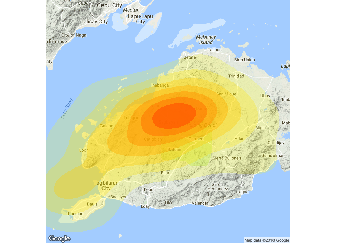

# Synopsis

While I was browsing the internet to complete my notes in my recently concluded course in Coursera, Building Data Visualization Tools, I came across a [presentation](https://erikafille.ph/2017/01/18/earthquake-maps-in-r/)  by Erika Fille using R that used data from the Philippines. I didn't have an inkiling were to obtain data locally, and decided to try duplicating the presentation using what I have recently learned about mapping in R. 

## Loading Packages

At the start I only wanted to duplicate the presentation which was done using packages included in base R.  However, the richness of R has grown over the past years that newer packages offer something new, different and definitely worth exploring. Join me as we explore the many fascinating ways to make maps in R.


```r
library(sp)
library(rmarkdown)
library(dplyr)
library(lubridate)
library(ggmap)
library(ggplot2)
library(viridis)
```


## Downloading the data

The data for this presentation was downloaded from the [USGS](https://earthquake.usgs.gov/) Search Earthquake Catalog website https://earthquake.usgs.gov/earthquakes/search/ and contains a record of all earthquakes that occured around the island of Bohol from October 15, 2015 to October 17, 2015.

The following search parameters were used and a square was drawn over the map of Bohol and its neighboring areas:

|      parameter    |         value              |
| :---------------: | :------------------------- |
| Minimum Magnitude | 2.5                        |
|  Start Date/Time  | (UTC) 2013-10-15 00:00:00  |
|   End  Date/Time  | (UTC) 2013-10-17 00:00:00  |
    
    

```r
Oct_2015_Quake <- read.csv("query.csv")
```

## Variables in the dataset and their meanings

|   variable   |         description                                                       |
| :----------: | :------------------------------------------------------------------------- |
|    time      | Time when the event occurred. Times are reported in milliseconds since the epoch ( 1970-01-01T00:00:00.000Z), and do not include leap seconds. In certain output formats, the date is formatted for readability.|
|  latitude    | Decimal degrees latitude. Negative values for southern latitudes.          |
|  longitude   | Decimal degrees longitude. Negative values for western longitudes.         | 
|    depth     | Depth of the event in kilometers.                                          |
|     mag      | The magnitude for the event.                                               |
|  magtype     | The method or algorithm used to calculate the preferred magnitude for the event.|
|     nst      | The total number of seismic stations used to determine earthquake location.|
|    gap       | The largest azimuthal gap between azimuthally adjacent stations (in degrees).|
|    dmin      | Horizontal distance from the epicenter to the nearest station (in degrees). 1 degree is approximately 111.2 kilometers.|
|     rms      | The root-mean-square (RMS) travel time residual, in sec, using all weights. This parameter provides a measure of the fit of the observed arrival times to the predicted arrival times for this location.|
|    net       | The ID of a data contributor. Identifies the network considered to be the preferred source of information for this event.|
|     id       | A unique identifier for the event.                                         |
|   updated    | Time when the event was most recently updated.                             | 
|    place     | Textual description of named geographic region near to the event.          |
|    type      | Type of seismic event.                                                     |
|horizontaError| The horizontal location error, in km, defined as the length of the largest projection of the three principal errors on a horizontal plane.|
|  depthError  | Uncertainty of reported depth of the event in kilometers.                  |
|   magError   | Uncertainty of reported magnitude of the event. The estimated standard error of the magnitude. |
|    magNst    | The total number of seismic stations used to calculate the magnitude for this earthquake.|
|   status     | Indicates whether the event has been reviewed by a human.                  |
|locationsource| The network that originally authored the reported location of this event.  |
|  magSource   | The root-mean-square (RMS) travel time residual, in sec, using all weights. This parameter provides a measure of the fit of the observed arrival times to the predicted arrival times for this location.|

**NOTE** Information about the variables were obtained from https://earthquake.usgs.gov/data/comcat/data-eventterms.php


## Structure of our data


```r
str(Oct_2015_Quake)
```

```
## 'data.frame':	83 obs. of  22 variables:
##  $ time           : Factor w/ 83 levels "2013-10-15T00:12:32.050Z",..: 83 82 81 80 79 78 77 76 75 74 ...
##  $ latitude       : num  9.7 9.93 9.77 9.89 9.82 ...
##  $ longitude      : num  124 124 124 124 124 ...
##  $ depth          : num  10 24.4 10 21 24 ...
##  $ mag            : num  5.3 4.9 4.8 4.8 4.5 4.9 4.6 5.2 4.9 4.6 ...
##  $ magType        : Factor w/ 3 levels "mb","mwb","mww": 1 1 1 1 1 1 1 1 1 1 ...
##  $ nst            : logi  NA NA NA NA NA NA ...
##  $ gap            : int  43 71 112 103 148 67 174 72 78 77 ...
##  $ dmin           : num  3.16 3.25 3.34 3.18 8.48 ...
##  $ rms            : num  1.39 1.29 0.63 0.55 0.79 1.09 0.91 0.78 0.81 0.81 ...
##  $ net            : Factor w/ 1 level "us": 1 1 1 1 1 1 1 1 1 1 ...
##  $ id             : Factor w/ 83 levels "usb000kdb4","usb000kdbw",..: 38 37 83 36 82 35 81 34 33 32 ...
##  $ updated        : Factor w/ 14 levels "2013-12-30T23:41:07.000Z",..: 6 5 5 5 5 5 5 5 4 4 ...
##  $ place          : Factor w/ 80 levels "0km ENE of Catigbian, Philippines",..: 66 25 31 38 45 28 12 9 17 73 ...
##  $ type           : Factor w/ 1 level "earthquake": 1 1 1 1 1 1 1 1 1 1 ...
##  $ horizontalError: logi  NA NA NA NA NA NA ...
##  $ depthError     : num  1.6 2.5 1.5 4 10.1 2.7 3.1 1.7 1.8 4.1 ...
##  $ magError       : num  0.048 0.066 0.134 0.088 0.18 0.076 0.207 0.052 0.07 0.105 ...
##  $ magNst         : logi  NA NA NA NA NA NA ...
##  $ status         : Factor w/ 1 level "reviewed": 1 1 1 1 1 1 1 1 1 1 ...
##  $ locationSource : Factor w/ 1 level "us": 1 1 1 1 1 1 1 1 1 1 ...
##  $ magSource      : Factor w/ 1 level "us": 1 1 1 1 1 1 1 1 1 1 ...
```

## First six rows of the data


```r
head(Oct_2015_Quake)
```

```
##                       time latitude longitude depth mag magType nst gap
## 1 2013-10-16T23:37:28.370Z   9.7020  123.7936 10.00 5.3      mb  NA  43
## 2 2013-10-16T22:19:12.410Z   9.9295  123.9820 24.42 4.9      mb  NA  71
## 3 2013-10-16T18:57:59.450Z   9.7679  123.5686 10.00 4.8      mb  NA 112
## 4 2013-10-16T17:04:31.940Z   9.8926  124.0694 20.96 4.8      mb  NA 103
## 5 2013-10-16T15:35:33.090Z   9.8188  123.8910 24.02 4.5      mb  NA 148
## 6 2013-10-16T15:32:45.430Z   9.5926  123.7010 20.22 4.9      mb  NA  67
##    dmin  rms net         id                  updated
## 1 3.156 1.39  us usb000kfbv 2015-01-30T04:34:03.305Z
## 2 3.250 1.29  us usb000kfad 2013-12-30T23:41:11.000Z
## 3 3.338 0.63  us usc000kpb6 2013-12-30T23:41:11.000Z
## 4 3.177 0.55  us usb000kevr 2013-12-30T23:41:11.000Z
## 5 8.476 0.79  us usc000kpaz 2013-12-30T23:41:11.000Z
## 6 3.120 1.09  us usb000kesc 2013-12-30T23:41:11.000Z
##                               place       type horizontalError depthError
## 1       6km SW of Bood, Philippines earthquake              NA        1.6
## 2  2km S of Panaytayon, Philippines earthquake              NA        2.5
## 3 3km ENE of Dalaguete, Philippines earthquake              NA        1.5
## 4   3km SW of Sagbayan, Philippines earthquake              NA        4.0
## 5 4km NNW of Antequera, Philippines earthquake              NA       10.1
## 6       2km W of Duljo, Philippines earthquake              NA        2.7
##   magError magNst   status locationSource magSource
## 1    0.048     NA reviewed             us        us
## 2    0.066     NA reviewed             us        us
## 3    0.134     NA reviewed             us        us
## 4    0.088     NA reviewed             us        us
## 5    0.180     NA reviewed             us        us
## 6    0.076     NA reviewed             us        us
```


# Tidying the data

While reading the function in R using the function `read.csv`, i forgot to specify the argument `stringsAsFactors = FALSE` and we ended up with a lot of factor variables as shown by the output of the function `str` above. Fortunately we only need a few variables for our purpose of plotting the 2013 Bohol Earthquake.

The variable `time` is read in as a factor variable and in order for that variable to convey the quantity of time, we need to change it to a class that conveys the sequence, continuity, and passage of time. Furthermore, it uses UTC or Coordinated Universal Time.  UTC is the time standard for which the world regulates clocks and time. Philippine Standard Time (PST) is eight hours ahead of UTC. Since R does not recognize `PST` as a time zone, we will use `Asia/Taipei` instead.


```r
Oct_2015_Quake <- Oct_2015_Quake %>%
        mutate(date_time = ymd_hms(time, tz = "Asia/Taipei")) %>% ### convert to dttm class
        mutate(date = date(date_time),                            ### separate date
               hr = hour(date_time),                              ### separate hour
               mins = minute(date_time),                          ### separate minutes
               secs = second(date_time))                          ### separate seconds
```

```
## Date in ISO8601 format; converting timezone from UTC to "Asia/Taipei".
```

```r
summary(Oct_2015_Quake)
```

```
##                        time       latitude        longitude    
##  2013-10-15T00:12:32.050Z: 1   Min.   : 9.484   Min.   :123.3  
##  2013-10-15T00:17:39.940Z: 1   1st Qu.: 9.746   1st Qu.:123.8  
##  2013-10-15T00:18:51.590Z: 1   Median : 9.863   Median :124.1  
##  2013-10-15T00:19:26.590Z: 1   Mean   : 9.863   Mean   :124.1  
##  2013-10-15T00:20:27.710Z: 1   3rd Qu.: 9.953   3rd Qu.:124.2  
##  2013-10-15T00:22:21.480Z: 1   Max.   :10.303   Max.   :125.2  
##  (Other)                 :77                                   
##      depth            mag        magType    nst               gap       
##  Min.   : 4.88   Min.   :4.000   mb :80   Mode:logical   Min.   : 12.0  
##  1st Qu.:10.00   1st Qu.:4.400   mwb: 1   NA's:83        1st Qu.: 72.5  
##  Median :10.00   Median :4.600   mww: 2                  Median :100.0  
##  Mean   :13.99   Mean   :4.702                           Mean   :104.1  
##  3rd Qu.:20.00   3rd Qu.:4.900                           3rd Qu.:130.5  
##  Max.   :29.09   Max.   :7.100                           Max.   :193.0  
##                                                                         
##       dmin             rms         net              id    
##  Min.   : 2.821   Min.   :0.3100   us:83   usb000kdb4: 1  
##  1st Qu.: 3.134   1st Qu.:0.7250           usb000kdbw: 1  
##  Median : 3.191   Median :0.8600           usb000kdca: 1  
##  Mean   : 4.302   Mean   :0.8776           usb000kdd6: 1  
##  3rd Qu.: 3.291   3rd Qu.:1.0450           usb000kdda: 1  
##  Max.   :21.613   Max.   :1.5100           usb000kddn: 1  
##                                            (Other)   :77  
##                      updated                                  place   
##  2013-12-30T23:41:08.000Z:25   11km WNW of Duljo, Philippines    : 2  
##  2013-12-30T23:41:09.000Z:17   3km ENE of San Miguel, Philippines: 2  
##  2013-12-30T23:41:07.000Z:15   6km N of Nueva Fuerza, Philippines: 2  
##  2013-12-30T23:41:10.000Z:10   0km ENE of Catigbian, Philippines : 1  
##  2013-12-30T23:41:11.000Z: 7   0km ESE of San Isidro, Philippines: 1  
##  2015-01-30T04:34:03.305Z: 1   0km N of Danao, Philippines       : 1  
##  (Other)                 : 8   (Other)                           :74  
##          type    horizontalError   depthError        magError     
##  earthquake:83   Mode:logical    Min.   : 1.300   Min.   :0.0480  
##                  NA's:83         1st Qu.: 1.800   1st Qu.:0.0770  
##                                  Median : 1.900   Median :0.1200  
##                                  Mean   : 2.778   Mean   :0.1289  
##                                  3rd Qu.: 3.150   3rd Qu.:0.1620  
##                                  Max.   :10.600   Max.   :0.5190  
##                                                   NA's   :2       
##   magNst             status   locationSource magSource
##  Mode:logical   reviewed:83   us:83          us:83    
##  NA's:83                                              
##                                                       
##                                                       
##                                                       
##                                                       
##                                                       
##    date_time                        date                  hr       
##  Min.   :2013-10-15 08:12:32   Min.   :2013-10-15   Min.   : 0.00  
##  1st Qu.:2013-10-15 09:36:11   1st Qu.:2013-10-15   1st Qu.: 8.00  
##  Median :2013-10-15 16:42:49   Median :2013-10-15   Median :10.00  
##  Mean   :2013-10-15 21:12:50   Mean   :2013-10-15   Mean   :11.75  
##  3rd Qu.:2013-10-16 04:39:53   3rd Qu.:2013-10-16   3rd Qu.:16.00  
##  Max.   :2013-10-17 07:37:28   Max.   :2013-10-17   Max.   :23.00  
##                                                                    
##       mins            secs      
##  Min.   : 0.00   Min.   : 0.13  
##  1st Qu.:18.00   1st Qu.:20.96  
##  Median :32.00   Median :28.34  
##  Mean   :29.66   Mean   :31.84  
##  3rd Qu.:40.50   3rd Qu.:45.98  
##  Max.   :59.00   Max.   :59.53  
## 
```

# Largest magnitude earthquake

We will create a separate data frame for the earthquake with the largest magnitude during that time period.


```r
max_mag <- Oct_2015_Quake %>% filter(mag == max(mag))
max_mag
```

```
##                       time latitude longitude depth mag magType nst gap
## 1 2013-10-15T00:12:32.050Z   9.8796  124.1167 19.04 7.1     mww  NA  12
##    dmin rms net         id                  updated
## 1 3.144 1.3  us usb000kdb4 2017-11-14T15:39:03.247Z
##                             place       type horizontalError depthError
## 1 4km SE of Sagbayan, Philippines earthquake              NA        2.9
##   magError magNst   status locationSource magSource           date_time
## 1       NA     NA reviewed             us        us 2013-10-15 08:12:32
##         date hr mins  secs
## 1 2013-10-15  8   12 32.05
```

# Recreating the plot in ggplot

The [plot](https://erikafille.ph/2017/01/18/earthquake-maps-in-r/) that I'm trying to produce was done using base R. I will try to recreate it using ggplot. To see how the original plot was done in base R just click on the link above.

The administrative maps in the .rds format comes from the [Global Administrative Website](http://gadm.org/about). We read them in R using the function `readRDS` in the base package and then subset the shapefiles for the particular town of Sagbayan, the epicenter of the7.1 M earthquake and the town of Loon which suffered the greatest casualties. Only the town of Sagbayan is shown in the plot below.


```r
phil_map <- readRDS("PHL_adm2.rds")

bohol_map <- phil_map[phil_map$NAME_1 == "Bohol", ]
bohol_mapdf <- fortify(bohol_map, region = "NAME_2")

sagbayan_map <- phil_map[phil_map$NAME_2 == "Sagbayan", ]     ### filter map only for sagbayan
sagbayan_mapdf <- fortify(sagbayan_map)                       ### use fortify function so you can use map in ggplot

loon_map <- phil_map[phil_map$NAME_2 == "Loon", ]
loon_mapdf <- fortify(loon_map) 

Oct_2015_Quake$date <- as.factor(Oct_2015_Quake$date)

bohol_mapdf %>%
    ggplot(aes(x = long,
               y = lat,
               group = group)) +
    geom_polygon(fill = "black",
                 color = "gray50") +
    geom_polygon(fill = "yellow",
                 data = sagbayan_mapdf) + 
    coord_map() +
    geom_point(data = Oct_2015_Quake,
               aes(x = longitude,
                   y = latitude,
                   color = date,
                   group = "Null"),
               size = 3) +
    geom_point(data = Oct_2015_Quake,
               aes(x = longitude,
                   y = latitude,
                   color = date,
                   group = "Null"),
               size = 5,
               stroke = 1.2,
               shape = 1) +
        theme(panel.background = element_rect(fill = 'gray80'),
              panel.grid.major = element_blank(),
              panel.grid.minor = element_blank()) +
        xlim(c(123.68114,124.64547)) +
        ylim(c(9.48583, 10.25)) +
    geom_point(data = max_mag,
               aes(x = longitude,
                   y = latitude,
                   group = "Null"),
               size = 5,
               color = "red") +
    geom_point(data = max_mag,
               aes(x = longitude,
                   y = latitude,
                   group = "Null"),
               size = 7,
               stroke = 1.2,
               color = "red",
               shape = 1) +
    geom_point(data = max_mag,
               aes(x = longitude,
                   y = latitude,
                   group = "Null"),
               size = 11,
               stroke =1.5,
               color = "red",
               shape = 1) +
        theme(legend.justification=c(0.05, 0.95),
              legend.position=c(0.05, 0.95),
              legend.key = element_rect("gray80")) +
        scale_color_manual(values = c("#FA8072",
                                      "#00B2EE",
                                      "#8FBC8F")) +
        guides(col=guide_legend(title="Date"))
```

<!-- -->

Mapping the color of the  points to date puts emphasis on the number of aftershocks that occurred per day.

## Aftershocks

I think a better way to show how many afershocks were felt each day is to use the function `facet_wrap`.


```r
bohol_mapdf %>%
    ggplot(aes(x = long,
               y = lat,
               group = group)) +
    geom_polygon(fill = "black",
                 color = "gray50") +
    geom_polygon(fill = "yellow",
                 data = sagbayan_mapdf) + 
    coord_map() +
    geom_point(data = Oct_2015_Quake,
               aes(x = longitude,
                   y = latitude,
                   color = date,
                   group = "Null"),
               size = 2) +
    geom_point(data = Oct_2015_Quake,
               aes(x = longitude,
                   y = latitude,
                   color = date,
                   group = "Null"),
               size = 4,
               stroke = 1.2,
               shape = 1) +
        theme(panel.background = element_rect(fill = 'gray80'),
              panel.grid.major = element_blank(),
              panel.grid.minor = element_blank(),
              legend.position="bottom",
              legend.box = "horizontal") +
        xlim(c(123.68114,124.64547)) +
        ylim(c(9.48583, 10.25)) +
    geom_point(data = max_mag,
               aes(x = longitude,
                   y = latitude,
                   group = "Null"),
               size = 3,
               color = "red") +
    geom_point(data = max_mag,
               aes(x = longitude,
                   y = latitude,
                   group = "Null"),
               size = 5,
               stroke = 1.5,
               shape = 1) +
        scale_color_manual(values = c("#FA8072",
                                      "#00B2EE",
                                      "#8FBC8F")) +
        facet_wrap(~date)
```


# Finding Bohol

Everyone nowadays are familiar with the nice google maps available in the web. Let's download a map from google using the `ggmap` package and plot our data on that map

We will use the `geocode` function from the package `ggmap` to obtain the appropriate latitude/longitude center of Bohol from `Google`. Thanks to the people behind Google for offering these services for free. 

At this moment a new project is brewing in my head with regard to a dataset that we used for predicting the prices of homes in Ames, Iowa. One of the projects that I reviewed from my peers in the class contained a map of the houses, which I thought was pretty cool.  I'd like to try that next.


```r
bohol <- geocode("Sagbayan, Bohol")
bohol
```

Please take note that Google Maps API places a limit of 2500 queries  per day. We can use the function `geocodeQueryCheck` function to determine how many queries remain. 

# Basemap

For our exploration, let's use a terrain map from Google


```r
bohol_terrain <- get_map(c(lon = 124.0975,
                           lat = 9.899196),
                         zoom = 10,
                         maptype = "terrain")

bohol_terrain_map <- ggmap(bohol_terrain, extent = 'device')
bohol_terrain_map
```

<!-- -->

This will be the basemap we will be using for this exploration. There are other maps available from googgle, stamen, osm and cloudmade. You can explore them by specifying the map you want using the arguments `source` and `maptype` in the `get-map` function. 

We will now add some points. We will be using size and transparency to map the variable mag, which stands for the Magnitude of the earthquake. you will recognize the earthquake with the largest magnitude by the intensity of the color and its size.

## Plotting the data over the map

For the next series of  plots The emphasis will be on the magnitude of the earthquake and not the date.


```r
bohol_terrain_map +
        geom_point(data = Oct_2015_Quake,
                   aes(x = longitude,
                       y = latitude,
                       size = mag,
                       alpha = mag),
                   color = "firebrick1") +
        scale_size_continuous(name = "Magnitude", range=range(Oct_2015_Quake$mag))
```

```
## Warning: Removed 10 rows containing missing values (geom_point).
```

<!-- -->

The warning that we got, tells us that there were several points that was not plotted on the map as it was outside of the range of the map. As you can see, the map from google is more zoomed-in than the earlier map we created using ggplot. Hence, some of the data points were not plotted. We'll set the options in our code chunks to ignore the warnings

It looks good but the sizes of the points fail to convey the differences between the magnitude of the different aftershocks. Instead of using the function `scale_size_continuous` to scale the sizes of our points, we will try to use the `scale_radius` function. 

## Using the function `scale_radius`


```r
bohol_terrain_map +
        geom_point(data = Oct_2015_Quake,
                   aes(x = longitude,
                       y = latitude,
                       size = mag,
                       alpha = mag),
                   color = "firebrick1") +
        scale_radius()
```

<!-- -->

I think the lower values of magnitude got depicted too small. Let's give it a try without specifying `scale_radius` or `scale_size_continuous`

## Default settings


```r
bohol_terrain_map +
        geom_point(data = Oct_2015_Quake,
                   aes(x = longitude,
                       y = latitude,
                       size = mag,
                       alpha = mag),
                   color = "firebrick1") +
        labs(title="7.1M Bohol Earthquake",
             subtitle="October 15, 2013",
             caption="Data from US Geological Survey")
```

<!-- -->

This looks a lot better for my taste. BTW, if you noticed the code above, you'd see that I tried to incorporate a title, subtitle and caption but it did not appear on the plot.

# Specifying extent

By specifying the argument extent to `panel` or `normal` in the function `ggmap` we can make the title, subtitle, and caption appear.

## extent = 'normal'


```r
bohol_terrain %>%
        ggmap(extent = 'normal')  +
 geom_point(data = Oct_2015_Quake,
            aes(x = longitude,
                y = latitude,
                size = mag,
                alpha = mag),
            color = "firebrick1") +
labs(title="7.1M Bohol Earthquake",
      subtitle="October 15, 2013",
      caption="Data from US Geological Survey")
```

<!-- -->

Not only do we see the title, subtitle, and caption but we also see the missing points that the warning was telling us about. The behviour of the legend, the size of the map and points changed as well. Notice how large the datapoints are in proportion to the size of the map. This type of setting has a lot of creative potential for adding explanatory text to both sides of the plot using the `annotation_custom` function in `ggplot`.  

## extent = 'panel'


```r
bohol_terrain %>%
        ggmap(extent = 'panel')  +
 geom_point(data = Oct_2015_Quake,
            aes(x = longitude,
                y = latitude,
                size = mag,
                alpha = mag),
            color = "firebrick1") +
        scale_radius(range = c(2, 5)) +
 labs(title="7.1M Bohol Earthquake",
      subtitle="October 15, 2013",
      caption="Data from US Geological Survey") 
```

<!-- -->

Specifying `extent = panel` changes the way the plot is printed again. The size of the datapoints have to be adjusted eveytime the size of the map changes. By specifying the argument `range` to the function `scale_radius` I was able to change the size of the points to what I think is best and as bonus a single legend represents both the size and transparency. 

If you don't like the axis ticks, labels, and title we can use the function 'theme` and specify it to its arguments.


```r
bohol_terrain %>%
        ggmap(extent = 'panel')  +
 geom_point(data = Oct_2015_Quake,
            aes(x = longitude,
                y = latitude,
                size = mag,
                alpha = mag),
            color = "firebrick1") +
        scale_radius(range = c(2, 5)) +
 labs(title="7.1M Bohol Earthquake",
      subtitle="October 15, 2013",
      caption="Data from US Geological Survey") +
        theme(axis.title = element_blank(),
              axis.text = element_blank(),
              axis.ticks = element_blank())
```

<!-- -->

# Adding Emphasis to certain towns

Let's now explore using shapefiles to map particular towns. Let's distinguish the town of Sagbayan where the 7.2 magnitude eathquake centered and the town of Loon where the highest number of casualties occured. 

 We used the `fortify` function to transform the shapefiles to a dataframe and plot the map using `ggplot`.


```r
cnames <- read.csv("bohol_labels.csv", stringsAsFactors = FALSE)
sagb_loon_labs <- cnames %>% filter(NAME_2 == "Sagbayan" | NAME_2 == "Loon")
bohol_terrain %>%
        ggmap(extent = 'device') +
        geom_polygon(data = sagbayan_mapdf,
                     aes(x =long,
                         y = lat,
                         group = group),
                     fill = "darkcyan") +
        geom_polygon(data = loon_mapdf,
                     aes(x =long,
                         y = lat,
                         group = group),
                     fill = "turquoise") +
        geom_point(data = Oct_2015_Quake,
                   aes(x = longitude,
                       y = latitude,
                       size = mag,
                       alpha = mag),
                   color = "firebrick1") +
        scale_radius(range = c(3, 5)) +
        geom_text(data=sagb_loon_labs,
            aes(long,
                lat,
                label = NAME_2),
            size=3,
            fontface="bold") 
```

<!-- -->

For further emphasis we also added the town names using geom_text. Now let's try plotting earthquakes using density instead of points. While points are particularly useful to denote particular places in maps, density tends to convey more information about concentraion of points in certain areas or the influence of different values over a particular area.

# Plotting Contour Maps

Creating a contour map in ggplot is easy but interpretting the results is not very staighforward. 

## geom_density2d

To illustrate how a contour map depicts the values of a variable we will overlay the values of the variable mag as labels. In a histogram, the values are group in bins and counted. The number of values in each bin is reflected in the height of the bars. In a contour map, the area between the lines are the bins. The higher values are located near the center and decreases as it extends toward the periphery. 

When data points overlap each other or gather in clusters, you can opt to plot a contour map instead of points.


```r
bohol_terrain %>%
        ggmap(extent = 'device') +
        geom_density2d(data = Oct_2015_Quake,
                       aes(x = longitude,
                           y = latitude),
                       size = 0.9) +
        geom_text(data = Oct_2015_Quake,
              aes(longitude,
                  latitude,
                  label = as.character(mag)),
              size=3,
              color = "red",
              fontface="bold")+
 labs(title="7.1M Bohol Earthquake",
      subtitle="October 15, 2013",
      caption="Data from US Geological Survey") +
        theme(axis.title = element_blank(),
              axis.text = element_blank(),
              axis.ticks = element_blank())
```

<!-- -->

We can see that the highest values are concenterated in the center or the narrowest contour line. As the contour lines increases in width, the values that it encompass gets smaller. 

However, just like when you're creating a linear regression line, there are observatinos that are from the least square line. You can spot stray values that are equally high in the periphery, particularly the value 5.7 on the left margin.

## stat_density2d

Let's look at the `stat_density2d` function which creates density plots. To see the how the points, contour lines and denstities are related to each other, lets  plot them together. Thanks to ggplot's feature that allows us to plot different layers together we can see all three in action in one plot.


```r
bohol_terrain %>%
        ggmap(extent = 'device') +
        geom_density2d(data = Oct_2015_Quake,
                       aes(x = longitude,
                           y = latitude),
                       size = 0.9,
                       bins = 8) +
        stat_density2d(data = Oct_2015_Quake,
                       aes(x = longitude,
                           y = latitude,
                           fill = ..level..,
                           alpha = ..level..),
                       geom = "polygon",
                       size = 0.01,
                       bins = 8) +
        geom_text(data = Oct_2015_Quake,
              aes(longitude,
                  latitude,
                  label = as.character(mag)),
              size=3,
              color = "red",
              fontface="bold") +
        labs(title="7.1M Bohol Earthquake",
             subtitle="October 15, 2013",
             caption="Data from US Geological Survey") +
        theme(axis.title = element_blank(),
              axis.text = element_blank(),
              axis.ticks = element_blank())
```

<!-- -->


The density plot is  more dramatic compared to points or contour lines. We can control the number of denstity groups just like when  we control the number of bins in a histogram. 


# Changing color of the density

We can experiment with changing the color of the density in our plot using the `scale_fill_gradient` function.


```r
bohol_terrain_map + 
        stat_density2d(data = Oct_2015_Quake,
                       aes(x = longitude,
                           y = latitude,
                           fill = ..level..,
                           alpha = ..level..),
                       geom = "polygon",
                       size = 0.01,
                       bins = 8) +
        scale_fill_gradient(low = "yellow",
                            high = "red") +
        scale_alpha(range = c(0.2, 0.7))
```

<!-- -->

# Combining Google map and shapefile 

let's try to put emphasis on the whole island of Bohol by plotting a shapefile over it. We'll add in the administrative boundaries to seperate one town from another. This could prove to be useful for visualizing which **administrative areas** are most and least affected by the earthquakes. 


```r
bohol_terrain_map +
        theme(legend.position = 'none') +
        geom_polygon(data = bohol_mapdf,
                     aes(x =long,
                         y = lat,
                         group = group),
                     color = "darkcyan") +
        stat_density2d(aes(fill = ..level..,
                           x = longitude,
                           y = latitude),
                       alpha = .4,
                       bins = 8,
                       geom = "polygon",
                       data = Oct_2015_Quake) +
        scale_fill_viridis() +
        geom_polygon(data = loon_mapdf,
                     aes(x = long,
                         y = lat,
                         group = group),
                     color = "green",
                     fill = "red")
```

<!-- -->

The plot looks good except for the clipping that happened at the right margin. Could the error have come from our shapefiles???


```r
ggplot(data = bohol_mapdf) +
        geom_polygon(aes(x = long,
                         y = lat,
                         group = group),
                     color = "black") +
        stat_density2d(aes(fill = ..level..,
                           x = longitude,
                           y = latitude),
                       alpha = .2,
                       geom = "polygon",
                       data = Oct_2015_Quake,
                       size = 0.01,
                       bins = 8) +
        scale_fill_viridis() +
        geom_polygon(data = loon_mapdf,
                     aes(x = long,
                         y = lat,
                         group = group),
                     color = "green",
                     fill = "red")
```

<!-- -->

No, The shapefiles show a complete map on this plot. The clipping is probably happening because  the right margin approximates the edge of the google map. 

We'll need to specify a new longitude/latitude location to extend the right margin of the map. We will create a numrical vector that will contain the left, bottom, right, and top limits of the map we want and google will try to stitch the image we need using the maps it has available.  


```r
bbox <- c(123.6518, 9.465327, 124.7567, 10.33142)
custom_latlong <- get_map(location = bbox,
        source = "google",
        zoom = 10,
        maptype = "terrain") 
        
custom_latlong %>%
        ggmap(extent = "device") +
        geom_polygon(data = bohol_mapdf,
                     aes(x =long,
                         y = lat,
                         group = group),
                     color = "darkcyan") +
        stat_density2d(aes(fill = ..level..,
                           x = longitude,
                           y = latitude),
                       alpha = .4, bins = 8,
                       geom = "polygon",
                       data = Oct_2015_Quake) +
        scale_fill_viridis() +
        geom_polygon(data = loon_mapdf,
                     aes(x = long,
                         y = lat,
                         group = group),
                     color = "green",
                     fill = "red")
```

<!-- -->

That seem to work but it created a lot of empty spaces on the lower part of the plot and it removed other landmass that act as reference points in terms of size of the island of Bohol. The island of Cebu on the upper left area acts as a landmark. More people are familiar with the island of Cebu compared to Bohol, so i'd like to keep it there. We can try decreasing our argument to zoom from 10 to 9.


```r
zoom9 <- get_map(c(lon = 124.0975,
                   lat = 9.899196),
                 zoom = 9,
                 maptype = "terrain")

zoom9 %>% ggmap(extent = "device") +
        geom_polygon(data = bohol_mapdf,
                     aes(x =long,
                         y = lat,
                         group = group),
                     color = "darkcyan") +
        stat_density2d(aes(fill = ..level..,
                           x = longitude,
                           y = latitude),
                       alpha = .4, bins = 8,
                       geom = "polygon",
                       data = Oct_2015_Quake) +
        scale_fill_viridis() +
        geom_polygon(data = loon_mapdf,
                     aes(x = long,
                         y = lat,
                         group = group),
                     color = "green",
                     fill = "red")
```

<!-- -->

That made the plot very small. No problem, we can adjust the boundaries of the map to show only the areas we want.

#Final plot


```r
zoom9 %>% ggmap(extent = "panel") +
        geom_polygon(data = bohol_mapdf,
                     aes(x =long,
                         y = lat,
                         group = group),
                     color = "darkcyan") +
        stat_density2d(aes(fill = ..level..,
                           x = longitude,
                           y = latitude),
                       alpha = .4, bins = 8,
                       geom = "polygon",
                       data = Oct_2015_Quake) +
        scale_fill_viridis() +
        geom_polygon(data = loon_mapdf,
                     aes(x = long,
                         y = lat,
                         group = group),
                     color = "green",
                     fill = "red") +
        coord_map(xlim = c(123.3,
                           125.01),
                  ylim = c(9.45,
                           10.35)) +
 labs(title="7.1M Bohol Earthquake",
      subtitle="October 15, 2013",
      caption="Data from US Geological Survey") +
 theme(axis.title = element_blank(),
              axis.text = element_blank(),
              axis.ticks = element_blank())
```

```
## Coordinate system already present. Adding new coordinate system, which will replace the existing one.
```


I think that's the plot i want.  Thank you for joining me  and I hope you learned something in this exploration.

EJLO
"I used to extract teeth now i extract bytes"


