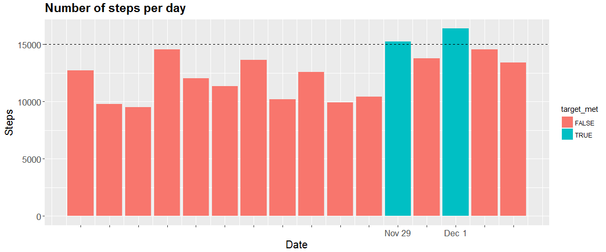
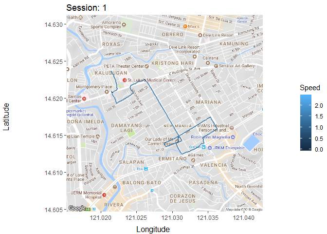

# Wearable Body Sensors

## Synopsis 

I once had the opportunity to work as a customer service agent in a call center. My job was to provide assistance to customers with problems regarding their  wearable body sensors. Wearable body sensors or trackers as we commonly refer to them are revolutionizing fitness programs by providing feedback to the user. It provides an asseesment of how well you performed today during your exercise routine and even how it compares to how well you have advanced since you started your program three months ago.

Not only has it improved individual exercise programs but also programs that cater to groups of people. More and more companies are seeing the benefit of incorporating a physical fitness program together with some form of incentives based on the feedback from wearable body sensors.

I was allowed to borrow from the company a tracker for a week. The tracker had a GPS (Global Positioning System) Receiver which allows you to track your geo-positions while doing an activity. I thought it was pretty neat!!!  I liked running  or taking long bike rides on weekends from Quezon City to Antipolo. I was even able to reach Lucban, Quezon and visit the Kamay ni Hesus Shrine during summer break.

# The Data

I will be exploring the data gathered from the tracker and have a great time plotting the results. When I left my job i lost access to my tracker's account. I tried accessing it but I Couldn't remember the right password anymore.  Luckily, I was able to save some of my data in .tcx, .csv, and .RData formats the last time I tried to explore the data while I was still in the company.

The company that owned the tracker offers a nice and easy way to for its customers to view their data but i will take this opportunity to exercise my learned R skills and explore the R package [TrackeR](https://github.com/hfrick/trackeR) by Hannah Frick and Ioannis Kosmidis. The package is available in [CRAN](https://www.r-project.org/).


```r
list.files("./data")
```

```
## [1] "fitbit.csv"    "fitbit.tcx"    "fitbit1.RData" "fitbit2.tcx"  
## [5] "fitbit3.tcx"
```

The `RData` files contained the data I was able to previously download using the R package [fitbitScraper](https://github.com/corynissen/fitbitScraper) by Cory Nissen which is also available in [CRAN](https://www.r-project.org/). Back then I didn't know about the package TrackeR and was disappointed when i tried to view the .tcx files which contained the data from the GPS positions.

# Intraday data

Let's take a look at my data from November 18 to December 3.


```r
load("./data/fitbit1.RData")
ls()
```

```
##  [1] "cookie"     "d"          "daydf"      "dt"         "fitbit.dt" 
##  [6] "fitbit.pwd" "fitbit.usr" "i"          "iris"       "target"
```

The variables: `cookie`, `fitbit.dt`, `fitbit.pwd`, `fitbit.usr`, `target`, `i` were arguments for the functions in fitbit scraper to download my data. It doesn't work now because I no longer have access to the company's email account and i don't remember the password as well. So we'll just rely on the other variables that's contained in the Rdata file. It turns out that the variable d contains all the data and the rest are just subsets of d.

`iris`, as most R users know is the name of a popular dataset in R. I guess i did a couple of practice rounds with that data while downloading my Fitbit data. The .tcx files contain the gps data.


```r
library(dplyr)
```

```
## Warning: package 'dplyr' was built under R version 3.4.3
```

```
## 
## Attaching package: 'dplyr'
```

```
## The following objects are masked from 'package:stats':
## 
##     filter, lag
```

```
## The following objects are masked from 'package:base':
## 
##     intersect, setdiff, setequal, union
```

```r
library(lubridate)
```

```
## 
## Attaching package: 'lubridate'
```

```
## The following object is masked from 'package:base':
## 
##     date
```

```r
str(d)
```

```
## 'data.frame':	1536 obs. of  4 variables:
##  $ time     : POSIXct, format: "2016-11-18 00:00:00" "2016-11-18 00:15:00" ...
##  $ steps    : num  0 0 0 0 0 0 0 0 0 0 ...
##  $ day      : chr  "11-18" "11-18" "11-18" "11-18" ...
##  $ timestamp: chr  "13:00:00" "13:15:00" "13:30:00" "13:45:00" ...
```


```r
tail(d)
```

```
##                     time steps   day timestamp
## 1531 2016-12-03 22:30:00     0 12-03  11:30:00
## 1532 2016-12-03 22:45:00     0 12-03  11:45:00
## 1533 2016-12-03 23:00:00    35 12-03  12:00:00
## 1534 2016-12-03 23:15:00   373 12-03  12:15:00
## 1535 2016-12-03 23:30:00   260 12-03  12:30:00
## 1536 2016-12-03 23:45:00    78 12-03  12:45:00
```

The downloaded data from the website summarizes the report to the number of steps achieved every 15 minutes. We can also manipulate the data in R in order to show other details with regard to time like days of the week.


```r
d$weekday <- wday(d$time, label = TRUE, abbr = TRUE)
d$date <- date(d$time)
head(d)
```

```
##                  time steps   day timestamp weekday       date
## 1 2016-11-18 00:00:00     0 11-18  13:00:00     Fri 2016-11-18
## 2 2016-11-18 00:15:00     0 11-18  13:15:00     Fri 2016-11-18
## 3 2016-11-18 00:30:00     0 11-18  13:30:00     Fri 2016-11-18
## 4 2016-11-18 00:45:00     0 11-18  13:45:00     Fri 2016-11-18
## 5 2016-11-18 01:00:00     0 11-18  14:00:00     Fri 2016-11-18
## 6 2016-11-18 01:15:00     0 11-18  14:15:00     Fri 2016-11-18
```

# Steps by day

Let's take a look at the total number of steps per day during that 2 week period.


```r
day_sum <- d %>% group_by(day) %>% summarize(Total_steps = sum(steps))
tail(day_sum)
```

```
## # A tibble: 6 x 2
##   day   Total_steps
##   <chr>       <dbl>
## 1 11-28       10429
## 2 11-29       15245
## 3 11-30       13795
## 4 12-01       16376
## 5 12-02       14539
## 6 12-03       13404
```

We can appreciate that data better in a plot.


```r
library(leaflet)
library(ggplot2)
ggplot(day_sum,
       aes(x = day,
           y = Total_steps,
           fill = Total_steps)) +
        geom_bar(stat = "identity") +
        geom_hline(yintercept = 15000) +
        theme(axis.title.x = element_blank()) +
        ggtitle(paste0("fitbit steps by day interval\nTotal Steps = ", sum(d$steps)))
```

<!-- -->


To find out what day of the week I was able to meet my 15000 goal per day we can:


```r
d %>% group_by(date) %>% summarize(Total_steps = sum(steps)) %>% filter(Total_steps > 15000) %>% mutate(weekday = wday(date, label = TRUE))
```

```
## # A tibble: 2 x 3
##   date       Total_steps weekday
##   <date>           <dbl> <ord>  
## 1 2016-11-29       15245 Tue    
## 2 2016-12-01       16376 Thu
```

At this point, I was transitioning from a baseline goal of 10,000 steps per day 15,000 steps but wasn't meeting much success. 

# Prettier plot

We can improve the previous graph such that it conveys the information readily by:


```r
d %>% group_by(date) %>%
        summarize(Total_steps = sum(steps)) %>%
        mutate(target_met = Total_steps >= 15000) %>%
        ggplot(aes(x = date,
                   y = Total_steps,
                   fill = target_met)) +
        geom_bar(stat = "identity") +
        geom_hline(yintercept = 15000,
                   linetype = "dashed") +
        ggtitle("Steps by Day")
```

<!-- -->

# Steps throughout the day

If we want to see number of steps throughout the day by 15 min intervals we can:


```r
ggplot(d, aes(timestamp, steps, fill = steps)) +
     geom_bar(stat = "identity") +
     facet_grid(day ~ .) +
     theme(axis.text.x = element_blank()) +
     xlab("15 minute interval") +
     ggtitle("fitbit steps by 15 min interval")
```

<!-- -->


# GPS data

Let's turn our attention now to mapping our gps data.

## Read in the data

We read in the data using the `readTCX` function from the trackeR package


```r
library(trackeR)
```

```
## Warning: package 'trackeR' was built under R version 3.4.3
```

```
## Loading required package: zoo
```

```
## Warning: package 'zoo' was built under R version 3.4.3
```

```
## 
## Attaching package: 'zoo'
```

```
## The following objects are masked from 'package:base':
## 
##     as.Date, as.Date.numeric
```

```
## 
## Attaching package: 'trackeR'
```

```
## The following object is masked from 'package:base':
## 
##     append
```

```r
am_run <- readTCX(file = "./data/fitbit.tcx", timezone = "Asia/Taipei")
str(am_run)
```

```
## 'data.frame':	3638 obs. of  9 variables:
##  $ time      : POSIXct, format: "2017-01-25 05:36:44" "2017-01-25 05:36:45" ...
##  $ latitude  : num  14.6 14.6 14.6 14.6 14.6 ...
##  $ longitude : num  121 121 121 121 121 ...
##  $ altitude  : num  77.6 74.5 72.6 70.6 68.8 ...
##  $ distance  : num  0 0 0 0 0.13 0.49 1.18 1.18 3.39 4.55 ...
##  $ heart.rate: num  74 74 74 74 74 74 74 74 74 74 ...
##  $ speed     : num  NA NA NA NA NA NA NA NA NA NA ...
##  $ cadence   : num  NA NA NA NA NA NA NA NA NA NA ...
##  $ power     : num  NA NA NA NA NA NA NA NA NA NA ...
```


```r
summary(am_run)
```

```
##       time                        latitude       longitude  
##  Min.   :2017-01-25 05:36:44   Min.   :14.61   Min.   :121  
##  1st Qu.:2017-01-25 05:54:24   1st Qu.:14.61   1st Qu.:121  
##  Median :2017-01-25 06:11:46   Median :14.62   Median :121  
##  Mean   :2017-01-25 06:10:52   Mean   :14.62   Mean   :121  
##  3rd Qu.:2017-01-25 06:26:54   3rd Qu.:14.62   3rd Qu.:121  
##  Max.   :2017-01-25 06:42:03   Max.   :14.62   Max.   :121  
##                                                             
##     altitude         distance      heart.rate        speed     
##  Min.   :-23.50   Min.   :   0   Min.   : 69.0   Min.   : NA   
##  1st Qu.: 12.60   1st Qu.:1166   1st Qu.: 95.0   1st Qu.: NA   
##  Median : 20.60   Median :2467   Median :102.0   Median : NA   
##  Mean   : 19.56   Mean   :2443   Mean   :100.2   Mean   :NaN   
##  3rd Qu.: 26.80   3rd Qu.:3711   3rd Qu.:107.0   3rd Qu.: NA   
##  Max.   : 77.59   Max.   :4960   Max.   :122.0   Max.   : NA   
##                                                  NA's   :3638  
##     cadence         power     
##  Min.   : NA    Min.   : NA   
##  1st Qu.: NA    1st Qu.: NA   
##  Median : NA    Median : NA   
##  Mean   :NaN    Mean   :NaN   
##  3rd Qu.: NA    3rd Qu.: NA   
##  Max.   : NA    Max.   : NA   
##  NA's   :3638   NA's   :3638
```


The data contains a run around the neighborhood lasting for a little over an hour. Aside from providing information about the geo-positions, the tracker also provides information about altitude, time, heart rate, and distance. 

## Convert data frame to time series data

We'll tranform our data frame to a time series data to better plot the variables. We'll use the function `trackeRdata` from the trackeR package.


```r
am_run_ts <- trackeRdata(am_run)
str(am_run_ts, 2)
```

```
## List of 1
##  $ :'zoo' series from 2017-01-25 05:36:39 to 2017-01-25 06:42:08
##   Data: num [1:3659, 1:9] 14.6 14.6 14.6 14.6 14.6 ...
##   ..- attr(*, "dimnames")=List of 2
##   Index:  POSIXct[1:3659], format: "2017-01-25 05:36:39" "2017-01-25 05:36:39" ...
##  - attr(*, "operations")=List of 2
##   ..$ smooth   : NULL
##   ..$ threshold: NULL
##  - attr(*, "units")='data.frame':	10 obs. of  2 variables:
##   ..$ variable: chr [1:10] "latitude" "longitude" "altitude" "distance" ...
##   ..$ unit    : chr [1:10] "degree" "degree" "m" "m" ...
##  - attr(*, "class")= chr [1:2] "trackeRdata" "list"
```

# Summary

We can see a summary of my performance by using the `summary` function.


```r
summary(am_run_ts, movingThreshold = 1)
```

```
## 
##  *** Session 1 ***
## 
##  Session times: 2017-01-25 05:36:39 - 2017-01-25 06:42:08 
##  Distance: 4960.91 m 
##  Duration: 1.09 hours 
##  Moving time: 0.93 hours 
##  Average speed: 1.26 m_per_s 
##  Average speed moving: 1.49 m_per_s 
##  Average pace (per 1 km): 13:11 min:sec
##  Average pace moving (per 1 km): 11:12 min:sec
##  Average cadence: NA steps_per_min 
##  Average cadence moving: NA steps_per_min 
##  Average power: NA W 
##  Average power moving: NA W 
##  Average heart rate: 98.84 bpm 
##  Average heart rate moving: 101.32 bpm 
##  Average heart rate resting: 84.74 bpm 
##  Work to rest ratio: 5.6 
## 
##  Moving threshold: 1 m_per_s
```


The summary function not only provided a summary of the variables in the data like total distance, duration, average speed and average heart rate, it also combined or extended the data to come up with other variables such as average heart rate when moving or resting.

# Plotting Heartbeat and pace

We can also plot heartbeat and pace.


```r
plot(am_run_ts, what = c("heart.rate", "distance", "pace"))
```

<!-- -->

Looking at the plot we can see a series of up and down movement in pace and heartbeat.  This is due to the many crossroads and vehicular traffic in the area.  It would be better if we have a sustained level of heart rate and pace.

# Mapping the run

We will use the plotRoute function from the package TrackeR


```r
plotRoute(am_run_ts, zoom = 15, source = "google")
```

```
## Source : https://maps.googleapis.com/maps/api/staticmap?center=14.618019,121.028885&zoom=15&size=640x640&scale=2&maptype=terrain&language=en-EN
```

<!-- -->


or the leaflet function from the package leaflet which gives us a lot of flexibility on how our plot should look


```r
leaflet(am_run) %>%
                addTiles() %>% 
                addProviderTiles("OpenStreetMap.Mapnik") %>% 
                setView(121.0289, 14.61739, zoom = 15) %>%
                addPolylines(~longitude, ~latitude) 
```

<!--html_preserve--><div id="htmlwidget-ad85768351bff4328df6" style="width:672px;height:480px;" class="leaflet html-widget"></div>
<script type="application/json" data-for="htmlwidget-ad85768351bff4328df6">{"x":{"options":{"crs":{"crsClass":"L.CRS.EPSG3857","code":null,"proj4def":null,"projectedBounds":null,"options":{}}},"calls":[{"method":"addTiles","args":["https://{s}.tile.openstreetmap.org/{z}/{x}/{y}.png",null,null,{"minZoom":0,"maxZoom":18,"maxNativeZoom":null,"tileSize":256,"subdomains":"abc","errorTileUrl":"","tms":false,"continuousWorld":false,"noWrap":false,"zoomOffset":0,"zoomReverse":false,"opacity":1,"zIndex":null,"unloadInvisibleTiles":null,"updateWhenIdle":null,"detectRetina":false,"reuseTiles":false,"attribution":"&copy; <a href=\"http://openstreetmap.org\">OpenStreetMap<\/a> contributors, <a href=\"http://creativecommons.org/licenses/by-sa/2.0/\">CC-BY-SA<\/a>"}]},{"method":"addProviderTiles","args":["OpenStreetMap.Mapnik",null,null,{"errorTileUrl":"","noWrap":false,"zIndex":null,"unloadInvisibleTiles":null,"updateWhenIdle":null,"detectRetina":false,"reuseTiles":false}]},{"method":"addPolylines","args":[[[[{"lng":[121.021504316065,121.021503561421,121.021502798796,121.021502108801,121.021501709114,121.021501709114,121.02150156187,121.021501635512,121.021501898766,121.021502270148,121.021502799458,121.021503469774,121.021504266509,121.021504266509,121.02150512139,121.021506136464,121.021505221244,121.02150527508,121.021506028791,121.021507536211,121.021509474324,121.021511839282,121.021514634932,121.021517642083,121.02151972261,121.021523685291,121.021527647972,121.021531725752,121.02153597618,121.021540284157,121.02154487988,121.021549763351,121.021554191907,121.021559993426,121.021566165818,121.021572523647,121.021579066912,121.021585729387,121.021592581714,121.021599619477,121.021606842677,121.021614313126,121.021621845387,121.021628932953,121.021636734009,121.021644468307,121.021652336121,121.021660203934,121.021668138504,121.021676068306,121.021683797836,121.021691598892,121.021699355996,121.021707617718,121.021716024565,121.021724431411,121.021732693133,121.021740519482,121.021749144509,121.021756365186,121.021763267971,121.021769858542,121.021776131221,121.021782006536,121.021787405014,121.021792247182,121.021796771458,121.021802663803,121.021806785935,121.02181073239,121.021814591006,121.02181828022,121.021821793757,121.021825388858,121.021828090443,121.021831028602,121.02183396676,121.021837199436,121.021840432111,121.021843664786,121.021846897462,121.021850522827,121.021854344536,121.021858460763,121.021862928073,121.021867593129,121.021872146924,121.021876811981,121.021881365776,121.021885560109,121.021889925003,121.021894546656,121.021899296687,121.021904175098,121.021909310268,121.021914693025,121.021919947404,121.021925330162,121.02193071292,121.021936004812,121.021941455928,121.021946907043,121.021952358159,121.021957809275,121.021963563832,121.021969166669,121.021974466064,121.021979776296,121.021985238249,121.021991003643,121.021996769038,121.022002827037,121.022009036758,121.022014943036,121.022020849315,121.022026755593,121.022032661871,121.022038264708,121.022043715824,121.022049015219,121.022054168913,121.02205880483,121.022063069873,121.02206714948,121.02207104365,121.022074196074,121.022077163061,121.022080130047,121.022083282471,121.022085878584,121.022087812424,121.022090435028,121.022092580795,121.022094964981,121.02209687233,121.022099494934,121.022102117538,121.022104740143,121.022107362747,121.022110462189,121.022113783019,121.022117342268,121.022120663098,121.02212374551,121.022126589503,121.022129195077,121.02213203907,121.022134661674,121.022137761116,121.022141098976,121.022144436836,121.022148251534,121.022153496742,121.022158741951,121.022164702415,121.022171139717,121.022177577019,121.022183060646,121.022188305855,121.022192835808,121.022196650505,121.022199988365,121.022202134132,121.02220426287,121.0222075837,121.02221090453,121.022213510105,121.022216830935,121.022219436509,121.022222518921,121.022225141525,121.02222776413,121.022230386734,121.022233724594,121.022236585617,121.022239923477,121.0222427845,121.022245883942,121.022248506546,121.022250652313,121.02225279808,121.022255182266,121.022257804871,121.022261142731,121.022263288498,121.022264719009,121.022265911102,121.022265911102,121.022265911102,121.022265195847,121.022264003754,121.022263526917,121.022263526917,121.022263765335,121.022264242172,121.022264242172,121.022264242172,121.022264003754,121.022263765335,121.022263526917,121.022264003754,121.022265195847,121.022266626358,121.02226805687,121.022269487381,121.02227139473,121.022273302078,121.022274494171,121.022275209427,121.022275209427,121.022275209427,121.022275686264,121.022275686264,121.022275924683,121.022276878357,121.022278308868,121.022280693054,121.02228307724,121.022285223007,121.022287368774,121.022289276123,121.022290468216,121.022294265883,121.022298301969,121.02230329173,121.022308043071,121.022312555994,121.022316353662,121.022318959236,121.022317051888,121.022312538964,121.022306357111,121.022299460002,121.022292801312,121.022287096296,121.022282344954,121.022280454636,121.022280454636,121.022281169891,121.022282600403,121.022283554077,121.022284030914,121.022283554077,121.022280216217,121.022275447845,121.022269010544,121.022260427475,121.022250175476,121.022238509996,121.022226606097,121.022214702197,121.022203513554,121.022192801748,121.022182805198,121.022173285484,121.02216398716,121.022154927254,121.022145884378,121.022135649409,121.022124937602,121.022113748959,121.02210184506,121.022089225905,121.022075431687,121.022060905184,121.022046378681,121.022030898503,121.022015179907,121.021999938147,121.021984951837,121.021970186915,121.021956375667,121.021943041256,121.021930898939,121.021919710296,121.021909236908,121.021898839209,121.021887911691,121.021875706586,121.021862250108,121.021849942207,121.021838943164,121.021828279776,121.021818368058,121.021808630542,121.021801772572,121.021795817043,121.021788280943,121.021784148216,121.021780442308,121.021774146292,121.021771040456,121.021765523943,121.021763228601,121.021758337175,121.021756515358,121.021754663331,121.021750426292,121.021748597557,121.021744766751,121.021742979685,121.021741041323,121.021737462137,121.021735482438,121.0217334191,121.021731178811,121.021727881533,121.021725484303,121.021723690132,121.021723690132,121.021723690132,121.021722139196,121.021722139196,121.021720883639,121.021719683541,121.021719683541,121.021718653766,121.021717653718,121.021716804731,121.021716804731,121.021716158565,121.021715688705,121.021715237544,121.021714762637,121.021714216954,121.021714216954,121.021713548236,121.021712984358,121.021712387309,121.021711703503,121.02171087265,121.021710095867,121.021704294959,121.021698494051,121.021692693143,121.021686892235,121.021681091327,121.021675290419,121.021669489511,121.021663688603,121.021657887695,121.021652086787,121.021646285879,121.02164048497,121.021634684062,121.021628883154,121.021623082246,121.021617281338,121.02161148043,121.021605679522,121.021599878614,121.021594077706,121.021588276798,121.02158247589,121.021576674982,121.021570874074,121.021565073166,121.021559272258,121.02155347135,121.021547670442,121.021541869534,121.021536068626,121.021530267718,121.02152446681,121.021518665901,121.021512864993,121.021507064085,121.021501263177,121.021495462269,121.021489661361,121.02148850118,121.021489197558,121.021489613196,121.021490005084,121.021490464608,121.021490899292,121.021491838129,121.021492857199,121.021493908763,121.021495112559,121.021496259031,121.021497352179,121.021498395638,121.021499392721,121.021501259601,121.021502134701,121.021502905962,121.021503646374,121.021504357749,121.021505041764,121.021505699967,121.021506333793,121.021506883881,121.021507414324,121.021507896875,121.021508362787,121.021508812904,121.021509248018,121.021509248018,121.021509915102,121.021510533748,121.021511079773,121.021513221756,121.021514729848,121.021515999522,121.021518083869,121.021519176296,121.021519967767,121.02152084294,121.021521154097,121.021521380392,121.021521256681,121.021521637314,121.021522155675,121.021522851424,121.021523840023,121.021524939897,121.021526147338,121.021527793943,121.02152946044,121.021530963005,121.021532228258,121.021533805271,121.021535626678,121.021537242866,121.021539153122,121.021540825184,121.02154146014,121.021543080742,121.021543070248,121.021544783456,121.021544875521,121.02154684428,121.021547075241,121.021549440199,121.021550096315,121.021552969669,121.021553935828,121.021555323601,121.021558990479,121.021561083586,121.021565069323,121.021566589673,121.021569308482,121.021574133321,121.021579826579,121.02158703804,121.021593594551,121.021602236308,121.021607875824,121.021614464847,121.021618247032,121.021622512076,121.021623624696,121.021623624696,121.021622512076,121.021621346474,121.021619677544,121.021618962288,121.021619677544,121.021622776985,121.021628022194,121.02163541317,121.021644234657,121.021653992789,121.021664943014,121.02167565482,121.021686128208,121.021695886339,121.021705644471,121.021714687347,121.021723270416,121.021730661392,121.02173781395,121.021744728088,121.021751625197,121.021758283888,121.021764704159,121.021771124431,121.021776591028,121.021783249719,121.021789669991,121.021795392036,121.021800637245,121.021806120872,121.021812319756,121.02181994915,121.021827578545,121.021835667746,121.021845664297,121.021856137684,121.021867803165,121.021879945483,121.021891134126,121.021901130676,121.021910905838,121.021919488907,121.021928054946,121.021935428892,121.021942087582,121.021948746272,121.0219558818,121.021961825235,121.021967053413,121.021971821785,121.021976351738,121.021980404854,121.021984219551,121.021987080574,121.021990418434,121.021994948387,121.02199947834,121.022004008293,121.022008061409,121.022012114525,121.022016167641,121.022020680564,121.022025193487,121.02202970641,121.022034457752,121.022038970675,121.022043483598,121.022048473358,121.022053003311,121.02205657959,121.022059440613,121.022060871124,121.022062301636,121.022063970566,121.022066116333,121.022068738937,121.022071838379,121.022076368332,121.022082805634,121.02209184851,121.022100891386,121.022109934262,121.022118023464,121.022125874247,121.022132294519,121.022138237953,121.022141575813,121.022144913673,121.022147536278,121.022150158882,121.022152304649,121.022154927254,121.022156357765,121.022157788277,121.02215898037,121.022159934044,121.022161126137,121.022162795067,121.022164702415,121.02216732502,121.022171139717,121.022175192833,121.022180438042,121.022187096732,121.022195185934,121.022204467228,121.022215417453,121.022226844515,121.02223946367,121.022252559662,121.022265178817,121.022277797971,121.022289940289,121.022301844188,121.022313509669,121.022324698312,121.022335886955,121.022347569466,121.022359234946,121.022371615682,121.022384234837,121.022396853992,121.022409711565,121.02242233072,121.022434234619,121.022445423262,121.02245589665,121.0224658932,121.022475651332,121.022485647883,121.02249612127,121.022507309914,121.022519230843,121.022531134742,121.022543038641,121.022555419377,121.022567323276,121.022578988756,121.022590892656,121.022602796555,121.022615177291,121.022628034864,121.022641130856,121.022654465267,121.022667561259,121.022679941995,121.022692322731,121.022704703467,121.022716845785,121.022728988103,121.022740892002,121.022752795901,121.022764222963,121.022775411606,121.022786140442,121.022797090667,121.022807564054,121.022818514279,121.022829702922,121.022841368403,121.022852795465,121.022864699364,121.022876603263,121.022888983999,121.022901364735,121.022913268634,121.022925172533,121.022936838014,121.022948026657,121.02295923233,121.022969944136,121.022980179105,121.022990652493,121.023001841136,121.02301302978,121.02302469526,121.023035883904,121.023047089577,121.023057341576,121.023067338126,121.023076619421,121.023086615971,121.023096135684,121.023105416979,121.023114698274,121.023124694824,121.023134469986,121.023144245148,121.023153526442,121.023162569319,121.02317232745,121.023181370326,121.023190651621,121.023200171334,121.023210644722,121.023221135139,121.023232323783,121.023243035589,121.023254462651,121.023266128131,121.023277793612,121.023288505418,121.023299694061,121.023310899734,121.023322088378,121.023333753858,121.023345657757,121.023358038494,121.023370896067,121.023383515222,121.023396594184,121.023409690176,121.023422786168,121.023435405322,121.023448024477,121.023460643632,121.023473024368,121.023484230042,121.023495418685,121.023506130491,121.023517080716,121.023527554103,121.023537550654,121.023548024041,121.023558735847,121.023569941521,121.023581130164,121.023592557226,121.023603984288,121.023615649768,121.023626361574,121.023637311799,121.02364730835,121.023657798767,121.023667573929,121.023677808898,121.023687805448,121.023698278836,121.023708513805,121.023718987192,121.02372946058,121.023740172386,121.023750901222,121.023762089866,121.023773278509,121.023784943989,121.023797324726,121.023809705462,121.023822086198,121.023834466934,121.023846370833,121.023858036314,121.023869701794,121.0238804136,121.023890886988,121.023901360376,121.023911356926,121.023921847343,121.023933035987,121.023943747793,121.023954698018,121.023965886661,121.023976598467,121.023987548692,121.023998022079,121.024007558823,121.024017333984,121.024027330535,121.024037327085,121.02404827731,121.024058989116,121.024070177759,121.02408184324,121.024093747139,121.024105651038,121.024117554937,121.024128981999,121.024140170642,121.02415064403,121.02416064058,121.024169445038,121.024177312851,121.024183988571,121.024190425873,121.024197101593,121.024203998702,121.024211849485,121.024220177105,121.024229935237,121.024240408625,121.024250405175,121.0242613554,121.024272322655,121.024282813072,121.024294001716,121.024304713522,121.024315425328,121.024327090808,121.024337802614,121.024348514421,121.024359464645,121.024369955063,121.024381143706,121.024392809187,121.024404951504,121.024417570659,121.024430666651,121.024443285806,121.024455904961,121.024468285697,121.024480189596,121.024491855076,121.024504235813,121.024516139712,121.024527566774,121.024537324905,121.024544715881,121.02454996109,121.024552583694,121.024551868439,121.024549007416,121.024544239044,121.024538516998,121.024532556534,121.024525880814,121.024519205093,121.024512767792,121.024506807327,121.024501102311,121.024495874132,121.024495070221,121.024490407535,121.024485894612,121.024480904852,121.024475676673,121.024469733238,121.024463534355,121.024457335472,121.024451375008,121.024443984032,121.0244358778,121.024426596505,121.024416838373,121.024407080242,121.024396130017,121.024385179792,121.02437542166,121.024366855621,121.024358987808,121.024351835251,121.024345159531,121.024339199066,121.024333255632,121.02432683536,121.02432017667,121.024313994816,121.024307336126,121.024300677436,121.024293541908,121.024286150932,121.024278759956,121.024271130562,121.024263501167,121.02425634861,121.024249911308,121.024245142937,121.024241328239,121.024239420891,121.024237990379,121.024235861642,121.024233256068,121.024229935237,121.024225183896,121.024219240461,121.024211151259,121.024203062057,121.024195194244,121.024187803268,121.024180412292,121.024173259735,121.024166584015,121.02416062355,121.024154203279,121.024147783007,121.024141124317,121.024134227208,121.024127806936,121.024121863501,121.024117350578,121.02411544323,121.02411544323,121.02411711216,121.024120688438,121.024125916617,121.024132575308,121.024139233998,121.024144939014,121.024149451937,121.024152534349,121.02415394783,121.024153232574,121.024151103837,121.024147783007,121.024142793247,121.024137326649,121.024131383215,121.024126155036,121.024123549461,121.024122595787,121.024124009269,121.024128522192,121.024135896138,121.024146607944,121.024159227099,121.024172323091,121.02418589592,121.024199468749,121.024212564741,121.024225660733,121.024238518306,121.024250899042,121.024263518197,121.024276137352,121.024288994925,121.024302090917,121.024315425328,121.024328759738,121.024342570986,121.024356382234,121.024370176452,121.024383749281,121.024397560528,121.02441065652,121.024423990931,121.024437802179,121.024451357978,121.024464692388,121.024478026799,121.024490645954,121.024503741946,121.024516122682,121.024527549744,121.024538993835,121.024550659316,121.024562563215,121.02457518237,121.024587801525,121.024600897517,121.024613993508,121.0246270895,121.024640185492,121.024652566229,121.024664946965,121.024677327701,121.024689946856,121.024703519685,121.024717313903,121.024730648313,121.024743744305,121.024756840297,121.024769459452,121.024781840188,121.02479326725,121.024804472923,121.024815661567,121.024827565466,121.024838992528,121.024850658008,121.024861369814,121.024871127946,121.024881124496,121.024890899658,121.024900197983,121.024909956115,121.024919952665,121.024930426053,121.024942329952,121.024953995432,121.024965899331,121.02497780323,121.024989707129,121.025001611028,121.025012799672,121.025022796222,121.025031362261,121.025039213044,121.025046110153,121.025052070618,121.025056838989,121.025061607361,121.025066137314,121.025070667267,121.025074720383,121.025079011917,121.025083065033,121.025088054793,121.025093759809,121.0251004185,121.025108269283,121.025117312159,121.025127070291,121.025138020515,121.025149464607,121.025161368506,121.025173749243,121.02518589156,121.025198510715,121.025211606707,121.025224941117,121.025237798691,121.025250179427,121.025262083326,121.025273987225,121.025285891124,121.025297318186,121.025308506829,121.025319695473,121.025330901146,121.025342089789,121.02535375527,121.02536542075,121.025377801486,121.025390182223,121.025402801377,121.025415420532,121.025428516524,121.025441612516,121.025454231671,121.02546613557,121.02547780105,121.025488989694,121.025500655174,121.025512082236,121.025523509298,121.025535174779,121.025547078678,121.025559220995,121.025571363313,121.02558350563,121.025595886367,121.025607551847,121.025618978909,121.025630167552,121.02564064094,121.025651114328,121.025661587715,121.025672078133,121.025683266776,121.025694932256,121.025706597737,121.025718978473,121.025731836046,121.025744455201,121.025757074356,121.025769693511,121.02578159741,121.025793501309,121.025804689952,121.025816117014,121.025829195976,121.025841792425,121.025855086066,121.025867657228,121.025879784064,121.025892062621,121.025904189457,121.025916923176,121.025928533994,121.025940198165,121.025950835301,121.025960830542,121.025970183886,121.025979032883,121.025987496743,121.025995575465,121.026003269049,121.026010320737,121.026017115666,121.026023011941,121.02602827549,121.026033025521,121.026037903932,121.026042782343,121.026047651584,121.026052264067,121.026056876549,121.026061360653,121.026065587997,121.026069943721,121.026074556204,121.026079168686,121.026083781169,121.026088393652,121.026093262893,121.026098003754,121.026102616237,121.026107237889,121.0261121163,121.026116609573,121.026121231226,121.026125852878,121.026130217772,121.026134701876,121.026136904955,121.026139205152,121.02614146471,121.026143670082,121.026145800948,121.026148063796,121.026152726237,121.026157388679,121.026162051121,121.026166713562,121.026171376004,121.026176038445,121.026180700887,121.026185363328,121.02619002577,121.026194688211,121.026199350653,121.026204013095,121.026208675536,121.026213337978,121.026218000419,121.026222662861,121.026227325302,121.026231987744,121.026236650185,121.026241312627,121.026245975069,121.02625063751,121.026255299952,121.026259962393,121.026264624835,121.026269287276,121.026273949718,121.02627861216,121.026283274601,121.026287937043,121.026292599484,121.026297261926,121.026301924367,121.026304721832,121.026300787926,121.026297357347,121.026294445992,121.026292063973,121.026290078958,121.02628839933,121.026283520919,121.026278385749,121.026274149234,121.026271710029,121.026271324891,121.026271966787,121.026273764097,121.026276203302,121.026279284404,121.02628326416,121.026287885813,121.026293268571,121.026299293225,121.026306344913,121.026314552014,121.026323401011,121.026332506767,121.026341740902,121.026351103416,121.026361098656,121.026371479034,121.026381752708,121.026392654939,121.026403112845,121.026413570751,121.026423725215,121.026434196366,121.026443825828,121.026453084416,121.026462528441,121.026470899582,121.026479482651,121.026489479201,121.026499475752,121.026509710721,121.026518992015,121.026527319636,121.026534216745,121.026540160179,121.026544690132,121.026548743248,121.026552796364,121.02655684948,121.026562094688,121.026567816734,121.026574492455,121.026581151145,121.026588763509,121.026596137456,121.026603988239,121.026611362185,121.026618736131,121.026625394821,121.026632547379,121.026638746262,121.026645183563,121.026652574539,121.02666090216,121.026669945036,121.026680418423,121.026690414974,121.026700173106,121.0267094544,121.026717305183,121.026724696159,121.026732087135,121.026738524437,121.026744961739,121.026752097266,121.026759948049,121.026768514088,121.026777080127,121.026785407748,121.026793258531,121.026801109314,121.026807785034,121.026813030243,121.026817560196,121.026821613312,121.026825666428,121.026829719543,121.026833772659,121.026839256287,121.026846391814,121.026854242597,121.026862570218,121.026870421001,121.026878510203,121.026887076242,121.026895403862,121.026903271675,121.026910662651,121.026918053627,121.026925444603,121.026933056968,121.026940907751,121.026948281697,121.026955655643,121.026963506426,121.026971357209,121.02697968483,121.026987791061,121.026995658875,121.027003526688,121.027010917664,121.027017593384,121.027024252074,121.027030433927,121.027036377362,121.027041605541,121.02704683372,121.027052061898,121.027057766914,121.027063012123,121.027068734169,121.027074456215,121.027080416679,121.027086377144,121.027092814445,121.027099490166,121.027106864112,121.027114953314,121.027123757771,121.027133039066,121.02714232036,121.027150886399,121.027158021927,121.027163982391,121.027168512344,121.027172327042,121.027176141739,121.027180194855,121.027184963226,121.027190906661,121.027197326933,121.027204700879,121.027212551662,121.027221117701,121.027230160577,121.027239203453,121.027248501778,121.027257800102,121.027266383171,121.027275426047,121.027283515249,121.027290889195,121.027297786304,121.027304444994,121.027311580522,121.027319192886,121.027326107025,121.027332782745,121.027339935303,121.027347564697,121.027354717255,121.027361392975,121.027368051665,121.027374710355,121.027381845883,121.027389219829,121.027397070612,121.027405159814,121.027413487434,121.027421355247,121.027428507805,121.027434468269,121.027438998222,121.027441859245,121.027444243431,121.027447104454,121.027450442314,121.027454955237,121.027460660253,121.027467318944,121.027474454471,121.027481589999,121.027488248689,121.027494907379,121.027501583099,121.02750825882,121.027515888214,121.027524471283,121.02753329277,121.027542335646,121.027551378523,121.027559944562,121.027568510601,121.027576599802,121.02758373533,121.027590870857,121.027598261833,121.027604937553,121.027610898018,121.027616143227,121.027621388435,121.0276273489,121.027633292334,121.02763899735,121.027645179204,121.027652314731,121.027659688677,121.027666824205,121.027674198151,121.027683496475,121.027693033218,121.027703983443,121.027716364179,121.027729460171,121.027742794582,121.027756367411,121.02776827131,121.027779459953,121.027789473534,121.027797579765,121.027804732323,121.027810692787,121.027815444129,121.027819957052,121.027824469975,121.027828982898,121.027833495821,121.027838247163,121.027843952179,121.027849912643,121.027856588364,121.027863740921,121.027871131897,121.02787899971,121.02788734436,121.027895195144,121.027903045927,121.027910181454,121.027916840145,121.027922545161,121.027927296502,121.027931571007,121.02793610096,121.027941346169,121.027946591377,121.027952313423,121.027958989143,121.027966141701,121.027973294258,121.027980685234,121.02798805918,121.027995909963,121.028003283909,121.0280099426,121.028016362871,121.028022783143,121.028029203415,121.028035163879,121.028040647507,121.028046607971,121.028053045273,121.028059720993,121.02806687355,121.028073770659,121.028080906187,121.028088518551,121.028095892497,121.028103028025,121.028110163552,121.028116822243,121.028123497963,121.028129935265,121.028135895729,121.028141856194,121.028147816658,121.028154015541,121.028160674231,121.028167809759,121.028175183705,121.028182557651,121.028190170016,121.028198259217,121.028206586838,121.028214693069,121.028222560883,121.028229951859,121.028237342834,121.02824473381,121.028251154082,121.028257335935,121.028263040951,121.028268984386,121.028275643076,121.028282778604,121.028289914131,121.028298020363,121.028306365013,121.028315663338,121.028324246407,121.028332574027,121.028341140066,121.028348990849,121.028355411121,121.028361354555,121.02836729799,121.028373241425,121.028379201889,121.028385639191,121.028393745422,121.028403282166,121.028413755553,121.028424228941,121.028435417584,121.028446606227,121.028456602778,121.028465645654,121.028474211693,121.028482317924,121.028490185738,121.028498053551,121.028505904334,121.02851327828,121.028519460133,121.028525880405,121.028532300677,121.028538959367,121.028545379639,121.028551578522,121.028558731079,121.028567075729,121.028575658798,121.028584241867,121.028592569487,121.028600658689,121.028608509472,121.028615645,121.02862230369,121.028628723962,121.028635382652,121.028641581535,121.028647542,121.028653264046,121.02865922451,121.028665184975,121.028671145439,121.028676390648,121.028681635857,121.028687340873,121.028693284307,121.028699227742,121.028705648014,121.028711591448,121.028717534883,121.028723955154,121.028730630875,121.028738021851,121.028746366501,121.028755664825,121.028765661376,121.028777326856,121.028789230755,121.028801134654,121.028812800135,121.028824227197,121.028834700584,121.028845191002,121.028854472297,121.028863753591,121.02887231963,121.028880408832,121.028887782778,121.028894918306,121.028901576996,121.028908252716,121.028914690018,121.028921127319,121.028928279877,121.028935432434,121.02894282341,121.028950674193,121.028958524976,121.028966614178,121.028975180217,121.028983507838,121.028991835458,121.028999686241,121.029006838799,121.029013514519,121.029019474983,121.029025435448,121.029031634331,121.029038293021,121.029044951711,121.029051610402,121.029058269092,121.029064689364,121.029070632798,121.029076337814,121.029081583023,121.02908706665,121.029093027115,121.029098987579,121.0291056633,121.029113054276,121.029120428222,121.029128517423,121.029136845044,121.029142736694,121.029145172664,121.029153500284,121.029161351068,121.029169201851,121.029177069664,121.029184937477,121.02919280529,121.029200673103,121.029209239142,121.029218520437,121.029227801732,121.029237559864,121.029247317995,121.029257076127,121.02926659584,121.029275178909,121.029283046722,121.029289484024,121.029294967651,121.029300451279,121.029306633132,121.029313053404,121.029319712094,121.029326132366,121.029332791056,121.029339449746,121.029345154762,121.029350161552,121.029355406761,121.02936065197,121.029366135597,121.029372572899,121.029379010201,121.029384970665,121.0293909141,121.029396857534,121.029403277806,121.029409936496,121.029416595187,121.029423730714,121.029431819916,121.029439926147,121.029447793961,121.029455900192,121.029463768005,121.029470920563,121.029477119446,121.029484016555,121.029490675245,121.029497333935,121.02950327737,121.029509220804,121.029515879495,121.029523015022,121.029529690742,121.029536128044,121.029542565346,121.029549241066,121.029557091849,121.029564942632,121.029572793416,121.029580167362,121.029588018145,121.02959563051,121.029603242874,121.029609680176,121.029615879059,121.029623031616,121.029630899429,121.029639005661,121.029647333281,121.029655422483,121.029663511685,121.029671839305,121.029679213251,121.029686348779,121.029693484306,121.029700636864,121.029708504677,121.029717087746,121.029725193977,121.029733760016,121.029742326055,121.029752799443,121.02976327283,121.029773746218,121.02978350435,121.029793024063,121.029801607132,121.029809713364,121.029815196991,121.029820680618,121.029825925827,121.029831392424,121.029837574278,121.029844709805,121.029851845333,121.029859696116,121.029866831643,121.029873490334,121.029880642891,121.029887795448,121.029895186424,121.029903054237,121.029910905021,121.02991947106,121.029928513936,121.029936364719,121.029944215502,121.02995135103,121.029958486557,121.029964923859,121.029971122742,121.029977321625,121.029984474182,121.029991865158,121.029999715941,121.030007805143,121.030017086438,121.030026129314,121.030033980097,121.030041354043,121.030048489571,121.030055880547,121.030063033104,121.030068993568,121.03007543087,121.030082583427,121.030089259148,121.030095917838,121.030101861273,121.03010732787,121.030113271305,121.030119214739,121.030125873429,121.030133485794,121.03014087677,121.030148744583,121.030157089233,121.030164957047,121.030173046248,121.030180897032,121.030188986233,121.030197313854,121.0302046878,121.03021134649,121.03021800518,121.030223727226,121.030228495598,121.030233025551,121.030237078667,121.03024160862,121.030246853828,121.030252575874,121.030258536339,121.03026497364,121.030271393912,121.030277814184,121.030284234456,121.03029017789,121.030294929232,121.030299680574,121.030304908752,121.030311107635,121.030318260193,121.030326128006,121.030334711075,121.030344469207,121.030354465757,121.030363747052,121.030371597835,121.030377779688,121.03038253103,121.03038585186,121.030388712883,121.030392289162,121.030396342278,121.030400156975,121.030405163765,121.030411124229,121.030418276787,121.030425429344,121.030433518546,121.030442084585,121.030450889042,121.0304596935,121.030468974795,121.030478256089,121.030488014221,121.030495882034,121.030503749847,121.030512094498,121.030519962311,121.030527574675,121.030534948621,121.030542322568,121.030550173351,121.030557308878,121.030564444406,121.030571579933,121.030578970909,121.030586600304,121.030593752861,121.030601143837,121.030609250069,121.03061733927,121.030625905309,121.030633994511,121.030642083713,121.030650649752,121.030658500535,121.030666351318,121.030674695969,121.030683279037,121.030692100525,121.030700666564,121.030708755766,121.030717321805,121.030725172588,121.030732546534,121.030739682061,121.03074657917,121.03075325489,121.030760884285,121.030768275261,121.030776143074,121.030784010887,121.030791384833,121.030798997198,121.030806609562,121.030813268253,121.03082040378,121.030827539308,121.030834674835,121.030842065811,121.030849456787,121.030857563019,121.030865430832,121.030872821808,121.030879497528,121.030886871474,121.030893291746,121.030898519925,121.030901840755,121.030904446329,121.030905382974,121.030905382974,121.030903492655,121.030901125499,121.030898519925,121.030895675932,121.030892355101,121.030888557434,121.030885219574,121.030880689621,121.030875921249,121.030870676041,121.030865430832,121.030860424042,121.030855894089,121.03085064888,121.030846118927,121.030842065811,121.030838012695,121.030833959579,121.030829191208,121.030824678285,121.030820165362,121.03081541402,121.030810185841,121.030806149755,121.030802828925,121.030800700188,121.030799269676,121.030799269676,121.030800461769,121.030803067344,121.030805196081,121.030808040074,121.030810168811,121.03081205913,121.030812774386,121.030813012804,121.030812314578,121.030811616353,121.030810202871,121.030809504645,121.030805706978,121.030802369118,121.030799746513,121.030799746513,121.030800444739,121.030800444739,121.030797822135,121.030797106879,121.030797106879,121.030796391623,121.030793292182,121.030788779259,121.030785679817,121.030784964561,121.030784726143,121.030783295631,121.030781388283,121.030779242516,121.030777335167,121.030774712563,121.030772089958,121.03077018261,121.030768752098,121.030767321587,121.030765891075,121.030765891075,121.030765891075,121.030766129494,121.030766129494,121.030765652657,121.030765652657,121.030769228935,121.030773043633,121.030778288841,121.030786139624,121.030794228826,121.030803986958,121.030814460346,121.030822787966,121.030830638749,121.030837774277,121.030843019485,121.03084897995,121.030854463577,121.030859708786,121.030866384506,121.030873758452,121.030881609235,121.030888029507,121.030894688198,121.030900393214,121.030904906137,121.030905621392,121.030904207911,121.030900410243,121.030896612576,121.030891145979,121.030884487288,121.030876636505,121.030868768692,121.030859708786,121.030850887299,121.030841129167,121.030830655779,121.030819705554,121.03080875533,121.030798043524,121.030788046973,121.03077685833,121.030765414238,121.030753510339,121.030741368021,121.030729225704,121.030717560223,121.030707563673,121.030699236052,121.030692577362,121.030687332153,121.030683517456,121.030680894852,121.030678272247,121.030673980713,121.030669927597,121.0306661129,121.030662059784,121.030658245087,121.030654191971,121.030648963792,121.030642781939,121.030635646411,121.030626603535,121.030616130148,121.030604941504,121.030591845512,121.030578511102,121.030566845621,121.030556372234,121.030548521451,121.030543770109,121.030540449279,121.030540687697,121.030542578016,121.03054518359,121.030548981258,121.030552778925,121.030556815011,121.030561327934,121.030565857887,121.030571341515,121.03057706356,121.030583739281,121.030591607094,121.03059899807,121.030606389046,121.030613541603,121.030621392386,121.030630196844,121.030638047627,121.030645183155,121.030652318682,121.030659454209,121.030667304993,121.03067445755,121.030680894852,121.030686855316,121.030691623688,121.030696392059,121.030700922012,121.030705451965,121.030709266663,121.030712604523,121.030715925353,121.03071972302,121.03072304385,121.030725649425,121.030727778162,121.030730622155,121.030734419823,121.030737519264,121.03074157238,121.030746102333,121.03075158596,121.030756831169,121.030762553215,121.030768036842,121.030774712563,121.030780434608,121.030786395073,121.030792117119,121.030798775809,121.030804957662,121.030811377934,121.03081875188,121.030827317919,121.030836599214,121.030846595764,121.030856370926,121.030866861343,121.030876857894,121.03088590077,121.030893989972,121.030901840755,121.030909214701,121.030917065484,121.03092443943,121.030932784081,121.030941605568,121.030950903893,121.030959946769,121.030970181738,121.030980178288,121.030990413257,121.030999694552,121.031008737428,121.031017780304,121.031026363373,121.031034231186,121.031041383743,121.031048059464,121.031054258347,121.031059026718,121.031062364578,121.031066400664,121.03107043675,121.031074472836,121.031078985759,121.031082783427,121.031087773187,121.031093716621,121.031099438667,121.031104683876,121.031110644341,121.031116604805,121.031123757362,121.031131148338,121.031138999122,121.031146373068,121.031153747014,121.031160882541,121.031168256487,121.031175630433,121.031183481216,121.031190872192,121.031198263168,121.031206130981,121.031214237213,121.031222105026,121.031230432647,121.031237568174,121.031246134213,121.031255177089,121.031264219965,121.03127350126,121.031283974648,121.031294226646,121.03130541529,121.031315173422,121.031324454716,121.031333736011,121.031342063631,121.031348722322,121.031355857849,121.031363010406,121.031370162964,121.031376600266,121.031382083893,121.031388044357,121.031394720078,121.031401395798,121.031408292907,121.03141614369,121.031425424985,121.031436613628,121.031448517527,121.031460421426,121.031472802162,121.031484467643,121.031495894705,121.031506606511,121.03151684148,121.031526122774,121.031535165651,121.031543731689,121.031553030014,121.031562805176,121.031573993819,121.031585420881,121.031597086361,121.031608990261,121.031621370997,121.031633274896,121.031644701958,121.031655669212,121.0316661426,121.031676615988,121.031686612538,121.031695893833,121.031705175127,121.031715648515,121.031726360321,121.031737565994,121.031748993056,121.031760658537,121.031773039273,121.031785420009,121.03179708549,121.03180875097,121.031821353095,121.03183564118,121.031851598195,121.031868270465,121.031885419573,121.031902091844,121.031918747084,121.031933988844,121.03194803851,121.031960657665,121.031972323145,121.031983511789,121.031994462013,121.032004952431,121.032015425818,121.032025899206,121.032036134175,121.032046845981,121.032058034624,121.032069938523,121.032081842422,121.032094223159,121.032106127058,121.032118746213,121.032131126949,121.032143030848,121.032154219491,121.032165408134,121.032175898552,121.032186150551,121.032195908683,121.032205189977,121.032215186528,121.032226375171,121.032237325396,121.032248037202,121.032259941101,121.032271146774,121.032281620162,121.032291378294,121.032299944333,121.03230874879,121.032318506922,121.032327788217,121.032337784767,121.032348275185,121.032358765602,121.032370192664,121.0323825734,121.032394954136,121.032407573291,121.032420669283,121.032434480531,121.032448751586,121.032462324415,121.03247494357,121.032486847469,121.032497559275,121.032508032663,121.032518029213,121.032527565956,121.032536864281,121.03254543032,121.032554234777,121.032563992909,121.032573989459,121.032584462847,121.03259565149,121.032607316971,121.032619936126,121.032633508955,121.032646604947,121.032659700939,121.032672796931,121.032685654504,121.032698512077,121.032711608069,121.032723511968,121.032735415867,121.032746842929,121.032758269991,121.032769697053,121.032781362534,121.032793028014,121.032805647169,121.032819219998,121.032833031246,121.03284731933,121.032861130578,121.032875180244,121.032889229911,121.032903041158,121.032916375569,121.032929948398,121.032943282809,121.032956617219,121.032969696181,121.032982792173,121.032995888165,121.03300850732,121.033021126475,121.033032791955,121.033044457436,121.033056139946,121.033067328589,121.033077801977,121.033088752202,121.033099225589,121.033110414233,121.033121602876,121.033132314682,121.033143281937,121.033154708999,121.03316613606,121.033177324704,121.033188513347,121.03319970199,121.033210652215,121.033221364021,121.033231854439,121.033243043082,121.033254946981,121.033267089299,121.033280185291,121.033293996538,121.033308523042,121.033323509353,121.0333373206,121.033351131848,121.033364704677,121.033377323832,121.033389227731,121.033400416374,121.033410429955,121.033420903342,121.033430661474,121.033439227513,121.033447555133,121.033455405916,121.033457877617,121.033463495118,121.033472537994,121.033481121063,121.033489704132,121.033498287201,121.0335101911,121.033526148115,121.033543535641,121.033561382975,121.03357899189,121.033596839224,121.033615401813,121.033630166735,121.033641355378,121.033650875092,121.033658266068,121.033664941788,121.033670902252,121.033678293228,121.033686620849,121.033694471632,121.033701607159,121.033709457942,121.0337182624,121.033727305276,121.033734202385,121.033739686012,121.033744931221,121.03375017643,121.033754706383,121.033757540915,121.033761435085,121.033766071002,121.033771249983,121.033777727021,121.033787218007,121.033795096657,121.033803582191,121.03381282633,121.033823407613,121.033833402854,121.03384403999,121.033855062265,121.033866715431,121.033878159523,121.033889826139,121.033901826541,121.033913938204,121.033927391557,121.033939845422,121.033951808425,121.033962887876,121.033973181949,121.033983083332,121.033989335361,121.033997849414,121.034006620708,121.034014864972,121.034022670043,121.034030211599,121.034038016671,121.034046436611,121.034054631279,121.034062811307,121.034070747239,121.034078603699,121.034087095942,121.034096144495,121.034105505262,121.034115263394,121.034125736782,121.034136766479,121.034148273014,121.034159938494,121.034172239758,121.034184938385,121.034197637013,121.034211522654,121.034225382303,121.034238451406,121.034251608347,121.034265643672,121.034280902461,121.034296424765,121.034311514152,121.034325812992,121.034338794257,121.034350633621,121.034361337361,121.034371689746,121.034381427263,121.034390637749,121.034399057689,121.03441140231,121.034418751212,121.03442502723,121.034430616042,121.034435223131,121.034438161289,121.034439430517,121.034438939656,121.034437565243,121.03443579814,121.03443412921,121.034432244301,121.03442958196,121.034426585833,121.034423589706,121.034420482318,121.034416484833,121.034411819776,121.034406820933,121.034401599566,121.034397379557,121.034393382072,121.034389162064,121.034384163221,121.03437927564,121.034374721845,121.034369175251,121.034364810357,121.034361215738,121.034358391395,121.034356722465,121.034356465706,121.03435749274,121.03435929005,121.034360317084,121.034361857634,121.034363654944,121.034366094149,121.034369642084,121.034372069619,121.034373586828,121.034374041991,121.034374041991,121.034373435107,121.034371917898,121.034370501836,121.034367905723,121.034365865919,121.034364011553,121.034362157186,121.034359455109,121.034358739853,121.034358263016,121.034358263016,121.034358263016,121.034358739853,121.034359455109,121.034360170364,121.034361362457,121.034361839294,121.034361839294,121.034361600876,121.03436088562,121.034360170364,121.034359455109,121.034358263016,121.034357786179,121.034357786179,121.034358501434,121.034359455109,121.034360170364,121.03436088562,121.034361600876,121.034362316132,121.034363031387,121.034363269806,121.034363269806,121.034363269806,121.034363269806,121.034363269806,121.034363031387,121.034362792969,121.034362077713,121.034361362457,121.034360647202,121.034359931946,121.034358024597,121.034353017807,121.034347312791,121.034340654101,121.034332564899,121.034323760441,121.034313763891,121.034303767341,121.034296870232,121.034289002419,121.034282326698,121.034274458885,121.034267544746,121.034262299538,121.034259676933,121.03425848484,121.034260392189,121.034264445305,121.034271836281,121.034280180931,121.034288764,121.034296631813,121.034304482596,121.034311856542,121.03431899207,121.034326366016,121.034333739962,121.034341590745,121.034350156784,121.034358739853,121.034367084503,121.034375190735,121.034383535385,121.034392578261,121.034401859556,121.034411140851,121.034421137401,121.034431610789,121.034442561013,121.034453749657,121.034464478493,121.034475190299,121.034486140524,121.034496613911,121.034507325717,121.034517560686,121.034528034074,121.034538507462,121.034549474716,121.034560186522,121.03457065991,121.034581133298,121.034591368267,121.034601364817,121.034611361367,121.034621357918,121.034632325172,121.034644229071,121.034657325063,121.03467137473,121.034685662815,121.034700189318,121.034714477403,121.034727794783,121.034741129194,121.034754225186,121.034767321178,121.034780655588,121.034794228418,121.034807085991,121.034820181983,121.034832562719,121.034843751362,121.034853509494,121.034862790789,121.034871595246,121.03488111496,121.034889936447,121.034898519516,121.034907341003,121.034917099135,121.03492638043,121.034935423306,121.034943512508,121.034951840128,121.034962551934,121.034974932671,121.034987551825,121.03500183991,121.035017796925,121.035034946033,121.035052810396,121.0350689888,121.035084213529,121.035099455288,121.035113981792,121.03512779304,121.035141365869,121.035155177116,121.035168988364,121.035182799612,121.035196610859,121.035210422107,121.035223518099,121.03523685251,121.035249931472,121.035262550626,121.035274931363,121.035287550517,121.035299931254,121.035312550409,121.0353256464,121.035338980811,121.035353268896,121.035367318562,121.03538112981,121.035395179476,121.035408752305,121.035421848297,121.035434229033,121.035445656095,121.035457321576,121.035468510219,121.035479698862,121.035490887506,121.035502076149,121.035513281822,121.035524470466,121.035535659109,121.035547324589,121.03555899007,121.035570893969,121.035582797868,121.035594701767,121.035606605666,121.035618509565,121.035630413464,121.035641840526,121.035653744425,121.035665648324,121.035677552223,121.035689473152,121.035701377051,121.035712804113,121.035724708012,121.035736611911,121.035747323717,121.035757797105,121.035768270493,121.035778284073,121.035789234298,121.035799707685,121.035810181073,121.035821369716,121.035832796778,121.035843985421,121.035855174065,121.035865187645,121.035875661033,121.035885657583,121.035896130971,121.03590636594,121.035916839327,121.035927074296,121.035938262939,121.035949468613,121.035960418837,121.035970892225,121.035981604031,121.035992315837,121.036002789225,121.036012547357,121.036021828651,121.036031365395,121.036041378975,121.036052567618,121.036064233099,121.036076852254,121.036089471408,121.036102090563,121.036114471299,121.036126852036,121.036138040679,121.036147798811,121.036157080105,121.036166122981,121.036175165858,121.036184208734,121.036192774773,121.036201357841,121.036210656166,121.036219954491,121.036229235785,121.036238278661,121.036247083119,121.036255649158,121.036263499941,121.036270635469,121.036275863647,121.036279678345,121.036282300949,121.036282062531,121.036280155182,121.036276102066,121.036270873887,121.03626540729,121.036259225437,121.036252805165,121.036247100149,121.036241156714,121.036235451698,121.036229729652,121.036223292351,121.036216616631,121.036209464073,121.036202311516,121.036195158958,121.036188483238,121.036181824548,121.036175165858,121.036168507167,121.036161848477,121.036155189787,121.036149007933,121.036143064499,121.036137104034,121.036131858826,121.036126613617,121.036121368408,121.036115884781,121.036109447479,121.036102073533,121.03609422275,121.036085656711,121.036077567509,121.03606900147,121.03606067385,121.036052823067,121.036045193672,121.036037802696,121.036030650139,121.036022782326,121.036014931543,121.036006842341,121.035998276302,121.035990663937,121.035982813154,121.035974723952,121.035966396332,121.035958528519,121.035952091217,121.035946130753,121.035939693451,121.035933017731,121.035927057266,121.035922288895,121.035917537553,121.035912070956,121.035906842777,121.035901137761,121.035896148,121.03589115824,121.035885930061,121.035881400108,121.035876870155,121.035872101784,121.035867810249,121.035863757133,121.035859704018,121.03585588932,121.035851359367,121.035847306252,121.035842299461,121.035837292671,121.035831826074,121.035825882639,121.035819223949,121.035811850003,121.035803283964,121.035795194762,121.035787343979,121.035779476166,121.035772323608,121.035764932632,121.035758256912,121.035751819611,121.035745399339,121.035738740649,121.035732320377,121.035724469594,121.03571661881,121.035708052771,121.035699486732,121.035690188408,121.035680174828,121.035670161247,121.035660879953,121.035651837076,121.035643271038,121.035634704999,121.035626854215,121.035619718688,121.03561258316,121.03560590744,121.035599708557,121.035593748093,121.035587072372,121.035580396652,121.035573720932,121.035566585405,121.035558257784,121.035549214908,121.035539456776,121.035531129156,121.035523039954,121.035514473915,121.035505890846,121.035497784615,121.035489916801,121.035482542855,121.035475645747,121.035468510219,121.035461136273,121.035454000746,121.035447580474,121.035441637039,121.035435914993,121.035429000854,121.035422563553,121.035416126251,121.035410642624,121.035404443741,121.035398244858,121.035391824586,121.035385881151,121.035379937717,121.035375186375,121.035369481359,121.03536425318,121.035357832909,121.035350441933,121.03534257412,121.035334706306,121.035326361656,121.035318255424,121.035310387611,121.035303252084,121.035297785486,121.035292318889,121.035286852292,121.03528210095,121.035276872771,121.035271644592,121.035266399384,121.035259962082,121.035253286362,121.035246133804,121.035237550735,121.035228967667,121.035219924791,121.035211120333,121.035202077457,121.035193034581,121.035183753286,121.03517471041,121.03516471386,121.035153269768,121.035140889032,121.035128985132,121.035117081233,121.035104700497,121.035092081342,121.035080177443,121.035069704056,121.035059928894,121.035049932344,121.035039458956,121.035029462406,121.035018989018,121.03500851563,121.034997326987,121.034985423088,121.034973502159,121.034962075097,121.034950171198,121.034938505718,121.034926840237,121.034915651594,121.034904224532,121.034891843796,121.034878747804,121.034865651812,121.034853032657,121.034840413502,121.03482731751,121.034814936774,121.034803509712,121.034792321069,121.034781847681,121.034770659038,121.034759947232,121.034749473844,121.034738285201,121.03472661972,121.03471493721,121.034702318055,121.0346896989,121.034676841327,121.034664222172,121.034651841436,121.0346394607,121.034627556801,121.034616368158,121.034605179514,121.034593275615,121.034581371716,121.034569467817,121.034558040755,121.034546852112,121.034535646439,121.034524934632,121.034514938082,121.034504941532,121.034495660237,121.034485902105,121.034475428717,121.03446495533,121.034453988075,121.034442799432,121.034431133951,121.034418753215,121.034406372479,121.03439446858,121.034382087844,121.034369468689,121.034356372697,121.034343276705,121.034330180713,121.03431732314,121.034304227148,121.034291131156,121.034278512001,121.034265892846,121.034253750529,121.034241608211,121.034228750638,121.034216131483,121.034203989165,121.034192323685,121.034180658204,121.034168992724,121.034156611988,121.034144708088,121.034132088934,121.034118992942,121.034105181694,121.034091847284,121.034078512873,121.034065893718,121.034053274563,121.034041609083,121.034029943602,121.034018754959,121.034007549286,121.033996599061,121.033986125674,121.033975652286,121.033964463643,121.033953274999,121.033941847937,121.033930182457,121.033918278558,121.033906374659,121.033895186016,121.033884712628,121.033874716078,121.033864957946,121.033854961395,121.033844947815,121.033834457397,121.033823745591,121.033812318529,121.033801129886,121.033789464406,121.033778275762,121.033767087119,121.033756613731,121.033746123314,121.033735888345,121.033725414957,121.033715418407,121.033704945019,121.033694471632,121.033683759826,121.033672571182,121.033661842346,121.033650653703,121.03363946506,121.033628276416,121.033617087773,121.033605422292,121.033593756812,121.033581376076,121.033569455147,121.033557074411,121.033545170512,121.033533266612,121.033522077969,121.033510889326,121.03350017752,121.033488988876,121.03347826004,121.033467548234,121.033457074847,121.03344636304,121.033435651234,121.033425177847,121.033414704459,121.033404231071,121.033392565591,121.033380184855,121.033367804119,121.033355423382,121.033342088972,121.03332899298,121.033316373825,121.033305644989,121.033296346664,121.033288478851,121.033282518387,121.03327870369,121.033276557922,121.033274888992,121.033274412155,121.033273696899,121.033271806581,121.033269201006,121.033265403339,121.033260651997,121.033254470144,121.033246380942,121.033236384392,121.033225178719,121.033212797982,121.033200655665,121.033187798091,121.033175417355,121.033163036619,121.033151371138,121.033141374588,121.033132076263,121.033123016357,121.033114450318,121.03310588428,121.033098168855,121.033098033496,121.03309065955,121.033082093511,121.033072812217,121.033062338829,121.033051133156,121.033039944513,121.033027563776,121.033014706203,121.033002325467,121.032989706312,121.032977802413,121.032965898514,121.032953977585,121.032942550523,121.03293136188,121.032920173236,121.032909699849,121.032898511205,121.032887322562,121.032876133919,121.032864468438,121.032852326121,121.032839230129,121.032825895718,121.032812561308,121.032799942153,121.032787322998,121.032774703843,121.032762799944,121.032751372882,121.032739230565,121.032727565084,121.032715661185,121.032703280449,121.03269135952,121.032680170877,121.032669220652,121.032659224101,121.032649227551,121.032639469419,121.032630426543,121.032621383667,121.032611608505,121.032602071762,121.03259231363,121.03258231708,121.032571605274,121.032560178212,121.03254875115,121.032536847251,121.032524466515,121.032512324197,121.032499943461,121.03248827798,121.032477089337,121.032466139112,121.032455665725,121.032445907593,121.032436132431,121.032426834106,121.032416360719,121.032405887331,121.032395175525,121.032383986882,121.032372082983,121.032360179084,121.032348513603,121.032337784767,121.032326596124,121.032314930643,121.032303265163,121.032291838101,121.032280649458,121.032269460814,121.032258272171,121.032247083528,121.032236371722,121.032226136753,121.032215901784,121.032205428396,121.032194001334,121.032182097435,121.032170176506,121.03215779577,121.032145653452,121.032133749553,121.032122084073,121.032111610685,121.032101852553,121.032092571259,121.032083749771,121.032074213028,121.032064216478,121.032053504671,121.032041839191,121.032029220036,121.032016124044,121.032002551215,121.031988756997,121.031975661005,121.031962565013,121.031949945859,121.031937565122,121.031925184386,121.031913280487,121.031902074814,121.031890886171,121.031880174364,121.031868985721,121.031858512333,121.031848515783,121.031838757651,121.031828999519,121.031818985939,121.031809210777,121.031799452645,121.031789456095,121.031778982707,121.031768270901,121.031758274351,121.031748516219,121.031738519669,121.031728744507,121.031718747956,121.031708751406,121.031698754856,121.031687804631,121.03167613915,121.03166447367,121.031652331352,121.031640648842,121.031629698617,121.031619463648,121.031610897609,121.031603523663,121.031596864973,121.031590921538,121.031584978104,121.031578302383,121.031570196152,121.031560182571,121.031549470765,121.031537805285,121.031526139804,121.031514235905,121.031502332006,121.031490666526,121.031478762627,121.031466364861,121.031453745706,121.031441126551,121.031428507396,121.03141612666,121.031404222761,121.031393034118,121.03138256073,121.031373262405,121.031364202499,121.03135563646,121.031347070421,121.031338504383,121.031330176762,121.031321610723,121.031312567847,121.031303286552,121.031293511391,121.031284213066,121.031274931771,121.031265650477,121.031255892345,121.031245895794,121.031235422407,121.031224949019,121.031213760376,121.031202077866,121.031190173967,121.031178746905,121.031167558261,121.031157084874,121.031146611486,121.031136853354,121.031128048897,121.031119942665,121.031112074852,121.031104207039,121.031094925744,121.03108564445,121.031076124736,121.031065651349,121.031053985868,121.031042320388,121.03103017807,121.031018751008,121.031007085528,121.030995420047,121.030983516148,121.030972089086,121.030959946769,121.030947804451,121.030936121941,121.030924933297,121.030913506235,121.030902317592,121.030891128949,121.030879940305,121.030869228499,121.030858755112,121.030848503113,121.030838727951,121.030829446656,121.03082040378,121.030811837741,121.030802794865,121.030793513571,121.030783278602,121.030772805214,121.030761599541,121.030750410897,121.030739222254,121.030727795192,121.03071636813,121.030705179487,121.030693990844,121.030683040619,121.030671834946,121.030660646302,121.030649696078,121.03063922269,121.030628510884,121.030618037496,121.030607564109,121.030597567558,121.030587077141,121.030576842172,121.030565891947,121.030555418559,121.030544706753,121.030534471784,121.030522806304,121.030511140823,121.030499458313,121.030487554414,121.030475650515,121.030463985034,121.030452319554,121.030441846166,121.030431849616,121.030421853065,121.030412554741,121.030403256416,121.030393975122,121.030384693827,121.030374697277,121.030364223889,121.030353750501,121.030342561858,121.030330896378,121.030318277223,121.030304704394,121.03029017789,121.030275651387,121.030260648046,121.030246121543,121.030231612069,121.030217800822,121.030204466411,121.030191847256,121.03017946652,121.030167562621,121.030154943466,121.030143039567,121.030131374087,121.030120900699,121.030111142567,121.030101622854,121.030091864722,121.030082821846,121.030073523521,121.030064225197,121.030054211617,121.030044930322,121.030035887446,121.030027082988,121.030017801694,121.030008758817,121.029998762267,121.029989004135,121.029978513718,121.029967308044,121.029956119401,121.029944930758,121.029933503696,121.029922315053,121.029908980642,121.029894471169,121.029880676951,121.029866388866,121.029852100781,121.029837574278,121.029821378844,121.029807090759,121.029793279512,121.029779229845,121.029764703342,121.029750653676,121.029736365591,121.029723746436,121.029710650444,121.029698269708,121.029685173716,121.02967279298,121.029660173825,121.02964755467,121.029635412352,121.029623508453,121.029610412461,121.029598031725,121.029584697315,121.029571124486,121.029556836401,121.029542071479,121.029526846749,121.029512320246,121.029497316905,121.029483505658,121.02946969441,121.029457075255,121.0294444561,121.029431836946,121.029419217791,121.029406598636,121.029393979481,121.029380883489,121.029367072242,121.029352562768,121.029338274683,121.02932374818,121.029309221676,121.029294218336,121.029280407088,121.029267787933,121.02925659929,121.029245887484,121.029235414096,121.029224225453,121.029213513647,121.029202563422,121.02918946743,121.029174940927,121.029159937586,121.029144934246,121.029131122998,121.029116834913,121.029102546828,121.029089467866,121.029077563967,121.029066375324,121.029055663518,121.02904519013,121.02903519358,121.029025197029,121.029015421867,121.029005646706,121.028995650155,121.028985892023,121.028975895473,121.028965898923,121.028955425535,121.028945190566,121.028935194016,121.028925180435,121.028914451599,121.028904455049,121.028895412173,121.028887799808,121.028881617955,121.028877105032,121.028874737876,121.028874278069,121.028874976294,121.028876866613,121.028879472188,121.028883031436,121.028886352267,121.028889434678,121.028892755508,121.028896331787,121.028900146484,121.028904676437,121.028908252716,121.028912067413,121.028916597366,121.028921842575,121.028927564621,121.028933525085,121.02893948555,121.028946621077,121.028953995023,121.02896136897,121.028968981334,121.028976832117,121.028984206063,121.028992056847,121.02899992466,121.029008507729,121.029017090797,121.029025197029,121.029033047812,121.029041137014,121.029048987797,121.029056838581,121.029064689364,121.029071824891,121.029078960419,121.029086351395,121.029093265533,121.029099225998,121.02910399437,121.029108047485,121.029113531113,121.029119491577,121.029125435012,121.029132808958,121.029141374997,121.029151848384,121.029163513865,121.029174702508,121.029186606407,121.029199225562,121.029211129461,121.029223510197,121.029236129352,121.029248510088,121.029260890824,121.029272556305,121.02928352356,121.029295427459,121.029307808195,121.029319473675,121.029331377574,121.029343281473,121.029355900628,121.029369694846,121.029383267675,121.02939588683,121.029407790729,121.029418502535,121.029429691178,121.029440402985,121.029449939728,121.029459238052,121.029469234603,121.029481138502,121.02949494975,121.029508760997,121.029522572245,121.029536145074,121.029549462455,121.029561843191,121.029573031834,121.029583505222,121.029593978609,121.029604928834,121.029616355896,121.029628276825,121.02964089598,121.029653991972,121.029666611126,121.029679230281,121.029691849436,121.029704230172,121.029716610909,121.029729230063,121.029742326055,121.029756137303,121.029769948551,121.029783759798,121.029798047883,121.029811842101,121.02982541493,121.029838510922,121.029850891658,121.029862795557,121.029874699456,121.029886126518,121.029897332191,121.029908043998,121.029917563711,121.029927321843,121.029937318393,121.029947314944,121.029958265168,121.029969453812,121.029980659485,121.029992563384,121.030004705702,121.030016371182,121.030028036663,121.030038748469,121.030049460275,121.030060648918,121.030072331429,121.030083520072,121.030094708715,121.030105420521,121.030116609165,121.030127797808,121.030138748033,121.030149459839,121.030160648482,121.030173267637,121.030185886792,121.030198267528,121.030210648264,121.030222790582,121.030233979225,121.030244469643,121.030254244804,121.030264002936,121.030273999487,121.030284472874,121.030295423099,121.030307088579,121.030318992479,121.030330181122,121.030341386795,121.030352575438,121.030363764082,121.030374475888,121.030384472438,121.030393038477,121.030402319772,121.030411362648,121.030419945717,121.030428051949,121.030436617987,121.030446852957,121.030458518437,121.030470183917,121.030481610979,121.03049327646,121.03050494194,121.030516147614,121.030525667327,121.030534233366,121.030540415219,121.030546358653,121.030551825251,121.030556576593,121.030561804771,121.030568242073,121.030576109886,121.030585885048,121.030597090721,121.030609471457,121.030623759542,121.030638286046,121.030653289386,121.030668531145,121.030684947968,121.030701841627,121.030718513897,121.030734470912,121.030750904764,121.030767083168,121.030782784734,121.030798026494,121.03081207616,121.030825648989,121.030839937074,121.030853748322,121.030867559569,121.030881609235,121.030895420483,121.030909231731,121.030923281397,121.030935900552,121.030947804451,121.030959469931,121.030970658575,121.030981131962,121.030991366931,121.031001363482,121.031011836869,121.031022310257,121.031032800674,121.031043989318,121.031055893217,121.031068035534,121.031080893108,121.0310939891,121.03110732351,121.031120419502,121.031132323401,121.0311442273,121.031156608037,121.031168511936,121.031179938998,121.031191127641,121.031202316284,121.031213998795,121.031225902694,121.03123828343,121.031250902585,121.031263283321,121.031275664057,121.031287091119,121.031297802925,121.031306147575,121.031311631203,121.031314730644,121.031316161156,121.031316161156,121.031315207481,121.03131377697,121.031312346458,121.031310200691,121.031308293343,121.031306385994,121.03130376339,121.031300187111,121.031296133995,121.031291127205,121.031287074089,121.031282067299,121.031277298927,121.031272530556,121.031267762184,121.031262057168,121.031256828989,121.031250885555,121.031244226864,121.031236852918,121.031230194228,121.031223773956,121.031217575073,121.031210899353,121.031204462051,121.031198501587,121.031192779541,121.031186342239,121.031179683549,121.031173263277,121.031166843006,121.031160899571,121.031155671392,121.031150204795,121.031144499779,121.031139731407,121.031134963036,121.031130194664,121.031125664711,121.031121134758,121.031117320061,121.031113743782,121.031109690666,121.03110563755,121.031101822853,121.031096577644,121.031091111047,121.031084690775,121.031078270503,121.031071134976,121.031063999449,121.031056625502,121.031048774719,121.03104019165,121.03103017807,121.031019466264,121.031008992876,121.030997804233,121.03098661559,121.030976619039,121.030966145652,121.03095638752,121.030946135521,121.030935645103,121.030925171716,121.03091445991,121.030902794429,121.030892082623,121.030882086073,121.030872566359,121.030862808228,121.030853509903,121.030844449997,121.030835645539,121.030826364245,121.030816606113,121.030806847981,121.030798043524,121.030789715903,121.030782580376,121.030776619911,121.030772089958,121.030768752098,121.030766844749,121.030765652657,121.030764937401,121.030764222145,121.030763824781,121.030763268471,121.030763268471],"lat":[14.6236329012447,14.6236289739609,14.6236250221729,14.6236210493814,14.623617134311,14.623617134311,14.6236134145571,14.6236094484727,14.6236055326462,14.623601601674,14.6235976528238,14.6235937476158,14.6235897088873,14.6235897088873,14.6235856056213,14.6235814978999,14.6235735954777,14.6235654238732,14.6235570907593,14.6235487537999,14.623540420686,14.6235320875722,14.6235231084208,14.6235138062508,14.6235056252315,14.6234962570256,14.6234866010732,14.6234768341328,14.6234669520937,14.6234569508454,14.6234468920478,14.6234366606022,14.6234274661099,14.6234169094651,14.623406291008,14.6233955489265,14.6233846258234,14.623373888157,14.6233630268662,14.6233522847847,14.6233414808909,14.6233306151849,14.6233198731034,14.623308467865,14.6232977342606,14.6232870674133,14.6232764005661,14.6232658672333,14.6232555341721,14.6232452011108,14.6232358026505,14.6232267379761,14.6232164631719,14.6232077660768,14.6231992866682,14.6231908798218,14.6231826180997,14.6231742112533,14.6231660502298,14.6231581142971,14.6231499399458,14.6231417655945,14.6231334322975,14.6231247016362,14.623115891502,14.6231068429493,14.623097555978,14.6230893260554,14.6230795948129,14.6230694243782,14.623058544962,14.623047489869,14.6230360834222,14.6230245012986,14.623013272005,14.6230013090021,14.6229889603222,14.6229766116423,14.6229638702729,14.6229509255465,14.6229375881307,14.6229244470596,14.6229113059885,14.6228981719298,14.6228848298391,14.6228718280792,14.6228589375814,14.6228466033936,14.6228342692057,14.6228217345018,14.6228093000559,14.62279685644,14.6227842936149,14.6227717307898,14.6227596814816,14.6227482740696,14.6227367382783,14.6227254592455,14.6227146845597,14.6227032704787,14.6226926608519,14.6226822029461,14.6226717558774,14.6226613088088,14.6226513060656,14.6226414550434,14.6226313005794,14.6226209943945,14.6226109916514,14.6226012923501,14.622591289607,14.6225812977011,14.6225711540742,14.6225609996102,14.6225508451462,14.6225403872403,14.6225296258926,14.622518712824,14.6225078105927,14.6224967566403,14.6224851343367,14.6224729087618,14.6224606831868,14.6224484576119,14.622436232037,14.6224243773354,14.6224125358793,14.6224012507333,14.6223893960317,14.6223775413301,14.6223659004484,14.6223539965493,14.6223425694874,14.622330904007,14.6223196983337,14.6223085096904,14.6222975594657,14.6222866092409,14.6222761358534,14.6222651856286,14.6222544738225,14.6222432851791,14.6222320795059,14.622220652444,14.622208748545,14.6221968446459,14.622185417584,14.6221737521035,14.6221620866231,14.6221504211426,14.6221385172435,14.6221273286002,14.6221156631197,14.6221039976392,14.6220925705773,14.6220811435154,14.6220697164536,14.6220580339432,14.622045653207,14.6220335108893,14.6220208917345,14.6220077957426,14.6219951765878,14.6219820805958,14.621969461441,14.6219573191234,14.6219449383872,14.6219330344881,14.6219213690077,14.6219097035272,14.6218980380467,14.6218863725662,14.6218744686672,14.6218625647681,14.6218501840319,14.6218375648771,14.6218249457223,14.6218128034047,14.6218008995056,14.6217887401581,14.6217770746776,14.6217654091971,14.6217542205538,14.6217425550733,14.6217304127557,14.6217185088566,14.6217070817947,14.6216956547328,14.6216842276709,14.6216723237719,14.6216604198728,14.6216489928109,14.621637565749,14.6216259002686,14.6216142177582,14.6216030291149,14.6215925557273,14.6215820823397,14.6215716089521,14.6215606587274,14.6215501853398,14.6215397119522,14.6215287446976,14.6215175560543,14.6215063674109,14.6214951787676,14.6214844669615,14.6214732783181,14.6214613744191,14.6214499473572,14.6214380264282,14.6214273146221,14.6214161259787,14.6214042220797,14.621392079762,14.621380175863,14.6213677951268,14.6213554143906,14.6213423183986,14.6213292224067,14.6213163648333,14.6213032688413,14.6212908881051,14.6212789842061,14.6212675571442,14.6212563514709,14.6212463549205,14.6212370736258,14.6212285075869,14.6212199415479,14.6212128060205,14.6212061473301,14.6211994886398,14.6211923360825,14.6211849451065,14.6211758852005,14.6211654118129,14.6211535079139,14.6211411271776,14.6211287464414,14.6211154120309,14.6211016007832,14.6210894584656,14.6210787466594,14.621068750109,14.6210589919771,14.6210492338453,14.6210409062249,14.6210337706975,14.6210278272629,14.6210225820541,14.6210173368454,14.6210120916367,14.6210068464279,14.6210027933121,14.6209987401962,14.6209937334061,14.6209884881973,14.6209832429886,14.620978474617,14.6209744385311,14.620969925608,14.620965889522,14.6209625686918,14.6209597246987,14.6209571191243,14.6209552288055,14.6209530830383,14.6209497451782,14.6209454536438,14.6209409236908,14.6209359169006,14.6209306716919,14.6209247112274,14.6209187507629,14.6209132671356,14.6209075185988,14.6209023263719,14.6208976398815,14.6208947805258,14.6208916902542,14.6208876927694,14.6208836471333,14.6208798383412,14.6208757162094,14.6208707207725,14.6208645623663,14.6208589128826,14.6208516645432,14.6208445628484,14.6208387613297,14.620832348692,14.6208266595314,14.6208204723174,14.6208148810171,14.6208091251778,14.6208039317812,14.620798931803,14.620793983743,14.6207890285028,14.6207845424994,14.6207801743252,14.6207754611969,14.6207713304564,14.6207673814562,14.6207635909953,14.6207593375064,14.6207558257239,14.6207533106208,14.6207533106208,14.6207533106208,14.6207505819645,14.6207505819645,14.6207478435143,14.6207450204425,14.6207450204425,14.6207422180609,14.620739401773,14.6207366897946,14.6207366897946,14.6207338455247,14.6207309424877,14.6207280189563,14.6207250733125,14.6207222390819,14.6207222390819,14.6207196182675,14.6207171337945,14.6207148958655,14.6207128221338,14.6207109838724,14.6207092423593,14.6207133618345,14.6207174813097,14.6207216007849,14.6207257202601,14.6207298397353,14.6207339592106,14.6207380786858,14.620742198161,14.6207463176362,14.6207504371114,14.6207545565866,14.6207586760618,14.620762795537,14.6207669150123,14.6207710344875,14.6207751539627,14.6207792734379,14.6207833929131,14.6207875123883,14.6207916318635,14.6207957513387,14.620799870814,14.6208039902892,14.6208081097644,14.6208122292396,14.6208163487148,14.62082046819,14.6208245876652,14.6208287071405,14.6208328266157,14.6208369460909,14.6208410655661,14.6208451850413,14.6208493045165,14.6208534239917,14.6208575434669,14.6208616629422,14.6208657824174,14.6208666063124,14.6208640806603,14.62086292926,14.6208617482867,14.6208606329229,14.6208595778491,14.6208590614168,14.6208587854336,14.6208587735891,14.6208590065561,14.6208593079022,14.6208595952322,14.6208598695018,14.6208601315816,14.6208607947573,14.6208611230055,14.6208614378559,14.6208618068695,14.6208621941361,14.6208625665078,14.6208629248277,14.6208632698766,14.6208636023782,14.6208638932024,14.6208641738222,14.6208644447656,14.6208647065243,14.6208649039268,14.6208649039268,14.6208645769807,14.620864233663,14.6208639012443,14.6208632143717,14.6208631084079,14.6208628434984,14.6208632109595,14.6208621458929,14.6208611062316,14.6208612858239,14.620859816923,14.6208578671439,14.6208576465908,14.620854898503,14.6208537166769,14.6208503831517,14.6208485454883,14.620844458634,14.6208417602614,14.6208396931084,14.6208359854562,14.6208358521157,14.6208359294468,14.6208362856577,14.6208321382833,14.620832489758,14.6208277737222,14.6208280905699,14.6208272238035,14.6208205996333,14.6208177770887,14.6208099671773,14.6208062280308,14.6207974426674,14.620792338925,14.6207825022359,14.6207757283901,14.6207645802662,14.6207559152886,14.6207459306717,14.6207327318192,14.620719935583,14.620705081069,14.6206918387186,14.620676423374,14.6206601105238,14.6206417013617,14.6206227143606,14.6206063826879,14.6205893021363,14.6205732730719,14.6205579692667,14.6205435774543,14.6205297576057,14.6205160485374,14.6205027103424,14.6204897430208,14.6204746961594,14.6204627922603,14.6204523188727,14.6204432759966,14.6204354252134,14.6204280512674,14.6204209157399,14.620414018631,14.6204068660736,14.6203994750977,14.6203916072845,14.6203837394714,14.6203746965953,14.6203649384635,14.6203549419131,14.6203449453626,14.6203351872308,14.6203247138432,14.6203135251999,14.6203023195267,14.6202916077205,14.6202804190772,14.6202692304339,14.6202573265348,14.6202454226358,14.6202330418995,14.6202204227448,14.6202073267528,14.6201942307608,14.6201811347689,14.6201685156141,14.6201558964593,14.6201439925602,14.6201330423355,14.6201230287552,14.6201142072678,14.6201056412288,14.6200965983527,14.6200882707323,14.6200797046934,14.6200704233987,14.6200601884297,14.6200485229492,14.6200366020203,14.620024221284,14.6200113637107,14.619997552463,14.6199835027967,14.6199694531304,14.6199556418828,14.619941847665,14.6199285132544,14.6199147020067,14.6199016060148,14.6198892252786,14.6198773213795,14.6198654174805,14.6198535135814,14.6198418481009,14.6198308978762,14.61982018607,14.6198101895196,14.6197990008763,14.6197873353958,14.6197749376297,14.6197627953121,14.619750891413,14.619738987514,14.6197266067777,14.6197149412973,14.6197042294911,14.6196942329407,14.6196839809418,14.6196732691356,14.6196620804923,14.6196501765932,14.6196382726942,14.6196256535394,14.6196118422917,14.6195970943996,14.619582091059,14.6195663724627,14.6195504154478,14.6195339815957,14.6195175477437,14.6195018461772,14.6194868428367,14.6194723163332,14.6194585050855,14.6194454090936,14.6194327899388,14.6194211244583,14.6194092205593,14.6193977934974,14.6193858895983,14.6193739856992,14.619361604963,14.6193492242268,14.6193361282349,14.6193237474986,14.619311605181,14.6193006549563,14.6192913736616,14.6192839997155,14.6192787715367,14.6192761659622,14.6192759275436,14.6192775964737,14.6192809173039,14.6192856686456,14.6192916120802,14.6192987476076,14.6193065983909,14.6193154028484,14.6193249225616,14.6193346977234,14.6193444728851,14.6193537712097,14.6193630525044,14.6193720953805,14.6193806614195,14.6193885122027,14.6193963629859,14.6194042137691,14.6194120645523,14.6194196939468,14.6194268465042,14.6194332838058,14.6194397211075,14.6194461584091,14.6194521018437,14.6194585221154,14.6194647039686,14.6194708858218,14.6194775445121,14.6194842032024,14.6194908618927,14.6194975376129,14.619503736496,14.6195101737976,14.619517326355,14.6195247173309,14.6195325681141,14.6195399420602,14.619548031262,14.6195565973009,14.6195651633399,14.6195730141231,14.6195801496506,14.6195865869522,14.6195930242538,14.6195987462997,14.6196039915085,14.6196087598801,14.6196132898331,14.6196182966232,14.6196237802505,14.6196290254593,14.619633776801,14.6196382897241,14.6196428026472,14.6196473155703,14.6196513516562,14.6196553877422,14.619660615921,14.6196665763855,14.6196732521057,14.6196804046631,14.6196885108948,14.6196973323822,14.619705915451,14.6197132893971,14.6197197096688,14.6197254146848,14.6197301660265,14.6197342021125,14.6197375229427,14.61974132061,14.619745850563,14.6197506189346,14.619756102562,14.6197625398636,14.6197689771652,14.6197754144669,14.6197811365128,14.6197863817215,14.6197921037674,14.6197973489761,14.6198021173477,14.6198066473007,14.6198118754796,14.6198178189141,14.6198240007673,14.6198306594576,14.6198373181479,14.6198444536754,14.6198523044586,14.6198601722717,14.6198675632477,14.6198747158051,14.6198818683624,14.6198890209198,14.6198963948659,14.6199030535562,14.6199094738279,14.6199161325182,14.6199232680457,14.619929926736,14.6199365854263,14.6199425458908,14.6199487447739,14.6199542284012,14.6199594736099,14.6199642419815,14.6199690103531,14.6199742555618,14.6199794837407,14.6199851887567,14.6199911321912,14.6199970756258,14.6200034958976,14.6200099161693,14.6200158596039,14.6200222969055,14.6200289726257,14.6200361251831,14.6200439929962,14.6200518608093,14.6200601884297,14.6200685160501,14.6200763668333,14.6200842176165,14.6200920683997,14.6200984886714,14.620104432106,14.6201099157333,14.6201153993607,14.6201213598251,14.6201266050339,14.6201318502426,14.6201373338699,14.6201432943344,14.6201492547989,14.6201563903264,14.6201637642724,14.6201716150556,14.6201789890017,14.6201868397849,14.6201934984752,14.6202001571655,14.6202056407928,14.6202101707458,14.6202147006989,14.6202192306519,14.6202237606049,14.6202290058136,14.6202342510223,14.6202401944569,14.6202466147287,14.6202525581632,14.6202585015978,14.6202649218696,14.6202713421413,14.620277762413,14.6202839612961,14.6202899217606,14.620295882225,14.6203018426895,14.6203080415726,14.6203142404556,14.6203209161758,14.6203278132847,14.6203344719751,14.6203411306654,14.6203485046114,14.6203551633017,14.6203622988292,14.620368719101,14.6203744411469,14.6203806400299,14.6203873157501,14.6203937530518,14.6204006671906,14.6204071044922,14.620414018631,14.6204218694142,14.6204301970346,14.6204380478178,14.620445898601,14.6204539878028,14.6204627922603,14.6204718351364,14.6204804182053,14.6204882860184,14.6204966306686,14.6205047198704,14.6205125706536,14.6205201830183,14.6205275569643,14.6205349309104,14.6205427816936,14.6205508708954,14.6205592155457,14.6205673217773,14.6205751895905,14.6205830574036,14.6205904483795,14.6205973454884,14.620603288923,14.6206087555204,14.6206139836993,14.6206199271338,14.6206256321498,14.6206320524216,14.6206384897232,14.6206458806992,14.6206542253494,14.6206632852554,14.620672089713,14.6206813710076,14.6206906523023,14.620699933597,14.6207089764731,14.6207177809307,14.6207263469696,14.6207346916199,14.6207427978516,14.6207506656647,14.6207590103149,14.6207602700266,14.6207675763539,14.6207761423928,14.6207847084318,14.6207939897265,14.6208037478583,14.6208135059902,14.6208235025406,14.6208332777023,14.6208423376083,14.6208509206772,14.6208582946232,14.6208654301507,14.6208735193525,14.6208820853915,14.620890889849,14.6209001711437,14.6209101676941,14.6209211349487,14.6209318637848,14.6209420987538,14.6209518568856,14.6209616150175,14.6209708963122,14.6209799391883,14.620989220483,14.6209989786148,14.6210089921951,14.6210189887456,14.6210287468774,14.621039220265,14.6210496936526,14.6210601670401,14.6210706404277,14.6210811138153,14.6210916042328,14.6211027928761,14.6211144583566,14.6211263622556,14.621137550899,14.621149454798,14.6211608818599,14.6211723089218,14.621183514595,14.6211949416569,14.621206845556,14.6212197031294,14.6212327991213,14.6212458951133,14.6212589911052,14.6212723255157,14.6212849446705,14.6212975638253,14.621309706143,14.6213208947863,14.6213327986853,14.6213451794216,14.6213570833206,14.621369940894,14.6213830368859,14.6213963712965,14.6214101825442,14.6214239937919,14.6214370897838,14.6214499473572,14.6214613744191,14.6214725630624,14.6214832748686,14.6214939866747,14.6215037448066,14.6215142181941,14.6215249300003,14.6215366125107,14.6215470858983,14.6215568440301,14.6215654100691,14.6215734992708,14.6215815884726,14.6215894392559,14.6215960979462,14.6216034889221,14.6216113567352,14.6216192245483,14.6216278076172,14.6216363736561,14.6216444628579,14.6216530288969,14.6216608796801,14.6216687304633,14.6216770580837,14.621685385704,14.6216925382614,14.6216996908188,14.6217068433762,14.6217139959335,14.6217206716537,14.6217268705368,14.6217323541641,14.6217378207615,14.6217430489404,14.6217478002821,14.6217525516238,14.6217573029654,14.6217625311443,14.6217675209045,14.6217725276947,14.6217777729034,14.6217837333679,14.6217901706696,14.6217970848083,14.6218044757843,14.6218125649861,14.621821131025,14.621829697064,14.6218375478472,14.6218449217933,14.6218515804836,14.6218568086624,14.6218613386154,14.6218653917313,14.6218694448471,14.6218739748001,14.6218785047531,14.6218832731247,14.6218885183334,14.6218944787979,14.6219002008438,14.6219054460526,14.6219106912613,14.6219159194401,14.6219216244561,14.6219282831464,14.6219349418368,14.6219418389457,14.6219489744731,14.6219551563263,14.6219611167908,14.6219663619995,14.6219701766968,14.6219732761383,14.6219763755798,14.6219797134399,14.6219832897186,14.6219866275787,14.6219902038574,14.6219940185547,14.6219980716705,14.6220021247864,14.6220054626465,14.6220094987324,14.6220140116555,14.6220180477415,14.6220220838274,14.6220261199134,14.6220308712551,14.6220368146896,14.6220434904099,14.6220508813858,14.6220597028732,14.6220696994237,14.622080888067,14.6220918382917,14.622103026935,14.6221135003226,14.6221244505474,14.6221346855164,14.6221444606781,14.6221530437469,14.6221616268158,14.6221694946289,14.6221766301564,14.6221820967538,14.6221866096769,14.6221896920885,14.622192297663,14.6221941879817,14.6221956014633,14.6221965551376,14.6221977472305,14.622199177742,14.6222013235092,14.6222039461136,14.6222068071365,14.6222101449966,14.6222144365311,14.6222184896469,14.6222227811813,14.6222268342972,14.6222301721573,14.6222327947617,14.6222347021103,14.6222361326218,14.6222373247147,14.6222387552261,14.622239947319,14.6222411394119,14.6222425699234,14.622244477272,14.6222459077835,14.6222478151321,14.6222492456436,14.6222511529922,14.6222530603409,14.6222549676895,14.622256398201,14.6222583055496,14.6222599744797,14.6222623586655,14.6222649812698,14.6222683021,14.6222720997674,14.6222766126905,14.6222813640322,14.6222863537925,14.6222903898784,14.6222937107086,14.6222965717316,14.6222991943359,14.6223015785217,14.6223034858704,14.622305393219,14.6223075389862,14.6223101615906,14.6223132610321,14.6223161220551,14.622318983078,14.6223220825195,14.6223249435425,14.622328042984,14.6223305066427,14.6223336590661,14.6223376880993,14.6223411776803,14.6223448189822,14.6223484494469,14.6223519281908,14.6223557103764,14.6223598168446,14.6223640441895,14.622368656672,14.6223736542922,14.6223786519124,14.6223833927741,14.6223882620151,14.6223931312561,14.6223981288763,14.6224032640457,14.6224085275943,14.622413791143,14.6224191830708,14.622424189861,14.6224291874812,14.622433928343,14.6224381556878,14.6224423830326,14.6224466103774,14.6224508377222,14.6224548083085,14.6224586505156,14.6224624927227,14.6224664633091,14.6224703055162,14.6224738909648,14.6224774764134,14.622481071032,14.6224847940298,14.6224883886484,14.622491983267,14.6224951927479,14.6224984022287,14.6225016117096,14.6225048211905,14.6225079022921,14.6225094000498,14.6225108666853,14.6225124597549,14.6225140359667,14.6225153803825,14.6225166320801,14.6225129032419,14.6225091744037,14.6225054455655,14.6225017167273,14.6224979878891,14.6224942590509,14.6224905302127,14.6224868013745,14.6224830725363,14.6224793436981,14.6224756148599,14.6224718860217,14.6224681571836,14.6224644283454,14.6224606995072,14.622456970669,14.6224532418308,14.6224495129926,14.6224457841544,14.6224420553162,14.622438326478,14.6224345976398,14.6224308688016,14.6224271399634,14.6224234111252,14.622419682287,14.6224159534488,14.6224122246106,14.6224084957725,14.6224047669343,14.6224010380961,14.6223973092579,14.6223935804197,14.6223913431168,14.6223899126053,14.6223886145486,14.6223870754242,14.6223855126988,14.6223833858967,14.6223809443987,14.6223765886747,14.6223715910545,14.6223659515381,14.6223588998501,14.6223513346452,14.6223431367141,14.622334425266,14.6223262273348,14.6223180294037,14.6223102166102,14.6223020186791,14.622294325095,14.6222868882693,14.6222795798228,14.6222722713764,14.6222654764469,14.6222597085513,14.6222540690349,14.6222484203485,14.6222423865245,14.6222357199742,14.6222291859713,14.622221307321,14.6222128217871,14.6222040328113,14.6221955472773,14.622186978658,14.6221782763799,14.6221701304118,14.622163467937,14.6221556663513,14.6221508979797,14.6221470832825,14.6221435070038,14.6221389770508,14.6221342086792,14.6221282652446,14.6221204144614,14.6221113715853,14.6221008981977,14.6220904248101,14.6220799514226,14.6220690011978,14.6220580339432,14.6220475605556,14.6220368487494,14.6220261369433,14.6220144714628,14.6220023291452,14.6219889947346,14.6219756603241,14.6219623259136,14.6219485146659,14.6219347034182,14.6219213690077,14.6219087498529,14.6218970843724,14.6218854188919,14.6218735149929,14.6218616110938,14.6218492303576,14.6218361343656,14.6218223231179,14.6218082734517,14.6217942408153,14.6217804295676,14.6217668567385,14.6217547144209,14.6217440026147,14.6217342444829,14.6217256784439,14.6217178106308,14.6217099428177,14.6217020750046,14.6216937303543,14.6216846874782,14.6216749293464,14.6216639791216,14.6216520752226,14.6216401713235,14.6216280290059,14.6216154098511,14.6216023138591,14.6215892178672,14.6215758834566,14.6215627874647,14.6215492146356,14.6215356418065,14.6215223244258,14.6215089900153,14.6214958940234,14.6214832748686,14.6214706557138,14.6214587518147,14.6214473247528,14.6214361190796,14.6214251688549,14.6214144570487,14.6214039836611,14.6213942255293,14.6213842289788,14.6213737555913,14.6213632822037,14.6213527917862,14.6213427782059,14.6213325432369,14.6213225466864,14.6213127885546,14.6213035072599,14.6212951796395,14.6212875672749,14.6212797164917,14.6212730407715,14.6212666034698,14.6212599277496,14.6212527751923,14.6212439707347,14.6212337357657,14.6212232623781,14.6212120737348,14.6212001698358,14.6211889811925,14.6211782693863,14.6211673191616,14.6211573226111,14.6211468492235,14.6211356605802,14.6211244719369,14.6211120912007,14.6210997104645,14.6210877895355,14.6210758856365,14.6210644585746,14.6210532699312,14.6210425581251,14.6210318463189,14.6210206576756,14.6210094690323,14.6209978035518,14.6209854228156,14.6209728036608,14.6209592308317,14.6209456580026,14.6209318467549,14.6209177970886,14.6209032705852,14.6208887440818,14.6208742175783,14.6208601679121,14.6208456414086,14.6208313533238,14.620817559106,14.6208042246955,14.6207911287035,14.6207787479673,14.6207663672311,14.620754463332,14.6207423210144,14.6207299402782,14.6207180363791,14.6207063708987,14.620694228581,14.6206816094262,14.62066922869,14.6206580400467,14.6206470727921,14.6206361225673,14.620624933924,14.6206139836993,14.6206037487303,14.6205937521798,14.6205832787922,14.6205732822418,14.6205639839172,14.6205551624298,14.6205458811351,14.6205358845847,14.6205251727785,14.6205135072981,14.6205013649804,14.6204882689885,14.6204747131893,14.6204613787787,14.6204480443682,14.6204349483762,14.6204223292215,14.6204094716481,14.6203961372375,14.620382802827,14.6203697068351,14.6203566108431,14.6203439916883,14.6203313725335,14.6203194686345,14.6203085184097,14.6202980279922,14.6202870777675,14.6202761275428,14.620265177318,14.6202542270933,14.6202428000314,14.6202306577138,14.6202192306519,14.6202085018158,14.6201985052654,14.6201885087149,14.6201785121645,14.6201687540327,14.620159472738,14.6201489993504,14.6201380491257,14.6201268434525,14.6201149395534,14.6201035124915,14.6200916085924,14.6200794662748,14.6200675623758,14.6200554200581,14.6200423240662,14.6200292280742,14.6200156552451,14.6200018439974,14.6199877943311,14.6199735062463,14.6199592181614,14.6199451855251,14.6199313742774,14.6199180398669,14.6199056591306,14.6198937552316,14.6198825665883,14.6198718547821,14.6198620796204,14.6198527812958,14.6198437384197,14.6198339802878,14.619824222156,14.6198137487684,14.6198032753808,14.6197932788304,14.6197828054428,14.6197715997696,14.6197608879634,14.6197496993201,14.619738987514,14.6197277988706,14.6197154181344,14.6197027989796,14.6196901798248,14.6196770838329,14.6196639878409,14.6196504150118,14.6196370806013,14.6196232693536,14.6196094581059,14.6195956638881,14.6195818526404,14.6195680413927,14.619554230145,14.6195404188974,14.6195270844868,14.6195139884949,14.6195008925029,14.6194882733481,14.6194756541933,14.6194630350385,14.6194506543023,14.6194387504033,14.6194268465042,14.619415640831,14.6194039753505,14.6193927867072,14.6193815980639,14.6193704094206,14.6193592207772,14.6193482705525,14.6193375587463,14.6193270683289,14.6193165949413,14.6193065983909,14.619296840259,14.6192870821272,14.6192775624139,14.6192673274449,14.6192573308945,14.6192475557327,14.619237780571,14.6192277840206,14.6192177874701,14.6192080293383,14.6191980327879,14.6191873209817,14.6191761323384,14.6191649436951,14.619153039796,14.6191406590598,14.6191273246493,14.6191139902387,14.6191004174096,14.6190868445805,14.6190727949142,14.6190592220851,14.6190461260932,14.6190330301012,14.6190199341093,14.6190070765359,14.618993980544,14.6189804247447,14.6189663750785,14.618951848575,14.6189375604902,14.6189237492425,14.6189108916691,14.6188985109329,14.6188866070339,14.6188749415534,14.6188632760729,14.618851849011,14.6188401835305,14.6188282796315,14.6188158988953,14.6188039779663,14.6187925509044,14.6187811238425,14.6187701736178,14.6187594618116,14.618748988424,14.6187389918736,14.618728518486,14.6187182664871,14.6187089681625,14.6186994484493,14.6186901671546,14.6186808858599,14.6186711277281,14.6186613695962,14.6186518498829,14.6186416149139,14.618631362915,14.6186204126903,14.618609224047,14.6185980354037,14.6185873235975,14.6185761349542,14.618565423148,14.6185547113419,14.6185439825058,14.6185327938625,14.6185213668006,14.6185094629015,14.6184970821653,14.6184839861734,14.6184696980885,14.618455188615,14.6184399468558,14.6184247050967,14.6184094633375,14.6183937447412,14.6183777877263,14.618362562997,14.6183473212378,14.6183323178973,14.6183173145567,14.6183027880532,14.618288738387,14.6182749441692,14.6182611329215,14.6182475600924,14.6182342256818,14.6182216065271,14.6182085105351,14.6181954145432,14.6181823185512,14.6181692225592,14.6181561265673,14.6181437458311,14.6181313650949,14.6181196996144,14.6181085109711,14.6180984973907,14.6180889776775,14.6180796963828,14.618069938251,14.6180601801191,14.6180501835687,14.6180401870183,14.6180289983749,14.6180180311203,14.6180073193141,14.6179973227637,14.6179873262133,14.6179773296629,14.617967571531,14.6179585286549,14.6179487705231,14.6179394721985,14.6179294586182,14.6179189852306,14.6179080350058,14.6178961311068,14.617883511952,14.6178745841146,14.6178708927972,14.6178566047123,14.6178420952388,14.6178270918982,14.6178123269762,14.6177978004728,14.6177827971322,14.6177677937916,14.6177539825439,14.6177401712963,14.6177268368857,14.6177137408938,14.6177006449018,14.6176885025842,14.6176763602665,14.6176644563675,14.6176532677242,14.6176427943366,14.617632320949,14.6176218475614,14.6176106589181,14.6175994702748,14.6175870895386,14.6175739935466,14.6175601822989,14.6175456557955,14.6175311292921,14.6175173180444,14.6175035067967,14.6174908876419,14.6174782684871,14.6174658877509,14.6174542222704,14.6174430336271,14.6174313681466,14.6174201795033,14.61740899086,14.6173980236053,14.6173873117992,14.6173761231559,14.6173644576754,14.6173530306135,14.6173411267144,14.6173285075596,14.617316365242,14.6173037460872,14.6172911269324,14.6172785077776,14.6172661270414,14.6172542231424,14.6172423192433,14.6172299385071,14.6172182730266,14.6172070843833,14.61719589574,14.6171839918409,14.6171716111047,14.6171592303685,14.6171468496323,14.6171335152217,14.6171201808112,14.6171070848192,14.617094704083,14.617082800184,14.6170708962849,14.6170589923859,14.6170473269054,14.6170356614249,14.617024234363,14.6170118536268,14.6169987576348,14.6169856616429,14.6169725656509,14.6169592312404,14.6169458968299,14.6169320855822,14.6169187511717,14.6169056551797,14.6168925591878,14.616879940033,14.6168675592967,14.6168544633048,14.61684184415,14.6168299402509,14.6168180363519,14.6168061324528,14.6167937517166,14.6167811325618,14.6167687518256,14.6167558942522,14.6167420830045,14.6167282717569,14.6167149373463,14.6167016029358,14.616688983781,14.6166763646262,14.6166644607271,14.6166532720838,14.6166420834405,14.61663041796,14.6166192293167,14.6166080236435,14.6165968350002,14.6165849311011,14.6165725503649,14.6165599312101,14.6165473120553,14.6165342160634,14.6165206602642,14.6165075642722,14.6164944682802,14.6164811338697,14.6164687531335,14.6164563723973,14.6164444684982,14.6164330244064,14.6164218357631,14.6164106471198,14.6164004121508,14.6163899387632,14.6163794653756,14.6163687535695,14.6163578033447,14.6163465976715,14.6163358858653,14.6163249356406,14.6163137469973,14.6163023199354,14.6162911312921,14.6162797042302,14.6162685155869,14.6162573099136,14.6162463596889,14.6162356478827,14.6162251744952,14.6162147011076,14.61620422772,14.6161935159138,14.6161823272705,14.6161708831787,14.6161592176982,14.6161480290549,14.6161363635744,14.6161244596754,14.6161123173577,14.6160999366215,14.6160870790482,14.6160744598934,14.6160613639014,14.6160482679095,14.6160358871732,14.6160237448556,14.6160123177937,14.6160011291504,14.6159892252513,14.6159777981894,14.6159663711275,14.6159549440656,14.6159432785852,14.6159311362675,14.6159189939499,14.6159070900508,14.6158947093146,14.6158828054156,14.6158711399351,14.6158599512918,14.6158492394856,14.6158390045166,14.6158285140991,14.6158180236816,14.6158068350383,14.6157949311393,14.6157818351473,14.6157687391554,14.6157554047448,14.61574278559,14.6157301834651,14.6157178027289,14.6157054219927,14.6156935180937,14.6156808989389,14.6156678029469,14.6156554222107,14.6156435012817,14.6156315973827,14.6156204087394,14.615609220096,14.6155987467085,14.6155882733209,14.6155766078404,14.6155647039413,14.6155528000423,14.6155401808875,14.6155275617327,14.6155149425779,14.6155023234231,14.6154901811055,14.6154778003693,14.6154658964702,14.6154539925711,14.6154420886721,14.615430184773,14.6154178040368,14.6154047080449,14.6153920888901,14.6153789928981,14.6153658969062,14.6153532777514,14.6153401817594,14.6153270857675,14.6153147050313,14.6153016090393,14.6152885130474,14.6152754170554,14.6152623210635,14.6152492250715,14.6152366059167,14.6152232715062,14.6152101755142,14.6151970795223,14.6151839835303,14.6151701722826,14.6151563610349,14.6151430266244,14.6151304074696,14.6151177883148,14.6151046923229,14.6150920731681,14.6150796924319,14.6150673116956,14.6150546925409,14.6150415965489,14.6150285175868,14.6150158984321,14.6150028024401,14.6149901832853,14.6149775641305,14.6149651833943,14.6149532794952,14.614940898759,14.61492899486,14.6149170909609,14.6149051870619,14.6148932831628,14.6148816176823,14.6148699522018,14.6148587465286,14.6148470810481,14.6148356539862,14.61482327325,14.6148108925138,14.6147975581033,14.6147832700184,14.6147687605449,14.6147542340415,14.6147392307009,14.6147247041975,14.614710177694,14.6146956511906,14.6146816185543,14.6146682841437,14.6146549497332,14.614642568997,14.6146301882608,14.6146180459431,14.6146063804626,14.6145946979523,14.6145827940532,14.6145708901542,14.6145585094179,14.6145466055189,14.6145349400384,14.6145235129765,14.6145128011703,14.6145025491714,14.6144927910396,14.6144835097449,14.614474943706,14.6144670929228,14.6144599573953,14.614453298705,14.6144478321075,14.6144433021545,14.6144397258759,14.6144368648529,14.6144342422485,14.6144309043884,14.6144270896912,14.6144213676453,14.6144151687622,14.6144082546234,14.614399927003,14.6143901688712,14.6143811259951,14.6143725599561,14.6143659012658,14.6143601962498,14.6143552064896,14.6143511533737,14.6143482923508,14.6143456697464,14.6143437623978,14.6143416166306,14.6143394708633,14.6143375635147,14.6143356561661,14.6143344640732,14.6143337488174,14.6143327951431,14.6143316030502,14.6143304109573,14.6143296957016,14.6143289804459,14.6143282651901,14.6143270730972,14.6143258810043,14.6143251657486,14.6143244504929,14.6143220663071,14.6143201589584,14.6143175363541,14.6143134832382,14.6143068245479,14.6142984969275,14.6142885003771,14.6142780269895,14.6142668383462,14.6142549344472,14.6142437458038,14.6142339706421,14.6142239740917,14.6142142159598,14.6142042194094,14.6141935076032,14.6141830342157,14.6141723224095,14.614160656929,14.6141494682857,14.614138518061,14.6141287599291,14.614119717053,14.6141111510141,14.6141035386494,14.614098072052,14.6140940189362,14.6140911579132,14.6140885353088,14.6140871047974,14.6140856742859,14.6140842437744,14.6140835285187,14.6140823364258,14.6140804290771,14.6140778064728,14.6140739917755,14.6140716075897,14.6140694618225,14.6140670776367,14.6140644550323,14.6140630245209,14.6140627861023,14.6140620708466,14.6140599250793,14.6140553951263,14.6140480211803,14.6140392167228,14.6140273128237,14.6140130247389,14.6139984982354,14.6139827796391,14.6139682701656,14.6139556510108,14.6139439855303,14.6139342273985,14.6139256613595,14.6139178105763,14.613911151886,14.6139051914215,14.6138994693756,14.6138949394226,14.6138916015625,14.6138894557953,14.6138865947723,14.6138827800751,14.6138782501221,14.6138723066875,14.6138649327414,14.6138558898653,14.6138461317335,14.6138363736016,14.6138268538884,14.6138170957565,14.6138077974319,14.6137984991074,14.6137892178127,14.6137794596808,14.613769701549,14.6137587513242,14.6137475626809,14.6137351819447,14.6137216261455,14.6137070996421,14.6136916194643,14.6136751856123,14.6136594670159,14.613643510001,14.6136289834976,14.6136149338314,14.6136011225837,14.6135868344988,14.6135730232511,14.6135592120034,14.6135458775929,14.6135318449565,14.6135182721274,14.6135049377169,14.6134918417249,14.613478745733,14.6134654113225,14.6134518555232,14.6134382826941,14.6134249482836,14.6134113754545,14.6133982794625,14.6133856603077,14.6133732795715,14.6133608988353,14.6133489949363,14.6133363757815,14.6133237566267,14.613311614309,14.6132989951542,14.6132863759995,14.6132737568447,14.6132604224341,14.613246849605,14.6132330383573,14.6132192271096,14.6132058926991,14.6131927967072,14.6131797007152,14.6131670815604,14.6131549392428,14.6131432737623,14.6131313698632,14.613118989127,14.6131063699722,14.6130937508174,14.6130813700812,14.613068989345,14.6130563701902,14.613043989454,14.6130316087178,14.6130197048187,14.6130082607269,14.6129970720836,14.612986598696,14.6129766021456,14.6129668440138,14.6129580395562,14.6129489966801,14.6129404306412,14.6129311323166,14.612921833992,14.6129125526973,14.6129027945655,14.6128930364336,14.6128830398832,14.6128720896585,14.612860424178,14.612847328186,14.6128335169383,14.6128187520163,14.6128023181643,14.6127854074751,14.612768973623,14.612754208701,14.6127411297389,14.6127292258399,14.6127187524523,14.6127101864134,14.6127025740487,14.6126947232655,14.6126863956451,14.6126775741577,14.612667798996,14.6126585006714,14.6126487425395,14.6126389844077,14.6126285110201,14.6126180376325,14.6126068489892,14.6125968524388,14.6125856637955,14.6125744581223,14.6125632694789,14.6125532729285,14.6125432763781,14.6125335182462,14.6125225680215,14.6125113793782,14.6124994754791,14.6124875545502,14.6124756506511,14.6124639851706,14.6124539886202,14.6124447073255,14.6124363797052,14.6124304362706,14.6124252080917,14.6124204397202,14.6124156713486,14.6124111413956,14.6124078035355,14.612406373024,14.6124056577682,14.612406373024,14.6124085187912,14.612412571907,14.6124178171158,14.6124242544174,14.6124306746892,14.6124368565423,14.6124432768141,14.6124496970858,14.6124561173575,14.6124620607921,14.6124672889709,14.6124720573425,14.6124770641327,14.6124818325043,14.6124866008759,14.6124913692474,14.6124966144562,14.6125013828278,14.6125066280365,14.6125113964081,14.6125166416168,14.6125218697957,14.6125275748117,14.6125330414091,14.6125397000994,14.6125468356269,14.6125539711543,14.6125601530075,14.612566113472,14.6125715970993,14.612576842308,14.6125820875168,14.6125868558884,14.6125921010971,14.612597823143,14.6126037836075,14.6126097270421,14.6126156704766,14.6126213754926,14.6126266036715,14.6126313550132,14.6126358679363,14.6126403808594,14.6126449108124,14.6126494407654,14.6126534938812,14.6126580238342,14.6126625537872,14.6126666069031,14.6126704216003,14.6126737594604,14.612676858902,14.6126797199249,14.6126818656921,14.6126837730408,14.612685918808,14.6126880645752,14.6126906871796,14.6126933097839,14.6126959323883,14.6126992702484,14.6127030679158,14.6127075808389,14.6127128090177,14.6127180371966,14.612723503794,14.61272920881,14.6127341985703,14.6127389669418,14.6127434968948,14.6127473115921,14.6127511262894,14.6127544641495,14.6127580404282,14.612762093544,14.6127654314041,14.6127675771713,14.6127701997757,14.6127723455429,14.6127742528915,14.6127754449844,14.6127759218216,14.6127763986588,14.6127773523331,14.6127773523331,14.6127771139145,14.6127771139145,14.6127771139145,14.6127778291702,14.6127792596817,14.6127814054489,14.6127842664719,14.6127883025578,14.6127930538995,14.6127994741712,14.6128068481173,14.6128149373191,14.6128227881023,14.6128306388855,14.6128380298615,14.6128451824188,14.6128511428833,14.6128556728363,14.6128602027893,14.6128656864166,14.6128716298512,14.6128775732858,14.6128832783018,14.6128894601549,14.612896834101,14.6129034927913,14.612909913063,14.6129163503647,14.6129230260849,14.6129304170609,14.6129380464554,14.6129459142685,14.6129537650517,14.6129609005792,14.6129675592695,14.6129744563784,14.6129811150687,14.6129870585033,14.6129927635193,14.6129987239838,14.6130046844482,14.6130101680756,14.6130151748657,14.6130201816559,14.6130249500275,14.6130290031433,14.6130328178406,14.6130373477936,14.6130425930023,14.6130475827626,14.6130523341043,14.6130575622831,14.6130630288805,14.6130677802222,14.613071339471,14.6130744218826,14.613077044487,14.6130796670914,14.6130827665329,14.613086104393,14.6130913496017,14.6130977869034,14.6131044626236,14.6131125688553,14.6131211519241,14.6131292411259,14.6131375687463,14.6131447042738,14.6131511245455,14.6131570679801,14.6131622961589,14.613166809082,14.6131708621979,14.6131749153137,14.6131794452667,14.6131837368011,14.6131885051727,14.6131937503815,14.6131997108459,14.6132061481476,14.6132128238678,14.613219005721,14.6132254259927,14.6132325615202,14.6132396970476,14.6132468325751,14.6132542065212,14.6132608652115,14.6132680177689,14.6132754087448,14.613282084465,14.6132839057181,14.6132880449295,14.6132935285568,14.6132987737656,14.6133044958115,14.6133102008275,14.6133128234318,14.6133121081761,14.6133116313389,14.6133116313389,14.6133121081761,14.6133128064019,14.6133142369134,14.6133194650922,14.6133287463869,14.6133385045188,14.6133482626506,14.6133580207825,14.6133673191071,14.6133751869202,14.6133823394775,14.6133892536163,14.6133963891438,14.6134037630899,14.6134111370359,14.6134187494005,14.6134268386023,14.6134354046413,14.6134456396103,14.6134563684464,14.6134680339268,14.6134816010793,14.6134943829642,14.6135079065959,14.6135218011008,14.6135356956058,14.6135466098785,14.6135582707145,14.6135694763877,14.6135800860145,14.6135907081457,14.61360173959,14.6136126334851,14.613622885484,14.6136325995127,14.6136418183645,14.6136510372162,14.6136599222819,14.6136685927709,14.6136758117115,14.6136836584877,14.6136917016085,14.6136996465571,14.6137090570786,14.6137182712555,14.6137280087722,14.6137367800662,14.613746774824,14.6137565123407,14.6137663376959,14.6137763387279,14.6137859884061,14.6137947597002,14.6138011217117,14.6138076328096,14.6138135081246,14.613818588711,14.6138233514059,14.6138273193723,14.6138308899743,14.6138335863749,14.6138361238298,14.6138372364498,14.613838269597,14.613839382217,14.6138400974728,14.6138404948371,14.6138393878937,14.6138365268707,14.6138333709616,14.6138302150526,14.6138274983356,14.6138250451339,14.6138232946396,14.6138218892248,14.6138211865174,14.6138216257095,14.6138225919322,14.6138253086492,14.6138296064578,14.6138346069737,14.6138397831666,14.6138453985515,14.6138512774518,14.6138537841685,14.6138600531746,14.6138669112149,14.6138750454959,14.6138839651557,14.6138934738496,14.6139037679223,14.6139144546845,14.6139255341362,14.6139370062772,14.6139486677506,14.6139609416326,14.6139713843664,14.6139816045761,14.6139917135239,14.6140014886856,14.6140107075373,14.6140199343363,14.6140287160873,14.6140369415283,14.6140456120173,14.6140545050303,14.614063390096,14.6140721638997,14.6140811602275,14.6140902678172,14.6140978886531,14.6141073795465,14.6141172555777,14.6141275167465,14.6141377779154,14.6141480299143,14.6141590521886,14.6141711014968,14.6141830224257,14.6141949433547,14.6142066166951,14.6142187943825,14.6142305569215,14.6142432798039,14.6142567612908,14.6142705462196,14.614284938032,14.6142994924025,14.6143129847266,14.6143269936244,14.6143384774526,14.6143488486608,14.6143573787477,14.6143634981579,14.61437022686,14.6143721342087,14.6143723726273,14.6143723726273,14.6143721342087,14.6143714189529,14.6143709421158,14.6143709421158,14.6143697500229,14.6143690347672,14.6143690347672,14.6143699884415,14.6143714189529,14.6143728494644,14.6143742799759,14.6143759489059,14.6143771409988,14.614377617836,14.6143773794174,14.6143766641617,14.6143759489059,14.6143752336502,14.614374756813,14.6143740415573,14.6143728494644,14.6143716573715,14.6143709421158,14.61437022686,14.6143699884415,14.6143697500229,14.6143697500229,14.6143704652786,14.6143716573715,14.6143728494644,14.6143742799759,14.6143756934575,14.6143797295434,14.6143899645124,14.6144018684115,14.6144151857921,14.6144316026143,14.6144496883665,14.6144687448229,14.6144870860236,14.6145006588527,14.6145135164261,14.614526612418,14.6145370858056,14.614547082356,14.6145570789065,14.6145663602012,14.6145756414958,14.6145849227905,14.6145935058594,14.6146030426025,14.6146123409271,14.6146213838032,14.6146299498422,14.614638039044,14.6146466050829,14.6146546942847,14.6146625450679,14.6146706342697,14.6146794557571,14.6146887540817,14.6146982908249,14.6147070952824,14.6147161381585,14.6147251810346,14.6147342239107,14.6147413594382,14.6147480181285,14.6147541999817,14.6147606372833,14.6147665977478,14.6147720813751,14.6147773265839,14.6147832870483,14.61478972435,14.6147961616516,14.6148014068604,14.6148066350392,14.6148111479623,14.6148144687925,14.614817074367,14.6148184878486,14.6148196629116,14.6148215532303,14.6148236989975,14.6148277521133,14.6148334741592,14.6148406267166,14.6148489713669,14.6148577928543,14.6148670911789,14.6148768663406,14.6148854323796,14.6148939984185,14.6149020876203,14.614909699985,14.6149173123496,14.6149246862956,14.6149311065674,14.6149377822876,14.6149439811707,14.6149504184723,14.6149580478668,14.6149654388428,14.6149730512074,14.6149811404092,14.6149889911924,14.6149968419756,14.6150046927588,14.6150113514491,14.6150180101395,14.6150242090225,14.6150299310684,14.6150356531143,14.6150408983231,14.6150461435318,14.6150513887405,14.6150571107864,14.6150628158024,14.6150689976556,14.6150756563459,14.6150827918734,14.6150901658194,14.6150980166027,14.6151061058044,14.6151142120361,14.6151225566864,14.6151309013367,14.6151390075684,14.6151468583516,14.6151542322976,14.6151613678251,14.6151685033526,14.6151758772986,14.6151825359889,14.6151896715164,14.6151963472366,14.615203499794,14.61521089077,14.6152187585831,14.6152266263962,14.615234715598,14.6152425663812,14.6152511324201,14.6152596984591,14.6152675492423,14.6152756384441,14.6152830123901,14.6152908802032,14.6152982711792,14.6153054237366,14.6153128147125,14.6153206654957,14.6153282778604,14.615335890225,14.6153437410082,14.6153515917914,14.6153589657375,14.615366101265,14.6153727769852,14.6153794527054,14.6153861284256,14.6153920888901,14.6153985261917,14.6154049634933,14.6154109239578,14.6154173442296,14.6154235260827,14.615430184773,14.6154368434634,14.6154435021537,14.6154508760997,14.6154587268829,14.6154661178589,14.6154732704163,14.6154804229736,14.6154880523682,14.6154952049255,14.6155016251973,14.6155075686319,14.6155139889036,14.6155204091753,14.6155270678656,14.615533726556,14.6155406236649,14.6155480146408,14.6155551671982,14.6155618429184,14.6155692338943,14.6155763864517,14.6155830621719,14.6155894824437,14.6155954258783,14.6156016077314,14.6156080280031,14.6156137330191,14.6156184843608,14.6156237125397,14.6156289577484,14.6156342029572,14.6156394481659,14.6156444549561,14.6156492233276,14.6156544685364,14.615659236908,14.615663766861,14.6156687736511,14.6156740188599,14.61567902565,14.6156842538289,14.6156899588449,14.6156956638609,14.6157011304583,14.6157061202185,14.6157113483974,14.615717291832,14.6157237291336,14.6157299280167,14.6157366037369,14.6157437562943,14.6157513856888,14.6157587766647,14.6157659121922,14.6157725708825,14.6157789911543,14.615785411426,14.6157920701163,14.6157987288066,14.6158058643341,14.6158132553101,14.6158218383789,14.6158311367035,14.6158406564168,14.6158508913858,14.6158613647733,14.6158718381609,14.6158823115485,14.6158920696804,14.6159020662308,14.6159125566483,14.6159228086472,14.6159328051976,14.615942801748,14.6159535135542,14.6159642253603,14.6159746987479,14.6159844568798,14.615993976593,14.6160037517548,14.6160132884979,14.6160218545369,14.616030897413,14.6160394634519,14.6160487447466,14.6160582644599,14.6160682610103,14.6160784959793,14.6160897016525,14.6161004304886,14.6161116191319,14.6161228077752,14.6161339964185,14.6161449466433,14.616155896868,14.6161663702556,14.6161770820618,14.616188287735,14.6161994763783,14.6162111418588,14.6162225689207,14.6162344728197,14.616246853556,14.6162592342922,14.6162711381912,14.6162828036717,14.6162932770593,14.6163032736097,14.6163125549044,14.6163211209433,14.6163301638195,14.6163387298584,14.6163468360901,14.6163563728333,14.616366147995,14.6163761445454,14.6163861410958,14.6163956608091,14.6164061341967,14.61641732284,14.6164282730648,14.6164401769638,14.6164525577,14.616465653692,14.6164785112653,14.6164908920016,14.6165032727378,14.6165151766368,14.6165263652802,14.6165375709534,14.6165482827595,14.6165597098214,14.6165711368833,14.6165823255266,14.6165930373328,14.6166035107204,14.6166132688522,14.6166223287582,14.6166306734085,14.6166385412216,14.6166466304234,14.6166551964624,14.6166642393385,14.6166742358889,14.6166859013694,14.6166985205242,14.6167120763234,14.6167251723153,14.6167382683073,14.6167516027178,14.6167646987098,14.6167775562831,14.6167901754379,14.6168027945927,14.6168158905847,14.6168294634138,14.6168425594057,14.6168551785605,14.616866844041,14.6168785095215,14.6168897151947,14.6169004270009,14.616911138807,14.6169218506132,14.6169330392565,14.6169444663184,14.6169556549617,14.616966843605,14.6169780492783,14.6169885226658,14.6169989960534,14.6170087541853,14.6170185123171,14.6170280320304,14.6170380285808,14.6170485019684,14.6170601674489,14.6170720713479,14.6170846905027,14.6170977864947,14.6171115977424,14.6171258858272,14.6171404123306,14.6171549388341,14.6171694653375,14.6171839918409,14.6171982799258,14.6172125680106,14.6172259024211,14.6172389813832,14.6172511237008,14.617263504437,14.6172754083361,14.6172875506537,14.6172994545528,14.6173113584518,14.6173232793808,14.617335660117,14.6173480408532,14.6173608984266,14.6173732791628,14.6173851830619,14.6173961332866,14.6174051761627,14.6174116134644,14.6174149513245,14.617415189743,14.6174130439758,14.6174082756042,14.6174018383026,14.6173946857452,14.6173870563507,14.6173799208232,14.6173737389701,14.6173685107912,14.6173639978681,14.6173599617822,14.6173561641148,14.6173533201218,14.6173506975174,14.6173473596573,14.6173423528671,14.6173371076584,14.6173313856125,14.617325425148,14.6173189878464,14.6173115968704,14.6173039674759,14.6172972917557,14.6172913312912,14.6172865629196,14.6172818115779,14.6172770602362,14.6172732625689,14.6172697033201,14.6172659056527,14.6172618695668,14.6172566413879,14.6172518730164,14.6172466278076,14.6172413825989,14.6172363758087,14.6172311306,14.6172258853912,14.6172211170197,14.6172158718109,14.6172108650208,14.6172060966492,14.617199914796,14.6171918255942,14.6171818290438,14.6171706404005,14.6171601670129,14.6171499320439,14.6171387434006,14.6171284914017,14.6171199253627,14.6171123129981,14.6171058927264,14.6170987571989,14.6170911448342,14.6170837708882,14.6170763969421,14.6170697212219,14.6170630455017,14.6170563697815,14.6170492172241,14.6170423030853,14.617035150528,14.6170277765819,14.6170201642173,14.6170127902712,14.6170056547437,14.6169985192163,14.6169920989445,14.6169868707657,14.6169825792313,14.6169785261154,14.6169744729996,14.616969704628,14.6169649362564,14.6169596910477,14.6169537305832,14.6169477701187,14.6169418096542,14.6169361046382,14.6169308764594,14.6169261251177,14.6169208969389,14.61691566876,14.6169097253254,14.6169035434723,14.6168968677521,14.6168897151947,14.6168825626373,14.61687541008,14.616868019104,14.6168613433838,14.6168549060822,14.6168484858104,14.616843019213,14.616837314197,14.6168320860182,14.6168263810022,14.6168199607304,14.6168135404587,14.6168075799942,14.6168016195297,14.6167954206467,14.6167892217636,14.6167832612991,14.6167765855789,14.6167687347957,14.6167601687568,14.6167516027178,14.6167430366789,14.6167339938028,14.6167249509266,14.6167168617249,14.6167099475861,14.6167032718658,14.6166949272156,14.6166865995952,14.616678748812,14.6166706596102,14.616662808827,14.6166549580438,14.6166471072606,14.6166399717331,14.6166325807571,14.6166244745255,14.6166166067123,14.6166080236435,14.6165989807674,14.6165904147284,14.6165818486895,14.6165737594877,14.6165661471231,14.616558773177,14.6165523529053,14.6165459156036,14.6165387630463,14.6165318489075,14.6165246963501,14.6165170669556,14.6165087393352,14.6165001732962,14.6164920840945,14.6164842333112,14.616476382528,14.6164685317448,14.6164609193802,14.6164540052414,14.6164473295212,14.616440653801,14.6164344549179,14.6164284944534,14.6164232492447,14.6164191961288,14.6164160966873,14.6164127588272,14.6164096593857,14.6164065769741,14.6164030177253,14.6163989816393,14.6163937534605,14.6163870947702,14.6163799592427,14.6163725852966,14.6163651943207,14.6163578033447,14.6163501739502,14.6163423061371,14.6163344553539,14.6163266045707,14.6163180385317,14.6163089956556,14.6162997143609,14.6162904330662,14.6162811517715,14.6162713766098,14.6162620782852,14.6162546873093,14.6162472963333,14.6162406206131,14.6162344387599,14.6162284953254,14.6162230287279,14.6162166084562,14.6162089960916,14.6162025758198,14.6161961555481,14.6161904335022,14.6161856651306,14.6161818504333,14.6161797046661,14.6161777973175,14.6161756515503,14.6161744594574,14.6161730289459,14.6161711215973,14.6161684989929,14.6161646842957,14.6161606311798,14.616156578064,14.6161522865295,14.6161482334137,14.6161444187164,14.6161410978862,14.6161384923117,14.6161363635744,14.6161339964185,14.6161309140069,14.6161271163395,14.6161223649979,14.616116642952,14.6161099672318,14.6161029379943,14.6161028146744,14.6160947084427,14.6160868406296,14.6160787343979,14.6160708665848,14.6160634926387,14.6160561186927,14.6160482679095,14.616041132382,14.6160332815988,14.6160254308156,14.6160175800323,14.6160101890564,14.616003036499,14.6159963607788,14.6159896850586,14.6159830093384,14.6159765890666,14.6159701687949,14.6159637485232,14.6159582819257,14.6159525769097,14.6159466334752,14.6159414052963,14.6159361600876,14.6159309148788,14.6159254312515,14.615919470787,14.6159135103226,14.6159077882767,14.6159018278122,14.6158953905106,14.6158892086574,14.6158832652228,14.6158770833697,14.6158711399351,14.6158651965005,14.6158585378102,14.615852355957,14.6158459186554,14.6158390045166,14.6158323287964,14.6158249378204,14.6158175468445,14.6158108711243,14.6158041954041,14.6157977751323,14.6157918316977,14.6157858882632,14.6157799448286,14.615774001394,14.6157675811223,14.6157611608505,14.6157542467117,14.6157468557358,14.6157387495041,14.6157313585281,14.615723490715,14.615716116769,14.6157082659858,14.6157006536211,14.6156935180937,14.6156870978219,14.6156806775502,14.6156747341156,14.6156687736511,14.6156635284424,14.6156587600708,14.6156535148621,14.6156482696533,14.6156430244446,14.6156377792358,14.6156320571899,14.6156260967255,14.6156201532909,14.6156142098563,14.6156080280031,14.6156016077314,14.6155949490411,14.6155890056065,14.6155830621719,14.6155771017075,14.6155723333359,14.6155678033829,14.615563750267,14.6155596971512,14.6155549287796,14.615550160408,14.6155453920364,14.615539431572,14.6155330113002,14.6155258757727,14.6155187402453,14.6155116047178,14.6155056612832,14.6154999562672,14.6154947280884,14.6154899597168,14.6154851913452,14.6154801845551,14.6154756546021,14.6154692173004,14.615462064743,14.6154542139598,14.6154458863395,14.6154373203005,14.6154287542616,14.6154201882226,14.6154116221837,14.6154030561447,14.6153951883316,14.6153877973557,14.6153806447983,14.6153739690781,14.6153672933578,14.6153608730861,14.6153549296515,14.6153485093798,14.6153418506895,14.6153356688363,14.6153294869832,14.6153230667114,14.6153175830841,14.6153116226196,14.6153061389923,14.6153008937836,14.6152951717377,14.6152899265289,14.6152844429016,14.6152784824371,14.6152729988098,14.6152670553752,14.6152611119407,14.6152551685061,14.6152480329786,14.6152408974511,14.6152337619237,14.6152266263962,14.6152194738388,14.6152130365372,14.6152077913284,14.6152037382126,14.6152004003525,14.6151970624924,14.6151937246323,14.6151908636093,14.6151868104935,14.6151820591518,14.6151763541358,14.6151692186083,14.6151613678251,14.6151528017862,14.6151442357472,14.6151356697083,14.6151270866394,14.6151185035706,14.6151106357574,14.6151034832001,14.6150975227356,14.6150918177196,14.6150865895408,14.6150813613619,14.6150766100202,14.6150725739343,14.6150680610112,14.6150630712509,14.6150583028793,14.6150530576706,14.6150478124619,14.6150425672531,14.6150366067886,14.6150304079056,14.6150242090225,14.6150170564651,14.6150106361934,14.6150042159217,14.6149982724871,14.6149923290525,14.6149866240365,14.6149809190205,14.6149756908417,14.6149702072144,14.6149649620056,14.6149590015411,14.6149530410767,14.6149468421936,14.6149396896362,14.6149322986603,14.6149249247142,14.6149161202567,14.6149077926363,14.6148997034345,14.6148918526513,14.6148849555424,14.6148782968521,14.6148711442947,14.6148651838303,14.61485850811,14.6148515939713,14.614844918251,14.6148370674678,14.6148285014289,14.6148201738085,14.614813038281,14.6148070948465,14.6148023435048,14.6147978305817,14.6147947311401,14.6147928237915,14.61479139328,14.6147887706757,14.6147854328156,14.6147813796997,14.6147768497467,14.6147720813751,14.6147668361664,14.6147615909576,14.6147558689117,14.6147501468658,14.6147444418498,14.614739213671,14.614733508655,14.6147275652204,14.6147213833673,14.6147152015141,14.6147090196609,14.6147028207779,14.6146961450577,14.6146899461746,14.614683508873,14.6146770715714,14.6146706342697,14.6146641969681,14.6146577766963,14.6146513564246,14.6146442208971,14.6146368469511,14.6146289961679,14.6146211453847,14.6146130561829,14.614604473114,14.6145963668823,14.614589214325,14.6145827770233,14.6145775318146,14.6145732402802,14.6145689487457,14.6145651510784,14.6145611149924,14.6145566020693,14.6145518507276,14.6145466225488,14.6145409175328,14.6145347356796,14.6145285367966,14.6145220994949,14.6145154237747,14.6145082712173,14.6145008802414,14.6144934892654,14.6144868135452,14.6144796780178,14.6144730193274,14.6144663606371,14.6144604172025,14.614454473768,14.614448768752,14.614443063736,14.6144378185272,14.6144325733185,14.6144278049469,14.6144230365753,14.6144177913666,14.614413022995,14.6144082546234,14.6144034862518,14.6143989562988,14.6143939665386,14.6143894536155,14.6143856559481,14.614381143025,14.6143773453576,14.6143737861088,14.6143704652786,14.6143683195114,14.614365696907,14.6143630743027,14.6143604516983,14.6143578290939,14.614354968071,14.6143516302109,14.6143468618393,14.6143418550491,14.6143366098404,14.6143313646317,14.6143258810043,14.6143201589584,14.6143144369125,14.6143099069595,14.6143058538437,14.6143018177577,14.6142980200904,14.6142937455859,14.6142897094999,14.614285673414,14.6142806836537,14.6142754554749,14.6142702102661,14.6142647266388,14.6142592430115,14.614253282547,14.6142468452454,14.6142408847809,14.6142349243164,14.6142287254333,14.6142215899059,14.6142137391227,14.6142058883395,14.6141985143934,14.6141906636102,14.6141825744084,14.614174246788,14.6141668558121,14.6141597032547,14.6141530275345,14.6141458749771,14.6141391992569,14.6141327789852,14.6141261202948,14.6141197000231,14.6141137565885,14.6141078131539,14.6141018697194,14.6140959262848,14.6140899658203,14.6140847206116,14.6140787601471,14.6140735149384,14.6140687465668,14.6140639781952,14.6140594482422,14.6140549182892,14.6140503883362,14.6140456369945,14.6140401703971,14.6140349422182,14.6140301908766,14.6140254395349,14.6140218802861,14.6140185594559,14.6140159368515,14.6140133142471,14.6140102148056,14.6140064001083,14.6140023469925,14.6139966249466,14.6139911413193,14.6139851808548,14.6139787435532,14.6139715909958,14.6139649152756,14.6139582565853,14.6139523131507,14.6139458928789,14.6139401878629,14.6139349596841,14.6139309235982,14.6139271259308,14.6139235496521,14.613920211792,14.6139168739319,14.6139132976532,14.6139092445374,14.6139044761658,14.613899230957,14.6138937473297,14.6138865947723,14.6138787439891,14.6138704163688,14.6138618503298,14.6138528074537,14.6138440029962,14.6138342448643,14.6138249635696,14.6138151884079,14.6138051748276,14.6137953996658,14.6137858799526,14.6137756449836,14.6137656484331,14.6137558903013,14.6137466090066,14.6137368508748,14.6137263774872,14.6137154102325,14.6137042215892,14.6136930329459,14.6136808906283,14.6136677946363,14.6136546986444,14.613641841071,14.6136285236904,14.6136147124427,14.6136004243578,14.6135866131101,14.6135735171182,14.6135608979634,14.6135485172272,14.6135365962982,14.6135254076549,14.6135146958487,14.613503745624,14.6134930338178,14.6134825604303,14.6134720870427,14.6134618520737,14.6134518384933,14.613441824913,14.6134320667812,14.6134235007422,14.6134168420519,14.6134127889361,14.6134106431689,14.613411120006,14.6134137426104,14.6134187323706,14.6134246758052,14.6134313344955,14.61343729496,14.6134432554245,14.6134487390518,14.6134546995163,14.6134613752365,14.6134685277939,14.6134749650955,14.6134816237858,14.6134887593133,14.6134958948408,14.6135030303683,14.6135101658957,14.6135168245861,14.6135234832764,14.6135301589966,14.6135349273682,14.6135382652283,14.6135408878326,14.6135427951813,14.6135447025299,14.6135466098785,14.6135485172272,14.6135516166687,14.6135561466217,14.6135609149933,14.6135652065277,14.6135692596436,14.6135730743408,14.6135768890381,14.613580925124,14.61358496121,14.6135887588773,14.6135925565447,14.6135965926307,14.6136006287166,14.6136046648026,14.6136082410812,14.6136111021042,14.6136139631271,14.6136165857315,14.6136192083359,14.6136218309402,14.6136239767075,14.6136263608932,14.6136294603348,14.6136320829391,14.6136354207993,14.6136385202408,14.6136418581009,14.6136456727982,14.6136504411697,14.6136549711227,14.6136601993016,14.6136654274804,14.6136708940778,14.6136761222567,14.6136808735984,14.6136849096843,14.6136889457703,14.6136929988861,14.6136968135834,14.6137006282806,14.6137046813965,14.6137089729309,14.6137127876282,14.613716840744,14.6137206554413,14.6137247085571,14.6137292385101,14.6137337684631,14.6137385368347,14.6137437820435,14.6137490102223,14.6137542384011,14.61375946658,14.6137642179217,14.6137687308448,14.6137727669307,14.6137768030167,14.6137806177139,14.6137846708298,14.6137887239456,14.6137927770615,14.6137963533401,14.6138008832932,14.6138054132462,14.6138101816177,14.6138154268265,14.6138206720352,14.613825917244,14.6138318777084,14.613837821143,14.6138437645776,14.6138497080122,14.613854936191,14.6138601643699,14.6138653925487,14.6138706207275,14.6138751506805,14.6138792037964,14.6138830184937,14.6138877868652,14.6138925552368,14.6138978004456,14.6139028072357,14.6139075756073,14.6139121055603,14.6139161586761,14.6139187812805,14.6139199733734,14.6139204502106,14.6139206886292,14.6139211654663,14.6139223575592,14.6139237880707,14.6139261722565,14.6139299699238,14.6139328139169,14.6139358963285,14.6139392171587,14.6139418227332,14.6139449051448,14.6139470338821,14.6139489412308,14.6139520406723,14.6139549016953,14.6139575242996,14.6139613389969,14.6139653921127,14.6139701604843,14.6139756441116,14.613981127739,14.6139868497849,14.6139928102493,14.6139987707138,14.6140044927597,14.6140104361943,14.6140163796289,14.6140223230634,14.614028266498,14.6140342099326,14.6140389612743,14.6140429973602,14.6140472888947,14.6140506267548,14.6140537261963,14.6140565872192,14.6140592098236,14.614061832428,14.6140651702881,14.614068031311,14.6140711307526,14.6140739917755,14.614077091217,14.6140804290771,14.6140837669373,14.6140875816345,14.6140913963318,14.6140959262848,14.6141009160451,14.6141061442239,14.6141108955656,14.6141166005816,14.614122067179,14.6141272953578,14.6141322851181,14.6141377687454,14.6141430139542,14.6141482591629,14.6141525506973,14.6141563653946,14.6141597032547,14.6141623258591,14.6141637563705,14.6141644716263,14.6141656637192,14.6141668558121,14.614168047905,14.6141701936722,14.6141728162766,14.6141766309738,14.6141820975712,14.6141887562616,14.6141966070448,14.6142058883395,14.6142156464713,14.6142261198589,14.6142370700836,14.6142480373383,14.6142585277557,14.6142690011433,14.6142789976937,14.6142887558256,14.6142985139574,14.6143080336707,14.6143180302211,14.6143280267715,14.614338517189,14.6143489905766,14.6143597023828,14.6143696989332,14.614379457065,14.6143884999411,14.6143968275615,14.6144049167633,14.6144123077393,14.6144201755524,14.6144285202026,14.6144375630787,14.6144468443734,14.6144568409239,14.6144665990557,14.6144770724433,14.6144877842494,14.6144989728928,14.614510178566,14.614522082465,14.6145339863641,14.6145466055189,14.6145597015108,14.6145720822471,14.6145842245647,14.6145961284637,14.6146068572998,14.6146178075245,14.6146282809121,14.6146382774626,14.6146480355944,14.6146577937262,14.6146673134395,14.6146775484085,14.6146875619888,14.6146973371506,14.6147063800267,14.6147144692285,14.6147208895002,14.6147258792605,14.6147287402834,14.6147287402834,14.6147275481905,14.6147249426161,14.6147216217858,14.6147178241185,14.6147133111954,14.6147085428238,14.6147044897079,14.6146997213364,14.6146947145462,14.6146894693375,14.6146839857101,14.6146780252457,14.614671587944,14.6146644524166,14.6146568400519,14.614648274013,14.6146389927183,14.6146292345864,14.6146194764546,14.6146099567413,14.6146006584167,14.6145913600922,14.6145825386047,14.6145737341472,14.6145651681083,14.6145566020693,14.6145487512861,14.6145416157586,14.614535672324,14.6145311594009,14.6145280599594,14.6145261526108,14.614525437355,14.6145244836807,14.6145244042079,14.6145242929459,14.6145241260529]}]]],null,null,{"lineCap":null,"lineJoin":null,"clickable":true,"pointerEvents":null,"className":"","stroke":true,"color":"#03F","weight":5,"opacity":0.5,"fill":false,"fillColor":"#03F","fillOpacity":0.2,"dashArray":null,"smoothFactor":1,"noClip":false},null,null,null,null,null]}],"setView":[[14.61739,121.0289],15,[]],"limits":{"lat":[14.6124056577682,14.6236329012447],"lng":[121.02148850118,121.036282300949]}},"evals":[],"jsHooks":[]}</script><!--/html_preserve-->

</div>

In case the leaflet map does not appear, you may view it on this link: http://www.rpubs.com/DocOfi/369472

<br>

The next .tcx files contain a session on the stationary bike. Wearing the tracker on the wrist will probably result in errors in the number of steps counted since the algorithm contained in the tracker was designed to monitor the swinging of arms during walking, which in turn gives the number of steps. And since riding a stationary bike does not mimic the swinging movement of the arms, I decided to wear the tracker on my ankle and see what would happen. Since the bike is also stationary, we won't have any use for GSP data. 

# Stationary bike data

The value of the tracker for this exercise is to monitor the heart rate. The longer you can keep your heart rate at a higher level during an exercise session, the more calories you burn.  I wanted to find out how high my heart rate would be at the peak of my effort.


```r
bike1 <- readTCX(file = "./data/fitbit2.tcx", timezone = "Asia/Taipei")
bike2 <- readTCX(file = "./data/fitbit3.tcx", timezone = "Asia/Taipei")
stat_bike <- rbind(bike1, bike2)
stat_bike_ts <- trackeRdata(stat_bike)
str(stat_bike_ts, 2)
```

```
## List of 1
##  $ :'zoo' series from 2017-02-01 05:38:05 to 2017-02-01 06:09:02
##   Data: num [1:1604, 1:9] 14.6 14.6 14.6 14.6 14.6 ...
##   ..- attr(*, "dimnames")=List of 2
##   Index:  POSIXct[1:1604], format: "2017-02-01 05:38:05" "2017-02-01 05:38:05" ...
##  - attr(*, "operations")=List of 2
##   ..$ smooth   : NULL
##   ..$ threshold: NULL
##  - attr(*, "units")='data.frame':	10 obs. of  2 variables:
##   ..$ variable: chr [1:10] "latitude" "longitude" "altitude" "distance" ...
##   ..$ unit    : chr [1:10] "degree" "degree" "m" "m" ...
##  - attr(*, "class")= chr [1:2] "trackeRdata" "list"
```


## Summary data


```r
summary(stat_bike_ts, movingThreshold = 1)
```

```
## 
##  *** Session 1 ***
## 
##  Session times: 2017-02-01 05:38:05 - 2017-02-01 06:09:02 
##  Distance: 3227.98 m 
##  Duration: 30.95 mins 
##  Moving time: 25.55 mins 
##  Average speed: 1.74 m_per_s 
##  Average speed moving: 2.11 m_per_s 
##  Average pace (per 1 km): 9:35 min:sec
##  Average pace moving (per 1 km): 7:55 min:sec
##  Average cadence: NA steps_per_min 
##  Average cadence moving: NA steps_per_min 
##  Average power: NA W 
##  Average power moving: NA W 
##  Average heart rate: 136.33 bpm 
##  Average heart rate moving: 136.2 bpm 
##  Average heart rate resting: 138.37 bpm 
##  Work to rest ratio: 4.73 
## 
##  Moving threshold: 1 m_per_s
```

Because I poured all my effort from start to finish of the stationary biking session I was able to maintain an average heart rate of 136.33.  Because of the sustained best effort, i was only able to keep going for 30 mminutes.

## Plotting heart rate and pace

The plot shows that i was able to reach a peak heart rate of about 145 and the steep incline of the plot showed how fast I achioeved the peak heart rate


```r
plot(stat_bike_ts)
```

<!-- -->

You can also plot the percentage of times you were able to maintain a range of heart beat.


```r
zone2 <- zones(stat_bike_ts)
plot(zone2)
```

<!-- -->

There are so many other useful and interesting functions in the TrackeR package but because we have a limited amount of data, we are unable to show them here. You can find the intoructory tutorial for the package trackeR at this URL https://cran.r-project.org/web/packages/trackeR/vignettes/TourDetrackeR.html

# Conclusion

Waerable sensors are great motivators for individuals to exercise by providing feedback with regard to the performance of the individual. It can help to set goals and provide interaction among people having the same goals and purpose. Companies can take advantage of this devices to keep their workforce healthy, increase productivity, and decrease medical insurance cost for the employee and the company. 


