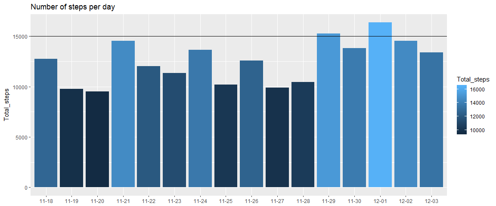
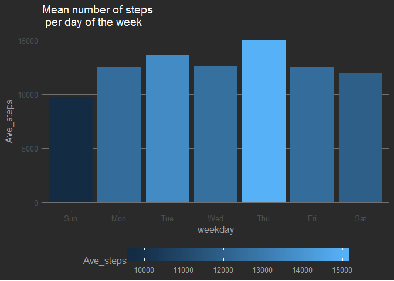

# Wearable Body Sensors

## Synopsis 

I once had the opportunity to work as a customer service agent in a call center. My job was to provide assistance to customers with problems regarding their  wearable body sensors. Wearable body sensors or trackers as we commonly refer to them are revolutionizing fitness programs by providing feedback to the user. It provides an asseesment of how well you performed today during your exercise routine and even how it compares to how well you have advanced since you started your program three months ago.

Not only has it improved individual exercise programs but also programs that cater to groups of people. More and more companies are seeing the benefit of incorporating a physical fitness program together with some form of incentives based on the feedback from wearable body sensors.

I was allowed to borrow from the company a tracker for a week. The tracker had a GPS (Global Positioning System) Receiver which allows you to track your geo-positions while doing an activity. I thought it was pretty neat!!!  I liked running  or taking long bike rides on weekends from Quezon City to Antipolo. I was even able to reach Lucban, Quezon and visit the Kamay ni Hesus Shrine during summer break.

# The Data

I will be exploring the data gathered from the tracker and have a great time plotting the results. When I left my job i lost access to my tracker's account. I tried accessing it but I Couldn't remember the right password anymore.  Luckily, I was able to save some of my data in .tcx, .csv, and .RData formats the last time I tried to explore the data while I was still in the company.

The company that owned the tracker offers a nice and easy way to for its customers to view their data but i will take this opportunity to exercise my learned R skills and explore the R package [TrackeR](https://github.com/hfrick/trackeR) by Hannah Frick and Ioannis Kosmidis. The package is available in [CRAN](https://www.r-project.org/).


```r
list.files("./data")
```

```
## [1] "fitbit.csv"    "fitbit.tcx"    "fitbit1.RData" "fitbit2.tcx"  
## [5] "fitbit3.tcx"
```

The `RData` files contained the data I was able to previously download using the R package [fitbitScraper](https://github.com/corynissen/fitbitScraper) by Cory Nissen which is also available in [CRAN](https://www.r-project.org/). Back then I didn't know about the package TrackeR and was disappointed when i tried to view the .tcx files which contained the data from the GPS positions.

# Intraday data

Let's take a look at my data from November 18 to December 3.


```r
load("./data/fitbit1.RData")
ls()
```

```
##  [1] "cookie"     "d"          "daydf"      "dt"         "fitbit.dt" 
##  [6] "fitbit.pwd" "fitbit.usr" "i"          "iris"       "target"
```

The variables: `cookie`, `fitbit.dt`, `fitbit.pwd`, `fitbit.usr`, `target`, `i` were arguments for the functions in fitbit scraper to download my data. It doesn't work now because I no longer have access to the company's email account and i don't remember the password as well. So we'll just rely on the other variables that's contained in the Rdata file. It turns out that the variable d contains all the data and the rest are just subsets of d.

`iris`, as most R users know is the name of a popular dataset in R. I guess i did a couple of practice rounds with that data while downloading my Fitbit data. The .tcx files contain the gps data.


```r
library(dplyr)
```

```
## Warning: package 'dplyr' was built under R version 3.4.3
```

```
## 
## Attaching package: 'dplyr'
```

```
## The following objects are masked from 'package:stats':
## 
##     filter, lag
```

```
## The following objects are masked from 'package:base':
## 
##     intersect, setdiff, setequal, union
```

```r
library(lubridate)
```

```
## 
## Attaching package: 'lubridate'
```

```
## The following object is masked from 'package:base':
## 
##     date
```

```r
str(d)
```

```
## 'data.frame':	1536 obs. of  4 variables:
##  $ time     : POSIXct, format: "2016-11-18 00:00:00" "2016-11-18 00:15:00" ...
##  $ steps    : num  0 0 0 0 0 0 0 0 0 0 ...
##  $ day      : chr  "11-18" "11-18" "11-18" "11-18" ...
##  $ timestamp: chr  "13:00:00" "13:15:00" "13:30:00" "13:45:00" ...
```


```r
tail(d)
```

```
##                     time steps   day timestamp
## 1531 2016-12-03 22:30:00     0 12-03  11:30:00
## 1532 2016-12-03 22:45:00     0 12-03  11:45:00
## 1533 2016-12-03 23:00:00    35 12-03  12:00:00
## 1534 2016-12-03 23:15:00   373 12-03  12:15:00
## 1535 2016-12-03 23:30:00   260 12-03  12:30:00
## 1536 2016-12-03 23:45:00    78 12-03  12:45:00
```

The downloaded data from the website summarizes the report to the number of steps achieved every 15 minutes. We can also manipulate the data in R in order to show other details with regard to time like days of the week.


```r
d$weekday <- wday(d$time, label = TRUE, abbr = TRUE)
d$date <- date(d$time)
head(d)
```

```
##                  time steps   day timestamp weekday       date
## 1 2016-11-18 00:00:00     0 11-18  13:00:00     Fri 2016-11-18
## 2 2016-11-18 00:15:00     0 11-18  13:15:00     Fri 2016-11-18
## 3 2016-11-18 00:30:00     0 11-18  13:30:00     Fri 2016-11-18
## 4 2016-11-18 00:45:00     0 11-18  13:45:00     Fri 2016-11-18
## 5 2016-11-18 01:00:00     0 11-18  14:00:00     Fri 2016-11-18
## 6 2016-11-18 01:15:00     0 11-18  14:15:00     Fri 2016-11-18
```

# Steps by day

Let's take a look at the total number of steps per day during that 2 week period.


```r
day_sum <- d %>% group_by(day) %>% summarize(Total_steps = sum(steps))
tail(day_sum)
```

```
## # A tibble: 6 x 2
##   day   Total_steps
##   <chr>       <dbl>
## 1 11-28       10429
## 2 11-29       15245
## 3 11-30       13795
## 4 12-01       16376
## 5 12-02       14539
## 6 12-03       13404
```

We can appreciate that data better in a plot.


```r
library(leaflet)
library(ggplot2)
ggplot(day_sum,
       aes(x = day,
           y = Total_steps,
           fill = Total_steps)) +
        geom_bar(stat = "identity") +
        geom_hline(yintercept = 15000) +
        theme(axis.title.x = element_blank()) +
        ggtitle(paste0("fitbit steps by day interval\nTotal Steps = ", sum(d$steps)))
```

<!-- -->


To find out what day of the week I was able to meet my 15000 goal per day we can:


```r
d %>% group_by(date) %>% summarize(Total_steps = sum(steps)) %>% filter(Total_steps > 15000) %>% mutate(weekday = wday(date, label = TRUE))
```

```
## # A tibble: 2 x 3
##   date       Total_steps weekday
##   <date>           <dbl> <ord>  
## 1 2016-11-29       15245 Tue    
## 2 2016-12-01       16376 Thu
```

At this point, I was transitioning from a baseline goal of 10,000 steps per day 15,000 steps but wasn't meeting much success. 

# Prettier plot

We can improve the previous graph such that it conveys the information readily by:


```r
d %>% group_by(date) %>%
        summarize(Total_steps = sum(steps)) %>%
        mutate(target_met = Total_steps >= 15000) %>%
        ggplot(aes(x = date,
                   y = Total_steps,
                   fill = target_met)) +
        geom_bar(stat = "identity") +
        geom_hline(yintercept = 15000,
                   linetype = "dashed") +
        ggtitle("Steps by Day")
```

<!-- -->

# Steps throughout the day

If we want to see number of steps throughout the day by 15 min intervals we can:


```r
ggplot(d, aes(timestamp, steps, fill = steps)) +
     geom_bar(stat = "identity") +
     facet_grid(day ~ .) +
     theme(axis.text.x = element_blank()) +
     xlab("15 minute interval") +
     ggtitle("fitbit steps by 15 min interval")
```

<!-- -->


# GPS data

Let's turn our attention now to mapping our gps data.

## Read in the data

We read in the data using the `readTCX` function from the trackeR package


```r
library(trackeR)
```

```
## Warning: package 'trackeR' was built under R version 3.4.3
```

```
## Loading required package: zoo
```

```
## Warning: package 'zoo' was built under R version 3.4.3
```

```
## 
## Attaching package: 'zoo'
```

```
## The following objects are masked from 'package:base':
## 
##     as.Date, as.Date.numeric
```

```
## 
## Attaching package: 'trackeR'
```

```
## The following object is masked from 'package:base':
## 
##     append
```

```r
am_run <- readTCX(file = "./data/fitbit.tcx", timezone = "Asia/Taipei")
str(am_run)
```

```
## 'data.frame':	3638 obs. of  9 variables:
##  $ time      : POSIXct, format: "2017-01-25 05:36:44" "2017-01-25 05:36:45" ...
##  $ latitude  : num  14.6 14.6 14.6 14.6 14.6 ...
##  $ longitude : num  121 121 121 121 121 ...
##  $ altitude  : num  77.6 74.5 72.6 70.6 68.8 ...
##  $ distance  : num  0 0 0 0 0.13 0.49 1.18 1.18 3.39 4.55 ...
##  $ heart.rate: num  74 74 74 74 74 74 74 74 74 74 ...
##  $ speed     : num  NA NA NA NA NA NA NA NA NA NA ...
##  $ cadence   : num  NA NA NA NA NA NA NA NA NA NA ...
##  $ power     : num  NA NA NA NA NA NA NA NA NA NA ...
```


```r
summary(am_run)
```

```
##       time                        latitude       longitude  
##  Min.   :2017-01-25 05:36:44   Min.   :14.61   Min.   :121  
##  1st Qu.:2017-01-25 05:54:24   1st Qu.:14.61   1st Qu.:121  
##  Median :2017-01-25 06:11:46   Median :14.62   Median :121  
##  Mean   :2017-01-25 06:10:52   Mean   :14.62   Mean   :121  
##  3rd Qu.:2017-01-25 06:26:54   3rd Qu.:14.62   3rd Qu.:121  
##  Max.   :2017-01-25 06:42:03   Max.   :14.62   Max.   :121  
##                                                             
##     altitude         distance      heart.rate        speed     
##  Min.   :-23.50   Min.   :   0   Min.   : 69.0   Min.   : NA   
##  1st Qu.: 12.60   1st Qu.:1166   1st Qu.: 95.0   1st Qu.: NA   
##  Median : 20.60   Median :2467   Median :102.0   Median : NA   
##  Mean   : 19.56   Mean   :2443   Mean   :100.2   Mean   :NaN   
##  3rd Qu.: 26.80   3rd Qu.:3711   3rd Qu.:107.0   3rd Qu.: NA   
##  Max.   : 77.59   Max.   :4960   Max.   :122.0   Max.   : NA   
##                                                  NA's   :3638  
##     cadence         power     
##  Min.   : NA    Min.   : NA   
##  1st Qu.: NA    1st Qu.: NA   
##  Median : NA    Median : NA   
##  Mean   :NaN    Mean   :NaN   
##  3rd Qu.: NA    3rd Qu.: NA   
##  Max.   : NA    Max.   : NA   
##  NA's   :3638   NA's   :3638
```


The data contains a run around the neighborhood lasting for a little over an hour. Aside from providing information about the geo-positions, the tracker also provides information about altitude, time, heart rate, and distance. 

## Convert data frame to time series data

We'll tranform our data frame to a time series data to better plot the variables. We'll use the function `trackeRdata` from the trackeR package.


```r
am_run_ts <- trackeRdata(am_run)
str(am_run_ts, 2)
```

```
## List of 1
##  $ :'zoo' series from 2017-01-25 05:36:39 to 2017-01-25 06:42:08
##   Data: num [1:3659, 1:9] 14.6 14.6 14.6 14.6 14.6 ...
##   ..- attr(*, "dimnames")=List of 2
##   Index:  POSIXct[1:3659], format: "2017-01-25 05:36:39" "2017-01-25 05:36:39" ...
##  - attr(*, "operations")=List of 2
##   ..$ smooth   : NULL
##   ..$ threshold: NULL
##  - attr(*, "units")='data.frame':	10 obs. of  2 variables:
##   ..$ variable: chr [1:10] "latitude" "longitude" "altitude" "distance" ...
##   ..$ unit    : chr [1:10] "degree" "degree" "m" "m" ...
##  - attr(*, "class")= chr [1:2] "trackeRdata" "list"
```

# Summary

We can see a summary of my performance by using the `summary` function.


```r
summary(am_run_ts, movingThreshold = 1)
```

```
## 
##  *** Session 1 ***
## 
##  Session times: 2017-01-25 05:36:39 - 2017-01-25 06:42:08 
##  Distance: 4960.91 m 
##  Duration: 1.09 hours 
##  Moving time: 0.93 hours 
##  Average speed: 1.26 m_per_s 
##  Average speed moving: 1.49 m_per_s 
##  Average pace (per 1 km): 13:11 min:sec
##  Average pace moving (per 1 km): 11:12 min:sec
##  Average cadence: NA steps_per_min 
##  Average cadence moving: NA steps_per_min 
##  Average power: NA W 
##  Average power moving: NA W 
##  Average heart rate: 98.84 bpm 
##  Average heart rate moving: 101.32 bpm 
##  Average heart rate resting: 84.74 bpm 
##  Work to rest ratio: 5.6 
## 
##  Moving threshold: 1 m_per_s
```


The summary function not only provided a summary of the variables in the data like total distance, duration, average speed and average heart rate, it also combined or extended the data to come up with other variables such as average heart rate when moving or resting.

# Plotting Heartbeat and pace

We can also plot heartbeat and pace.


```r
plot(am_run_ts, what = c("heart.rate", "distance", "pace"))
```

<!-- -->

Looking at the plot we can see a series of up and down movement in pace and heartbeat.  This is due to the many crossroads and vehicular traffic in the area.  It would be better if we have a sustained level of heart rate and pace.

# Mapping the run

We will use the plotRoute function from the package TrackeR


```r
plotRoute(am_run_ts, zoom = 15, source = "google")
```

```
## Source : https://maps.googleapis.com/maps/api/staticmap?center=14.618019,121.028885&zoom=15&size=640x640&scale=2&maptype=terrain&language=en-EN
```

<!-- -->


or the leaflet function from the package leaflet which gives us a lot of flexibility on how our plot should look


```r
leaflet(am_run) %>%
                addTiles() %>% 
                addProviderTiles("OpenStreetMap.Mapnik") %>% 
                setView(121.0289, 14.61739, zoom = 15) %>%
                addPolylines(~longitude, ~latitude) 
```

<iframe width="700" height="500" src="https://github.com/DocOfi/Building_Data_Visualization_Tools/blob/gh-pages/maprun.html"></iframe>

<br>

The next .tcx files contain a session on the stationary bike. Wearing the tracker on the wrist will probably result in errors in the number of steps counted since the algorithm contained in the tracker was designed to monitor the swinging of arms during walking, which in turn gives the number of steps. And since riding a stationary bike does not mimic the swinging movement of the arms, I decided to wear the tracker on my ankle and see what would happen. Since the bike is also stationary, we won't have any use for GSP data. 

# Stationary bike data

The value of the tracker for this exercise is to monitor the heart rate. The longer you can keep your heart rate at a higher level during an exercise session, the more calories you burn.  I wanted to find out how high my heart rate would be at the peak of my effort.


```r
bike1 <- readTCX(file = "./data/fitbit2.tcx", timezone = "Asia/Taipei")
bike2 <- readTCX(file = "./data/fitbit3.tcx", timezone = "Asia/Taipei")
stat_bike <- rbind(bike1, bike2)
stat_bike_ts <- trackeRdata(stat_bike)
str(stat_bike_ts, 2)
```

```
## List of 1
##  $ :'zoo' series from 2017-02-01 05:38:05 to 2017-02-01 06:09:02
##   Data: num [1:1604, 1:9] 14.6 14.6 14.6 14.6 14.6 ...
##   ..- attr(*, "dimnames")=List of 2
##   Index:  POSIXct[1:1604], format: "2017-02-01 05:38:05" "2017-02-01 05:38:05" ...
##  - attr(*, "operations")=List of 2
##   ..$ smooth   : NULL
##   ..$ threshold: NULL
##  - attr(*, "units")='data.frame':	10 obs. of  2 variables:
##   ..$ variable: chr [1:10] "latitude" "longitude" "altitude" "distance" ...
##   ..$ unit    : chr [1:10] "degree" "degree" "m" "m" ...
##  - attr(*, "class")= chr [1:2] "trackeRdata" "list"
```


## Summary data


```r
summary(stat_bike_ts, movingThreshold = 1)
```

```
## 
##  *** Session 1 ***
## 
##  Session times: 2017-02-01 05:38:05 - 2017-02-01 06:09:02 
##  Distance: 3227.98 m 
##  Duration: 30.95 mins 
##  Moving time: 25.55 mins 
##  Average speed: 1.74 m_per_s 
##  Average speed moving: 2.11 m_per_s 
##  Average pace (per 1 km): 9:35 min:sec
##  Average pace moving (per 1 km): 7:55 min:sec
##  Average cadence: NA steps_per_min 
##  Average cadence moving: NA steps_per_min 
##  Average power: NA W 
##  Average power moving: NA W 
##  Average heart rate: 136.33 bpm 
##  Average heart rate moving: 136.2 bpm 
##  Average heart rate resting: 138.37 bpm 
##  Work to rest ratio: 4.73 
## 
##  Moving threshold: 1 m_per_s
```

Because I poured all my effort from start to finish of the stationary biking session I was able to maintain an average heart rate of 136.33.  Because of the sustained best effort, i was only able to keep going for 30 mminutes.

## Plotting heart rate and pace

The plot shows that i was able to reach a peak heart rate of about 145 and the steep incline of the plot showed how fast I achioeved the peak heart rate


```r
plot(stat_bike_ts)
```

<!-- -->

You can also plot the percentage of times you were able to maintain a range of heart beat.


```r
zone2 <- zones(stat_bike_ts)
plot(zone2)
```

<!-- -->

There are so many other useful and interesting functions in the TrackeR package but because we have a limited amount of data, we are unable to show them here. You can find the intoructory tutorial for the package trackeR at this URL https://cran.r-project.org/web/packages/trackeR/vignettes/TourDetrackeR.html

# Conclusion

Waerable sensors are great motivators for individuals to exercise by providing feedback with regard to the performance of the individual. It can help to set goals and provide interaction among people having the same goals and purpose. Companies can take advantage of this devices to keep their workforce healthy, increase productivity, and decrease medical insurance cost for the employee and the company. 


