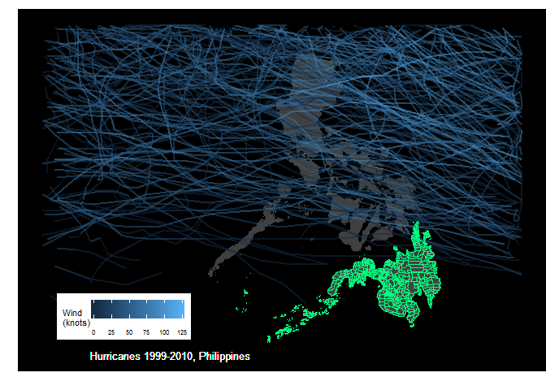

# Synopsis

I was once asked to give a series of talks in several cities in the southern group of islands in the Philippines known as Mindanao. The people of Mindanao prided themselves with perfect weather the whole year round. They said that typhoons rarely visited them and I wanted to know if this was true.


```r
library(lubridate)
library(dplyr)
library(ggplot2)
```

# The data

<br>

Our data we will be using for this exercise comes from the [National Oceanic and Atmospheric Administration](http://www.noaa.gov/) and is commonly referred to as IBTrACS.  IBTrACS or International Best Track Archive for Climate Stewardship contains data from all official Tropical Cyclone Warning Centers (TCWCs) and the WMO Regional Specialized Meteorological Centers (RSMCs) who are responsible for developing and archiving best track data worldwide. The dataset period is from 1848 to the present. 

We will be using the IBTrACS-WMO (World Meterological Organization) version of the data from the Western Pacific basin which can be downloaded from ftp://eclipse.ncdc.noaa.gov/pub/ibtracs/v03r10/wmo/csv/basin/Basin.WP.ibtracs_wmo.v03r10.csv

<br>

# Reading in the data


```r
library(lubridate)
library(dplyr)
library(ggplot2)

wpacific<-read.csv("Basin.WP.ibtracs_wmo.v03r03.csv",
                   stringsAsFactors = FALSE,
                   skip = 1)   ### 1st row only title                  
units <- wpacific[1, ]
units
```

```
##   Serial_Num Season Num Basin Sub_basin Name            ISO_time Nature
## 1        N/A   Year   #    BB        BB  N/A YYYY-MM-DD HH:MM:SS    N/A
##    Latitude Longitude Wind.WMO. Pres.WMO. Center Wind.WMO..Percentile
## 1 deg_north  deg_east        kt        mb    N/A                    %
##   Pres.WMO..Percentile Track.type
## 1                    %        N/A
```

<br>

The first line of the downloaded file contains the title of the dataset.  We'll skip that line to facilitate reading the data correctly. The second line of the data contains the units for each of the variables.  We'll skip that one as well.

<br>


```r
wpacific <- wpacific[-1, ]
str(wpacific)
```

```
## 'data.frame':	56095 obs. of  16 variables:
##  $ Serial_Num          : chr  "1951050N20139" "1951050N20139" "1951050N20139" "1951050N20139" ...
##  $ Season              : chr  "1951" "1951" "1951" "1951" ...
##  $ Num                 : chr  "01" "01" "01" "01" ...
##  $ Basin               : chr  " WP" " WP" " WP" " WP" ...
##  $ Sub_basin           : chr  " MM" " MM" " MM" " MM" ...
##  $ Name                : chr  "NOT NAMED" "NOT NAMED" "NOT NAMED" "NOT NAMED" ...
##  $ ISO_time            : chr  "1951-02-19 06:00:00" "1951-02-19 12:00:00" "1951-02-19 18:00:00" "1951-02-20 00:00:00" ...
##  $ Nature              : chr  " TS" " TS" " TS" " NR" ...
##  $ Latitude            : chr  " 20.00" " 20.00" " 23.00" " 25.00" ...
##  $ Longitude           : chr  " 138.50" " 138.50" " 142.10" " 146.00" ...
##  $ Wind.WMO.           : chr  "  0.0" "  0.0" "  0.0" "  0.0" ...
##  $ Pres.WMO.           : chr  " 1010.0" " 1010.0" " 1000.0" "  994.0" ...
##  $ Center              : chr  "tokyo" "tokyo" "tokyo" "tokyo" ...
##  $ Wind.WMO..Percentile: chr  "-100.000" "-100.000" "-100.000" "-100.000" ...
##  $ Pres.WMO..Percentile: chr  "   0.876" "   0.876" "  20.665" "  39.411" ...
##  $ Track.type          : chr  "main" "main" "main" "main" ...
```

Here's a list of the variables in the data but since I'll be plotting only the path of the different hurricanes/typhoon that crosses the Philippine archipelago, we're only interested in the variables: Serial_Num, Season, ISO_time, Latitude and Longitude  

<br>

## Tidying Data

<br>

We need to clean the data a bit by setting the variables to their right classes.


```r
wpacific$Pres.WMO..Percentile <- as.numeric(wpacific$Pres.WMO..Percentile)
wpacific$Wind.WMO..Percentile <- as.numeric(wpacific$Wind.WMO..Percentile)
wpacific$Pres.WMO. <- as.numeric(wpacific$Pres.WMO.)
wpacific$Wind.WMO. <- as.numeric(wpacific$Wind.WMO.)
wpacific$Longitude <- as.numeric(wpacific$Longitude)
wpacific$Latitude <- as.numeric(wpacific$Latitude)
wpacific$Serial_Num <- as.numeric(wpacific$Serial_Num)
wpacific$Season <- as.numeric(wpacific$Season)
wpacific$Num <- as.numeric(wpacific$Num)
wpacific$ISO_time <- ymd_hms(wpacific$ISO_time)
wpacific$month <- month(wpacific$ISO_time)
wpacific$yr_name <- paste(wpacific$Season,
                          wpacific$Name,
                          sep = "_")
yr1990to2010 <- wpacific %>% filter(Season >= 1990)

yr1990to2010 %>%
        select(yr_name,
               Serial_Num,
               Latitude,
               Longitude,
               Wind.WMO.) %>%
        slice(c(1:6, (n()-6):n()))
```

```
## # A tibble: 13 x 5
##    yr_name           Serial_Num Latitude Longitude Wind.WMO.
##    <chr>                  <dbl>    <dbl>     <dbl>     <dbl>
##  1 1990_KORYN                NA     7.00       153       0  
##  2 1990_KORYN                NA     7.00       152       0  
##  3 1990_KORYN                NA     8.00       152       0  
##  4 1990_KORYN                NA     8.50       150       0  
##  5 1990_KORYN                NA     9.00       150       0  
##  6 1990_KORYN                NA     9.70       148      35.0
##  7 2010_OMEKA:TD1219         NA    25.4       -174      35.0
##  8 2010_OMEKA:TD1219         NA    27.0       -173      35.0
##  9 2010_OMEKA:TD1219         NA    29.0       -173      35.0
## 10 2010_OMEKA:TD1219         NA    30.7       -172      30.0
## 11 2010_OMEKA:TD1219         NA    32.2       -172      30.0
## 12 2010_OMEKA:TD1219         NA    33.3       -172      25.0
## 13 2010_OMEKA:TD1219         NA    34.1       -172      25.0
```

<br>

We are ready to plot
 


# Plotting Typhoons


```r
phil_map <- readRDS("PHL_adm2.rds")
phil_mapdf <- fortify(phil_map)
g <- phil_mapdf %>% 
 ggplot(aes(x = long,
            y = lat,
            group = group)) +
        geom_polygon(fill = "gray25",
                     colour = "gray25",
                     size = 0.2) +
        geom_path(data = yr1990to2010,
                  aes(x = Longitude,
           y = Latitude, group = Serial_Num,
                      colour = Wind.WMO.),
                  alpha = 0.5,
                  size = 0.8) +
        xlim(110, 130) +
        ylim(4, 20) +
        labs(x = "",
             y = "",
             colour = "Wind \n(knots)")

mindanao <- c("Agusan del Norte",
              "Agusan del Sur",
              "Basilan",
              "Bukidnon",
              "Camiguin",
              "Compostela Valley",
              "Davao del Norte",
              "Davao del Sur",
              "Davao Oriental",
              "Dinagat Islands",
              "Lanao del Norte",
              "Lanao del Sur",
              "Maguindanao",
              "Misamis Occidental",
              "Misamis Oriental",
              "North Cotabato",
              "Sarangani",
              "South Cotabato",
              "Sultan Kudarat",
              "Sulu",
              "Surigao del Norte",
              "Surigao del Sur",
              "Tawi-Tawi",
              "Zamboanga del Norte",
              "Zamboanga del Sur",
              "Zamboanga Sibugay")
min_provs <- phil_map[phil_map$NAME_1 %in% mindanao, ]
min_provdf <- fortify(min_provs)

g + theme_classic() +
        theme(axis.line = element_blank(),
        axis.text = element_blank(),
        axis.ticks = element_blank(),
        plot.margin=unit(c(3, 0, 0, 0),
                         "mm"),
        legend.text = element_text(size = 6),
        legend.direction = "horizontal",
        legend.position = c(0.20, 0.15),
        legend.title = element_text(size = 8,
                                    face = "plain"),
        panel.background = element_rect(fill='black')) +
        geom_text(aes(x = 112.,
                      y = 4),
                  label = "Hurricanes 1999-2010, Philippines",
                  color="white",
                  hjust=0,
                  size=3.5) +
        geom_polygon(data = min_provs, 
                     fill = "springgreen",
                     colour = "springgreen",
                     size = 0.2,
                     alpha =0.02)
```

<!-- -->

<br>

I guess the people of Mindanao are correct in boasting that typhoons rarely visit their province.

<br>

# Plotting storms by year

<br>


```r
g + theme_classic() +
        theme(axis.line = element_blank(),
        axis.text = element_blank(),
        axis.ticks = element_blank(),
        plot.margin=unit(c(3, 0, 0, 0),
                         "mm"),
        legend.text = element_text(size = 6),
        legend.direction = "horizontal",
        legend.position = "bottom",
        legend.title = element_text(size = 8,
                                    face = "plain"),
        panel.background = element_rect(fill='black')) +
        geom_polygon(data = min_provs, 
                     fill = "springgreen",
                     colour = "springgreen",
                     size = 0.2,
                     alpha =0.02) +
        facet_wrap(~Season, nrow = 7)
```

<!-- -->

<br>

Looking at the plot of storms per year, it seems there is quite a bit of variability in the number of storms that cross the Philippines each year. This lead me to ask what's the mean number of storms that cross the Philippines per year, per month?  Which month has the highest mean number of storms?  Based on historical data what is the probability that in a a given year, a storm in the pacific basin will enter the philippines airspace or cross the island of Mindanao. 

I'll answer these questions in a later project. For now, I'll just be content to be happy for the great weather the Lumads, Christian, and Muslim people of Mindanao are enjoying.


# References

Schreck, Carl & National Center for Atmospheric Research Staff (Eds). Last modified 06 Nov 2013. "The Climate Data Guide: IBTrACS: Tropical cyclone best track data." Retrieved from https://climatedataguide.ucar.edu/climate-data/ibtracs-tropical-cyclone-best-track-data.

[Visualizing Hurricane Trajectories](https://rpubs.com/gaston/hurricanes)
by: Gaston Sanchez

[Mapping Global Earthquakes and Hurricane tracks with R](http://david-lallemant.com/tag/earthquakes/)
