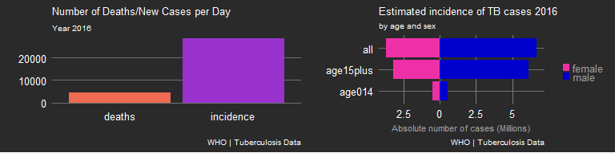
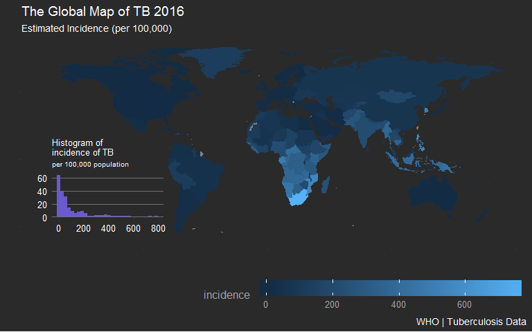
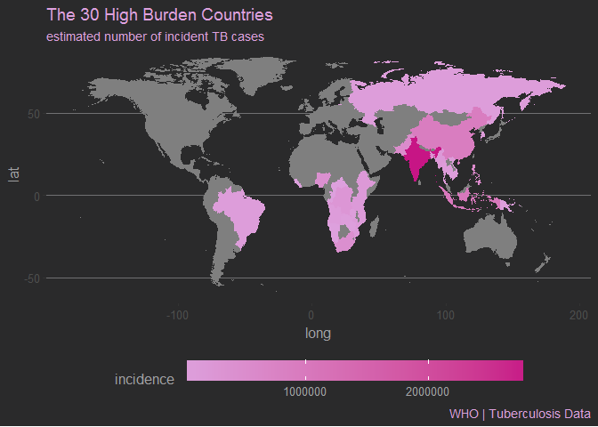
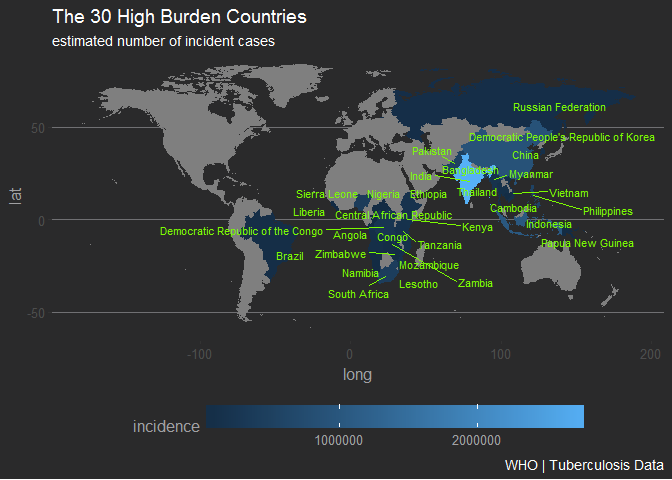
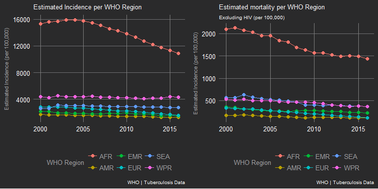
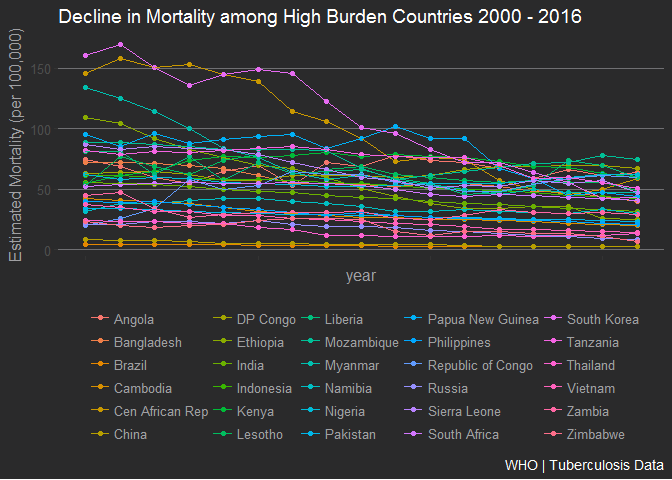

# Introduction 

I was looking to do a project that will challenge my newly learned skills in R after taking the courses [Building Data Visualization Tools](https://www.coursera.org/learn/r-data-visualization) and [Reproducible Templates for Analysis and Dissemination](https://www.coursera.org/learn/reproducible-templates-analysis). I wanted a topic that is interesting, relevant, timely and with some measure of importance. to create beautiful and interesting plots and presentation.

While browsing the internet, I came upon the [Global Tuberculosis Report](http://www.who.int/tb/publications/global_report/en/) 2017 by the [World Health Organization or WHO](http://www.who.int/). The report impresssed upon me the need for sustained and concerted efforts to meet the goal of the WHO to end the TB epidemic by 2030. TB has been with us for a long time and the WHO is making an enormous effort to finally rid the world of this disease. However, there are many obstacles along the way.

> *The social and economic impacts are*
> *devastating, including poverty, stigma and discrimination. While the world has committed to*
> *ending the TB epidemic by 2030, actions and investments don't match the political rhetoric.* - Dr Tedros Adhanom Ghebreyesus, WHO Director-General

The measure for success for this goal is a 90% reduction in TB deaths and 80% reduction in TB incidence rate by 2030 compared to 2015. The report was outstandingly well written in a language that is easily understandable and organized in a logical and meaningful way. Plus it is accompanied by a website/repository where data in the report can easily be navigated and downloaded. Equally important, the  subject of the  data  was something that I can relate to as a former healthcare provider and as a citizen of a developing country like the Philippines.

Although 2030 seems conveniently far in to the future, the WHO has set goals for the year 2020 and 2025 to ensure that countries are on trak to meet the 2030 end goal. The first milestones of the End TB Strategy set for 2020 are a 35% reduction in TB deaths and a 20% reduction in TB incidence, compared with levels in 2015; and that no TB patients and their households should face catastrophic costs as a result of TB disease.

For this exercise, I will be exploring the global TB data for the year 2016 and examine the progress that has been made since the year 2000.  My goal is to bring attention to the problem of TB and the need for immediate, sustained, and timely response to meet the target Goals of the WHO and to create beautiful and interesting plots using R.

The [Global Tuberculosis Report 2017](http://www.who.int/tb/publications/global_report/en/) was concisely written and compels me to lift lines of text directly rather than paraphrase what was written. Text copied directly from the report will be set in block lines of text like the one below. 

### The Global TB Epidemic

>  In 2016, there were an estimated 1.3 million TB deaths among* 
> *HIV-negative people and an additional 374 000 deaths among HIV-positive people.*
> *TB is the ninth leading cause of death worldwide and the leading cause from a single infectious agent, ranking above HIV/AIDS.*


```r
library(dplyr)
library(tidyr)
library(ggplot2)
library(ggthemes)
library(gridExtra)

TB.burden <- read.csv("TB_burden_countries_2018-05-20.csv",      ### read in file and save
                      stringsAsFactors = FALSE)                  ### as an R object TB.burden

stat_2016 <- TB.burden %>%                                       ### take The R object TB.burden
        select(country, year, e_inc_num, e_mort_num) %>%         ### select the variables we need
        filter(year == 2016) %>%                                 ### filter data year 2016 only
        summarize(incidence = sum(e_inc_num)/365,                ### summarize incidence and mortality into
                  deaths = sum(e_mort_num)/365)                  ### number of cases per day
                                                                 ### save as R object mean_inc_death

g1 <- stat_2016 %>%                                              ### Take R object mean_inc_death
        gather(key = "key",                                      ### prepare data
               value = "value") %>%                              ### for plotting with ggplot
        ggplot(aes(x = key,                                      ### Plot var key on the x axis
                   y = value,                                    ### plot var value on the y axis
                   fill = key)) +                                ### plot color as var key
        geom_bar(stat = "identity",                              ### plot data as a barplot
                 position = "dodge") +
        labs(title = "Number of Deaths/New Cases per Day",  ### add title, subtitle, caption
             subtitle = "Year 2016",
             x = "",
             y = "",
             caption = "WHO | Tuberculosis Data") +
        theme_hc(bgcolor = "darkunica") +                        ### use preset theme
        theme(axis.text = element_text(colour = "white"),        ### set axis labels as white 
              axis.title = element_text(colour = "white"),       ### set title color as white 
              panel.grid.major.x = element_blank(),              ### remove grid elements
              title = element_text(size = 8)) +                  ### set font size to 8
        guides(fill = FALSE) +                                   ### remove legend
        scale_fill_manual(values = c("coral2", "darkorchid"))    ### set color manually

###TB.burden %>% select(country, year, e_inc_num, e_mort_num) %>% group_by(year) %>% summarize(incidence = sum(e_inc_num)/365, deaths = sum(e_mort_num)/365) %>%gather(key = "key", value = "value", -year) %>% ggplot(aes(x = year, y = value, fill = key)) + geom_bar(stat = "identity", position = "dodge") + labs(title = "Mean Number of Deaths and New Cases", subtitle = "per day", x = "", y = "", caption = "WHO | Tuberculosis Data") + theme_hc(bgcolor = "darkunica") + theme(axis.text = element_text(colour = "white"), axis.title = element_text(colour = "white"), legend.position = "right", panel.grid.major.x = element_line(color = "gray50")) + scale_fill_manual(values = c("dodgerblue", "tomato"))

eincnum_m <- names(TB.burden)[grep("^e_inc_num_m",                  ### find variables that begin
                                   names(TB.burden))][c(1, 4, 7)]   ### with e_inc_num_m

allcasesM <- TB.burden %>%                                          ### take R object TB.burden
        filter(year == "2016") %>%                                  ### filter year 2016 only
        select(year, eincnum_m)                                     ### select var year and those
                                                                    ### beginning with e_inc_num_m

names(allcasesM) <- gsub("^e_inc_num_m", "age",                     ### change variable names 
                         names(allcasesM))

sum_allcasesM <- allcasesM %>%                                      ### summarize data according 
        group_by(year) %>%                                          ### to age groups
        summarize(age014 = sum(age014),
                  age15plus = sum(age15plus),
                  all = sum(age)) %>%
        mutate(gender = "male")                                     ### add variable gender

eincnum_f <- names(TB.burden)[grep("^e_inc_num_f",
                                   names(TB.burden))][c(1, 4, 7)]
allcasesF <- TB.burden %>%
        filter(year == "2016") %>%
        select(year, eincnum_f)

names(allcasesF) <- gsub("^e_inc_num_f", "age",
                         names(allcasesF))

sum_allcasesF <- allcasesF %>%
        group_by(year) %>%
        summarize(age014 = sum(age014),
                  age15plus = sum(age15plus),                      
                  all = sum(age))

sum_allcasesF$gender <- "female"
sum_allcasesF$age014 <- sum_allcasesF$age014 * -1                   ### make variables negative
sum_allcasesF$age15plus <- sum_allcasesF$age15plus * -1
sum_allcasesF$all <- sum_allcasesF$all * -1

allcase_df <- rbind(sum_allcasesM, sum_allcasesF)                   ### rowbind maledatframes

allcase_plotdf <- gather(allcase_df,                                ### prepare data for plotting
                         key = "key",
                         value = "value",
                         -year, -gender)

g2 <- ggplot(allcase_plotdf,                                        ### take allcase_plotdf
             aes(x = key,                                           ### plot key on x axis
                 y = value,                                         ### plot value on y axis
                 fill = gender)) +                                  ### plot gende as color
        geom_bar(stat = "identity") +                               ### create a barplot
        coord_flip() +                                              ### flip x and y axis
        labs(title = "Estimated incidence of TB cases 2016",        ### add title, subtitle
             subtitle = "by age and sex",                           ### caption and y axis title
             x = "",
             y = "Absolute number of cases (Millions)",
             caption = "WHO | Tuberculosis Data") +
        theme_hc(bgcolor = "darkunica") +                           ### use preset theme
        theme(axis.text = element_text(colour = "white"),           ### color axis title as white
              axis.title = element_text(colour = "white"),          ### COLOR title as white
              legend.position = "right",                            ### put legend on the right
              panel.grid.major.x = element_line(color = "gray50"),  ### set color for grid lines
              title = element_text(size = 8),                       ### set font size to 8
              legend.key.size = unit(0.25, "cm"),
              legend.title = element_blank()) +
        scale_y_continuous(breaks = c(-2500000,                     ### set y axis tick labels
                                      0,
                                      2500000,
                                      5000000),
                           labels = c(2.5,
                                      0,
                                      2.5,
                                      5)) +
        scale_fill_manual(values = c("maroon2", "mediumblue"))     ### set color manually     

grid.arrange(g1, g2, nrow = 1)                                     ### arrange position of plot
```

<!-- -->

In 2016, 4548 people died from TB each day. That's about 3 persons per minute. Approximatley 28498 new cases of TB were recorded daily worldwide or 20 persons per minute. 

> *An estimated 10.4 million people fell ill with TB in 2016: 90% were* 
> *adults, 65% were male, 10% were people living with HIV (74% in Africa)*

# The WHO Tuberculosis Data

I downloaded the [data dictionary](https://extranet.who.int/tme/generateCSV.asp?ds=dictionary) which contains a definition of the different variables in the diffrent datasets available for download from the [WHO repository](http://www.who.int/tb/country/data/download/en/). 

Next I downloaded the [WHO TB burden estimates](https://extranet.who.int/tme/generateCSV.asp?ds=estimates). The data includes WHO-generated estimates of TB mortality, incidence (including disaggregation by age and sex and incidence of TB/HIV), case fatality ratio, treatment coverage (previously called case detection rate), proportion of TB cases that have rifampicin-resistant TB (RR-TB, which includes cases with multidrug-resistant TB, MDR-TB), RR/MDR-TB among notified pulmonary TB cases and latent TB infection among children aged under 5.

## Measuring TB

*WHO measures the burden of tuberculosis (TB) disease in terms of:

>    - *incidence - the number of new and relapse cases of TB arising in a given time period, usually 1 year;*
>    - *prevalence - the number of cases of TB at a given point in time; and*
>    - *mortality - the number of deaths caused by TB in a give time period, usually 1 year.*

Incidence is reported either as absolute number of new cases or as a proportion of the population per 100,000

## Read the data in R {.tabset .tabset-fade .tabset-pills}

Below are separate tabs to view the different steps taken to read the data in R. Click on them from left to right to follow the steps chronologically. We already read in the TB burden estimates data earlier to produce the plot of the incidence and number of deaths per day earlier.  The steps are shown here for instructional puposes. 

In case you encounter a variable name in the codes that you don't understand, you can search for its meaning by clicking on the rightmost tab marked `Reading the TB burden estimates data` and entering the variable name in the search tab. The search engine is case-sensitive so make sure spell the name accurately. You can also search using keywords in case you don't know the variable name you are interested in.

In the interest of reproducible research, the codes for this article can be seen by clicking on the rectangular tabs marked "code" on the right saide margin in each section. For students of R programming feel free to copy the codes. Freely have I received and freely i give.

### Load R packages

We loaded the packages: `dplyr`, `tidyr`, and  `ggplot2` earlier to create the plot. We will load other packages to further extend the basic functionality of R to help us manipulate and plot the data.


```r
library(tibble)
library(ggmap)
library(ggrepel)
library(ggalt)
library(DT)
```

### Reading the dictionary in R


```r
TB.dic <- read.csv("TB_data_dictionary_2018-05-20.csv", ### read file in R
                   stringsAsFactors = FALSE)            ### read strings as strings
        
var_dic <- TB.dic[,1]                                   ### store variable names in a vector
defofterms <- TB.dic[, c(1,4)]                          ### subset 1st and last column of the dictionary
head(TB.dic)
```

```
##              variable_name              dataset   code_list
## 1                      bmu Community engagement            
## 2       bmu_community_impl Community engagement            
## 3             bmu_ref_data Community engagement            
## 4       bmu_rxsupport_data Community engagement            
## 5   bmu_rxsupport_data_coh Community engagement            
## 6 community_data_available Community engagement 0=No; 1=Yes
##                                                                                                                             definition
## 1                                                                                   Number of TB Basic Management Units in the country
## 2 Number of TB Basic Management Units which implemented community-based referrals or any form of community treatment adherence support
## 3                           Number of Basic Management Units with data on referrals by community health workers / community volunteers
## 4                                                  Number of Basic Management Units with data on community treatment adherence support
## 5   Total number of patients who started TB treatment in the Basic Management Units with data on community treatment adherence support
## 6                                Are data available on community-based referrals or any form of community treatment adherence support?
```

### Reading the TB burden estimates data


```r
TB.burden <- read.csv("TB_burden_countries_2018-05-20.csv",               ### read in file
                      stringsAsFactors = FALSE)
var_burden <- names(TB.burden)                                            ### store variable names in a vector
var_burden_in_dic <-var_dic[var_dic %in% var_burden]                      ### find which variable names in the  in the TB.burden dataframe in the dictionary
var_burden_def <- subset(defofterms,                                      ### create a dataframe of the variable
                         defofterms$variable_name %in% var_burden_in_dic) ### names and their definition
datatable(var_burden_def)                                                            ### show variable and definition
```

<!--html_preserve--><div id="htmlwidget-a2192a0204c3c20d9df3" style="width:100%;height:auto;" class="datatables html-widget"></div>
<script type="application/json" data-for="htmlwidget-a2192a0204c3c20d9df3">{"x":{"filter":"none","data":[["11","12","13","14","15","16","17","18","19","20","21","22","23","24","25","26","27","28","29","30","31","32","33","34","35","36","37","38","39","40","41","42","43","44","45","46","47","48","49","50","51","55","56","57","58","59","60","63","64","65","66","67","68","69","70","71","72","73","74","75","76","77","78","79","80","81","91","92","93"],["country","iso_numeric","iso2","iso3","c_cdr","c_cdr_hi","c_cdr_lo","c_newinc_100k","cfr","cfr_hi","cfr_lo","e_inc_100k","e_inc_100k_hi","e_inc_100k_lo","e_inc_num","e_inc_num_014","e_inc_num_014_hi","e_inc_num_014_lo","e_inc_num_15plus","e_inc_num_15plus_hi","e_inc_num_15plus_lo","e_inc_num_f","e_inc_num_f_hi","e_inc_num_f_lo","e_inc_num_f014","e_inc_num_f014_hi","e_inc_num_f014_lo","e_inc_num_f15plus","e_inc_num_f15plus_hi","e_inc_num_f15plus_lo","e_inc_num_hi","e_inc_num_lo","e_inc_num_m","e_inc_num_m_hi","e_inc_num_m_lo","e_inc_num_m014","e_inc_num_m014_hi","e_inc_num_m014_lo","e_inc_num_m15plus","e_inc_num_m15plus_hi","e_inc_num_m15plus_lo","e_inc_tbhiv_100k","e_inc_tbhiv_100k_hi","e_inc_tbhiv_100k_lo","e_inc_tbhiv_num","e_inc_tbhiv_num_hi","e_inc_tbhiv_num_lo","e_mort_100k","e_mort_100k_hi","e_mort_100k_lo","e_mort_exc_tbhiv_100k","e_mort_exc_tbhiv_100k_hi","e_mort_exc_tbhiv_100k_lo","e_mort_exc_tbhiv_num","e_mort_exc_tbhiv_num_hi","e_mort_exc_tbhiv_num_lo","e_mort_num","e_mort_num_hi","e_mort_num_lo","e_mort_tbhiv_100k","e_mort_tbhiv_100k_hi","e_mort_tbhiv_100k_lo","e_mort_tbhiv_num","e_mort_tbhiv_num_hi","e_mort_tbhiv_num_lo","e_pop_num","e_tbhiv_prct","e_tbhiv_prct_hi","e_tbhiv_prct_lo"],["Country or territory name","ISO numeric country/territory code","ISO 2-character country/territory code","ISO 3-character country/territory code","Case detection rate (all forms), percent","Case detection rate (all forms), percent, high bound","Case detection rate (all forms), percent, low bound","Case notification rate, which is the total of new and relapse cases and cases with unknown previous TB treatment history per 100 000 population (calculated)","Estimated TB case fatality ratio","Estimated TB case fatality ratio: high bound","Estimated TB case fatality ratio: low bound","Estimated incidence (all forms) per 100 000 population","Estimated incidence (all forms) per 100 000 population, high bound","Estimated incidence (all forms) per 100 000 population, low bound","Estimated number of incident cases (all forms)","Estimated number of incident cases that are aged 0 - 14","Estimated number of incident cases that are male 0 - 14 (upper bound)","Estimated number of incident cases that are aged 0 - 14 (lower bound)","Estimated number of incident cases that are aged 15 and over","Estimated number of incident cases that are aged 15 and over (upper bound)","Estimated number of incident cases that are aged 15 and over (lower bound)","Estimated number of incident cases that are female","Estimated number of incident cases that are female (upper bound)","Estimated number of incident cases that are female (lower bound)","Estimated number of incident cases that are female aged 0 - 14","Estimated number of incident cases that are female aged 0 - 14 (upper bound)","Estimated number of incident cases that are female aged 0 - 14 (lower bound)","Estimated number of incident cases that are female aged 15 and over","Estimated number of incident cases that are female aged 15 and over (upper bound)","Estimated number of incident cases that are female aged 15 and over (lower bound)","Estimated number of incident cases (all forms), high bound","Estimated number of incident cases (all forms), low bound","Estimated number of incident cases that are male","Estimated number of incident cases that are male (upper bound)","Estimated number of incident cases that are male (lower bound)","Estimated number of incident cases that are male aged 0 - 14","Estimated number of incident cases that are male aged 0 - 14 (upper bound)","Estimated number of incident cases that are male aged 0 - 14 (lower bound)","Estimated number of incident cases that are male aged 15 and over","Estimated number of incident cases that are male aged 15 and over (upper bound)","Estimated number of incident cases that are male aged 15 and over (lower bound)","Estimated incidence of TB cases who are HIV-positive per 100 000 population","Estimated incidence of TB cases who are HIV-positive per 100 000 population, high bound","Estimated incidence of TB cases who are HIV-positive per 100 000 population, low bound","Estimated incidence of TB cases who are HIV-positive","Estimated incidence of TB cases who are HIV-positive, high bound","Estimated incidence of TB cases who are HIV-positive, low bound","Estimated mortality of TB cases (all forms) per 100 000 population","Estimated mortality of TB cases (all forms) per 100 000 population, high bound","Estimated mortality of TB cases (all forms) per 100 000 population, low bound","Estimated mortality of TB cases (all forms, excluding HIV) per 100 000 population","Estimated mortality of TB cases (all forms, excluding HIV), per 100 000 population, high bound","Estimated mortality of TB cases (all forms, excluding HIV), per 100 000 population, low bound","Estimated number of deaths from TB (all forms, excluding HIV)","Estimated number of deaths from TB (all forms, excluding HIV), high bound","Estimated number of deaths from TB (all forms, excluding HIV), low bound","Estimated number of deaths from TB (all forms)","Estimated number of deaths from TB (all forms), high bound","Estimated number of deaths from TB (all forms), low bound","Estimated mortality of TB cases who are HIV-positive, per 100 000 population","Estimated mortality of TB cases who are HIV-positive, per 100 000 population, high bound","Estimated mortality of TB cases who are HIV-positive, per 100 000 population, low bound","Estimated number of deaths from TB in people who are HIV-positive","Estimated number of deaths from TB in people who are HIV-positive, high bound","Estimated number of deaths from TB in people who are HIV-positive, low bound","Estimated total population number","Estimated HIV in incident TB (percent)","Estimated HIV in incident TB (percent), high bound","Estimated HIV in incident TB (percent), low bound"]],"container":"<table class=\"display\">\n  <thead>\n    <tr>\n      <th> <\/th>\n      <th>variable_name<\/th>\n      <th>definition<\/th>\n    <\/tr>\n  <\/thead>\n<\/table>","options":{"order":[],"autoWidth":false,"orderClasses":false,"columnDefs":[{"orderable":false,"targets":0}]}},"evals":[],"jsHooks":[]}</script><!--/html_preserve-->

## A Global Map of TB

The map below shows the countries with higher incidence of TB (per 100,000 population) in lighter shades of blue. Incidence varied widely among countries, from under 10 per 100 000 population in most high-income countries to 150-300 in most of the 30 high TB burden countries, and above 500 in a few countries including the
Democratic People's Republic of Korea, Lesotho, Mozambique, the Philippines and South Africa.


```r
world_map <- map_data("world")                                       ### Create data for world map
world_map <- world_map[world_map$region != "Antarctica",]            ### remove Antartica 

map_region <- unique(world_map$region)                               ### get names of countries
TB_country <- unique(TB.burden$country)                              ### get names of countries

TB.burden_recoded <- TB.burden %>%                                       ### create subset of the
        select(country,                                               ### TB.burden data and
               g_whoregion,                                           ### select variables that
               year,                                                  ### we'll need to plot
               e_pop_num,                                             ### the data
               e_inc_100k,
               e_inc_num,
               e_inc_num_014,
               e_inc_num_15plus,
               e_inc_num_f,
               e_inc_num_f014,
               e_inc_num_f15plus,
               e_inc_num_m,
               e_inc_num_m014,
               e_inc_num_m15plus,
               e_mort_num,
               e_mort_100k,
               e_mort_exc_tbhiv_100k) 


### reconcile spelling of the names of the countries in the two data frames before merging
TB.burden_recoded$country <- recode(TB.burden_recoded$country,
                                             "Antigua and Barbuda" = "Antigua",
                                             "Bolivia (Plurinational State of)" = "Bolivia",
                                             "Bonaire, Saint Eustatius and Saba" = "Bonaire",
                                             "British Virgin Islands" = "VirginIslands",
                                             "Brunei Darussalam" = "Brunei",
                                             "Cabo Verde" = "Cape Verde",
                                             "Côte d'Ivoire" = "Ivory Coast",
                                             "Congo" = "Republic of Congo",
                                             "Czechia" = "Czech Republic",
                                             "Democratic People's Republic of Korea" = "South Korea",
                                             "Iran (Islamic Republic of)" = "Iran",
                                             "Lao People's Democratic Republic" = "Laos",
                                             "Micronesia (Federated States of)" = "Micronesia",
                                             "Republic of Korea" = "North Korea",
                                             "Republic of Moldova" = "Moldova",
                                             "Russian Federation" = "Russia",
                                             "Saint Kitts and Nevis" = "Nevis",
                                             "Saint Vincent and the Grenadines" = "Saint Vincent",
                                             "Sint Maarten (Dutch part)" = "Sint Maarten",
                                             "Syrian Arab Republic" = "Syria",
                                             "The Former Yugoslav Republic of Macedonia" = "Macedonia",
                                             "Trinidad and Tobago" = "Trinidad",
                                             "United Kingdom of Great Britain and Northern Ireland" = "UK",
                                             "United States of America" = "USA",
                                             "United Republic of Tanzania" = "Tanzania",
                                             "Venezuela (Bolivarian Republic of)"= "Venezuela",
                                             "Viet Nam" = "Vietnam",
                                             "Wallis and Futuna Islands" = "Wallis and Futuna")

inset_plot <- TB.burden %>% select(year, e_inc_100k) %>% filter(year == 2016) %>% ggplot(aes(x = e_inc_100k)) + geom_histogram(Color = "yellow", fill = "slateblue")+ theme_hc(bgcolor = "darkunica") + labs(title = "Histogram of\nincidence of TB", subtitle = "per 100,000 population", x = "", y = "") +theme(title = element_text(size = 8), axis.text = element_text(color = "white"))

g <- ggplotGrob(inset_plot)

###g <- qplot(data = TB.burden, x = e_inc_100k, geom = "histogram", fill = I("slateblue")) 

world_map_joined <- left_join(world_map,                             ### merged world map data
                              TB.burden_recoded %>%
                                      filter(year == 2016),          ### with TB data
                              by = c('region' = 'country')) 

ggplot(data = world_map_joined) + geom_polygon(aes (x = long,
                             y = lat,
                             group = group,
                             fill = e_inc_100k)) +
        labs(title = "The Global Map of TB 2016",
             subtitle = "Estimated Incidence (per 100,000)",
             caption = "WHO | Tuberculosis Data",
             x ="", y = "") +
        scale_fill_gradient(name = "incidence  ",
                            guide = "colourbar") +
        theme_hc(bgcolor = "darkunica") +
        scale_colour_hc("darkunica") +
        theme(legend.key.width = unit(2, "cm"),
              panel.grid.major.y = element_blank(),
              legend.just = c("right","bottom"),
              axis.text = element_blank()) +
        annotation_custom(grob = g,
                          xmin = -Inf,
                          xmax = -80,
                          ymin = -Inf,
                          ymax = 20)
```

<!-- -->
        
### High TB Burden Countries

The 30 High TB Burden Countries were higlighted to focus global action on TB in countries where progress is most needed. High TB Burden Countries account for **87.1%** of estimated absolute number of incident cases and **86.5%** estimated absolute number of mortality cases. The 20 countries with the highest estimated **absolute** number of incident TB cases, plus the top 10 countries with the highest estimated TB incidence _per capita_ make up the list.


```r
top30 <- c("Angola",                              ###  filter countries
           "Bangladesh",                          ### that belong to the
           "Brazil",                              ### High Burden Countries
           "Cambodia",
           "Central African Republic",
           "China",
           "Republic of Congo",
           "South Korea",
           "Democratic Republic of the Congo",
           "Ethiopia",
           "India",
           "Indonesia",
           "Kenya",
           "Lesotho",
           "Liberia",
           "Mozambique",
           "Myanmar",
           "Namibia",
           "Nigeria",
           "Pakistan",
           "Papua New Guinea",
           "Philippines",
           "Russia",
           "Sierra Leone",
           "South Africa",
           "Thailand",
           "Tanzania",
           "Vietnam",
           "Zambia",
           "Zimbabwe")


g1 <- TB.burden_recoded %>% select(country, year, e_inc_num) %>% filter(year == 2016) %>% mutate(hbc = ifelse(country %in% top30, TRUE, FALSE)) %>% group_by(hbc) %>% summarise(sum_inc = sum(e_inc_num)) %>% mutate(perc = paste0(round(sum_inc/sum(sum_inc)*100,1), "%")) %>% ggplot(aes(x = hbc, y=sum_inc, fill = factor(hbc))) + geom_bar(stat = "identity") + geom_text(aes(label = perc), vjust = 1.6, color = "white", size = 3.5) +  theme_hc(bgcolor = "darkunica") + labs(title = "Incidence of TB cases in 2016 among\nHigh Burden Countries and\nthe rest of the world", subtitle = "estimated number of incident cases" , caption = "WHO | Tuberculosis Data", x = "", y = "") + guides(fill = FALSE) + scale_x_discrete(labels = c("rest of the world", "High Burden Countries")) + scale_fill_manual(values = c("mediumblue", "maroon2")) + theme(axis.text.x = element_text(colour = "white"), title = element_text(size = 9))        

g2 <- TB.burden_recoded %>% select(country, year, e_mort_num) %>% filter(year == 2016) %>% mutate(hbc = ifelse(country %in% top30, TRUE, FALSE)) %>% group_by(hbc) %>% summarise(sum_mort = sum(e_mort_num)) %>% mutate(perc = paste0(round(sum_mort/sum(sum_mort)*100,1), "%")) %>% ggplot(aes(x = hbc, y=sum_mort, fill = factor(hbc))) + geom_bar(stat = "identity") + geom_text(aes(label = perc), vjust = 1.6, color = "white", size = 3.5) +  theme_hc(bgcolor = "darkunica") + guides(fill = FALSE) + labs(title = "Mortality of TB cases in 2016 among\nHigh Burden Countries and\nthe rest of the world", subtitle = "estimated number of mortality cases", caption = "WHO | Tuberculosis Data", x = "", y = "") + scale_x_discrete(labels = c("rest of the world", "High Burden Countries")) + scale_fill_manual(values = c("mediumblue", "maroon2")) + theme(axis.text.x = element_text(colour = "white"), title = element_text(size = 9))     

grid.arrange(g1, g2, nrow =1)
```

<!-- -->

> *The top 20 by estimated absolute number (in alphabetical order):*
> *- Angola, Bangladesh, Brazil, China, DPR Korea, DR Congo, Ethiopia, India, Indonesia, Kenya,*
> *Mozambique, Myanmar, Nigeria, Pakistan, Philippines, Russian Federation, South Africa,*
> *Thailand, UR Tanzania, Viet Nam*
    
> *The additional 10 by estimated incidence rate per 100 000 population and with a minimum number*
> *of 10 000 cases per year (in alphabetical order):*
> *- Cambodia, Central African, Republic of Congo, Lesotho, Liberia, Namibia, Papua New Guinea,*
> *Sierra Leone, Zambia, Zimbabwe.*

The map below highlight the 30 countries with the highest burden of TB in different shades of pink. Countries not included in the list are in gray. A darker shade indicate countries with higher burden of disease. The `ggplot2` package offers a lot of flexibility to alter different aspects of the plot to suit different situations.


```r
top30mapdf <- TB.burden_recoded %>%                                       ### take 2016 data from 
        filter(year == 2016,
               country %in% top30) %>%                              ### high burden countries         
        select(country,                                       ### select var needed
               e_inc_num) %>%                                 ### arrange incidence
        arrange(desc(e_inc_num))                              ### in descending order

top30_joined <- left_join(world_map,                          ### merge data by
                          top30mapdf,                         ### by country
                          by = c('region' = 'country'))

ggplot() + geom_polygon(data = top30_joined,                  ### plot data 
                        aes (x = long,
                             y = lat,
                             group = group,
                             fill = e_inc_num)) +
        labs(title = "The 30 High Burden Countries",
             subtitle = "estimated number of incident TB cases",
             caption = "WHO | Tuberculosis Data") +
        scale_fill_gradient(name = "incidence  ",
                            guide = "colourbar",
                            low = "plum",
                            high = "mediumvioletred") +
        theme_hc(bgcolor = "darkunica") +
        scale_colour_hc("darkunica") +
        theme(legend.key.width = unit(2, "cm"),
              title = element_text(colour = "plum")) 
```

<!-- -->

### Map with Labels

We can include labels to facilitate identificaton of the countries in the list and their geographic locations.


```r
top30_latlon <- read.csv("top30_latlon2.csv",           ### get de and longitude position
                         stringsAsFactors = FALSE)     ### of high burden countries
ggplot(data = top30_joined) +                          ### plot map
        geom_polygon(aes (x = long,
                          y = lat,
                          group = group,
                          fill = e_inc_num)) +
        labs(title = "The 30 High Burden Countries",   
             subtitle = "estimated number of incident cases",  ### add labels
             caption = "WHO | Tuberculosis Data") +
        scale_fill_gradient(name = "incidence",       ### change name of legened
                            guide = "colourbar") +
        theme_hc(bgcolor = "darkunica") +             ### use preset theme
        scale_colour_hc("darkunica") +
        theme(legend.key.width = unit(2, "cm")) +     ### set legend dimensions
        geom_text_repel(data = top30_latlon,          ### label countries
                        aes(x = lon,                  ### avoid overlapping labels
                            y = lat,
                            label = country),
                        nudge_x = 2,
                        size = 3,
                        color = "lawngreen")
```

<!-- -->

### Focus on Ranking

The plot below shows the ranking among the 30 High Burden countries in terms of absolute number of incident cases. It also highlight how far India is from the rest of the world in terms of absolute number of incident cases.

> *An estimated 10.4 million people fell ill with TB in 2016: * 
> *56% were in five countries: India, Indonesia, China, the Philippines and Pakistan.*


```r
TB.burden_recoded %>%
        filter(year == 2016,
               country %in% top30) %>%
        select(country,
               e_inc_num, year) %>%
        arrange(desc(e_inc_num)) %>%
        ggplot(aes(x = reorder(country,
                               e_inc_num),
                   y = e_inc_num)) +
        geom_point(size = 3,
                   color = "firebrick1") +
        coord_flip() +
        scale_y_reverse() +
        labs(title = "The 30 High Burden Countries",
             subtitle = "Estimated number of incident cases",
             x = "",
             y = "Count",
             caption = "WHO | Tuberculosis Data") +
        theme_hc(bgcolor = "darkunica") +
        theme(axis.text = element_text(colour = "white"),
              axis.title = element_text(colour = "white"),
              legend.position = "right",
              panel.grid.major.x = element_line(color = "gray50"))
```

<!-- -->

Notice in the left plot below how the values and ranking changed when incidence is reported in proportion to the size of the countries population as compared to absolute number of new cases like in the plot above. In terms of incidence per 100,000 population, South Africa ranks number 1, followed by Lesotho, and the Philippines, third. The plot on the right below shows the estimated total population number per country. The other countries on the list are dwarfed by China and India in terms of population size.


```r
TB.burden_recoded$country_abbrev <- recode(TB.burden_recoded$country,
                        "Central African Republic" = "Cen African Rep",
                        "Democratic Republic of the Congo" = "DP Congo")

g1 <- TB.burden_recoded %>%
        filter(year == 2016,
               country %in% top30) %>%
        select(country_abbrev,
               e_inc_100k, year) %>%
        arrange(desc(e_inc_100k)) %>%
        ggplot(aes(x = reorder(country_abbrev,
                               e_inc_100k),
                   y = e_inc_100k)) +
        geom_point(size = 3,
                   color = "cyan") +
        coord_flip() +
        scale_y_reverse() +
        labs(title = "The 30 High Burden Countries",
             subtitle = "Estimated incidence per 100000 population",
             x = "",
             y = "incidence (per 100,000)",
             caption = "WHO | Tuberculosis Data") +
        theme_hc(bgcolor = "darkunica") +
        theme(axis.text = element_text(colour = "white"),
              axis.title = element_text(colour = "white"),
              title = element_text(size = 10),
              legend.position = "right",
              panel.grid.major.x = element_line(color = "gray50"))

g2 <- TB.burden_recoded %>%
        filter(year == 2016,
               country %in% top30) %>%
        select(country_abbrev,
               e_pop_num, year) %>%
        arrange(desc(e_pop_num)) %>%
        ggplot(aes(x = reorder(country_abbrev,
                               e_pop_num),
                   y = e_pop_num)) +
        geom_point(size = 3,
                   color = "purple1") +
        coord_flip() +
        scale_y_reverse() +
        labs(title = "The 30 High Burden Countries",
             subtitle = "Estimated total population",
             x = "",
             y = "Count",
             caption = "WHO | Tuberculosis Data") +
        theme_hc(bgcolor = "darkunica") +
        theme(axis.text = element_text(colour = "white"),
              axis.title = element_text(colour = "white"),
              title = element_text(size = 10),
              legend.position = "right",
              panel.grid.major.x = element_line(color = "gray50"))

grid.arrange(g1, g2, nrow=1)
```

<!-- -->

### Global trend in incidence and mortality

For the plots below we will be using the variable `e_inc_100k` which reports the incidence of TB per 100,000 population. The plots earlier were constructed using the variable `e_inc_num` which shows the absolute number of incident cases per country. In this way, the value that is reported does not only take into account the number of cases per country but also the proportion of the population that is affected. The TB mortality rate (per 100 000 population) fell by 37% between 2000 and 2016.


```r
inc_2016 <- TB.burden_recoded %>%
        select(country,
               year, e_inc_100k) %>%
        group_by(year) %>%
        summarise(incidence = sum(e_inc_100k)) %>%
        ggplot(aes(x = year,
                   y = incidence)) +
        geom_point(color = "seagreen",
                   size = 2) +
        geom_line(color = "royalblue") +
        labs(title = "Estimated Global Incidence of TB cases",
             subtitle = "per 100,000",
             x = "Year",
             y = "Estimated Incidence (per 100,000)",
             caption = "WHO | Tuberculosis Data") +
        theme_hc(bgcolor = "darkunica") +
        theme(axis.text = element_text(colour = "white"),
              axis.title = element_text(colour = "white"),
              legend.position = "right",
              panel.grid.major.x = element_line(color = "gray50"),
              title = element_text(size = 8))

mort_2016 <- TB.burden_recoded %>%
        select(country,
               year,
               e_mort_exc_tbhiv_100k) %>%
        group_by(year) %>% 
        summarise(mortality = sum(e_mort_exc_tbhiv_100k)) %>%
        ggplot(aes(x = year,
                   y = mortality)) +
        geom_point(size = 2,
                   color = "tomato") +
        geom_line(color = "navajowhite") +
        labs(title = "Estimated Global mortality of TB cases",
             subtitle = "Excluding HIV (per 100,000)",
             x = "Year",
             y = "Estimated mortality (per 100,000)",
             caption = "WHO | Tuberculosis Data") +
        theme_hc(bgcolor = "darkunica") +
        theme(axis.text = element_text(colour = "white"),
              axis.title = element_text(colour = "white"),
              legend.position = "right",
              panel.grid.major.x = element_line(color = "gray50"),
              title = element_text(size = 8))

grid.arrange(inc_2016, mort_2016, nrow = 1)
```

<!-- -->

> *Globally, the TB mortality rate is falling at about 3% per year. TB incidence is falling*
> *at about 2% per year and 16% of TB cases die from the disease; by 2020, these figures*
> *need to improve to 4-5% per year and 10%, respectively, to reach the first (2020)*
> *milestones of the End TB Strategy*

### Regional trend in incidence and mortality

The graph below shows how high the incidence and mortality were in the African Region in 2000 and the significiant improvement that has been achieved from 2000 to 2016.


```r
g1 <- TB.burden_recoded %>%
        select(country,
               g_whoregion,
               year,
               e_inc_100k) %>%
        group_by(g_whoregion, year) %>% 
        summarize(incidence = sum(e_inc_100k)) %>%
        ggplot(aes(x = year,
                   y = incidence,
                   color = g_whoregion)) +
        geom_line() +
        geom_point(size = 2) +
        labs(title = "Estimated Incidence per WHO Region",
             x = "",
             y = "Estimated Incidence (per 100,000)",
             caption = "WHO | Tuberculosis Data") +
        guides(colour = guide_legend("WHO Region")) +
        theme_hc(bgcolor = "darkunica") +
        theme(axis.text = element_text(colour = "white"),
              axis.title = element_text(colour = "white"),
              panel.grid.major.x = element_line(color = "gray50"),
              title = element_text(size = 8),
              legend.position = "bottom",
              legend.title = element_text(size = 10))

g2 <- TB.burden_recoded %>%
        select(country,
               g_whoregion,
               year,
               e_mort_exc_tbhiv_100k) %>% 
        group_by(g_whoregion, year) %>%
        summarize(incidence = sum(e_mort_exc_tbhiv_100k)) %>%
        ggplot(aes(x = year,
                   y = incidence,
                   color = g_whoregion)) +
        geom_line() +
        geom_point(size = 2) +
        labs(title = "Estimated mortality per WHO Region",
             subtitle = "Excluding HIV (per 100,000)",
             x = "",
             y = "Estimated Incidence (per 100,000)",
             caption = "WHO | Tuberculosis Data") +
        guides(colour = guide_legend("WHO Region")) +
        theme_hc(bgcolor = "darkunica") +
        theme(axis.text = element_text(colour = "white"),
              axis.title = element_text(colour = "white"),
              panel.grid.major.x = element_line(color = "gray50"),
              title = element_text(size = 8), legend.position = "bottom",
              legend.title = element_text(size = 10))

grid.arrange(g1, g2, nrow = 1)
```

<!-- -->

> *Regionally, the fastest decline in TB incidence is in the WHO European Region*
> *(4.6% from 2015 to 2016). The fastest declines in the TB mortality rate are in the WHO European*
> *Region and the WHO Western Pacific Region (6.0% and 4.6% per year, respectively, since 2010).* 

### Decline in incidence among the High Burden Countries

In the plot below, Incidence is plotted on the x-axis, with the highest values on the left and 0 on the right. For most High Burden countries, the dark purple colored points representing the year 2000 are located on the left and the light yellow colored point representing the year 2016 is on the right, indicating a decrease in the number of incident cases across the years. Notice however that in the case of Angola, Liberia, and Mozambique, the opposite is true. In the case of the Philippines the yellow colored point is in the middle, indicating that there was some resurgence in the number of incident cases in recent years.

The distance between the purple colored points and the yellow colored points quantifies the amount of change. The longer the distance, the greater the amount of change. Tanzania, Zambia, Cambodia, and Ethiopia seem to be getting there slowly but surely while Zimbabwe, Kenya, and the Central African Republic are in a hurry to get there by leaps and bounds. The goal set by the WHO is less than 10 tuberculosis cases per 100,000.

The plot below was inspired by a plot created by [eugejoh](https://github.com/eugejoh). I tried to recreate it with some changes added.


```r
TB.burden_recoded %>%
        filter(country %in% top30) %>%
        ggplot(aes(x = reorder(country_abbrev, e_inc_100k),
                   y = e_inc_100k,
                   color = year)) +
        geom_point(size = 3) +
        coord_flip() +
        scale_y_reverse() +
        labs(title = "Estimated Incidence",
             subtitle = "per 100,000",
             x = "",
             y = "Estimated Incidence (per 100,000)",
             caption = "WHO | Tuberculosis Data") +
        scale_color_gradient(high = "yellow",
                             low = "purple") +
        theme_hc(bgcolor = "darkunica") +
        theme(axis.text = element_text(colour = "white"),
              axis.title = element_text(colour = "white"),
              legend.position = "right",
              panel.grid.major.x = element_line(color = "gray50"))
```

<!-- -->

> *The decline since 2010 has exceeded 4% per year in several high TB burden*
> *countries, including Ethiopia, Kenya, Lesotho, Namibia, the Russian Federation,*
> *the United Republic of Tanzania, Zambia and Zimbabwe.*

### Decline in mortality among the High Burden Countries

The plot below is a variant of the plot above except that it shows the **estimate TB mortality** per 100,000. It conveys the rate of decline more effectively by showing the angle of the slope of the line. The steeper the slope the faster the rate of decline. It also shows whether the downward trend was continuous or whether there were periods of reversal. 

There was a steady rapid decline in Ethiopia, Central African Republic, and South Korea while the gentler slope of the line for India, Indonesia and the Philippines show a slow but steady decline.


```r
TB.burden_recoded %>%
        filter(country %in% top30) %>%
        ggplot(aes(x = year,
           y = e_mort_exc_tbhiv_100k,
           color = country)) +
        geom_point() +
        geom_line() +
        facet_wrap(~country_abbrev, ncol = 5) +
        guides(color= FALSE) +
        labs(title = "Estimated Mortality among High Burden Countries 2000 - 2016",
             subtitle = "Excluding HIV (per 100,000)",
             x = "year",
             y = "Estimated Mortality (per 100,000)",
             caption = "WHO | Tuberculosis Data") +
        theme(axis.text.x = element_blank()) +
        theme_hc(bgcolor = "darkunica") 
```

<!-- -->

For direct comparison between countries, the plot below provides a better view. Countries that might be considered outliers or different from the rest, are highlighted. It also reveals the upward and downward trends clearly across the years. Identifying which line represents a certain country can be difficult.


```r
TB.burden_recoded %>%
        filter(country %in% top30) %>%
        ggplot(aes(x = year,
                   y = e_mort_exc_tbhiv_100k,
                   color = country_abbrev)) +
        geom_point() +
        geom_line() +
        labs(title = "Decline in Mortality among High Burden Countries 2000 - 2016",
             x = "year",
             y = "Estimated Mortality (per 100,000)",
             caption = "WHO | Tuberculosis Data") +
        theme(axis.text.x = element_blank(),
              legend.position = "bottom") +
        theme_hc(bgcolor = "darkunica") +
        theme(legend.title = element_blank())
```

<!-- -->

## Interactive Plot

Each point represents a high TB burden country on the interactive plot below. Estimated mortality is plotted on the x axis and estimated incidence on the y axis. The size of the points map the estimated population number and the color maps the WHO region where the country belongs. Year is depicted by the movement and position of the datapoint on the plot.  

Hovering the pointer using the mouse on a datapoint/country reveals all the information mentioned above. You can adjust the slider at the bottom of the plot to whichever year you desire to show the data for a particular year. 

Repeatedly playing the video or sequence of events backward and forward allows one to sort of freeze the moment in time and compare the progress of each country year by year.


```r
library(plotly)

gg <- TB.burden_recoded %>% filter(country %in% top30) %>% ggplot(aes(x = e_mort_100k, y = e_inc_100k, color = g_whoregion)) + geom_point(aes(size = e_pop_num, frame = year, ids = country)) + labs(x= "Estimated Mortality (per 100,000)", y = "Estimated Incidence (per 100,000)") + theme_hc(bgcolor = "darkunica") + scale_colour_hc("darkunica") + theme(legend.position = "bottom")
ggplotly(gg)
```

<!--html_preserve--><div id="a906acc43de" style="width:768px;height:480px;" class="plotly html-widget"></div>
<script type="application/json" data-for="a906acc43de">{"x":{"data":[{"x":[87,316,59,111,142,163,367,84,245,118,105,107,185,213,223,163],"y":[297,1070,356,327,421,451,992,240,513,711,219,305,585,503,759,605],"text":["e_pop_num:   16440924<br />year: 2000<br />country: Angola<br />e_mort_100k:  87.0<br />e_inc_100k:  297<br />g_whoregion: AFR","e_pop_num:    3754986<br />year: 2000<br />country: Central African Republic<br />e_mort_100k: 316.0<br />e_inc_100k: 1070<br />g_whoregion: AFR","e_pop_num:    3225727<br />year: 2000<br />country: Republic of Congo<br />e_mort_100k:  59.0<br />e_inc_100k:  356<br />g_whoregion: AFR","e_pop_num:   47076387<br />year: 2000<br />country: Democratic Republic of the Congo<br />e_mort_100k: 111.0<br />e_inc_100k:  327<br />g_whoregion: AFR","e_pop_num:   66537331<br />year: 2000<br />country: Ethiopia<br />e_mort_100k: 142.0<br />e_inc_100k:  421<br />g_whoregion: AFR","e_pop_num:   31450483<br />year: 2000<br />country: Kenya<br />e_mort_100k: 163.0<br />e_inc_100k:  451<br />g_whoregion: AFR","e_pop_num:    1868699<br />year: 2000<br />country: Lesotho<br />e_mort_100k: 367.0<br />e_inc_100k:  992<br />g_whoregion: AFR","e_pop_num:    2884522<br />year: 2000<br />country: Liberia<br />e_mort_100k:  84.0<br />e_inc_100k:  240<br />g_whoregion: AFR","e_pop_num:   18067687<br />year: 2000<br />country: Mozambique<br />e_mort_100k: 245.0<br />e_inc_100k:  513<br />g_whoregion: AFR","e_pop_num:    1899257<br />year: 2000<br />country: Namibia<br />e_mort_100k: 118.0<br />e_inc_100k:  711<br />g_whoregion: AFR","e_pop_num:  122352009<br />year: 2000<br />country: Nigeria<br />e_mort_100k: 105.0<br />e_inc_100k:  219<br />g_whoregion: AFR","e_pop_num:    4564297<br />year: 2000<br />country: Sierra Leone<br />e_mort_100k: 107.0<br />e_inc_100k:  305<br />g_whoregion: AFR","e_pop_num:   45728315<br />year: 2000<br />country: South Africa<br />e_mort_100k: 185.0<br />e_inc_100k:  585<br />g_whoregion: AFR","e_pop_num:   34178042<br />year: 2000<br />country: Tanzania<br />e_mort_100k: 213.0<br />e_inc_100k:  503<br />g_whoregion: AFR","e_pop_num:   10531221<br />year: 2000<br />country: Zambia<br />e_mort_100k: 223.0<br />e_inc_100k:  759<br />g_whoregion: AFR","e_pop_num:   12222251<br />year: 2000<br />country: Zimbabwe<br />e_mort_100k: 163.0<br />e_inc_100k:  605<br />g_whoregion: AFR"],"frame":"2000","ids":["Angola","Central African Republic","Republic of Congo","Democratic Republic of the Congo","Ethiopia","Kenya","Lesotho","Liberia","Mozambique","Namibia","Nigeria","Sierra Leone","South Africa","Tanzania","Zambia","Zimbabwe"],"type":"scatter","mode":"markers","marker":{"autocolorscale":false,"color":"rgba(43,144,143,1)","opacity":1,"size":[5.70640239272569,4.4727848668486,4.36753791489489,7.17340940633808,7.83869912250432,6.52490936519994,3.77952755905512,4.28827189998271,5.81111028884045,3.86776502630782,9.32009206581586,4.60826723877053,7.12242446256226,6.64868667597841,5.26516469146681,5.40371166031502],"symbol":"circle","line":{"width":1.88976377952756,"color":"rgba(43,144,143,1)"}},"hoveron":"points","name":"AFR","legendgroup":"AFR","showlegend":true,"xaxis":"x","yaxis":"y","hoverinfo":"text","visible":true},{"x":[6.1],"y":[51],"text":"e_pop_num:  175287587<br />year: 2000<br />country: Brazil<br />e_mort_100k:   6.1<br />e_inc_100k:   51<br />g_whoregion: AMR","frame":"2000","ids":["Brazil"],"type":"scatter","mode":"markers","marker":{"autocolorscale":false,"color":"rgba(144,238,126,1)","opacity":1,"size":10.4267279116542,"symbol":"circle","line":{"width":1.88976377952756,"color":"rgba(144,238,126,1)"}},"hoveron":"points","name":"AMR","legendgroup":"AMR","showlegend":true,"xaxis":"x","yaxis":"y","hoverinfo":"text","visible":true},{"x":[34],"y":[275],"text":"e_pop_num:  138523285<br />year: 2000<br />country: Pakistan<br />e_mort_100k:  34.0<br />e_inc_100k:  275<br />g_whoregion: EMR","frame":"2000","ids":["Pakistan"],"type":"scatter","mode":"markers","marker":{"autocolorscale":false,"color":"rgba(244,91,91,1)","opacity":1,"size":9.68021588510529,"symbol":"circle","line":{"width":1.88976377952756,"color":"rgba(244,91,91,1)"}},"hoveron":"points","name":"EMR","legendgroup":"EMR","showlegend":true,"xaxis":"x","yaxis":"y","hoverinfo":"text","visible":true},{"x":[21],"y":[95],"text":"e_pop_num:  146396514<br />year: 2000<br />country: Russia<br />e_mort_100k:  21.0<br />e_inc_100k:   95<br />g_whoregion: EUR","frame":"2000","ids":["Russia"],"type":"scatter","mode":"markers","marker":{"autocolorscale":false,"color":"rgba(119,152,191,1)","opacity":1,"size":9.84781702315795,"symbol":"circle","line":{"width":1.88976377952756,"color":"rgba(119,152,191,1)"}},"hoveron":"points","name":"EUR","legendgroup":"EUR","showlegend":true,"xaxis":"x","yaxis":"y","hoverinfo":"text","visible":true},{"x":[72,161,60,62,143,44],"y":[221,513,289,449,411,241],"text":["e_pop_num:  131581243<br />year: 2000<br />country: Bangladesh<br />e_mort_100k:  72.0<br />e_inc_100k:  221<br />g_whoregion: SEA","e_pop_num:   22929075<br />year: 2000<br />country: South Korea<br />e_mort_100k: 161.0<br />e_inc_100k:  513<br />g_whoregion: SEA","e_pop_num: 1053050912<br />year: 2000<br />country: India<br />e_mort_100k:  60.0<br />e_inc_100k:  289<br />g_whoregion: SEA","e_pop_num:  211540429<br />year: 2000<br />country: Indonesia<br />e_mort_100k:  62.0<br />e_inc_100k:  449<br />g_whoregion: SEA","e_pop_num:   46095462<br />year: 2000<br />country: Myanmar<br />e_mort_100k: 143.0<br />e_inc_100k:  411<br />g_whoregion: SEA","e_pop_num:   62958021<br />year: 2000<br />country: Thailand<br />e_mort_100k:  44.0<br />e_inc_100k:  241<br />g_whoregion: SEA"],"frame":"2000","ids":["Bangladesh","South Korea","India","Indonesia","Myanmar","Thailand"],"type":"scatter","mode":"markers","marker":{"autocolorscale":false,"color":"rgba(170,238,238,1)","opacity":1,"size":[9.52838526138879,6.09598129394518,20.1450386304028,11.0885704383965,7.13638692831177,7.72476569966185],"symbol":"circle","line":{"width":1.88976377952756,"color":"rgba(170,238,238,1)"}},"hoveron":"points","name":"SEA","legendgroup":"SEA","showlegend":true,"xaxis":"x","yaxis":"y","hoverinfo":"text","visible":true},{"x":[81,9.5,102,40,39],"y":[575,109,432,590,197],"text":["e_pop_num:   12152354<br />year: 2000<br />country: Cambodia<br />e_mort_100k:  81.0<br />e_inc_100k:  575<br />g_whoregion: WPR","e_pop_num: 1283198970<br />year: 2000<br />country: China<br />e_mort_100k:   9.5<br />e_inc_100k:  109<br />g_whoregion: WPR","e_pop_num:    5572222<br />year: 2000<br />country: Papua New Guinea<br />e_mort_100k: 102.0<br />e_inc_100k:  432<br />g_whoregion: WPR","e_pop_num:   77991569<br />year: 2000<br />country: Philippines<br />e_mort_100k:  40.0<br />e_inc_100k:  590<br />g_whoregion: WPR","e_pop_num:   80285562<br />year: 2000<br />country: Vietnam<br />e_mort_100k:  39.0<br />e_inc_100k:  197<br />g_whoregion: WPR"],"frame":"2000","ids":["Cambodia","China","Papua New Guinea","Philippines","Vietnam"],"type":"scatter","mode":"markers","marker":{"autocolorscale":false,"color":"rgba(255,0,102,1)","opacity":1,"size":[5.39821992912372,21.8479865187613,4.75092754643241,8.18353604711051,8.24940178248864],"symbol":"circle","line":{"width":1.88976377952756,"color":"rgba(255,0,102,1)"}},"hoveron":"points","name":"WPR","legendgroup":"WPR","showlegend":true,"xaxis":"x","yaxis":"y","hoverinfo":"text","visible":true}],"layout":{"margin":{"t":27.689497716895,"r":7.30593607305936,"b":44.0348692403487,"l":52.4034869240349},"paper_bgcolor":"rgba(42,42,43,1)","font":{"color":"rgba(160,160,163,1)","family":"sans","size":15.9402241594022},"xaxis":{"domain":[0,1],"type":"linear","autorange":false,"tickmode":"array","range":[-24.255,573.155],"ticktext":["0","200","400"],"tickvals":[0,200,400],"ticks":"outside","tickcolor":"rgba(51,51,51,1)","ticklen":3.65296803652968,"tickwidth":0.66417600664176,"showticklabels":true,"tickfont":{"color":"rgba(77,77,77,1)","family":"sans","size":12.7521793275218},"tickangle":-0,"showline":false,"linecolor":null,"linewidth":0,"showgrid":false,"gridcolor":null,"gridwidth":0,"zeroline":false,"anchor":"y","title":"Estimated Mortality (per 100,000)","titlefont":{"color":"rgba(160,160,163,1)","family":"sans","size":15.9402241594022},"hoverformat":".2f"},"yaxis":{"domain":[0,1],"type":"linear","autorange":false,"tickmode":"array","range":[-19.9,1341.9],"ticktext":["0","500","1000"],"tickvals":[0,500,1000],"ticks":"outside","tickcolor":"rgba(51,51,51,1)","ticklen":3.65296803652968,"tickwidth":0.66417600664176,"showticklabels":true,"tickfont":{"color":"rgba(77,77,77,1)","family":"sans","size":12.7521793275218},"tickangle":-0,"showline":false,"linecolor":null,"linewidth":0,"showgrid":true,"gridcolor":"rgba(112,112,115,1)","gridwidth":0.66417600664176,"zeroline":false,"anchor":"x","title":"Estimated Incidence (per 100,000)","titlefont":{"color":"rgba(160,160,163,1)","family":"sans","size":15.9402241594022},"hoverformat":".2f"},"shapes":[{"type":"rect","fillcolor":null,"line":{"color":null,"width":0,"linetype":[]},"yref":"paper","xref":"paper","x0":0,"x1":1,"y0":0,"y1":1}],"showlegend":true,"legend":{"bgcolor":"rgba(42,42,43,1)","bordercolor":"transparent","borderwidth":1.88976377952756,"font":{"color":"rgba(160,160,163,1)","family":"sans","size":12.7521793275218},"y":0.811023622047244},"annotations":[{"text":"g_whoregion<br>e_pop_num","x":1.02,"y":1,"showarrow":false,"ax":0,"ay":0,"font":{"color":"rgba(160,160,163,1)","family":"sans","size":15.9402241594022},"xref":"paper","yref":"paper","textangle":-0,"xanchor":"left","yanchor":"bottom","legendTitle":true}],"hovermode":"closest","sliders":[{"currentvalue":{"prefix":"year: ","xanchor":"right","font":{"size":16,"color":"rgba(204,204,204,1)"}},"steps":[{"method":"animate","args":[["2000"],{"transition":{"duration":500,"easing":"linear"},"frame":{"duration":500,"redraw":false},"mode":"immediate"}],"label":"2000","value":"2000"},{"method":"animate","args":[["2001"],{"transition":{"duration":500,"easing":"linear"},"frame":{"duration":500,"redraw":false},"mode":"immediate"}],"label":"2001","value":"2001"},{"method":"animate","args":[["2002"],{"transition":{"duration":500,"easing":"linear"},"frame":{"duration":500,"redraw":false},"mode":"immediate"}],"label":"2002","value":"2002"},{"method":"animate","args":[["2003"],{"transition":{"duration":500,"easing":"linear"},"frame":{"duration":500,"redraw":false},"mode":"immediate"}],"label":"2003","value":"2003"},{"method":"animate","args":[["2004"],{"transition":{"duration":500,"easing":"linear"},"frame":{"duration":500,"redraw":false},"mode":"immediate"}],"label":"2004","value":"2004"},{"method":"animate","args":[["2005"],{"transition":{"duration":500,"easing":"linear"},"frame":{"duration":500,"redraw":false},"mode":"immediate"}],"label":"2005","value":"2005"},{"method":"animate","args":[["2006"],{"transition":{"duration":500,"easing":"linear"},"frame":{"duration":500,"redraw":false},"mode":"immediate"}],"label":"2006","value":"2006"},{"method":"animate","args":[["2007"],{"transition":{"duration":500,"easing":"linear"},"frame":{"duration":500,"redraw":false},"mode":"immediate"}],"label":"2007","value":"2007"},{"method":"animate","args":[["2008"],{"transition":{"duration":500,"easing":"linear"},"frame":{"duration":500,"redraw":false},"mode":"immediate"}],"label":"2008","value":"2008"},{"method":"animate","args":[["2009"],{"transition":{"duration":500,"easing":"linear"},"frame":{"duration":500,"redraw":false},"mode":"immediate"}],"label":"2009","value":"2009"},{"method":"animate","args":[["2010"],{"transition":{"duration":500,"easing":"linear"},"frame":{"duration":500,"redraw":false},"mode":"immediate"}],"label":"2010","value":"2010"},{"method":"animate","args":[["2011"],{"transition":{"duration":500,"easing":"linear"},"frame":{"duration":500,"redraw":false},"mode":"immediate"}],"label":"2011","value":"2011"},{"method":"animate","args":[["2012"],{"transition":{"duration":500,"easing":"linear"},"frame":{"duration":500,"redraw":false},"mode":"immediate"}],"label":"2012","value":"2012"},{"method":"animate","args":[["2013"],{"transition":{"duration":500,"easing":"linear"},"frame":{"duration":500,"redraw":false},"mode":"immediate"}],"label":"2013","value":"2013"},{"method":"animate","args":[["2014"],{"transition":{"duration":500,"easing":"linear"},"frame":{"duration":500,"redraw":false},"mode":"immediate"}],"label":"2014","value":"2014"},{"method":"animate","args":[["2015"],{"transition":{"duration":500,"easing":"linear"},"frame":{"duration":500,"redraw":false},"mode":"immediate"}],"label":"2015","value":"2015"},{"method":"animate","args":[["2016"],{"transition":{"duration":500,"easing":"linear"},"frame":{"duration":500,"redraw":false},"mode":"immediate"}],"label":"2016","value":"2016"}],"visible":true,"pad":{"t":40}}],"updatemenus":[{"type":"buttons","direction":"right","showactive":false,"y":0,"x":0,"yanchor":"top","xanchor":"right","pad":{"t":60,"r":5},"buttons":[{"label":"Play","method":"animate","args":[null,{"fromcurrent":true,"mode":"immediate","transition":{"duration":500,"easing":"linear"},"frame":{"duration":500,"redraw":false}}]}]}]},"source":"A","attrs":{"a9010033346":{"size":{},"frame":{},"ids":{},"x":{},"y":{},"colour":{},"type":"ggplotly"}},"cur_data":"a9010033346","visdat":{"a9010033346":["function (y) ","x"]},"config":{"modeBarButtonsToAdd":[{"name":"Collaborate","icon":{"width":1000,"ascent":500,"descent":-50,"path":"M487 375c7-10 9-23 5-36l-79-259c-3-12-11-23-22-31-11-8-22-12-35-12l-263 0c-15 0-29 5-43 15-13 10-23 23-28 37-5 13-5 25-1 37 0 0 0 3 1 7 1 5 1 8 1 11 0 2 0 4-1 6 0 3-1 5-1 6 1 2 2 4 3 6 1 2 2 4 4 6 2 3 4 5 5 7 5 7 9 16 13 26 4 10 7 19 9 26 0 2 0 5 0 9-1 4-1 6 0 8 0 2 2 5 4 8 3 3 5 5 5 7 4 6 8 15 12 26 4 11 7 19 7 26 1 1 0 4 0 9-1 4-1 7 0 8 1 2 3 5 6 8 4 4 6 6 6 7 4 5 8 13 13 24 4 11 7 20 7 28 1 1 0 4 0 7-1 3-1 6-1 7 0 2 1 4 3 6 1 1 3 4 5 6 2 3 3 5 5 6 1 2 3 5 4 9 2 3 3 7 5 10 1 3 2 6 4 10 2 4 4 7 6 9 2 3 4 5 7 7 3 2 7 3 11 3 3 0 8 0 13-1l0-1c7 2 12 2 14 2l218 0c14 0 25-5 32-16 8-10 10-23 6-37l-79-259c-7-22-13-37-20-43-7-7-19-10-37-10l-248 0c-5 0-9-2-11-5-2-3-2-7 0-12 4-13 18-20 41-20l264 0c5 0 10 2 16 5 5 3 8 6 10 11l85 282c2 5 2 10 2 17 7-3 13-7 17-13z m-304 0c-1-3-1-5 0-7 1-1 3-2 6-2l174 0c2 0 4 1 7 2 2 2 4 4 5 7l6 18c0 3 0 5-1 7-1 1-3 2-6 2l-173 0c-3 0-5-1-8-2-2-2-4-4-4-7z m-24-73c-1-3-1-5 0-7 2-2 3-2 6-2l174 0c2 0 5 0 7 2 3 2 4 4 5 7l6 18c1 2 0 5-1 6-1 2-3 3-5 3l-174 0c-3 0-5-1-7-3-3-1-4-4-5-6z"},"click":"function(gd) { \n        // is this being viewed in RStudio?\n        if (location.search == '?viewer_pane=1') {\n          alert('To learn about plotly for collaboration, visit:\\n https://cpsievert.github.io/plotly_book/plot-ly-for-collaboration.html');\n        } else {\n          window.open('https://cpsievert.github.io/plotly_book/plot-ly-for-collaboration.html', '_blank');\n        }\n      }"}],"cloud":false},"highlight":{"on":"plotly_click","persistent":false,"dynamic":false,"selectize":false,"opacityDim":0.2,"selected":{"opacity":1}},"frames":[{"name":"2000","data":[{"x":[87,316,59,111,142,163,367,84,245,118,105,107,185,213,223,163],"y":[297,1070,356,327,421,451,992,240,513,711,219,305,585,503,759,605],"text":["e_pop_num:   16440924<br />year: 2000<br />country: Angola<br />e_mort_100k:  87.0<br />e_inc_100k:  297<br />g_whoregion: AFR","e_pop_num:    3754986<br />year: 2000<br />country: Central African Republic<br />e_mort_100k: 316.0<br />e_inc_100k: 1070<br />g_whoregion: AFR","e_pop_num:    3225727<br />year: 2000<br />country: Republic of Congo<br />e_mort_100k:  59.0<br />e_inc_100k:  356<br />g_whoregion: AFR","e_pop_num:   47076387<br />year: 2000<br />country: Democratic Republic of the Congo<br />e_mort_100k: 111.0<br />e_inc_100k:  327<br />g_whoregion: AFR","e_pop_num:   66537331<br />year: 2000<br />country: Ethiopia<br />e_mort_100k: 142.0<br />e_inc_100k:  421<br />g_whoregion: AFR","e_pop_num:   31450483<br />year: 2000<br />country: Kenya<br />e_mort_100k: 163.0<br />e_inc_100k:  451<br />g_whoregion: AFR","e_pop_num:    1868699<br />year: 2000<br />country: Lesotho<br />e_mort_100k: 367.0<br />e_inc_100k:  992<br />g_whoregion: AFR","e_pop_num:    2884522<br />year: 2000<br />country: Liberia<br />e_mort_100k:  84.0<br />e_inc_100k:  240<br />g_whoregion: AFR","e_pop_num:   18067687<br />year: 2000<br />country: Mozambique<br />e_mort_100k: 245.0<br />e_inc_100k:  513<br />g_whoregion: AFR","e_pop_num:    1899257<br />year: 2000<br />country: Namibia<br />e_mort_100k: 118.0<br />e_inc_100k:  711<br />g_whoregion: AFR","e_pop_num:  122352009<br />year: 2000<br />country: Nigeria<br />e_mort_100k: 105.0<br />e_inc_100k:  219<br />g_whoregion: AFR","e_pop_num:    4564297<br />year: 2000<br />country: Sierra Leone<br />e_mort_100k: 107.0<br />e_inc_100k:  305<br />g_whoregion: AFR","e_pop_num:   45728315<br />year: 2000<br />country: South Africa<br />e_mort_100k: 185.0<br />e_inc_100k:  585<br />g_whoregion: AFR","e_pop_num:   34178042<br />year: 2000<br />country: Tanzania<br />e_mort_100k: 213.0<br />e_inc_100k:  503<br />g_whoregion: AFR","e_pop_num:   10531221<br />year: 2000<br />country: Zambia<br />e_mort_100k: 223.0<br />e_inc_100k:  759<br />g_whoregion: AFR","e_pop_num:   12222251<br />year: 2000<br />country: Zimbabwe<br />e_mort_100k: 163.0<br />e_inc_100k:  605<br />g_whoregion: AFR"],"frame":"2000","ids":["Angola","Central African Republic","Republic of Congo","Democratic Republic of the Congo","Ethiopia","Kenya","Lesotho","Liberia","Mozambique","Namibia","Nigeria","Sierra Leone","South Africa","Tanzania","Zambia","Zimbabwe"],"type":"scatter","mode":"markers","marker":{"autocolorscale":false,"color":"rgba(43,144,143,1)","opacity":1,"size":[5.70640239272569,4.4727848668486,4.36753791489489,7.17340940633808,7.83869912250432,6.52490936519994,3.77952755905512,4.28827189998271,5.81111028884045,3.86776502630782,9.32009206581586,4.60826723877053,7.12242446256226,6.64868667597841,5.26516469146681,5.40371166031502],"symbol":"circle","line":{"width":1.88976377952756,"color":"rgba(43,144,143,1)"}},"hoveron":"points","name":"AFR","legendgroup":"AFR","showlegend":true,"xaxis":"x","yaxis":"y","hoverinfo":"text","visible":true},{"x":[6.1],"y":[51],"text":"e_pop_num:  175287587<br />year: 2000<br />country: Brazil<br />e_mort_100k:   6.1<br />e_inc_100k:   51<br />g_whoregion: AMR","frame":"2000","ids":["Brazil"],"type":"scatter","mode":"markers","marker":{"autocolorscale":false,"color":"rgba(144,238,126,1)","opacity":1,"size":10.4267279116542,"symbol":"circle","line":{"width":1.88976377952756,"color":"rgba(144,238,126,1)"}},"hoveron":"points","name":"AMR","legendgroup":"AMR","showlegend":true,"xaxis":"x","yaxis":"y","hoverinfo":"text","visible":true},{"x":[34],"y":[275],"text":"e_pop_num:  138523285<br />year: 2000<br />country: Pakistan<br />e_mort_100k:  34.0<br />e_inc_100k:  275<br />g_whoregion: EMR","frame":"2000","ids":["Pakistan"],"type":"scatter","mode":"markers","marker":{"autocolorscale":false,"color":"rgba(244,91,91,1)","opacity":1,"size":9.68021588510529,"symbol":"circle","line":{"width":1.88976377952756,"color":"rgba(244,91,91,1)"}},"hoveron":"points","name":"EMR","legendgroup":"EMR","showlegend":true,"xaxis":"x","yaxis":"y","hoverinfo":"text","visible":true},{"x":[21],"y":[95],"text":"e_pop_num:  146396514<br />year: 2000<br />country: Russia<br />e_mort_100k:  21.0<br />e_inc_100k:   95<br />g_whoregion: EUR","frame":"2000","ids":["Russia"],"type":"scatter","mode":"markers","marker":{"autocolorscale":false,"color":"rgba(119,152,191,1)","opacity":1,"size":9.84781702315795,"symbol":"circle","line":{"width":1.88976377952756,"color":"rgba(119,152,191,1)"}},"hoveron":"points","name":"EUR","legendgroup":"EUR","showlegend":true,"xaxis":"x","yaxis":"y","hoverinfo":"text","visible":true},{"x":[72,161,60,62,143,44],"y":[221,513,289,449,411,241],"text":["e_pop_num:  131581243<br />year: 2000<br />country: Bangladesh<br />e_mort_100k:  72.0<br />e_inc_100k:  221<br />g_whoregion: SEA","e_pop_num:   22929075<br />year: 2000<br />country: South Korea<br />e_mort_100k: 161.0<br />e_inc_100k:  513<br />g_whoregion: SEA","e_pop_num: 1053050912<br />year: 2000<br />country: India<br />e_mort_100k:  60.0<br />e_inc_100k:  289<br />g_whoregion: SEA","e_pop_num:  211540429<br />year: 2000<br />country: Indonesia<br />e_mort_100k:  62.0<br />e_inc_100k:  449<br />g_whoregion: SEA","e_pop_num:   46095462<br />year: 2000<br />country: Myanmar<br />e_mort_100k: 143.0<br />e_inc_100k:  411<br />g_whoregion: SEA","e_pop_num:   62958021<br />year: 2000<br />country: Thailand<br />e_mort_100k:  44.0<br />e_inc_100k:  241<br />g_whoregion: SEA"],"frame":"2000","ids":["Bangladesh","South Korea","India","Indonesia","Myanmar","Thailand"],"type":"scatter","mode":"markers","marker":{"autocolorscale":false,"color":"rgba(170,238,238,1)","opacity":1,"size":[9.52838526138879,6.09598129394518,20.1450386304028,11.0885704383965,7.13638692831177,7.72476569966185],"symbol":"circle","line":{"width":1.88976377952756,"color":"rgba(170,238,238,1)"}},"hoveron":"points","name":"SEA","legendgroup":"SEA","showlegend":true,"xaxis":"x","yaxis":"y","hoverinfo":"text","visible":true},{"x":[81,9.5,102,40,39],"y":[575,109,432,590,197],"text":["e_pop_num:   12152354<br />year: 2000<br />country: Cambodia<br />e_mort_100k:  81.0<br />e_inc_100k:  575<br />g_whoregion: WPR","e_pop_num: 1283198970<br />year: 2000<br />country: China<br />e_mort_100k:   9.5<br />e_inc_100k:  109<br />g_whoregion: WPR","e_pop_num:    5572222<br />year: 2000<br />country: Papua New Guinea<br />e_mort_100k: 102.0<br />e_inc_100k:  432<br />g_whoregion: WPR","e_pop_num:   77991569<br />year: 2000<br />country: Philippines<br />e_mort_100k:  40.0<br />e_inc_100k:  590<br />g_whoregion: WPR","e_pop_num:   80285562<br />year: 2000<br />country: Vietnam<br />e_mort_100k:  39.0<br />e_inc_100k:  197<br />g_whoregion: WPR"],"frame":"2000","ids":["Cambodia","China","Papua New Guinea","Philippines","Vietnam"],"type":"scatter","mode":"markers","marker":{"autocolorscale":false,"color":"rgba(255,0,102,1)","opacity":1,"size":[5.39821992912372,21.8479865187613,4.75092754643241,8.18353604711051,8.24940178248864],"symbol":"circle","line":{"width":1.88976377952756,"color":"rgba(255,0,102,1)"}},"hoveron":"points","name":"WPR","legendgroup":"WPR","showlegend":true,"xaxis":"x","yaxis":"y","hoverinfo":"text","visible":true}],"traces":[0,1,2,3,4,5]},{"name":"2001","data":[{"x":[92,337,65,104,135,180,522,83,245,140,97,102,229,206,229,147],"y":[308,1000,379,327,409,499,1080,245,515,845,219,309,666,506,728,617],"text":["e_pop_num:   16983266<br />year: 2001<br />country: Angola<br />e_mort_100k:  92.0<br />e_inc_100k:  308<br />g_whoregion: AFR","e_pop_num:    3832203<br />year: 2001<br />country: Central African Republic<br />e_mort_100k: 337.0<br />e_inc_100k: 1000<br />g_whoregion: AFR","e_pop_num:    3315806<br />year: 2001<br />country: Republic of Congo<br />e_mort_100k:  65.0<br />e_inc_100k:  379<br />g_whoregion: AFR","e_pop_num:   48394338<br />year: 2001<br />country: Democratic Republic of the Congo<br />e_mort_100k: 104.0<br />e_inc_100k:  327<br />g_whoregion: AFR","e_pop_num:   68492257<br />year: 2001<br />country: Ethiopia<br />e_mort_100k: 135.0<br />e_inc_100k:  409<br />g_whoregion: AFR","e_pop_num:   32321482<br />year: 2001<br />country: Kenya<br />e_mort_100k: 180.0<br />e_inc_100k:  499<br />g_whoregion: AFR","e_pop_num:    1885955<br />year: 2001<br />country: Lesotho<br />e_mort_100k: 522.0<br />e_inc_100k: 1080<br />g_whoregion: AFR","e_pop_num:    2991132<br />year: 2001<br />country: Liberia<br />e_mort_100k:  83.0<br />e_inc_100k:  245<br />g_whoregion: AFR","e_pop_num:   18588758<br />year: 2001<br />country: Mozambique<br />e_mort_100k: 245.0<br />e_inc_100k:  515<br />g_whoregion: AFR","e_pop_num:    1933596<br />year: 2001<br />country: Namibia<br />e_mort_100k: 140.0<br />e_inc_100k:  845<br />g_whoregion: AFR","e_pop_num:  125463434<br />year: 2001<br />country: Nigeria<br />e_mort_100k:  97.0<br />e_inc_100k:  219<br />g_whoregion: AFR","e_pop_num:    4739147<br />year: 2001<br />country: Sierra Leone<br />e_mort_100k: 102.0<br />e_inc_100k:  309<br />g_whoregion: AFR","e_pop_num:   46385006<br />year: 2001<br />country: South Africa<br />e_mort_100k: 229.0<br />e_inc_100k:  666<br />g_whoregion: AFR","e_pop_num:   35117019<br />year: 2001<br />country: Tanzania<br />e_mort_100k: 206.0<br />e_inc_100k:  506<br />g_whoregion: AFR","e_pop_num:   10824125<br />year: 2001<br />country: Zambia<br />e_mort_100k: 229.0<br />e_inc_100k:  728<br />g_whoregion: AFR","e_pop_num:   12366165<br />year: 2001<br />country: Zimbabwe<br />e_mort_100k: 147.0<br />e_inc_100k:  617<br />g_whoregion: AFR"],"frame":"2001","ids":["Angola","Central African Republic","Republic of Congo","Democratic Republic of the Congo","Ethiopia","Kenya","Lesotho","Liberia","Mozambique","Namibia","Nigeria","Sierra Leone","South Africa","Tanzania","Zambia","Zimbabwe"],"type":"scatter","mode":"markers","marker":{"autocolorscale":false,"color":"rgba(43,144,143,1)","opacity":1,"size":[5.74193158191475,4.48683213147072,4.38674032371402,7.22252534752978,7.89959648533347,6.56503334152186,3.84583475103144,4.31430217410342,5.84352651487434,3.90811628133815,9.39117729595479,4.63472306959615,7.14735735440465,6.69007996471963,5.29007265491891,5.4149607549783],"symbol":"circle","line":{"width":1.88976377952756,"color":"rgba(43,144,143,1)"}},"hoveron":"points","name":"AFR","legendgroup":"AFR","showlegend":false,"xaxis":"x","yaxis":"y","hoverinfo":"text","visible":true},{"x":[5.9],"y":[48],"text":"e_pop_num:  177750670<br />year: 2001<br />country: Brazil<br />e_mort_100k:   5.9<br />e_inc_100k:   48<br />g_whoregion: AMR","frame":"2001","ids":["Brazil"],"type":"scatter","mode":"markers","marker":{"autocolorscale":false,"color":"rgba(144,238,126,1)","opacity":1,"size":10.4737668479021,"symbol":"circle","line":{"width":1.88976377952756,"color":"rgba(144,238,126,1)"}},"hoveron":"points","name":"AMR","legendgroup":"AMR","showlegend":false,"xaxis":"x","yaxis":"y","hoverinfo":"text","visible":true},{"x":[34],"y":[275],"text":"e_pop_num:  141601437<br />year: 2001<br />country: Pakistan<br />e_mort_100k:  34.0<br />e_inc_100k:  275<br />g_whoregion: EMR","frame":"2001","ids":["Pakistan"],"type":"scatter","mode":"markers","marker":{"autocolorscale":false,"color":"rgba(244,91,91,1)","opacity":1,"size":9.7463024696537,"symbol":"circle","line":{"width":1.88976377952756,"color":"rgba(244,91,91,1)"}},"hoveron":"points","name":"EMR","legendgroup":"EMR","showlegend":false,"xaxis":"x","yaxis":"y","hoverinfo":"text","visible":true},{"x":[21],"y":[92],"text":"e_pop_num:  145814864<br />year: 2001<br />country: Russia<br />e_mort_100k:  21.0<br />e_inc_100k:   92<br />g_whoregion: EUR","frame":"2001","ids":["Russia"],"type":"scatter","mode":"markers","marker":{"autocolorscale":false,"color":"rgba(119,152,191,1)","opacity":1,"size":9.83559384329163,"symbol":"circle","line":{"width":1.88976377952756,"color":"rgba(119,152,191,1)"}},"hoveron":"points","name":"EUR","legendgroup":"EUR","showlegend":false,"xaxis":"x","yaxis":"y","hoverinfo":"text","visible":true},{"x":[72,170,64,61,136,42],"y":[221,513,288,448,411,245],"text":["e_pop_num:  134107160<br />year: 2001<br />country: Bangladesh<br />e_mort_100k:  72.0<br />e_inc_100k:  221<br />g_whoregion: SEA","e_pop_num:   23131810<br />year: 2001<br />country: South Korea<br />e_mort_100k: 170.0<br />e_inc_100k:  513<br />g_whoregion: SEA","e_pop_num: 1071477855<br />year: 2001<br />country: India<br />e_mort_100k:  64.0<br />e_inc_100k:  288<br />g_whoregion: SEA","e_pop_num:  214506502<br />year: 2001<br />country: Indonesia<br />e_mort_100k:  61.0<br />e_inc_100k:  448<br />g_whoregion: SEA","e_pop_num:   46627994<br />year: 2001<br />country: Myanmar<br />e_mort_100k: 136.0<br />e_inc_100k:  411<br />g_whoregion: SEA","e_pop_num:   63543322<br />year: 2001<br />country: Thailand<br />e_mort_100k:  42.0<br />e_inc_100k:  245<br />g_whoregion: SEA"],"frame":"2001","ids":["Bangladesh","South Korea","India","Indonesia","Myanmar","Thailand"],"type":"scatter","mode":"markers","marker":{"autocolorscale":false,"color":"rgba(170,238,238,1)","opacity":1,"size":[9.58408968204573,6.10710411188841,20.2878569733464,11.14008673602,7.15653633406495,7.74362044429527],"symbol":"circle","line":{"width":1.88976377952756,"color":"rgba(170,238,238,1)"}},"hoveron":"points","name":"SEA","legendgroup":"SEA","showlegend":false,"xaxis":"x","yaxis":"y","hoverinfo":"text","visible":true},{"x":[78,8.6,93,39,38],"y":[567,105,432,579,192],"text":["e_pop_num:   12402473<br />year: 2001<br />country: Cambodia<br />e_mort_100k:  78.0<br />e_inc_100k:  567<br />g_whoregion: WPR","e_pop_num: 1290937649<br />year: 2001<br />country: China<br />e_mort_100k:   8.6<br />e_inc_100k:  105<br />g_whoregion: WPR","e_pop_num:    5716152<br />year: 2001<br />country: Papua New Guinea<br />e_mort_100k:  93.0<br />e_inc_100k:  432<br />g_whoregion: WPR","e_pop_num:   79665315<br />year: 2001<br />country: Philippines<br />e_mort_100k:  39.0<br />e_inc_100k:  579<br />g_whoregion: WPR","e_pop_num:   81139919<br />year: 2001<br />country: Vietnam<br />e_mort_100k:  38.0<br />e_inc_100k:  192<br />g_whoregion: WPR"],"frame":"2001","ids":["Cambodia","China","Papua New Guinea","Philippines","Vietnam"],"type":"scatter","mode":"markers","marker":{"autocolorscale":false,"color":"rgba(255,0,102,1)","opacity":1,"size":[5.41778658231082,21.9024672096957,4.76962339060228,8.23168920152066,8.27368560844172],"symbol":"circle","line":{"width":1.88976377952756,"color":"rgba(255,0,102,1)"}},"hoveron":"points","name":"WPR","legendgroup":"WPR","showlegend":false,"xaxis":"x","yaxis":"y","hoverinfo":"text","visible":true}],"traces":[0,1,2,3,4,5]},{"name":"2002","data":[{"x":[78,510,76,100,120,193,477,64,238,140,101,104,208,212,172,136],"y":[320,923,398,327,393,534,1160,250,517,846,219,311,746,509,695,617],"text":["e_pop_num:   17572649<br />year: 2002<br />country: Angola<br />e_mort_100k:  78.0<br />e_inc_100k:  320<br />g_whoregion: AFR","e_pop_num:    3907612<br />year: 2002<br />country: Central African Republic<br />e_mort_100k: 510.0<br />e_inc_100k:  923<br />g_whoregion: AFR","e_pop_num:    3407180<br />year: 2002<br />country: Republic of Congo<br />e_mort_100k:  76.0<br />e_inc_100k:  398<br />g_whoregion: AFR","e_pop_num:   49835756<br />year: 2002<br />country: Democratic Republic of the Congo<br />e_mort_100k: 100.0<br />e_inc_100k:  327<br />g_whoregion: AFR","e_pop_num:   70497192<br />year: 2002<br />country: Ethiopia<br />e_mort_100k: 120.0<br />e_inc_100k:  393<br />g_whoregion: AFR","e_pop_num:   33214009<br />year: 2002<br />country: Kenya<br />e_mort_100k: 193.0<br />e_inc_100k:  534<br />g_whoregion: AFR","e_pop_num:    1902312<br />year: 2002<br />country: Lesotho<br />e_mort_100k: 477.0<br />e_inc_100k: 1160<br />g_whoregion: AFR","e_pop_num:    3062863<br />year: 2002<br />country: Liberia<br />e_mort_100k:  64.0<br />e_inc_100k:  250<br />g_whoregion: AFR","e_pop_num:   19139658<br />year: 2002<br />country: Mozambique<br />e_mort_100k: 238.0<br />e_inc_100k:  517<br />g_whoregion: AFR","e_pop_num:    1962147<br />year: 2002<br />country: Namibia<br />e_mort_100k: 140.0<br />e_inc_100k:  846<br />g_whoregion: AFR","e_pop_num:  128666710<br />year: 2002<br />country: Nigeria<br />e_mort_100k: 101.0<br />e_inc_100k:  219<br />g_whoregion: AFR","e_pop_num:    4957216<br />year: 2002<br />country: Sierra Leone<br />e_mort_100k: 104.0<br />e_inc_100k:  311<br />g_whoregion: AFR","e_pop_num:   47026173<br />year: 2002<br />country: South Africa<br />e_mort_100k: 208.0<br />e_inc_100k:  746<br />g_whoregion: AFR","e_pop_num:   36105808<br />year: 2002<br />country: Tanzania<br />e_mort_100k: 212.0<br />e_inc_100k:  509<br />g_whoregion: AFR","e_pop_num:   11120409<br />year: 2002<br />country: Zambia<br />e_mort_100k: 172.0<br />e_inc_100k:  695<br />g_whoregion: AFR","e_pop_num:   12500525<br />year: 2002<br />country: Zimbabwe<br />e_mort_100k: 136.0<br />e_inc_100k:  617<br />g_whoregion: AFR"],"frame":"2002","ids":["Angola","Central African Republic","Republic of Congo","Democratic Republic of the Congo","Ethiopia","Kenya","Lesotho","Liberia","Mozambique","Namibia","Nigeria","Sierra Leone","South Africa","Tanzania","Zambia","Zimbabwe"],"type":"scatter","mode":"markers","marker":{"autocolorscale":false,"color":"rgba(43,144,143,1)","opacity":1,"size":[5.77982704049901,4.50028629989981,4.40561737422871,7.27545256065738,7.96113058778048,6.60555812688087,3.87207069417853,4.33112540014519,5.87725373292297,3.93383098757549,9.46343230274132,4.66661323890028,7.17152402201389,6.73304209894126,5.31485699335288,5.42539366088363],"symbol":"circle","line":{"width":1.88976377952756,"color":"rgba(43,144,143,1)"}},"hoveron":"points","name":"AFR","legendgroup":"AFR","showlegend":false,"xaxis":"x","yaxis":"y","hoverinfo":"text","visible":true},{"x":[5.6],"y":[52],"text":"e_pop_num:  180151021<br />year: 2002<br />country: Brazil<br />e_mort_100k:   5.6<br />e_inc_100k:   52<br />g_whoregion: AMR","frame":"2002","ids":["Brazil"],"type":"scatter","mode":"markers","marker":{"autocolorscale":false,"color":"rgba(144,238,126,1)","opacity":1,"size":10.5192918979895,"symbol":"circle","line":{"width":1.88976377952756,"color":"rgba(144,238,126,1)"}},"hoveron":"points","name":"AMR","legendgroup":"AMR","showlegend":false,"xaxis":"x","yaxis":"y","hoverinfo":"text","visible":true},{"x":[33],"y":[275],"text":"e_pop_num:  144654143<br />year: 2002<br />country: Pakistan<br />e_mort_100k:  33.0<br />e_inc_100k:  275<br />g_whoregion: EMR","frame":"2002","ids":["Pakistan"],"type":"scatter","mode":"markers","marker":{"autocolorscale":false,"color":"rgba(244,91,91,1)","opacity":1,"size":9.81112764348155,"symbol":"circle","line":{"width":1.88976377952756,"color":"rgba(244,91,91,1)"}},"hoveron":"points","name":"EMR","legendgroup":"EMR","showlegend":false,"xaxis":"x","yaxis":"y","hoverinfo":"text","visible":true},{"x":[23],"y":[89],"text":"e_pop_num:  145194882<br />year: 2002<br />country: Russia<br />e_mort_100k:  23.0<br />e_inc_100k:   89<br />g_whoregion: EUR","frame":"2002","ids":["Russia"],"type":"scatter","mode":"markers","marker":{"autocolorscale":false,"color":"rgba(119,152,191,1)","opacity":1,"size":9.82253790784237,"symbol":"circle","line":{"width":1.88976377952756,"color":"rgba(119,152,191,1)"}},"hoveron":"points","name":"EUR","legendgroup":"EUR","showlegend":false,"xaxis":"x","yaxis":"y","hoverinfo":"text","visible":true},{"x":[71,151,62,61,127,41],"y":[221,513,287,446,410,244],"text":["e_pop_num:  136600667<br />year: 2002<br />country: Bangladesh<br />e_mort_100k:  71.0<br />e_inc_100k:  221<br />g_whoregion: SEA","e_pop_num:   23336681<br />year: 2002<br />country: South Korea<br />e_mort_100k: 151.0<br />e_inc_100k:  513<br />g_whoregion: SEA","e_pop_num: 1089807112<br />year: 2002<br />country: India<br />e_mort_100k:  62.0<br />e_inc_100k:  287<br />g_whoregion: SEA","e_pop_num:  217508059<br />year: 2002<br />country: Indonesia<br />e_mort_100k:  61.0<br />e_inc_100k:  446<br />g_whoregion: SEA","e_pop_num:   47140220<br />year: 2002<br />country: Myanmar<br />e_mort_100k: 127.0<br />e_inc_100k:  410<br />g_whoregion: SEA","e_pop_num:   64073164<br />year: 2002<br />country: Thailand<br />e_mort_100k:  41.0<br />e_inc_100k:  244<br />g_whoregion: SEA"],"frame":"2002","ids":["Bangladesh","South Korea","India","Indonesia","Myanmar","Thailand"],"type":"scatter","mode":"markers","marker":{"autocolorscale":false,"color":"rgba(170,238,238,1)","opacity":1,"size":[9.63855992603102,6.11829038213085,20.4287028578534,11.1918548538893,7.17580463212026,7.76061164020594],"symbol":"circle","line":{"width":1.88976377952756,"color":"rgba(170,238,238,1)"}},"hoveron":"points","name":"SEA","legendgroup":"SEA","showlegend":false,"xaxis":"x","yaxis":"y","hoverinfo":"text","visible":true},{"x":[71,7.9,106,40,37],"y":[556,102,432,569,189],"text":["e_pop_num:   12634729<br />year: 2002<br />country: Cambodia<br />e_mort_100k:  71.0<br />e_inc_100k:  556<br />g_whoregion: WPR","e_pop_num: 1298646577<br />year: 2002<br />country: China<br />e_mort_100k:   7.9<br />e_inc_100k:  102<br />g_whoregion: WPR","e_pop_num:    5862316<br />year: 2002<br />country: Papua New Guinea<br />e_mort_100k: 106.0<br />e_inc_100k:  432<br />g_whoregion: WPR","e_pop_num:   81352060<br />year: 2002<br />country: Philippines<br />e_mort_100k:  40.0<br />e_inc_100k:  569<br />g_whoregion: WPR","e_pop_num:   81956496<br />year: 2002<br />country: Vietnam<br />e_mort_100k:  37.0<br />e_inc_100k:  189<br />g_whoregion: WPR"],"frame":"2002","ids":["Cambodia","China","Papua New Guinea","Philippines","Vietnam"],"type":"scatter","mode":"markers","marker":{"autocolorscale":false,"color":"rgba(255,0,102,1)","opacity":1,"size":[5.43574885007941,21.9565761024037,4.78825486365982,8.27969509195747,8.29677358220409],"symbol":"circle","line":{"width":1.88976377952756,"color":"rgba(255,0,102,1)"}},"hoveron":"points","name":"WPR","legendgroup":"WPR","showlegend":false,"xaxis":"x","yaxis":"y","hoverinfo":"text","visible":true}],"traces":[0,1,2,3,4,5]},{"name":"2003","data":[{"x":[73,462,117,92,109,220,431,79,232,151,99,103,235,210,140,149],"y":[334,842,413,327,376,610,1220,256,518,912,219,313,820,510,662,617],"text":["e_pop_num:   18203369<br />year: 2003<br />country: Angola<br />e_mort_100k:  73.0<br />e_inc_100k:  334<br />g_whoregion: AFR","e_pop_num:    3981665<br />year: 2003<br />country: Central African Republic<br />e_mort_100k: 462.0<br />e_inc_100k:  842<br />g_whoregion: AFR","e_pop_num:    3502519<br />year: 2003<br />country: Republic of Congo<br />e_mort_100k: 117.0<br />e_inc_100k:  413<br />g_whoregion: AFR","e_pop_num:   51390033<br />year: 2003<br />country: Democratic Republic of the Congo<br />e_mort_100k:  92.0<br />e_inc_100k:  327<br />g_whoregion: AFR","e_pop_num:   72545144<br />year: 2003<br />country: Ethiopia<br />e_mort_100k: 109.0<br />e_inc_100k:  376<br />g_whoregion: AFR","e_pop_num:   34130852<br />year: 2003<br />country: Kenya<br />e_mort_100k: 220.0<br />e_inc_100k:  610<br />g_whoregion: AFR","e_pop_num:    1918097<br />year: 2003<br />country: Lesotho<br />e_mort_100k: 431.0<br />e_inc_100k: 1220<br />g_whoregion: AFR","e_pop_num:    3116233<br />year: 2003<br />country: Liberia<br />e_mort_100k:  79.0<br />e_inc_100k:  256<br />g_whoregion: AFR","e_pop_num:   19716598<br />year: 2003<br />country: Mozambique<br />e_mort_100k: 232.0<br />e_inc_100k:  518<br />g_whoregion: AFR","e_pop_num:    1986535<br />year: 2003<br />country: Namibia<br />e_mort_100k: 151.0<br />e_inc_100k:  912<br />g_whoregion: AFR","e_pop_num:  131972533<br />year: 2003<br />country: Nigeria<br />e_mort_100k:  99.0<br />e_inc_100k:  219<br />g_whoregion: AFR","e_pop_num:    5199549<br />year: 2003<br />country: Sierra Leone<br />e_mort_100k: 103.0<br />e_inc_100k:  313<br />g_whoregion: AFR","e_pop_num:   47648727<br />year: 2003<br />country: South Africa<br />e_mort_100k: 235.0<br />e_inc_100k:  820<br />g_whoregion: AFR","e_pop_num:   37149072<br />year: 2003<br />country: Tanzania<br />e_mort_100k: 210.0<br />e_inc_100k:  510<br />g_whoregion: AFR","e_pop_num:   11421984<br />year: 2003<br />country: Zambia<br />e_mort_100k: 140.0<br />e_inc_100k:  662<br />g_whoregion: AFR","e_pop_num:   12633897<br />year: 2003<br />country: Zimbabwe<br />e_mort_100k: 149.0<br />e_inc_100k:  617<br />g_whoregion: AFR"],"frame":"2003","ids":["Angola","Central African Republic","Republic of Congo","Democratic Republic of the Congo","Ethiopia","Kenya","Lesotho","Liberia","Mozambique","Namibia","Nigeria","Sierra Leone","South Africa","Tanzania","Zambia","Zimbabwe"],"type":"scatter","mode":"markers","marker":{"autocolorscale":false,"color":"rgba(43,144,143,1)","opacity":1,"size":[5.819600770046,4.51325848561665,4.42472505690666,7.33164027191488,8.02306383115113,6.64659060900639,3.89171526134272,4.34331677661353,5.91200340279311,3.95280002905913,9.53704971503557,4.70075763480241,7.19482550890567,6.7777037737239,5.33967965005505,5.43568485235984],"symbol":"circle","line":{"width":1.88976377952756,"color":"rgba(43,144,143,1)"}},"hoveron":"points","name":"AFR","legendgroup":"AFR","showlegend":false,"xaxis":"x","yaxis":"y","hoverinfo":"text","visible":true},{"x":[5.5],"y":[53],"text":"e_pop_num:  182482149<br />year: 2003<br />country: Brazil<br />e_mort_100k:   5.5<br />e_inc_100k:   53<br />g_whoregion: AMR","frame":"2003","ids":["Brazil"],"type":"scatter","mode":"markers","marker":{"autocolorscale":false,"color":"rgba(144,238,126,1)","opacity":1,"size":10.5632116432754,"symbol":"circle","line":{"width":1.88976377952756,"color":"rgba(144,238,126,1)"}},"hoveron":"points","name":"AMR","legendgroup":"AMR","showlegend":false,"xaxis":"x","yaxis":"y","hoverinfo":"text","visible":true},{"x":[32],"y":[276],"text":"e_pop_num:  147703401<br />year: 2003<br />country: Pakistan<br />e_mort_100k:  32.0<br />e_inc_100k:  276<br />g_whoregion: EMR","frame":"2003","ids":["Pakistan"],"type":"scatter","mode":"markers","marker":{"autocolorscale":false,"color":"rgba(244,91,91,1)","opacity":1,"size":9.87519141213472,"symbol":"circle","line":{"width":1.88976377952756,"color":"rgba(244,91,91,1)"}},"hoveron":"points","name":"EMR","legendgroup":"EMR","showlegend":false,"xaxis":"x","yaxis":"y","hoverinfo":"text","visible":true},{"x":[23],"y":[88],"text":"e_pop_num:  144584695<br />year: 2003<br />country: Russia<br />e_mort_100k:  23.0<br />e_inc_100k:   88<br />g_whoregion: EUR","frame":"2003","ids":["Russia"],"type":"scatter","mode":"markers","marker":{"autocolorscale":false,"color":"rgba(119,152,191,1)","opacity":1,"size":9.80966063992238,"symbol":"circle","line":{"width":1.88976377952756,"color":"rgba(119,152,191,1)"}},"hoveron":"points","name":"EUR","legendgroup":"EUR","showlegend":false,"xaxis":"x","yaxis":"y","hoverinfo":"text","visible":true},{"x":[70,136,61,60,123,40],"y":[221,513,285,444,408,240],"text":["e_pop_num:  139019001<br />year: 2003<br />country: Bangladesh<br />e_mort_100k:  70.0<br />e_inc_100k:  221<br />g_whoregion: SEA","e_pop_num:   23538540<br />year: 2003<br />country: South Korea<br />e_mort_100k: 136.0<br />e_inc_100k:  513<br />g_whoregion: SEA","e_pop_num: 1108027848<br />year: 2003<br />country: India<br />e_mort_100k:  61.0<br />e_inc_100k:  285<br />g_whoregion: SEA","e_pop_num:  220545214<br />year: 2003<br />country: Indonesia<br />e_mort_100k:  60.0<br />e_inc_100k:  444<br />g_whoregion: SEA","e_pop_num:   47624894<br />year: 2003<br />country: Myanmar<br />e_mort_100k: 123.0<br />e_inc_100k:  408<br />g_whoregion: SEA","e_pop_num:   64554952<br />year: 2003<br />country: Thailand<br />e_mort_100k:  40.0<br />e_inc_100k:  240<br />g_whoregion: SEA"],"frame":"2003","ids":["Bangladesh","South Korea","India","Indonesia","Myanmar","Thailand"],"type":"scatter","mode":"markers","marker":{"autocolorscale":false,"color":"rgba(170,238,238,1)","opacity":1,"size":[9.69090860250087,6.12926010779562,20.5675437081627,11.2438714982404,7.19393639419659,7.77599911228963],"symbol":"circle","line":{"width":1.88976377952756,"color":"rgba(170,238,238,1)"}},"hoveron":"points","name":"SEA","legendgroup":"SEA","showlegend":false,"xaxis":"x","yaxis":"y","hoverinfo":"text","visible":true},{"x":[64,7.2,112,37,37],"y":[542,98,432,559,185],"text":["e_pop_num:   12853124<br />year: 2003<br />country: Cambodia<br />e_mort_100k:  64.0<br />e_inc_100k:  542<br />g_whoregion: WPR","e_pop_num: 1306343911<br />year: 2003<br />country: China<br />e_mort_100k:   7.2<br />e_inc_100k:   98<br />g_whoregion: WPR","e_pop_num:    6010724<br />year: 2003<br />country: Papua New Guinea<br />e_mort_100k: 112.0<br />e_inc_100k:  432<br />g_whoregion: WPR","e_pop_num:   83031954<br />year: 2003<br />country: Philippines<br />e_mort_100k:  37.0<br />e_inc_100k:  559<br />g_whoregion: WPR","e_pop_num:   82747662<br />year: 2003<br />country: Vietnam<br />e_mort_100k:  37.0<br />e_inc_100k:  185<br />g_whoregion: WPR"],"frame":"2003","ids":["Cambodia","China","Papua New Guinea","Philippines","Vietnam"],"type":"scatter","mode":"markers","marker":{"autocolorscale":false,"color":"rgba(255,0,102,1)","opacity":1,"size":[5.45246320285085,22.0104433859383,4.80682670808298,8.32700233044429,8.31903108303313],"symbol":"circle","line":{"width":1.88976377952756,"color":"rgba(255,0,102,1)"}},"hoveron":"points","name":"WPR","legendgroup":"WPR","showlegend":false,"xaxis":"x","yaxis":"y","hoverinfo":"text","visible":true}],"traces":[0,1,2,3,4,5]},{"name":"2004","data":[{"x":[85,407,97,82,99,229,509,59,229,155,95,102,231,215,145,150],"y":[350,762,423,327,358,634,1260,262,520,935,219,314,883,510,631,607],"text":["e_pop_num:   18865716<br />year: 2004<br />country: Angola<br />e_mort_100k:  85.0<br />e_inc_100k:  350<br />g_whoregion: AFR","e_pop_num:    4055036<br />year: 2004<br />country: Central African Republic<br />e_mort_100k: 407.0<br />e_inc_100k:  762<br />g_whoregion: AFR","e_pop_num:    3605439<br />year: 2004<br />country: Republic of Congo<br />e_mort_100k:  97.0<br />e_inc_100k:  423<br />g_whoregion: AFR","e_pop_num:   53034217<br />year: 2004<br />country: Democratic Republic of the Congo<br />e_mort_100k:  82.0<br />e_inc_100k:  327<br />g_whoregion: AFR","e_pop_num:   74624405<br />year: 2004<br />country: Ethiopia<br />e_mort_100k:  99.0<br />e_inc_100k:  358<br />g_whoregion: AFR","e_pop_num:   35074931<br />year: 2004<br />country: Kenya<br />e_mort_100k: 229.0<br />e_inc_100k:  634<br />g_whoregion: AFR","e_pop_num:    1933728<br />year: 2004<br />country: Lesotho<br />e_mort_100k: 509.0<br />e_inc_100k: 1260<br />g_whoregion: AFR","e_pop_num:    3176414<br />year: 2004<br />country: Liberia<br />e_mort_100k:  59.0<br />e_inc_100k:  262<br />g_whoregion: AFR","e_pop_num:   20312705<br />year: 2004<br />country: Mozambique<br />e_mort_100k: 229.0<br />e_inc_100k:  520<br />g_whoregion: AFR","e_pop_num:    2009228<br />year: 2004<br />country: Namibia<br />e_mort_100k: 155.0<br />e_inc_100k:  935<br />g_whoregion: AFR","e_pop_num:  135393616<br />year: 2004<br />country: Nigeria<br />e_mort_100k:  95.0<br />e_inc_100k:  219<br />g_whoregion: AFR","e_pop_num:    5439695<br />year: 2004<br />country: Sierra Leone<br />e_mort_100k: 102.0<br />e_inc_100k:  314<br />g_whoregion: AFR","e_pop_num:   48247395<br />year: 2004<br />country: South Africa<br />e_mort_100k: 231.0<br />e_inc_100k:  883<br />g_whoregion: AFR","e_pop_num:   38249984<br />year: 2004<br />country: Tanzania<br />e_mort_100k: 215.0<br />e_inc_100k:  510<br />g_whoregion: AFR","e_pop_num:   11731746<br />year: 2004<br />country: Zambia<br />e_mort_100k: 145.0<br />e_inc_100k:  631<br />g_whoregion: AFR","e_pop_num:   12777511<br />year: 2004<br />country: Zimbabwe<br />e_mort_100k: 150.0<br />e_inc_100k:  607<br />g_whoregion: AFR"],"frame":"2004","ids":["Angola","Central African Republic","Republic of Congo","Democratic Republic of the Congo","Ethiopia","Kenya","Lesotho","Liberia","Mozambique","Namibia","Nigeria","Sierra Leone","South Africa","Tanzania","Zambia","Zimbabwe"],"type":"scatter","mode":"markers","marker":{"autocolorscale":false,"color":"rgba(43,144,143,1)","opacity":1,"size":[5.86055077307782,4.52588887664665,4.44473634078306,7.39012656367014,8.08503258085172,6.68823719309665,3.90824698914443,4.35675520489211,5.94732249717352,3.96875039554808,9.61225561971466,4.73338891029789,7.21708399803749,6.82412296454751,5.36477157246945,5.44669530314279],"symbol":"circle","line":{"width":1.88976377952756,"color":"rgba(43,144,143,1)"}},"hoveron":"points","name":"AFR","legendgroup":"AFR","showlegend":false,"xaxis":"x","yaxis":"y","hoverinfo":"text","visible":true},{"x":[5.4],"y":[54],"text":"e_pop_num:  184738458<br />year: 2004<br />country: Brazil<br />e_mort_100k:   5.4<br />e_inc_100k:   54<br />g_whoregion: AMR","frame":"2004","ids":["Brazil"],"type":"scatter","mode":"markers","marker":{"autocolorscale":false,"color":"rgba(144,238,126,1)","opacity":1,"size":10.605452630865,"symbol":"circle","line":{"width":1.88976377952756,"color":"rgba(144,238,126,1)"}},"hoveron":"points","name":"AMR","legendgroup":"AMR","showlegend":false,"xaxis":"x","yaxis":"y","hoverinfo":"text","visible":true},{"x":[31],"y":[276],"text":"e_pop_num:  150780300<br />year: 2004<br />country: Pakistan<br />e_mort_100k:  31.0<br />e_inc_100k:  276<br />g_whoregion: EMR","frame":"2004","ids":["Pakistan"],"type":"scatter","mode":"markers","marker":{"autocolorscale":false,"color":"rgba(244,91,91,1)","opacity":1,"size":9.93916055716021,"symbol":"circle","line":{"width":1.88976377952756,"color":"rgba(244,91,91,1)"}},"hoveron":"points","name":"EMR","legendgroup":"EMR","showlegend":false,"xaxis":"x","yaxis":"y","hoverinfo":"text","visible":true},{"x":[23],"y":[87],"text":"e_pop_num:  144044607<br />year: 2004<br />country: Russia<br />e_mort_100k:  23.0<br />e_inc_100k:   87<br />g_whoregion: EUR","frame":"2004","ids":["Russia"],"type":"scatter","mode":"markers","marker":{"autocolorscale":false,"color":"rgba(119,152,191,1)","opacity":1,"size":9.79823974221275,"symbol":"circle","line":{"width":1.88976377952756,"color":"rgba(119,152,191,1)"}},"hoveron":"points","name":"EUR","legendgroup":"EUR","showlegend":false,"xaxis":"x","yaxis":"y","hoverinfo":"text","visible":true},{"x":[67,145,59,60,103,38],"y":[221,513,282,441,406,232],"text":["e_pop_num:  141307489<br />year: 2004<br />country: Bangladesh<br />e_mort_100k:  67.0<br />e_inc_100k:  221<br />g_whoregion: SEA","e_pop_num:   23729498<br />year: 2004<br />country: South Korea<br />e_mort_100k: 145.0<br />e_inc_100k:  513<br />g_whoregion: SEA","e_pop_num: 1126135777<br />year: 2004<br />country: India<br />e_mort_100k:  59.0<br />e_inc_100k:  282<br />g_whoregion: SEA","e_pop_num:  223614649<br />year: 2004<br />country: Indonesia<br />e_mort_100k:  60.0<br />e_inc_100k:  441<br />g_whoregion: SEA","e_pop_num:   48073707<br />year: 2004<br />country: Myanmar<br />e_mort_100k: 103.0<br />e_inc_100k:  406<br />g_whoregion: SEA","e_pop_num:   65002231<br />year: 2004<br />country: Thailand<br />e_mort_100k:  38.0<br />e_inc_100k:  232<br />g_whoregion: SEA"],"frame":"2004","ids":["Bangladesh","South Korea","India","Indonesia","Myanmar","Thailand"],"type":"scatter","mode":"markers","marker":{"autocolorscale":false,"color":"rgba(170,238,238,1)","opacity":1,"size":[9.74002317907778,6.13959050328919,20.7043966073425,11.2960752743907,7.21064114385678,7.79023158296228],"symbol":"circle","line":{"width":1.88976377952756,"color":"rgba(170,238,238,1)"}},"hoveron":"points","name":"SEA","legendgroup":"SEA","showlegend":false,"xaxis":"x","yaxis":"y","hoverinfo":"text","visible":true},{"x":[58,5.7,114,35,33],"y":[527,95,432,549,181],"text":["e_pop_num:   13063377<br />year: 2004<br />country: Cambodia<br />e_mort_100k:  58.0<br />e_inc_100k:  527<br />g_whoregion: WPR","e_pop_num: 1314007478<br />year: 2004<br />country: China<br />e_mort_100k:   5.7<br />e_inc_100k:   95<br />g_whoregion: WPR","e_pop_num:    6161517<br />year: 2004<br />country: Papua New Guinea<br />e_mort_100k: 114.0<br />e_inc_100k:  432<br />g_whoregion: WPR","e_pop_num:   84678493<br />year: 2004<br />country: Philippines<br />e_mort_100k:  35.0<br />e_inc_100k:  549<br />g_whoregion: WPR","e_pop_num:   83527678<br />year: 2004<br />country: Vietnam<br />e_mort_100k:  33.0<br />e_inc_100k:  181<br />g_whoregion: WPR"],"frame":"2004","ids":["Cambodia","China","Papua New Guinea","Philippines","Vietnam"],"type":"scatter","mode":"markers","marker":{"autocolorscale":false,"color":"rgba(255,0,102,1)","opacity":1,"size":[5.46839815133134,22.0639167081939,4.82535927618247,8.37289748454857,8.34086858493338],"symbol":"circle","line":{"width":1.88976377952756,"color":"rgba(255,0,102,1)"}},"hoveron":"points","name":"WPR","legendgroup":"WPR","showlegend":false,"xaxis":"x","yaxis":"y","hoverinfo":"text","visible":true}],"traces":[0,1,2,3,4,5]},{"name":"2005","data":[{"x":[93,367,100,81,92,227,546,74,228,152,93,96,264,219,156,167],"y":[368,687,426,327,341,630,1280,267,523,918,219,316,932,510,602,588],"text":["e_pop_num:   19552542<br />year: 2005<br />country: Angola<br />e_mort_100k:  93.0<br />e_inc_100k:  368<br />g_whoregion: AFR","e_pop_num:    4127910<br />year: 2005<br />country: Central African Republic<br />e_mort_100k: 367.0<br />e_inc_100k:  687<br />g_whoregion: AFR","e_pop_num:    3718243<br />year: 2005<br />country: Republic of Congo<br />e_mort_100k: 100.0<br />e_inc_100k:  426<br />g_whoregion: AFR","e_pop_num:   54751476<br />year: 2005<br />country: Democratic Republic of the Congo<br />e_mort_100k:  81.0<br />e_inc_100k:  327<br />g_whoregion: AFR","e_pop_num:   76727083<br />year: 2005<br />country: Ethiopia<br />e_mort_100k:  92.0<br />e_inc_100k:  341<br />g_whoregion: AFR","e_pop_num:   36048288<br />year: 2005<br />country: Kenya<br />e_mort_100k: 227.0<br />e_inc_100k:  630<br />g_whoregion: AFR","e_pop_num:    1949543<br />year: 2005<br />country: Lesotho<br />e_mort_100k: 546.0<br />e_inc_100k: 1280<br />g_whoregion: AFR","e_pop_num:    3261230<br />year: 2005<br />country: Liberia<br />e_mort_100k:  74.0<br />e_inc_100k:  267<br />g_whoregion: AFR","e_pop_num:   20923070<br />year: 2005<br />country: Mozambique<br />e_mort_100k: 228.0<br />e_inc_100k:  523<br />g_whoregion: AFR","e_pop_num:    2032196<br />year: 2005<br />country: Namibia<br />e_mort_100k: 152.0<br />e_inc_100k:  918<br />g_whoregion: AFR","e_pop_num:  138939478<br />year: 2005<br />country: Nigeria<br />e_mort_100k:  93.0<br />e_inc_100k:  219<br />g_whoregion: AFR","e_pop_num:    5658379<br />year: 2005<br />country: Sierra Leone<br />e_mort_100k:  96.0<br />e_inc_100k:  316<br />g_whoregion: AFR","e_pop_num:   48820586<br />year: 2005<br />country: South Africa<br />e_mort_100k: 264.0<br />e_inc_100k:  932<br />g_whoregion: AFR","e_pop_num:   39410545<br />year: 2005<br />country: Tanzania<br />e_mort_100k: 219.0<br />e_inc_100k:  510<br />g_whoregion: AFR","e_pop_num:   12052156<br />year: 2005<br />country: Zambia<br />e_mort_100k: 156.0<br />e_inc_100k:  602<br />g_whoregion: AFR","e_pop_num:   12940032<br />year: 2005<br />country: Zimbabwe<br />e_mort_100k: 167.0<br />e_inc_100k:  588<br />g_whoregion: AFR"],"frame":"2005","ids":["Angola","Central African Republic","Republic of Congo","Democratic Republic of the Congo","Ethiopia","Kenya","Lesotho","Liberia","Mozambique","Namibia","Nigeria","Sierra Leone","South Africa","Tanzania","Zambia","Zimbabwe"],"type":"scatter","mode":"markers","marker":{"autocolorscale":false,"color":"rgba(43,144,143,1)","opacity":1,"size":[5.90218003061804,4.53822560830266,4.46599967977363,7.450217459547,8.14680511987722,6.73056003232493,3.92304823368714,4.37518011059895,5.98289982646763,3.98362871507798,9.68919457449631,4.76216167963859,7.23826102519524,6.87230295948025,5.39031482411136,5.45906823867115],"symbol":"circle","line":{"width":1.88976377952756,"color":"rgba(43,144,143,1)"}},"hoveron":"points","name":"AFR","legendgroup":"AFR","showlegend":false,"xaxis":"x","yaxis":"y","hoverinfo":"text","visible":true},{"x":[5],"y":[50],"text":"e_pop_num:  186917361<br />year: 2005<br />country: Brazil<br />e_mort_100k:   5.0<br />e_inc_100k:   50<br />g_whoregion: AMR","frame":"2005","ids":["Brazil"],"type":"scatter","mode":"markers","marker":{"autocolorscale":false,"color":"rgba(144,238,126,1)","opacity":1,"size":10.6459978458108,"symbol":"circle","line":{"width":1.88976377952756,"color":"rgba(144,238,126,1)"}},"hoveron":"points","name":"AMR","legendgroup":"AMR","showlegend":false,"xaxis":"x","yaxis":"y","hoverinfo":"text","visible":true},{"x":[30],"y":[276],"text":"e_pop_num:  153909667<br />year: 2005<br />country: Pakistan<br />e_mort_100k:  30.0<br />e_inc_100k:  276<br />g_whoregion: EMR","frame":"2005","ids":["Pakistan"],"type":"scatter","mode":"markers","marker":{"autocolorscale":false,"color":"rgba(244,91,91,1)","opacity":1,"size":10.0035461818232,"symbol":"circle","line":{"width":1.88976377952756,"color":"rgba(244,91,91,1)"}},"hoveron":"points","name":"EMR","legendgroup":"EMR","showlegend":false,"xaxis":"x","yaxis":"y","hoverinfo":"text","visible":true},{"x":[24],"y":[87],"text":"e_pop_num:  143618185<br />year: 2005<br />country: Russia<br />e_mort_100k:  24.0<br />e_inc_100k:   87<br />g_whoregion: EUR","frame":"2005","ids":["Russia"],"type":"scatter","mode":"markers","marker":{"autocolorscale":false,"color":"rgba(119,152,191,1)","opacity":1,"size":9.78920713387441,"symbol":"circle","line":{"width":1.88976377952756,"color":"rgba(119,152,191,1)"}},"hoveron":"points","name":"EUR","legendgroup":"EUR","showlegend":false,"xaxis":"x","yaxis":"y","hoverinfo":"text","visible":true},{"x":[61,149,57,60,94,34],"y":[221,513,279,437,403,224],"text":["e_pop_num:  143431101<br />year: 2005<br />country: Bangladesh<br />e_mort_100k:  61.0<br />e_inc_100k:  221<br />g_whoregion: SEA","e_pop_num:   23904167<br />year: 2005<br />country: South Korea<br />e_mort_100k: 149.0<br />e_inc_100k:  513<br />g_whoregion: SEA","e_pop_num: 1144118674<br />year: 2005<br />country: India<br />e_mort_100k:  57.0<br />e_inc_100k:  279<br />g_whoregion: SEA","e_pop_num:  226712730<br />year: 2005<br />country: Indonesia<br />e_mort_100k:  60.0<br />e_inc_100k:  437<br />g_whoregion: SEA","e_pop_num:   48482614<br />year: 2005<br />country: Myanmar<br />e_mort_100k:  94.0<br />e_inc_100k:  403<br />g_whoregion: SEA","e_pop_num:   65425470<br />year: 2005<br />country: Thailand<br />e_mort_100k:  34.0<br />e_inc_100k:  224<br />g_whoregion: SEA"],"frame":"2005","ids":["Bangladesh","South Korea","India","Indonesia","Myanmar","Thailand"],"type":"scatter","mode":"markers","marker":{"autocolorscale":false,"color":"rgba(170,238,238,1)","opacity":1,"size":[9.78523997270851,6.14900026166281,20.8392181063124,11.3484011453239,7.22579010700046,7.8036527465731],"symbol":"circle","line":{"width":1.88976377952756,"color":"rgba(170,238,238,1)"}},"hoveron":"points","name":"SEA","legendgroup":"SEA","showlegend":false,"xaxis":"x","yaxis":"y","hoverinfo":"text","visible":true},{"x":[51,5.7,117,33,33],"y":[511,92,432,539,176],"text":["e_pop_num:   13270201<br />year: 2005<br />country: Cambodia<br />e_mort_100k:  51.0<br />e_inc_100k:  511<br />g_whoregion: WPR","e_pop_num: 1321623490<br />year: 2005<br />country: China<br />e_mort_100k:   5.7<br />e_inc_100k:   92<br />g_whoregion: WPR","e_pop_num:    6314709<br />year: 2005<br />country: Papua New Guinea<br />e_mort_100k: 117.0<br />e_inc_100k:  432<br />g_whoregion: WPR","e_pop_num:   86274237<br />year: 2005<br />country: Philippines<br />e_mort_100k:  33.0<br />e_inc_100k:  539<br />g_whoregion: WPR","e_pop_num:   84308843<br />year: 2005<br />country: Vietnam<br />e_mort_100k:  33.0<br />e_inc_100k:  176<br />g_whoregion: WPR"],"frame":"2005","ids":["Cambodia","China","Papua New Guinea","Philippines","Vietnam"],"type":"scatter","mode":"markers","marker":{"autocolorscale":false,"color":"rgba(255,0,102,1)","opacity":1,"size":[5.48392786831611,22.1169037269663,4.84385629538307,8.41694340489797,8.36263397472855],"symbol":"circle","line":{"width":1.88976377952756,"color":"rgba(255,0,102,1)"}},"hoveron":"points","name":"WPR","legendgroup":"WPR","showlegend":false,"xaxis":"x","yaxis":"y","hoverinfo":"text","visible":true}],"traces":[0,1,2,3,4,5]},{"name":"2006","data":[{"x":[72,288,118,84,87,232,500,65,227,148,91,89,253,221,153,181],"y":[377,620,422,327,325,646,1280,272,526,892,219,317,963,504,577,561],"text":["e_pop_num:   20262399<br />year: 2006<br />country: Angola<br />e_mort_100k:  72.0<br />e_inc_100k:  377<br />g_whoregion: AFR","e_pop_num:    4201758<br />year: 2006<br />country: Central African Republic<br />e_mort_100k: 288.0<br />e_inc_100k:  620<br />g_whoregion: AFR","e_pop_num:    3842365<br />year: 2006<br />country: Republic of Congo<br />e_mort_100k: 118.0<br />e_inc_100k:  422<br />g_whoregion: AFR","e_pop_num:   56543011<br />year: 2006<br />country: Democratic Republic of the Congo<br />e_mort_100k:  84.0<br />e_inc_100k:  327<br />g_whoregion: AFR","e_pop_num:   78850689<br />year: 2006<br />country: Ethiopia<br />e_mort_100k:  87.0<br />e_inc_100k:  325<br />g_whoregion: AFR","e_pop_num:   37052050<br />year: 2006<br />country: Kenya<br />e_mort_100k: 232.0<br />e_inc_100k:  646<br />g_whoregion: AFR","e_pop_num:    1965662<br />year: 2006<br />country: Lesotho<br />e_mort_100k: 500.0<br />e_inc_100k: 1280<br />g_whoregion: AFR","e_pop_num:    3375838<br />year: 2006<br />country: Liberia<br />e_mort_100k:  65.0<br />e_inc_100k:  272<br />g_whoregion: AFR","e_pop_num:   21547463<br />year: 2006<br />country: Mozambique<br />e_mort_100k: 227.0<br />e_inc_100k:  526<br />g_whoregion: AFR","e_pop_num:    2055734<br />year: 2006<br />country: Namibia<br />e_mort_100k: 148.0<br />e_inc_100k:  892<br />g_whoregion: AFR","e_pop_num:  142614094<br />year: 2006<br />country: Nigeria<br />e_mort_100k:  91.0<br />e_inc_100k:  219<br />g_whoregion: AFR","e_pop_num:    5848692<br />year: 2006<br />country: Sierra Leone<br />e_mort_100k:  89.0<br />e_inc_100k:  317<br />g_whoregion: AFR","e_pop_num:   49364582<br />year: 2006<br />country: South Africa<br />e_mort_100k: 253.0<br />e_inc_100k:  963<br />g_whoregion: AFR","e_pop_num:   40634948<br />year: 2006<br />country: Tanzania<br />e_mort_100k: 221.0<br />e_inc_100k:  504<br />g_whoregion: AFR","e_pop_num:   12383446<br />year: 2006<br />country: Zambia<br />e_mort_100k: 153.0<br />e_inc_100k:  577<br />g_whoregion: AFR","e_pop_num:   13124267<br />year: 2006<br />country: Zimbabwe<br />e_mort_100k: 181.0<br />e_inc_100k:  561<br />g_whoregion: AFR"],"frame":"2006","ids":["Angola","Central African Republic","Republic of Congo","Democratic Republic of the Congo","Ethiopia","Kenya","Lesotho","Liberia","Mozambique","Namibia","Nigeria","Sierra Leone","South Africa","Tanzania","Zambia","Zimbabwe"],"type":"scatter","mode":"markers","marker":{"autocolorscale":false,"color":"rgba(43,144,143,1)","opacity":1,"size":[5.94436414977661,4.55052587826192,4.48866007612075,7.5118764504526,8.20831806253638,6.77357840185791,3.9367062228437,4.39920719503351,6.01870999642048,3.9978266928494,9.76788434329351,4.78653278545145,7.25824018523727,6.92233274369812,5.41630633206237,5.47298496812507],"symbol":"circle","line":{"width":1.88976377952756,"color":"rgba(43,144,143,1)"}},"hoveron":"points","name":"AFR","legendgroup":"AFR","showlegend":false,"xaxis":"x","yaxis":"y","hoverinfo":"text","visible":true},{"x":[4.7],"y":[46],"text":"e_pop_num:  189012412<br />year: 2006<br />country: Brazil<br />e_mort_100k:   4.7<br />e_inc_100k:   46<br />g_whoregion: AMR","frame":"2006","ids":["Brazil"],"type":"scatter","mode":"markers","marker":{"autocolorscale":false,"color":"rgba(144,238,126,1)","opacity":1,"size":10.684758237436,"symbol":"circle","line":{"width":1.88976377952756,"color":"rgba(144,238,126,1)"}},"hoveron":"points","name":"AMR","legendgroup":"AMR","showlegend":false,"xaxis":"x","yaxis":"y","hoverinfo":"text","visible":true},{"x":[29],"y":[276],"text":"e_pop_num:  157093993<br />year: 2006<br />country: Pakistan<br />e_mort_100k:  29.0<br />e_inc_100k:  276<br />g_whoregion: EMR","frame":"2006","ids":["Pakistan"],"type":"scatter","mode":"markers","marker":{"autocolorscale":false,"color":"rgba(244,91,91,1)","opacity":1,"size":10.068385955098,"symbol":"circle","line":{"width":1.88976377952756,"color":"rgba(244,91,91,1)"}},"hoveron":"points","name":"EMR","legendgroup":"EMR","showlegend":false,"xaxis":"x","yaxis":"y","hoverinfo":"text","visible":true},{"x":[21],"y":[88],"text":"e_pop_num:  143322933<br />year: 2006<br />country: Russia<br />e_mort_100k:  21.0<br />e_inc_100k:   88<br />g_whoregion: EUR","frame":"2006","ids":["Russia"],"type":"scatter","mode":"markers","marker":{"autocolorscale":false,"color":"rgba(119,152,191,1)","opacity":1,"size":9.78294504823141,"symbol":"circle","line":{"width":1.88976377952756,"color":"rgba(119,152,191,1)"}},"hoveron":"points","name":"EUR","legendgroup":"EUR","showlegend":false,"xaxis":"x","yaxis":"y","hoverinfo":"text","visible":true},{"x":[55,146,55,60,79,32],"y":[221,513,274,433,400,215],"text":["e_pop_num:  145368004<br />year: 2006<br />country: Bangladesh<br />e_mort_100k:  55.0<br />e_inc_100k:  221<br />g_whoregion: SEA","e_pop_num:   24061097<br />year: 2006<br />country: South Korea<br />e_mort_100k: 146.0<br />e_inc_100k:  513<br />g_whoregion: SEA","e_pop_num: 1161977719<br />year: 2006<br />country: India<br />e_mort_100k:  55.0<br />e_inc_100k:  274<br />g_whoregion: SEA","e_pop_num:  229838202<br />year: 2006<br />country: Indonesia<br />e_mort_100k:  60.0<br />e_inc_100k:  433<br />g_whoregion: SEA","e_pop_num:   48846474<br />year: 2006<br />country: Myanmar<br />e_mort_100k:  79.0<br />e_inc_100k:  400<br />g_whoregion: SEA","e_pop_num:   65824164<br />year: 2006<br />country: Thailand<br />e_mort_100k:  32.0<br />e_inc_100k:  215<br />g_whoregion: SEA"],"frame":"2006","ids":["Bangladesh","South Korea","India","Indonesia","Myanmar","Thailand"],"type":"scatter","mode":"markers","marker":{"autocolorscale":false,"color":"rgba(170,238,238,1)","opacity":1,"size":[9.82618644675496,6.15742263014891,20.9720647387023,11.400825618173,7.23921441981527,7.8162547581019],"symbol":"circle","line":{"width":1.88976377952756,"color":"rgba(170,238,238,1)"}},"hoveron":"points","name":"SEA","legendgroup":"SEA","showlegend":false,"xaxis":"x","yaxis":"y","hoverinfo":"text","visible":true},{"x":[48,5.3,119,31,30],"y":[496,89,432,530,172],"text":["e_pop_num:   13474489<br />year: 2006<br />country: Cambodia<br />e_mort_100k:  48.0<br />e_inc_100k:  496<br />g_whoregion: WPR","e_pop_num: 1329209094<br />year: 2006<br />country: China<br />e_mort_100k:   5.3<br />e_inc_100k:   89<br />g_whoregion: WPR","e_pop_num:    6470272<br />year: 2006<br />country: Papua New Guinea<br />e_mort_100k: 119.0<br />e_inc_100k:  432<br />g_whoregion: WPR","e_pop_num:   87809419<br />year: 2006<br />country: Philippines<br />e_mort_100k:  31.0<br />e_inc_100k:  530<br />g_whoregion: WPR","e_pop_num:   85094617<br />year: 2006<br />country: Vietnam<br />e_mort_100k:  30.0<br />e_inc_100k:  172<br />g_whoregion: WPR"],"frame":"2006","ids":["Cambodia","China","Papua New Guinea","Philippines","Vietnam"],"type":"scatter","mode":"markers","marker":{"autocolorscale":false,"color":"rgba(255,0,102,1)","opacity":1,"size":[5.49912949129533,22.1695274301147,4.86231629318815,8.45892641298116,8.38442399699773],"symbol":"circle","line":{"width":1.88976377952756,"color":"rgba(255,0,102,1)"}},"hoveron":"points","name":"WPR","legendgroup":"WPR","showlegend":false,"xaxis":"x","yaxis":"y","hoverinfo":"text","visible":true}],"traces":[0,1,2,3,4,5]},{"name":"2007","data":[{"x":[96,253,110,82,78,218,460,67,226,138,88,81,251,216,151,179],"y":[379,561,413,327,310,618,1260,277,531,833,219,318,977,492,554,527],"text":["e_pop_num:   20997687<br />year: 2007<br />country: Angola<br />e_mort_100k:  96.0<br />e_inc_100k:  379<br />g_whoregion: AFR","e_pop_num:    4275800<br />year: 2007<br />country: Central African Republic<br />e_mort_100k: 253.0<br />e_inc_100k:  561<br />g_whoregion: AFR","e_pop_num:    3976246<br />year: 2007<br />country: Republic of Congo<br />e_mort_100k: 110.0<br />e_inc_100k:  413<br />g_whoregion: AFR","e_pop_num:   58417562<br />year: 2007<br />country: Democratic Republic of the Congo<br />e_mort_100k:  82.0<br />e_inc_100k:  327<br />g_whoregion: AFR","e_pop_num:   81000409<br />year: 2007<br />country: Ethiopia<br />e_mort_100k:  78.0<br />e_inc_100k:  310<br />g_whoregion: AFR","e_pop_num:   38085909<br />year: 2007<br />country: Kenya<br />e_mort_100k: 218.0<br />e_inc_100k:  618<br />g_whoregion: AFR","e_pop_num:    1982287<br />year: 2007<br />country: Lesotho<br />e_mort_100k: 460.0<br />e_inc_100k: 1260<br />g_whoregion: AFR","e_pop_num:    3512932<br />year: 2007<br />country: Liberia<br />e_mort_100k:  67.0<br />e_inc_100k:  277<br />g_whoregion: AFR","e_pop_num:   22188387<br />year: 2007<br />country: Mozambique<br />e_mort_100k: 226.0<br />e_inc_100k:  531<br />g_whoregion: AFR","e_pop_num:    2079915<br />year: 2007<br />country: Namibia<br />e_mort_100k: 138.0<br />e_inc_100k:  833<br />g_whoregion: AFR","e_pop_num:  146417024<br />year: 2007<br />country: Nigeria<br />e_mort_100k:  88.0<br />e_inc_100k:  219<br />g_whoregion: AFR","e_pop_num:    6015417<br />year: 2007<br />country: Sierra Leone<br />e_mort_100k:  81.0<br />e_inc_100k:  318<br />g_whoregion: AFR","e_pop_num:   49887181<br />year: 2007<br />country: South Africa<br />e_mort_100k: 251.0<br />e_inc_100k:  977<br />g_whoregion: AFR","e_pop_num:   41923715<br />year: 2007<br />country: Tanzania<br />e_mort_100k: 216.0<br />e_inc_100k:  492<br />g_whoregion: AFR","e_pop_num:   12725974<br />year: 2007<br />country: Zambia<br />e_mort_100k: 151.0<br />e_inc_100k:  554<br />g_whoregion: AFR","e_pop_num:   13329909<br />year: 2007<br />country: Zimbabwe<br />e_mort_100k: 179.0<br />e_inc_100k:  527<br />g_whoregion: AFR"],"frame":"2007","ids":["Angola","Central African Republic","Republic of Congo","Democratic Republic of the Congo","Ethiopia","Kenya","Lesotho","Liberia","Mozambique","Namibia","Nigeria","Sierra Leone","South Africa","Tanzania","Zambia","Zimbabwe"],"type":"scatter","mode":"markers","marker":{"autocolorscale":false,"color":"rgba(43,144,143,1)","opacity":1,"size":[5.98720981881121,4.56266453023355,4.51231700324656,7.57532045843838,8.26972921613979,6.81724983619884,3.94964811638554,4.4267778444482,6.05488215741836,4.01150939292109,9.84824758457499,4.80740851892113,7.27732603169905,6.974146227469,5.44275250238818,5.48838488843223],"symbol":"circle","line":{"width":1.88976377952756,"color":"rgba(43,144,143,1)"}},"hoveron":"points","name":"AFR","legendgroup":"AFR","showlegend":false,"xaxis":"x","yaxis":"y","hoverinfo":"text","visible":true},{"x":[4.6],"y":[45],"text":"e_pop_num:  191026637<br />year: 2007<br />country: Brazil<br />e_mort_100k:   4.6<br />e_inc_100k:   45<br />g_whoregion: AMR","frame":"2007","ids":["Brazil"],"type":"scatter","mode":"markers","marker":{"autocolorscale":false,"color":"rgba(144,238,126,1)","opacity":1,"size":10.7218192301509,"symbol":"circle","line":{"width":1.88976377952756,"color":"rgba(144,238,126,1)"}},"hoveron":"points","name":"AMR","legendgroup":"AMR","showlegend":false,"xaxis":"x","yaxis":"y","hoverinfo":"text","visible":true},{"x":[29],"y":[276],"text":"e_pop_num:  160332974<br />year: 2007<br />country: Pakistan<br />e_mort_100k:  29.0<br />e_inc_100k:  276<br />g_whoregion: EMR","frame":"2007","ids":["Pakistan"],"type":"scatter","mode":"markers","marker":{"autocolorscale":false,"color":"rgba(244,91,91,1)","opacity":1,"size":10.1336598792189,"symbol":"circle","line":{"width":1.88976377952756,"color":"rgba(244,91,91,1)"}},"hoveron":"points","name":"EMR","legendgroup":"EMR","showlegend":false,"xaxis":"x","yaxis":"y","hoverinfo":"text","visible":true},{"x":[19],"y":[90],"text":"e_pop_num:  143150142<br />year: 2007<br />country: Russia<br />e_mort_100k:  19.0<br />e_inc_100k:   90<br />g_whoregion: EUR","frame":"2007","ids":["Russia"],"type":"scatter","mode":"markers","marker":{"autocolorscale":false,"color":"rgba(119,152,191,1)","opacity":1,"size":9.7792772418292,"symbol":"circle","line":{"width":1.88976377952756,"color":"rgba(119,152,191,1)"}},"hoveron":"points","name":"EUR","legendgroup":"EUR","showlegend":false,"xaxis":"x","yaxis":"y","hoverinfo":"text","visible":true},{"x":[55,123,52,59,72,26],"y":[221,513,268,429,396,205],"text":["e_pop_num:  147139191<br />year: 2007<br />country: Bangladesh<br />e_mort_100k:  55.0<br />e_inc_100k:  221<br />g_whoregion: SEA","e_pop_num:   24203289<br />year: 2007<br />country: South Korea<br />e_mort_100k: 123.0<br />e_inc_100k:  513<br />g_whoregion: SEA","e_pop_num: 1179681239<br />year: 2007<br />country: India<br />e_mort_100k:  52.0<br />e_inc_100k:  268<br />g_whoregion: SEA","e_pop_num:  232989141<br />year: 2007<br />country: Indonesia<br />e_mort_100k:  59.0<br />e_inc_100k:  429<br />g_whoregion: SEA","e_pop_num:   49171586<br />year: 2007<br />country: Myanmar<br />e_mort_100k:  72.0<br />e_inc_100k:  396<br />g_whoregion: SEA","e_pop_num:   66195615<br />year: 2007<br />country: Thailand<br />e_mort_100k:  26.0<br />e_inc_100k:  205<br />g_whoregion: SEA"],"frame":"2007","ids":["Bangladesh","South Korea","India","Indonesia","Myanmar","Thailand"],"type":"scatter","mode":"markers","marker":{"autocolorscale":false,"color":"rgba(170,238,238,1)","opacity":1,"size":[9.8633884346505,6.16502833783194,21.102749016888,11.4533147313284,7.25116524534713,7.82796036818593],"symbol":"circle","line":{"width":1.88976377952756,"color":"rgba(170,238,238,1)"}},"hoveron":"points","name":"SEA","legendgroup":"SEA","showlegend":false,"xaxis":"x","yaxis":"y","hoverinfo":"text","visible":true},{"x":[44,4.8,105,28,29],"y":[480,86,432,520,168],"text":["e_pop_num:   13676693<br />year: 2007<br />country: Cambodia<br />e_mort_100k:  44.0<br />e_inc_100k:  480<br />g_whoregion: WPR","e_pop_num: 1336800506<br />year: 2007<br />country: China<br />e_mort_100k:   4.8<br />e_inc_100k:   86<br />g_whoregion: WPR","e_pop_num:    6627922<br />year: 2007<br />country: Papua New Guinea<br />e_mort_100k: 105.0<br />e_inc_100k:  432<br />g_whoregion: WPR","e_pop_num:   89293490<br />year: 2007<br />country: Philippines<br />e_mort_100k:  28.0<br />e_inc_100k:  520<br />g_whoregion: WPR","e_pop_num:   85889590<br />year: 2007<br />country: Vietnam<br />e_mort_100k:  29.0<br />e_inc_100k:  168<br />g_whoregion: WPR"],"frame":"2007","ids":["Cambodia","China","Papua New Guinea","Philippines","Vietnam"],"type":"scatter","mode":"markers","marker":{"autocolorscale":false,"color":"rgba(255,0,102,1)","opacity":1,"size":[5.51404484512438,22.2220410972843,4.88070827618182,8.49915667651804,8.40636468580761],"symbol":"circle","line":{"width":1.88976377952756,"color":"rgba(255,0,102,1)"}},"hoveron":"points","name":"WPR","legendgroup":"WPR","showlegend":false,"xaxis":"x","yaxis":"y","hoverinfo":"text","visible":true}],"traces":[0,1,2,3,4,5]},{"name":"2008","data":[{"x":[94,212,109,80,67,196,477,68,241,141,88,74,225,206,154,171],"y":[382,511,403,327,296,564,1220,282,536,798,219,318,977,474,534,487],"text":["e_pop_num:   21759420<br />year: 2008<br />country: Angola<br />e_mort_100k:  94.0<br />e_inc_100k:  382<br />g_whoregion: AFR","e_pop_num:    4345386<br />year: 2008<br />country: Central African Republic<br />e_mort_100k: 212.0<br />e_inc_100k:  511<br />g_whoregion: AFR","e_pop_num:    4115435<br />year: 2008<br />country: Republic of Congo<br />e_mort_100k: 109.0<br />e_inc_100k:  403<br />g_whoregion: AFR","e_pop_num:   60373608<br />year: 2008<br />country: Democratic Republic of the Congo<br />e_mort_100k:  80.0<br />e_inc_100k:  327<br />g_whoregion: AFR","e_pop_num:   83184892<br />year: 2008<br />country: Ethiopia<br />e_mort_100k:  67.0<br />e_inc_100k:  296<br />g_whoregion: AFR","e_pop_num:   39148416<br />year: 2008<br />country: Kenya<br />e_mort_100k: 196.0<br />e_inc_100k:  564<br />g_whoregion: AFR","e_pop_num:    1999930<br />year: 2008<br />country: Lesotho<br />e_mort_100k: 477.0<br />e_inc_100k: 1220<br />g_whoregion: AFR","e_pop_num:    3662993<br />year: 2008<br />country: Liberia<br />e_mort_100k:  68.0<br />e_inc_100k:  282<br />g_whoregion: AFR","e_pop_num:   22846758<br />year: 2008<br />country: Mozambique<br />e_mort_100k: 241.0<br />e_inc_100k:  536<br />g_whoregion: AFR","e_pop_num:    2106375<br />year: 2008<br />country: Namibia<br />e_mort_100k: 141.0<br />e_inc_100k:  798<br />g_whoregion: AFR","e_pop_num:  150347390<br />year: 2008<br />country: Nigeria<br />e_mort_100k:  88.0<br />e_inc_100k:  219<br />g_whoregion: AFR","e_pop_num:    6165372<br />year: 2008<br />country: Sierra Leone<br />e_mort_100k:  74.0<br />e_inc_100k:  318<br />g_whoregion: AFR","e_pop_num:   50412129<br />year: 2008<br />country: South Africa<br />e_mort_100k: 225.0<br />e_inc_100k:  977<br />g_whoregion: AFR","e_pop_num:   43270144<br />year: 2008<br />country: Tanzania<br />e_mort_100k: 206.0<br />e_inc_100k:  474<br />g_whoregion: AFR","e_pop_num:   13082517<br />year: 2008<br />country: Zambia<br />e_mort_100k: 154.0<br />e_inc_100k:  534<br />g_whoregion: AFR","e_pop_num:   13558469<br />year: 2008<br />country: Zimbabwe<br />e_mort_100k: 171.0<br />e_inc_100k:  487<br />g_whoregion: AFR"],"frame":"2008","ids":["Angola","Central African Republic","Republic of Congo","Democratic Republic of the Congo","Ethiopia","Kenya","Lesotho","Liberia","Mozambique","Namibia","Nigeria","Sierra Leone","South Africa","Tanzania","Zambia","Zimbabwe"],"type":"scatter","mode":"markers","marker":{"autocolorscale":false,"color":"rgba(43,144,143,1)","opacity":1,"size":[6.03073664705676,4.57390359219654,4.5361280042982,7.64041130177061,8.33128477560011,6.86148667947459,3.9623833798078,4.45566871676498,6.09144979330935,4.02561147853621,9.93020051791476,4.8258287552696,7.2963933902897,7.02739518314956,5.46984130039279,5.50533983406465],"symbol":"circle","line":{"width":1.88976377952756,"color":"rgba(43,144,143,1)"}},"hoveron":"points","name":"AFR","legendgroup":"AFR","showlegend":false,"xaxis":"x","yaxis":"y","hoverinfo":"text","visible":true},{"x":[4.6],"y":[46],"text":"e_pop_num:  192979029<br />year: 2008<br />country: Brazil<br />e_mort_100k:   4.6<br />e_inc_100k:   46<br />g_whoregion: AMR","frame":"2008","ids":["Brazil"],"type":"scatter","mode":"markers","marker":{"autocolorscale":false,"color":"rgba(144,238,126,1)","opacity":1,"size":10.7575546574775,"symbol":"circle","line":{"width":1.88976377952756,"color":"rgba(144,238,126,1)"}},"hoveron":"points","name":"AMR","legendgroup":"AMR","showlegend":false,"xaxis":"x","yaxis":"y","hoverinfo":"text","visible":true},{"x":[28],"y":[276],"text":"e_pop_num:  163644603<br />year: 2008<br />country: Pakistan<br />e_mort_100k:  28.0<br />e_inc_100k:  276<br />g_whoregion: EMR","frame":"2008","ids":["Pakistan"],"type":"scatter","mode":"markers","marker":{"autocolorscale":false,"color":"rgba(244,91,91,1)","opacity":1,"size":10.1997117534518,"symbol":"circle","line":{"width":1.88976377952756,"color":"rgba(244,91,91,1)"}},"hoveron":"points","name":"EMR","legendgroup":"EMR","showlegend":false,"xaxis":"x","yaxis":"y","hoverinfo":"text","visible":true},{"x":[19],"y":[91],"text":"e_pop_num:  143083187<br />year: 2008<br />country: Russia<br />e_mort_100k:  19.0<br />e_inc_100k:   91<br />g_whoregion: EUR","frame":"2008","ids":["Russia"],"type":"scatter","mode":"markers","marker":{"autocolorscale":false,"color":"rgba(119,152,191,1)","opacity":1,"size":9.77785539605469,"symbol":"circle","line":{"width":1.88976377952756,"color":"rgba(119,152,191,1)"}},"hoveron":"points","name":"EUR","legendgroup":"EUR","showlegend":false,"xaxis":"x","yaxis":"y","hoverinfo":"text","visible":true},{"x":[55,101,50,61,75,28],"y":[221,513,261,424,392,196],"text":["e_pop_num:  148805814<br />year: 2008<br />country: Bangladesh<br />e_mort_100k:  55.0<br />e_inc_100k:  221<br />g_whoregion: SEA","e_pop_num:   24335146<br />year: 2008<br />country: South Korea<br />e_mort_100k: 101.0<br />e_inc_100k:  513<br />g_whoregion: SEA","e_pop_num: 1197146906<br />year: 2008<br />country: India<br />e_mort_100k:  50.0<br />e_inc_100k:  261<br />g_whoregion: SEA","e_pop_num:  236159276<br />year: 2008<br />country: Indonesia<br />e_mort_100k:  61.0<br />e_inc_100k:  424<br />g_whoregion: SEA","e_pop_num:   49479752<br />year: 2008<br />country: Myanmar<br />e_mort_100k:  75.0<br />e_inc_100k:  392<br />g_whoregion: SEA","e_pop_num:   66545760<br />year: 2008<br />country: Thailand<br />e_mort_100k:  28.0<br />e_inc_100k:  196<br />g_whoregion: SEA"],"frame":"2008","ids":["Bangladesh","South Korea","India","Indonesia","Myanmar","Thailand"],"type":"scatter","mode":"markers","marker":{"autocolorscale":false,"color":"rgba(170,238,238,1)","opacity":1,"size":[9.89818760986534,6.17205963090146,21.230718529518,11.5057637682114,7.26245529534489,7.83896365293602],"symbol":"circle","line":{"width":1.88976377952756,"color":"rgba(170,238,238,1)"}},"hoveron":"points","name":"SEA","legendgroup":"SEA","showlegend":false,"xaxis":"x","yaxis":"y","hoverinfo":"text","visible":true},{"x":[41,4.3,114,31,27],"y":[465,83,432,524,164],"text":["e_pop_num:   13880509<br />year: 2008<br />country: Cambodia<br />e_mort_100k:  41.0<br />e_inc_100k:  465<br />g_whoregion: WPR","e_pop_num: 1344415227<br />year: 2008<br />country: China<br />e_mort_100k:   4.3<br />e_inc_100k:   83<br />g_whoregion: WPR","e_pop_num:    6787187<br />year: 2008<br />country: Papua New Guinea<br />e_mort_100k: 114.0<br />e_inc_100k:  432<br />g_whoregion: WPR","e_pop_num:   90751864<br />year: 2008<br />country: Philippines<br />e_mort_100k:  31.0<br />e_inc_100k:  524<br />g_whoregion: WPR","e_pop_num:   86707801<br />year: 2008<br />country: Vietnam<br />e_mort_100k:  27.0<br />e_inc_100k:  164<br />g_whoregion: WPR"],"frame":"2008","ids":["Cambodia","China","Papua New Guinea","Philippines","Vietnam"],"type":"scatter","mode":"markers","marker":{"autocolorscale":false,"color":"rgba(255,0,102,1)","opacity":1,"size":[5.52895041996987,22.2745662138173,4.89898188391838,8.53835903944144,8.42883860306555],"symbol":"circle","line":{"width":1.88976377952756,"color":"rgba(255,0,102,1)"}},"hoveron":"points","name":"WPR","legendgroup":"WPR","showlegend":false,"xaxis":"x","yaxis":"y","hoverinfo":"text","visible":true}],"traces":[0,1,2,3,4,5]},{"name":"2009","data":[{"x":[105,164,97,77,58,194,442,64,244,123,87,70,209,192,144,121],"y":[385,467,393,327,282,566,1180,288,540,701,219,318,967,452,514,450],"text":["e_pop_num:   22549547<br />year: 2009<br />country: Angola<br />e_mort_100k: 105.0<br />e_inc_100k:  385<br />g_whoregion: AFR","e_pop_num:    4404230<br />year: 2009<br />country: Central African Republic<br />e_mort_100k: 164.0<br />e_inc_100k:  467<br />g_whoregion: AFR","e_pop_num:    4253712<br />year: 2009<br />country: Republic of Congo<br />e_mort_100k:  97.0<br />e_inc_100k:  393<br />g_whoregion: AFR","e_pop_num:   62409435<br />year: 2009<br />country: Democratic Republic of the Congo<br />e_mort_100k:  77.0<br />e_inc_100k:  327<br />g_whoregion: AFR","e_pop_num:   85416253<br />year: 2009<br />country: Ethiopia<br />e_mort_100k:  58.0<br />e_inc_100k:  282<br />g_whoregion: AFR","e_pop_num:   40237204<br />year: 2009<br />country: Kenya<br />e_mort_100k: 194.0<br />e_inc_100k:  566<br />g_whoregion: AFR","e_pop_num:    2019209<br />year: 2009<br />country: Lesotho<br />e_mort_100k: 442.0<br />e_inc_100k: 1180<br />g_whoregion: AFR","e_pop_num:    3811528<br />year: 2009<br />country: Liberia<br />e_mort_100k:  64.0<br />e_inc_100k:  288<br />g_whoregion: AFR","e_pop_num:   23524063<br />year: 2009<br />country: Mozambique<br />e_mort_100k: 244.0<br />e_inc_100k:  540<br />g_whoregion: AFR","e_pop_num:    2137040<br />year: 2009<br />country: Namibia<br />e_mort_100k: 123.0<br />e_inc_100k:  701<br />g_whoregion: AFR","e_pop_num:  154402181<br />year: 2009<br />country: Nigeria<br />e_mort_100k:  87.0<br />e_inc_100k:  219<br />g_whoregion: AFR","e_pop_num:    6310260<br />year: 2009<br />country: Sierra Leone<br />e_mort_100k:  70.0<br />e_inc_100k:  318<br />g_whoregion: AFR","e_pop_num:   50970818<br />year: 2009<br />country: South Africa<br />e_mort_100k: 209.0<br />e_inc_100k:  967<br />g_whoregion: AFR","e_pop_num:   44664231<br />year: 2009<br />country: Tanzania<br />e_mort_100k: 192.0<br />e_inc_100k:  452<br />g_whoregion: AFR","e_pop_num:   13456417<br />year: 2009<br />country: Zambia<br />e_mort_100k: 144.0<br />e_inc_100k:  514<br />g_whoregion: AFR","e_pop_num:   13810599<br />year: 2009<br />country: Zimbabwe<br />e_mort_100k: 121.0<br />e_inc_100k:  450<br />g_whoregion: AFR"],"frame":"2009","ids":["Angola","Central African Republic","Republic of Congo","Democratic Republic of the Congo","Ethiopia","Kenya","Lesotho","Liberia","Mozambique","Namibia","Nigeria","Sierra Leone","South Africa","Tanzania","Zambia","Zimbabwe"],"type":"scatter","mode":"markers","marker":{"autocolorscale":false,"color":"rgba(43,144,143,1)","opacity":1,"size":[6.07501405267675,4.58328504863384,4.55906314525243,7.70701150651691,8.39331348896425,6.90616849202481,3.97535486458658,4.4830984438459,6.12847508215871,4.04100491659614,10.013618920347,4.8433236398406,7.31657339413642,7.08162424417981,5.49779012735168,5.52385207822106],"symbol":"circle","line":{"width":1.88976377952756,"color":"rgba(43,144,143,1)"}},"hoveron":"points","name":"AFR","legendgroup":"AFR","showlegend":false,"xaxis":"x","yaxis":"y","hoverinfo":"text","visible":true},{"x":[4.4],"y":[45],"text":"e_pop_num:  194895996<br />year: 2009<br />country: Brazil<br />e_mort_100k:   4.4<br />e_inc_100k:   45<br />g_whoregion: AMR","frame":"2009","ids":["Brazil"],"type":"scatter","mode":"markers","marker":{"autocolorscale":false,"color":"rgba(144,238,126,1)","opacity":1,"size":10.7924645198472,"symbol":"circle","line":{"width":1.88976377952756,"color":"rgba(144,238,126,1)"}},"hoveron":"points","name":"AMR","legendgroup":"AMR","showlegend":false,"xaxis":"x","yaxis":"y","hoverinfo":"text","visible":true},{"x":[28],"y":[276],"text":"e_pop_num:  167049580<br />year: 2009<br />country: Pakistan<br />e_mort_100k:  28.0<br />e_inc_100k:  276<br />g_whoregion: EMR","frame":"2009","ids":["Pakistan"],"type":"scatter","mode":"markers","marker":{"autocolorscale":false,"color":"rgba(244,91,91,1)","opacity":1,"size":10.2669243179205,"symbol":"circle","line":{"width":1.88976377952756,"color":"rgba(244,91,91,1)"}},"hoveron":"points","name":"EMR","legendgroup":"EMR","showlegend":false,"xaxis":"x","yaxis":"y","hoverinfo":"text","visible":true},{"x":[18],"y":[89],"text":"e_pop_num:  143092765<br />year: 2009<br />country: Russia<br />e_mort_100k:  18.0<br />e_inc_100k:   89<br />g_whoregion: EUR","frame":"2009","ids":["Russia"],"type":"scatter","mode":"markers","marker":{"autocolorscale":false,"color":"rgba(119,152,191,1)","opacity":1,"size":9.778058813603,"symbol":"circle","line":{"width":1.88976377952756,"color":"rgba(119,152,191,1)"}},"hoveron":"points","name":"EUR","legendgroup":"EUR","showlegend":false,"xaxis":"x","yaxis":"y","hoverinfo":"text","visible":true},{"x":[52,96,47,60,70,25],"y":[221,513,254,419,388,188],"text":["e_pop_num:  150454708<br />year: 2009<br />country: Bangladesh<br />e_mort_100k:  52.0<br />e_inc_100k:  221<br />g_whoregion: SEA","e_pop_num:   24463021<br />year: 2009<br />country: South Korea<br />e_mort_100k:  96.0<br />e_inc_100k:  513<br />g_whoregion: SEA","e_pop_num: 1214270132<br />year: 2009<br />country: India<br />e_mort_100k:  47.0<br />e_inc_100k:  254<br />g_whoregion: SEA","e_pop_num:  239340478<br />year: 2009<br />country: Indonesia<br />e_mort_100k:  60.0<br />e_inc_100k:  419<br />g_whoregion: SEA","e_pop_num:   49800690<br />year: 2009<br />country: Myanmar<br />e_mort_100k:  70.0<br />e_inc_100k:  388<br />g_whoregion: SEA","e_pop_num:   66881867<br />year: 2009<br />country: Thailand<br />e_mort_100k:  25.0<br />e_inc_100k:  188<br />g_whoregion: SEA"],"frame":"2009","ids":["Bangladesh","South Korea","India","Indonesia","Myanmar","Thailand"],"type":"scatter","mode":"markers","marker":{"autocolorscale":false,"color":"rgba(170,238,238,1)","opacity":1,"size":[9.93242291995045,6.17885890199085,21.3552745020535,11.5580404057952,7.27417449059978,7.84949781186219],"symbol":"circle","line":{"width":1.88976377952756,"color":"rgba(170,238,238,1)"}},"hoveron":"points","name":"SEA","legendgroup":"SEA","showlegend":false,"xaxis":"x","yaxis":"y","hoverinfo":"text","visible":true},{"x":[39,4.2,114,29,26],"y":[450,82,432,528,159],"text":["e_pop_num:   14090208<br />year: 2009<br />country: Cambodia<br />e_mort_100k:  39.0<br />e_inc_100k:  450<br />g_whoregion: WPR","e_pop_num: 1352068091<br />year: 2009<br />country: China<br />e_mort_100k:   4.2<br />e_inc_100k:   82<br />g_whoregion: WPR","e_pop_num:    6947447<br />year: 2009<br />country: Papua New Guinea<br />e_mort_100k: 114.0<br />e_inc_100k:  432<br />g_whoregion: WPR","e_pop_num:   92220879<br />year: 2009<br />country: Philippines<br />e_mort_100k:  29.0<br />e_inc_100k:  528<br />g_whoregion: WPR","e_pop_num:   87565407<br />year: 2009<br />country: Vietnam<br />e_mort_100k:  26.0<br />e_inc_100k:  159<br />g_whoregion: WPR"],"frame":"2009","ids":["Cambodia","China","Papua New Guinea","Philippines","Vietnam"],"type":"scatter","mode":"markers","marker":{"autocolorscale":false,"color":"rgba(255,0,102,1)","opacity":1,"size":[5.54415482910585,22.3272045699855,4.91707338866631,8.57752363280193,8.45227856824218],"symbol":"circle","line":{"width":1.88976377952756,"color":"rgba(255,0,102,1)"}},"hoveron":"points","name":"WPR","legendgroup":"WPR","showlegend":false,"xaxis":"x","yaxis":"y","hoverinfo":"text","visible":true}],"traces":[0,1,2,3,4,5]},{"name":"2010","data":[{"x":[102,168,92,78,51,179,422,64,248,111,88,62,203,176,140,94],"y":[384,431,386,327,268,531,1120,293,545,649,219,317,948,426,495,416],"text":["e_pop_num:   23369131<br />year: 2010<br />country: Angola<br />e_mort_100k: 102.0<br />e_inc_100k:  384<br />g_whoregion: AFR","e_pop_num:    4448525<br />year: 2010<br />country: Central African Republic<br />e_mort_100k: 168.0<br />e_inc_100k:  431<br />g_whoregion: AFR","e_pop_num:    4386693<br />year: 2010<br />country: Republic of Congo<br />e_mort_100k:  92.0<br />e_inc_100k:  386<br />g_whoregion: AFR","e_pop_num:   64523263<br />year: 2010<br />country: Democratic Republic of the Congo<br />e_mort_100k:  78.0<br />e_inc_100k:  327<br />g_whoregion: AFR","e_pop_num:   87702670<br />year: 2010<br />country: Ethiopia<br />e_mort_100k:  51.0<br />e_inc_100k:  268<br />g_whoregion: AFR","e_pop_num:   41350152<br />year: 2010<br />country: Kenya<br />e_mort_100k: 179.0<br />e_inc_100k:  531<br />g_whoregion: AFR","e_pop_num:    2040551<br />year: 2010<br />country: Lesotho<br />e_mort_100k: 422.0<br />e_inc_100k: 1120<br />g_whoregion: AFR","e_pop_num:    3948125<br />year: 2010<br />country: Liberia<br />e_mort_100k:  64.0<br />e_inc_100k:  293<br />g_whoregion: AFR","e_pop_num:   24221405<br />year: 2010<br />country: Mozambique<br />e_mort_100k: 248.0<br />e_inc_100k:  545<br />g_whoregion: AFR","e_pop_num:    2173170<br />year: 2010<br />country: Namibia<br />e_mort_100k: 111.0<br />e_inc_100k:  649<br />g_whoregion: AFR","e_pop_num:  158578261<br />year: 2010<br />country: Nigeria<br />e_mort_100k:  88.0<br />e_inc_100k:  219<br />g_whoregion: AFR","e_pop_num:    6458720<br />year: 2010<br />country: Sierra Leone<br />e_mort_100k:  62.0<br />e_inc_100k:  317<br />g_whoregion: AFR","e_pop_num:   51584663<br />year: 2010<br />country: South Africa<br />e_mort_100k: 203.0<br />e_inc_100k:  948<br />g_whoregion: AFR","e_pop_num:   46098591<br />year: 2010<br />country: Tanzania<br />e_mort_100k: 176.0<br />e_inc_100k:  426<br />g_whoregion: AFR","e_pop_num:   13850033<br />year: 2010<br />country: Zambia<br />e_mort_100k: 140.0<br />e_inc_100k:  495<br />g_whoregion: AFR","e_pop_num:   14086317<br />year: 2010<br />country: Zimbabwe<br />e_mort_100k:  94.0<br />e_inc_100k:  416<br />g_whoregion: AFR"],"frame":"2010","ids":["Angola","Central African Republic","Republic of Congo","Democratic Republic of the Congo","Ethiopia","Kenya","Lesotho","Liberia","Mozambique","Namibia","Nigeria","Sierra Leone","South Africa","Tanzania","Zambia","Zimbabwe"],"type":"scatter","mode":"markers","marker":{"autocolorscale":false,"color":"rgba(43,144,143,1)","opacity":1,"size":[6.12005729707049,4.59027535765499,4.58050063136166,7.77498884137496,8.45601931398649,6.95119127646908,3.98877871501854,4.50741178085922,6.16599560368258,4.05805214498449,10.0983815288225,4.86095629784242,7.33861372845442,7.13650567346155,5.52672971919127,5.54387390179584],"symbol":"circle","line":{"width":1.88976377952756,"color":"rgba(43,144,143,1)"}},"hoveron":"points","name":"AFR","legendgroup":"AFR","showlegend":false,"xaxis":"x","yaxis":"y","hoverinfo":"text","visible":true},{"x":[4.2],"y":[44],"text":"e_pop_num:  196796269<br />year: 2010<br />country: Brazil<br />e_mort_100k:   4.2<br />e_inc_100k:   44<br />g_whoregion: AMR","frame":"2010","ids":["Brazil"],"type":"scatter","mode":"markers","marker":{"autocolorscale":false,"color":"rgba(144,238,126,1)","opacity":1,"size":10.8268996929527,"symbol":"circle","line":{"width":1.88976377952756,"color":"rgba(144,238,126,1)"}},"hoveron":"points","name":"AMR","legendgroup":"AMR","showlegend":false,"xaxis":"x","yaxis":"y","hoverinfo":"text","visible":true},{"x":[28],"y":[276],"text":"e_pop_num:  170560182<br />year: 2010<br />country: Pakistan<br />e_mort_100k:  28.0<br />e_inc_100k:  276<br />g_whoregion: EMR","frame":"2010","ids":["Pakistan"],"type":"scatter","mode":"markers","marker":{"autocolorscale":false,"color":"rgba(244,91,91,1)","opacity":1,"size":10.3355004419256,"symbol":"circle","line":{"width":1.88976377952756,"color":"rgba(244,91,91,1)"}},"hoveron":"points","name":"EMR","legendgroup":"EMR","showlegend":false,"xaxis":"x","yaxis":"y","hoverinfo":"text","visible":true},{"x":[17],"y":[86],"text":"e_pop_num:  143153869<br />year: 2010<br />country: Russia<br />e_mort_100k:  17.0<br />e_inc_100k:   86<br />g_whoregion: EUR","frame":"2010","ids":["Russia"],"type":"scatter","mode":"markers","marker":{"autocolorscale":false,"color":"rgba(119,152,191,1)","opacity":1,"size":9.77935637791078,"symbol":"circle","line":{"width":1.88976377952756,"color":"rgba(119,152,191,1)"}},"hoveron":"points","name":"EUR","legendgroup":"EUR","showlegend":false,"xaxis":"x","yaxis":"y","hoverinfo":"text","visible":true},{"x":[55,83,45,58,66,22],"y":[221,513,247,415,384,181],"text":["e_pop_num:  152149102<br />year: 2010<br />country: Bangladesh<br />e_mort_100k:  55.0<br />e_inc_100k:  221<br />g_whoregion: SEA","e_pop_num:   24591599<br />year: 2010<br />country: South Korea<br />e_mort_100k:  83.0<br />e_inc_100k:  513<br />g_whoregion: SEA","e_pop_num: 1230980691<br />year: 2010<br />country: India<br />e_mort_100k:  45.0<br />e_inc_100k:  247<br />g_whoregion: SEA","e_pop_num:  242524123<br />year: 2010<br />country: Indonesia<br />e_mort_100k:  58.0<br />e_inc_100k:  415<br />g_whoregion: SEA","e_pop_num:   50155896<br />year: 2010<br />country: Myanmar<br />e_mort_100k:  66.0<br />e_inc_100k:  384<br />g_whoregion: SEA","e_pop_num:   67208808<br />year: 2010<br />country: Thailand<br />e_mort_100k:  22.0<br />e_inc_100k:  181<br />g_whoregion: SEA"],"frame":"2010","ids":["Bangladesh","South Korea","India","Indonesia","Myanmar","Thailand"],"type":"scatter","mode":"markers","marker":{"autocolorscale":false,"color":"rgba(170,238,238,1)","opacity":1,"size":[9.96740560720936,6.18567618049014,21.4759834696559,11.6100077936461,7.28709934804608,7.85971859853877],"symbol":"circle","line":{"width":1.88976377952756,"color":"rgba(170,238,238,1)"}},"hoveron":"points","name":"SEA","legendgroup":"SEA","showlegend":false,"xaxis":"x","yaxis":"y","hoverinfo":"text","visible":true},{"x":[34,4,114,27,24],"y":[436,77,432,531,155],"text":["e_pop_num:   14308740<br />year: 2010<br />country: Cambodia<br />e_mort_100k:  34.0<br />e_inc_100k:  436<br />g_whoregion: WPR","e_pop_num: 1359755102<br />year: 2010<br />country: China<br />e_mort_100k:   4.0<br />e_inc_100k:   77<br />g_whoregion: WPR","e_pop_num:    7108239<br />year: 2010<br />country: Papua New Guinea<br />e_mort_100k: 114.0<br />e_inc_100k:  432<br />g_whoregion: WPR","e_pop_num:   93726624<br />year: 2010<br />country: Philippines<br />e_mort_100k:  27.0<br />e_inc_100k:  531<br />g_whoregion: WPR","e_pop_num:   88472512<br />year: 2010<br />country: Vietnam<br />e_mort_100k:  24.0<br />e_inc_100k:  155<br />g_whoregion: WPR"],"frame":"2010","ids":["Cambodia","China","Papua New Guinea","Philippines","Vietnam"],"type":"scatter","mode":"markers","marker":{"autocolorscale":false,"color":"rgba(255,0,102,1)","opacity":1,"size":[5.55986151979879,22.3799278357097,4.93494029542693,8.617338427484,8.47694414884374],"symbol":"circle","line":{"width":1.88976377952756,"color":"rgba(255,0,102,1)"}},"hoveron":"points","name":"WPR","legendgroup":"WPR","showlegend":false,"xaxis":"x","yaxis":"y","hoverinfo":"text","visible":true}],"traces":[0,1,2,3,4,5]},{"name":"2011","data":[{"x":[99,163,85,82,45,168,380,56,248,100,88,64,195,161,131,98],"y":[383,402,383,327,253,506,1050,299,548,610,219,316,922,401,475,384],"text":["e_pop_num:   24218565<br />year: 2011<br />country: Angola<br />e_mort_100k:  99.0<br />e_inc_100k:  383<br />g_whoregion: AFR","e_pop_num:    4476153<br />year: 2011<br />country: Central African Republic<br />e_mort_100k: 163.0<br />e_inc_100k:  402<br />g_whoregion: AFR","e_pop_num:    4512730<br />year: 2011<br />country: Republic of Congo<br />e_mort_100k:  85.0<br />e_inc_100k:  383<br />g_whoregion: AFR","e_pop_num:   66713597<br />year: 2011<br />country: Democratic Republic of the Congo<br />e_mort_100k:  82.0<br />e_inc_100k:  327<br />g_whoregion: AFR","e_pop_num:   90046756<br />year: 2011<br />country: Ethiopia<br />e_mort_100k:  45.0<br />e_inc_100k:  253<br />g_whoregion: AFR","e_pop_num:   42486839<br />year: 2011<br />country: Kenya<br />e_mort_100k: 168.0<br />e_inc_100k:  506<br />g_whoregion: AFR","e_pop_num:    2064166<br />year: 2011<br />country: Lesotho<br />e_mort_100k: 380.0<br />e_inc_100k: 1050<br />g_whoregion: AFR","e_pop_num:    4070167<br />year: 2011<br />country: Liberia<br />e_mort_100k:  56.0<br />e_inc_100k:  299<br />g_whoregion: AFR","e_pop_num:   24939005<br />year: 2011<br />country: Mozambique<br />e_mort_100k: 248.0<br />e_inc_100k:  548<br />g_whoregion: AFR","e_pop_num:    2215621<br />year: 2011<br />country: Namibia<br />e_mort_100k: 100.0<br />e_inc_100k:  610<br />g_whoregion: AFR","e_pop_num:  162877076<br />year: 2011<br />country: Nigeria<br />e_mort_100k:  88.0<br />e_inc_100k:  219<br />g_whoregion: AFR","e_pop_num:    6611692<br />year: 2011<br />country: Sierra Leone<br />e_mort_100k:  64.0<br />e_inc_100k:  316<br />g_whoregion: AFR","e_pop_num:   52263516<br />year: 2011<br />country: South Africa<br />e_mort_100k: 195.0<br />e_inc_100k:  922<br />g_whoregion: AFR","e_pop_num:   47570902<br />year: 2011<br />country: Tanzania<br />e_mort_100k: 161.0<br />e_inc_100k:  401<br />g_whoregion: AFR","e_pop_num:   14264756<br />year: 2011<br />country: Zambia<br />e_mort_100k: 131.0<br />e_inc_100k:  475<br />g_whoregion: AFR","e_pop_num:   14386649<br />year: 2011<br />country: Zimbabwe<br />e_mort_100k:  98.0<br />e_inc_100k:  384<br />g_whoregion: AFR"],"frame":"2011","ids":["Angola","Central African Republic","Republic of Congo","Democratic Republic of the Congo","Ethiopia","Kenya","Lesotho","Liberia","Mozambique","Namibia","Nigeria","Sierra Leone","South Africa","Tanzania","Zambia","Zimbabwe"],"type":"scatter","mode":"markers","marker":{"autocolorscale":false,"color":"rgba(43,144,143,1)","opacity":1,"size":[6.1658439937491,4.59460504677615,4.60030203371639,7.84422735948823,8.51944560723722,6.99652404515332,4.00269318134398,4.52846709793528,6.20399997813296,4.07683548768632,10.1844637369627,4.87882903811296,7.36283034057674,7.19192130993205,5.5567113875773,5.56542772124382],"symbol":"circle","line":{"width":1.88976377952756,"color":"rgba(43,144,143,1)"}},"hoveron":"points","name":"AFR","legendgroup":"AFR","showlegend":false,"xaxis":"x","yaxis":"y","hoverinfo":"text","visible":true},{"x":[4.1],"y":[44],"text":"e_pop_num:  198686688<br />year: 2011<br />country: Brazil<br />e_mort_100k:   4.1<br />e_inc_100k:   44<br />g_whoregion: AMR","frame":"2011","ids":["Brazil"],"type":"scatter","mode":"markers","marker":{"autocolorscale":false,"color":"rgba(144,238,126,1)","opacity":1,"size":10.8609901535849,"symbol":"circle","line":{"width":1.88976377952756,"color":"rgba(144,238,126,1)"}},"hoveron":"points","name":"AMR","legendgroup":"AMR","showlegend":false,"xaxis":"x","yaxis":"y","hoverinfo":"text","visible":true},{"x":[28],"y":[276],"text":"e_pop_num:  174184265<br />year: 2011<br />country: Pakistan<br />e_mort_100k:  28.0<br />e_inc_100k:  276<br />g_whoregion: EMR","frame":"2011","ids":["Pakistan"],"type":"scatter","mode":"markers","marker":{"autocolorscale":false,"color":"rgba(244,91,91,1)","opacity":1,"size":10.4055488325271,"symbol":"circle","line":{"width":1.88976377952756,"color":"rgba(244,91,91,1)"}},"hoveron":"points","name":"EMR","legendgroup":"EMR","showlegend":false,"xaxis":"x","yaxis":"y","hoverinfo":"text","visible":true},{"x":[15],"y":[81],"text":"e_pop_num:  143263988<br />year: 2011<br />country: Russia<br />e_mort_100k:  15.0<br />e_inc_100k:   81<br />g_whoregion: EUR","frame":"2011","ids":["Russia"],"type":"scatter","mode":"markers","marker":{"autocolorscale":false,"color":"rgba(119,152,191,1)","opacity":1,"size":9.78169408420307,"symbol":"circle","line":{"width":1.88976377952756,"color":"rgba(119,152,191,1)"}},"hoveron":"points","name":"EUR","legendgroup":"EUR","showlegend":false,"xaxis":"x","yaxis":"y","hoverinfo":"text","visible":true},{"x":[55,73,43,57,61,21],"y":[221,513,241,410,380,176],"text":["e_pop_num:  153911916<br />year: 2011<br />country: Bangladesh<br />e_mort_100k:  55.0<br />e_inc_100k:  221<br />g_whoregion: SEA","e_pop_num:   24722298<br />year: 2011<br />country: South Korea<br />e_mort_100k:  73.0<br />e_inc_100k:  513<br />g_whoregion: SEA","e_pop_num: 1247236029<br />year: 2011<br />country: India<br />e_mort_100k:  43.0<br />e_inc_100k:  241<br />g_whoregion: SEA","e_pop_num:  245707511<br />year: 2011<br />country: Indonesia<br />e_mort_100k:  57.0<br />e_inc_100k:  410<br />g_whoregion: SEA","e_pop_num:   50553031<br />year: 2011<br />country: Myanmar<br />e_mort_100k:  61.0<br />e_inc_100k:  380<br />g_whoregion: SEA","e_pop_num:   67530130<br />year: 2011<br />country: Thailand<br />e_mort_100k:  21.0<br />e_inc_100k:  176<br />g_whoregion: SEA"],"frame":"2011","ids":["Bangladesh","South Korea","India","Indonesia","Myanmar","Thailand"],"type":"scatter","mode":"markers","marker":{"autocolorscale":false,"color":"rgba(170,238,238,1)","opacity":1,"size":[10.0035922146994,6.19258617660322,21.5926193052786,11.6616284097736,7.30149371351414,7.86973883938059],"symbol":"circle","line":{"width":1.88976377952756,"color":"rgba(170,238,238,1)"}},"hoveron":"points","name":"SEA","legendgroup":"SEA","showlegend":false,"xaxis":"x","yaxis":"y","hoverinfo":"text","visible":true},{"x":[32,3.5,114,26,22],"y":[423,76,432,535,151],"text":["e_pop_num:   14537886<br />year: 2011<br />country: Cambodia<br />e_mort_100k:  32.0<br />e_inc_100k:  423<br />g_whoregion: WPR","e_pop_num: 1367480264<br />year: 2011<br />country: China<br />e_mort_100k:   3.5<br />e_inc_100k:   76<br />g_whoregion: WPR","e_pop_num:    7269348<br />year: 2011<br />country: Papua New Guinea<br />e_mort_100k: 114.0<br />e_inc_100k:  432<br />g_whoregion: WPR","e_pop_num:   95277940<br />year: 2011<br />country: Philippines<br />e_mort_100k:  26.0<br />e_inc_100k:  535<br />g_whoregion: WPR","e_pop_num:   89436644<br />year: 2011<br />country: Vietnam<br />e_mort_100k:  22.0<br />e_inc_100k:  151<br />g_whoregion: WPR"],"frame":"2011","ids":["Cambodia","China","Papua New Guinea","Philippines","Vietnam"],"type":"scatter","mode":"markers","marker":{"autocolorscale":false,"color":"rgba(255,0,102,1)","opacity":1,"size":[5.57618360702295,22.4327626368461,4.95256951758617,8.658018378528,8.50301918179543],"symbol":"circle","line":{"width":1.88976377952756,"color":"rgba(255,0,102,1)"}},"hoveron":"points","name":"WPR","legendgroup":"WPR","showlegend":false,"xaxis":"x","yaxis":"y","hoverinfo":"text","visible":true}],"traces":[0,1,2,3,4,5]},{"name":"2012","data":[{"x":[93,120,84,85,45,155,357,60,242,87,86,63,216,146,131,94],"y":[380,378,382,327,239,471,985,304,551,552,219,314,892,378,456,355],"text":["e_pop_num:   25096150<br />year: 2012<br />country: Angola<br />e_mort_100k:  93.0<br />e_inc_100k:  380<br />g_whoregion: AFR","e_pop_num:    4490416<br />year: 2012<br />country: Central African Republic<br />e_mort_100k: 120.0<br />e_inc_100k:  378<br />g_whoregion: AFR","e_pop_num:    4633363<br />year: 2012<br />country: Republic of Congo<br />e_mort_100k:  84.0<br />e_inc_100k:  382<br />g_whoregion: AFR","e_pop_num:   68978682<br />year: 2012<br />country: Democratic Republic of the Congo<br />e_mort_100k:  85.0<br />e_inc_100k:  327<br />g_whoregion: AFR","e_pop_num:   92444183<br />year: 2012<br />country: Ethiopia<br />e_mort_100k:  45.0<br />e_inc_100k:  239<br />g_whoregion: AFR","e_pop_num:   43646629<br />year: 2012<br />country: Kenya<br />e_mort_100k: 155.0<br />e_inc_100k:  471<br />g_whoregion: AFR","e_pop_num:    2089928<br />year: 2012<br />country: Lesotho<br />e_mort_100k: 357.0<br />e_inc_100k:  985<br />g_whoregion: AFR","e_pop_num:    4181563<br />year: 2012<br />country: Liberia<br />e_mort_100k:  60.0<br />e_inc_100k:  304<br />g_whoregion: AFR","e_pop_num:   25676606<br />year: 2012<br />country: Mozambique<br />e_mort_100k: 242.0<br />e_inc_100k:  551<br />g_whoregion: AFR","e_pop_num:    2263934<br />year: 2012<br />country: Namibia<br />e_mort_100k:  87.0<br />e_inc_100k:  552<br />g_whoregion: AFR","e_pop_num:  167297284<br />year: 2012<br />country: Nigeria<br />e_mort_100k:  86.0<br />e_inc_100k:  219<br />g_whoregion: AFR","e_pop_num:    6766103<br />year: 2012<br />country: Sierra Leone<br />e_mort_100k:  63.0<br />e_inc_100k:  314<br />g_whoregion: AFR","e_pop_num:   52998213<br />year: 2012<br />country: South Africa<br />e_mort_100k: 216.0<br />e_inc_100k:  892<br />g_whoregion: AFR","e_pop_num:   49082997<br />year: 2012<br />country: Tanzania<br />e_mort_100k: 146.0<br />e_inc_100k:  378<br />g_whoregion: AFR","e_pop_num:   14699937<br />year: 2012<br />country: Zambia<br />e_mort_100k: 131.0<br />e_inc_100k:  456<br />g_whoregion: AFR","e_pop_num:   14710826<br />year: 2012<br />country: Zimbabwe<br />e_mort_100k:  94.0<br />e_inc_100k:  355<br />g_whoregion: AFR"],"frame":"2012","ids":["Angola","Central African Republic","Republic of Congo","Democratic Republic of the Congo","Ethiopia","Kenya","Lesotho","Liberia","Mozambique","Namibia","Nigeria","Sierra Leone","South Africa","Tanzania","Zambia","Zimbabwe"],"type":"scatter","mode":"markers","marker":{"autocolorscale":false,"color":"rgba(43,144,143,1)","opacity":1,"size":[6.21224319621705,4.59683127885644,4.61881698036069,7.91460964164635,8.58344906004519,7.04212904305031,4.01694444186224,4.54718173825067,6.2424525140577,4.09686277394551,10.2717867212576,4.89657993401673,7.38885599231178,7.24791287471873,5.587637569895,5.58840461726036],"symbol":"circle","line":{"width":1.88976377952756,"color":"rgba(43,144,143,1)"}},"hoveron":"points","name":"AFR","legendgroup":"AFR","showlegend":false,"xaxis":"x","yaxis":"y","hoverinfo":"text","visible":true},{"x":[3.9],"y":[42],"text":"e_pop_num:  200560983<br />year: 2012<br />country: Brazil<br />e_mort_100k:   3.9<br />e_inc_100k:   42<br />g_whoregion: AMR","frame":"2012","ids":["Brazil"],"type":"scatter","mode":"markers","marker":{"autocolorscale":false,"color":"rgba(144,238,126,1)","opacity":1,"size":10.8946285941468,"symbol":"circle","line":{"width":1.88976377952756,"color":"rgba(144,238,126,1)"}},"hoveron":"points","name":"AMR","legendgroup":"AMR","showlegend":false,"xaxis":"x","yaxis":"y","hoverinfo":"text","visible":true},{"x":[27],"y":[276],"text":"e_pop_num:  177911533<br />year: 2012<br />country: Pakistan<br />e_mort_100k:  27.0<br />e_inc_100k:  276<br />g_whoregion: EMR","frame":"2012","ids":["Pakistan"],"type":"scatter","mode":"markers","marker":{"autocolorscale":false,"color":"rgba(244,91,91,1)","opacity":1,"size":10.4768274495547,"symbol":"circle","line":{"width":1.88976377952756,"color":"rgba(244,91,91,1)"}},"hoveron":"points","name":"EMR","legendgroup":"EMR","showlegend":false,"xaxis":"x","yaxis":"y","hoverinfo":"text","visible":true},{"x":[14],"y":[76],"text":"e_pop_num:  143420597<br />year: 2012<br />country: Russia<br />e_mort_100k:  14.0<br />e_inc_100k:   76<br />g_whoregion: EUR","frame":"2012","ids":["Russia"],"type":"scatter","mode":"markers","marker":{"autocolorscale":false,"color":"rgba(119,152,191,1)","opacity":1,"size":9.78501715516458,"symbol":"circle","line":{"width":1.88976377952756,"color":"rgba(119,152,191,1)"}},"hoveron":"points","name":"EUR","legendgroup":"EUR","showlegend":false,"xaxis":"x","yaxis":"y","hoverinfo":"text","visible":true},{"x":[52,73,41,55,56,22],"y":[221,513,234,407,376,172],"text":["e_pop_num:  155727053<br />year: 2012<br />country: Bangladesh<br />e_mort_100k:  52.0<br />e_inc_100k:  221<br />g_whoregion: SEA","e_pop_num:   24854034<br />year: 2012<br />country: South Korea<br />e_mort_100k:  73.0<br />e_inc_100k:  513<br />g_whoregion: SEA","e_pop_num: 1263065852<br />year: 2012<br />country: India<br />e_mort_100k:  41.0<br />e_inc_100k:  234<br />g_whoregion: SEA","e_pop_num:  248883232<br />year: 2012<br />country: Indonesia<br />e_mort_100k:  55.0<br />e_inc_100k:  407<br />g_whoregion: SEA","e_pop_num:   50986514<br />year: 2012<br />country: Myanmar<br />e_mort_100k:  56.0<br />e_inc_100k:  376<br />g_whoregion: SEA","e_pop_num:   67843979<br />year: 2012<br />country: Thailand<br />e_mort_100k:  22.0<br />e_inc_100k:  172<br />g_whoregion: SEA"],"frame":"2012","ids":["Bangladesh","South Korea","India","Indonesia","Myanmar","Thailand"],"type":"scatter","mode":"markers","marker":{"autocolorscale":false,"color":"rgba(170,238,238,1)","opacity":1,"size":[10.0406343522366,6.19953103250088,21.7054726294021,11.712790032219,7.31713867560068,7.8795023975728],"symbol":"circle","line":{"width":1.88976377952756,"color":"rgba(170,238,238,1)"}},"hoveron":"points","name":"SEA","legendgroup":"SEA","showlegend":false,"xaxis":"x","yaxis":"y","hoverinfo":"text","visible":true},{"x":[29,3.2,83,25,19],"y":[411,74,432,539,147],"text":["e_pop_num:   14776866<br />year: 2012<br />country: Cambodia<br />e_mort_100k:  29.0<br />e_inc_100k:  411<br />g_whoregion: WPR","e_pop_num: 1375198619<br />year: 2012<br />country: China<br />e_mort_100k:   3.2<br />e_inc_100k:   74<br />g_whoregion: WPR","e_pop_num:    7430836<br />year: 2012<br />country: Papua New Guinea<br />e_mort_100k:  83.0<br />e_inc_100k:  432<br />g_whoregion: WPR","e_pop_num:   96866642<br />year: 2012<br />country: Philippines<br />e_mort_100k:  25.0<br />e_inc_100k:  539<br />g_whoregion: WPR","e_pop_num:   90451881<br />year: 2012<br />country: Vietnam<br />e_mort_100k:  19.0<br />e_inc_100k:  147<br />g_whoregion: WPR"],"frame":"2012","ids":["Cambodia","China","Papua New Guinea","Philippines","Vietnam"],"type":"scatter","mode":"markers","marker":{"autocolorscale":false,"color":"rgba(255,0,102,1)","opacity":1,"size":[5.59304968335896,22.4854018484944,4.96997824963968,8.69933008603343,8.53032166194038],"symbol":"circle","line":{"width":1.88976377952756,"color":"rgba(255,0,102,1)"}},"hoveron":"points","name":"WPR","legendgroup":"WPR","showlegend":false,"xaxis":"x","yaxis":"y","hoverinfo":"text","visible":true}],"traces":[0,1,2,3,4,5]},{"name":"2013","data":[{"x":[83,104,93,84,45,144,347,71,227,80,85,71,205,123,124,70],"y":[376,359,382,326,224,443,916,308,551,518,219,313,860,336,437,304],"text":["e_pop_num:   25998340<br />year: 2013<br />country: Angola<br />e_mort_100k:  83.0<br />e_inc_100k:  376<br />g_whoregion: AFR","e_pop_num:    4499653<br />year: 2013<br />country: Central African Republic<br />e_mort_100k: 104.0<br />e_inc_100k:  359<br />g_whoregion: AFR","e_pop_num:    4751393<br />year: 2013<br />country: Republic of Congo<br />e_mort_100k:  93.0<br />e_inc_100k:  382<br />g_whoregion: AFR","e_pop_num:   71316033<br />year: 2013<br />country: Democratic Republic of the Congo<br />e_mort_100k:  84.0<br />e_inc_100k:  326<br />g_whoregion: AFR","e_pop_num:   94887724<br />year: 2013<br />country: Ethiopia<br />e_mort_100k:  45.0<br />e_inc_100k:  224<br />g_whoregion: AFR","e_pop_num:   44826849<br />year: 2013<br />country: Kenya<br />e_mort_100k: 144.0<br />e_inc_100k:  443<br />g_whoregion: AFR","e_pop_num:    2117361<br />year: 2013<br />country: Lesotho<br />e_mort_100k: 347.0<br />e_inc_100k:  916<br />g_whoregion: AFR","e_pop_num:    4286291<br />year: 2013<br />country: Liberia<br />e_mort_100k:  71.0<br />e_inc_100k:  308<br />g_whoregion: AFR","e_pop_num:   26434372<br />year: 2013<br />country: Mozambique<br />e_mort_100k: 227.0<br />e_inc_100k:  551<br />g_whoregion: AFR","e_pop_num:    2316520<br />year: 2013<br />country: Namibia<br />e_mort_100k:  80.0<br />e_inc_100k:  518<br />g_whoregion: AFR","e_pop_num:  171829303<br />year: 2013<br />country: Nigeria<br />e_mort_100k:  85.0<br />e_inc_100k:  219<br />g_whoregion: AFR","e_pop_num:    6922079<br />year: 2013<br />country: Sierra Leone<br />e_mort_100k:  71.0<br />e_inc_100k:  313<br />g_whoregion: AFR","e_pop_num:   53767396<br />year: 2013<br />country: South Africa<br />e_mort_100k: 205.0<br />e_inc_100k:  860<br />g_whoregion: AFR","e_pop_num:   50636595<br />year: 2013<br />country: Tanzania<br />e_mort_100k: 123.0<br />e_inc_100k:  336<br />g_whoregion: AFR","e_pop_num:   15153210<br />year: 2013<br />country: Zambia<br />e_mort_100k: 124.0<br />e_inc_100k:  437<br />g_whoregion: AFR","e_pop_num:   15054506<br />year: 2013<br />country: Zimbabwe<br />e_mort_100k:  70.0<br />e_inc_100k:  304<br />g_whoregion: AFR"],"frame":"2013","ids":["Angola","Central African Republic","Republic of Congo","Democratic Republic of the Congo","Ethiopia","Kenya","Lesotho","Liberia","Mozambique","Namibia","Nigeria","Sierra Leone","South Africa","Tanzania","Zambia","Zimbabwe"],"type":"scatter","mode":"markers","marker":{"autocolorscale":false,"color":"rgba(43,144,143,1)","opacity":1,"size":[6.25903833865949,4.59826980110855,4.63654535974297,7.98600301881352,8.64781779531226,7.08789208552885,4.03123455218118,4.56436926914538,6.28134089797249,4.11731445542443,10.3601155919608,4.91422885021918,7.41590368331176,7.30451504896573,5.61929681354838,5.61244932206158],"symbol":"circle","line":{"width":1.88976377952756,"color":"rgba(43,144,143,1)"}},"hoveron":"points","name":"AFR","legendgroup":"AFR","showlegend":false,"xaxis":"x","yaxis":"y","hoverinfo":"text","visible":true},{"x":[3.9],"y":[45],"text":"e_pop_num:  202408632<br />year: 2013<br />country: Brazil<br />e_mort_100k:   3.9<br />e_inc_100k:   45<br />g_whoregion: AMR","frame":"2013","ids":["Brazil"],"type":"scatter","mode":"markers","marker":{"autocolorscale":false,"color":"rgba(144,238,126,1)","opacity":1,"size":10.9276338737662,"symbol":"circle","line":{"width":1.88976377952756,"color":"rgba(144,238,126,1)"}},"hoveron":"points","name":"AMR","legendgroup":"AMR","showlegend":false,"xaxis":"x","yaxis":"y","hoverinfo":"text","visible":true},{"x":[27],"y":[275],"text":"e_pop_num:  181712595<br />year: 2013<br />country: Pakistan<br />e_mort_100k:  27.0<br />e_inc_100k:  275<br />g_whoregion: EMR","frame":"2013","ids":["Pakistan"],"type":"scatter","mode":"markers","marker":{"autocolorscale":false,"color":"rgba(244,91,91,1)","opacity":1,"size":10.548744326875,"symbol":"circle","line":{"width":1.88976377952756,"color":"rgba(244,91,91,1)"}},"hoveron":"points","name":"EMR","legendgroup":"EMR","showlegend":false,"xaxis":"x","yaxis":"y","hoverinfo":"text","visible":true},{"x":[12],"y":[73],"text":"e_pop_num:  143597230<br />year: 2013<br />country: Russia<br />e_mort_100k:  12.0<br />e_inc_100k:   73<br />g_whoregion: EUR","frame":"2013","ids":["Russia"],"type":"scatter","mode":"markers","marker":{"autocolorscale":false,"color":"rgba(119,152,191,1)","opacity":1,"size":9.78876290831286,"symbol":"circle","line":{"width":1.88976377952756,"color":"rgba(119,152,191,1)"}},"hoveron":"points","name":"EUR","legendgroup":"EUR","showlegend":false,"xaxis":"x","yaxis":"y","hoverinfo":"text","visible":true},{"x":[48,64,40,53,60,21],"y":[221,513,228,403,373,170],"text":["e_pop_num:  157571292<br />year: 2013<br />country: Bangladesh<br />e_mort_100k:  48.0<br />e_inc_100k:  221<br />g_whoregion: SEA","e_pop_num:   24985976<br />year: 2013<br />country: South Korea<br />e_mort_100k:  64.0<br />e_inc_100k:  513<br />g_whoregion: SEA","e_pop_num: 1278562207<br />year: 2013<br />country: India<br />e_mort_100k:  40.0<br />e_inc_100k:  228<br />g_whoregion: SEA","e_pop_num:  252032263<br />year: 2013<br />country: Indonesia<br />e_mort_100k:  53.0<br />e_inc_100k:  403<br />g_whoregion: SEA","e_pop_num:   51448196<br />year: 2013<br />country: Myanmar<br />e_mort_100k:  60.0<br />e_inc_100k:  373<br />g_whoregion: SEA","e_pop_num:   68143065<br />year: 2013<br />country: Thailand<br />e_mort_100k:  21.0<br />e_inc_100k:  170<br />g_whoregion: SEA"],"frame":"2013","ids":["Bangladesh","South Korea","India","Indonesia","Myanmar","Thailand"],"type":"scatter","mode":"markers","marker":{"autocolorscale":false,"color":"rgba(170,238,238,1)","opacity":1,"size":[10.0780472733252,6.20646682855618,21.8152646302501,11.7631979423819,7.33372564489515,7.88878510527999],"symbol":"circle","line":{"width":1.88976377952756,"color":"rgba(170,238,238,1)"}},"hoveron":"points","name":"SEA","legendgroup":"SEA","showlegend":false,"xaxis":"x","yaxis":"y","hoverinfo":"text","visible":true},{"x":[28,3.2,73,24,19],"y":[400,70,432,543,144],"text":["e_pop_num:   15022692<br />year: 2013<br />country: Cambodia<br />e_mort_100k:  28.0<br />e_inc_100k:  400<br />g_whoregion: WPR","e_pop_num: 1382793212<br />year: 2013<br />country: China<br />e_mort_100k:   3.2<br />e_inc_100k:   70<br />g_whoregion: WPR","e_pop_num:    7592865<br />year: 2013<br />country: Papua New Guinea<br />e_mort_100k:  73.0<br />e_inc_100k:  432<br />g_whoregion: WPR","e_pop_num:   98481032<br />year: 2013<br />country: Philippines<br />e_mort_100k:  24.0<br />e_inc_100k:  543<br />g_whoregion: WPR","e_pop_num:   91497725<br />year: 2013<br />country: Vietnam<br />e_mort_100k:  19.0<br />e_inc_100k:  144<br />g_whoregion: WPR"],"frame":"2013","ids":["Cambodia","China","Papua New Guinea","Philippines","Vietnam"],"type":"scatter","mode":"markers","marker":{"autocolorscale":false,"color":"rgba(255,0,102,1)","opacity":1,"size":[5.61023679958124,22.5370528160602,4.98719311621458,8.74095740942156,8.55828413804325],"symbol":"circle","line":{"width":1.88976377952756,"color":"rgba(255,0,102,1)"}},"hoveron":"points","name":"WPR","legendgroup":"WPR","showlegend":false,"xaxis":"x","yaxis":"y","hoverinfo":"text","visible":true}],"traces":[0,1,2,3,4,5]},{"name":"2014","data":[{"x":[92,94,102,83,43,136,325,97,218,73,86,70,196,121,118,68],"y":[370,375,381,325,207,423,852,308,551,480,219,310,834,327,406,278],"text":["e_pop_num:   26920466<br />year: 2014<br />country: Angola<br />e_mort_100k:  92.0<br />e_inc_100k:  370<br />g_whoregion: AFR","e_pop_num:    4515392<br />year: 2014<br />country: Central African Republic<br />e_mort_100k:  94.0<br />e_inc_100k:  375<br />g_whoregion: AFR","e_pop_num:    4871101<br />year: 2014<br />country: Republic of Congo<br />e_mort_100k: 102.0<br />e_inc_100k:  381<br />g_whoregion: AFR","e_pop_num:   73722860<br />year: 2014<br />country: Democratic Republic of the Congo<br />e_mort_100k:  83.0<br />e_inc_100k:  325<br />g_whoregion: AFR","e_pop_num:   97366774<br />year: 2014<br />country: Ethiopia<br />e_mort_100k:  43.0<br />e_inc_100k:  207<br />g_whoregion: AFR","e_pop_num:   46024250<br />year: 2014<br />country: Kenya<br />e_mort_100k: 136.0<br />e_inc_100k:  423<br />g_whoregion: AFR","e_pop_num:    2145785<br />year: 2014<br />country: Lesotho<br />e_mort_100k: 325.0<br />e_inc_100k:  852<br />g_whoregion: AFR","e_pop_num:    4390737<br />year: 2014<br />country: Liberia<br />e_mort_100k:  97.0<br />e_inc_100k:  308<br />g_whoregion: AFR","e_pop_num:   27212382<br />year: 2014<br />country: Mozambique<br />e_mort_100k: 218.0<br />e_inc_100k:  551<br />g_whoregion: AFR","e_pop_num:    2370992<br />year: 2014<br />country: Namibia<br />e_mort_100k:  73.0<br />e_inc_100k:  480<br />g_whoregion: AFR","e_pop_num:  176460502<br />year: 2014<br />country: Nigeria<br />e_mort_100k:  86.0<br />e_inc_100k:  219<br />g_whoregion: AFR","e_pop_num:    7079162<br />year: 2014<br />country: Sierra Leone<br />e_mort_100k:  70.0<br />e_inc_100k:  310<br />g_whoregion: AFR","e_pop_num:   54539571<br />year: 2014<br />country: South Africa<br />e_mort_100k: 196.0<br />e_inc_100k:  834<br />g_whoregion: AFR","e_pop_num:   52234869<br />year: 2014<br />country: Tanzania<br />e_mort_100k: 121.0<br />e_inc_100k:  327<br />g_whoregion: AFR","e_pop_num:   15620974<br />year: 2014<br />country: Zambia<br />e_mort_100k: 118.0<br />e_inc_100k:  406<br />g_whoregion: AFR","e_pop_num:   15411675<br />year: 2014<br />country: Zimbabwe<br />e_mort_100k:  68.0<br />e_inc_100k:  278<br />g_whoregion: AFR"],"frame":"2014","ids":["Angola","Central African Republic","Republic of Congo","Democratic Republic of the Congo","Ethiopia","Kenya","Lesotho","Liberia","Mozambique","Namibia","Nigeria","Sierra Leone","South Africa","Tanzania","Zambia","Zimbabwe"],"type":"scatter","mode":"markers","marker":{"autocolorscale":false,"color":"rgba(43,144,143,1)","opacity":1,"size":[6.305972001353,4.6007151060273,4.65415880997038,8.05827381197959,8.71226363282999,7.13368330546942,4.04523141808912,4.58114357086078,6.32064908028409,4.13726890231639,10.4491691302799,4.93172983455081,7.44285572133046,7.36181172920907,5.6514068713036,5.63710797976852],"symbol":"circle","line":{"width":1.88976377952756,"color":"rgba(43,144,143,1)"}},"hoveron":"points","name":"AFR","legendgroup":"AFR","showlegend":false,"xaxis":"x","yaxis":"y","hoverinfo":"text","visible":true},{"x":[3.7],"y":[43],"text":"e_pop_num:  204213133<br />year: 2014<br />country: Brazil<br />e_mort_100k:   3.7<br />e_inc_100k:   43<br />g_whoregion: AMR","frame":"2014","ids":["Brazil"],"type":"scatter","mode":"markers","marker":{"autocolorscale":false,"color":"rgba(144,238,126,1)","opacity":1,"size":10.9597219426132,"symbol":"circle","line":{"width":1.88976377952756,"color":"rgba(144,238,126,1)"}},"hoveron":"points","name":"AMR","legendgroup":"AMR","showlegend":false,"xaxis":"x","yaxis":"y","hoverinfo":"text","visible":true},{"x":[26],"y":[270],"text":"e_pop_num:  185546257<br />year: 2014<br />country: Pakistan<br />e_mort_100k:  26.0<br />e_inc_100k:  270<br />g_whoregion: EMR","frame":"2014","ids":["Pakistan"],"type":"scatter","mode":"markers","marker":{"autocolorscale":false,"color":"rgba(244,91,91,1)","opacity":1,"size":10.6205122547336,"symbol":"circle","line":{"width":1.88976377952756,"color":"rgba(244,91,91,1)"}},"hoveron":"points","name":"EMR","legendgroup":"EMR","showlegend":false,"xaxis":"x","yaxis":"y","hoverinfo":"text","visible":true},{"x":[11],"y":[70],"text":"e_pop_num:  143761378<br />year: 2014<br />country: Russia<br />e_mort_100k:  11.0<br />e_inc_100k:   70<br />g_whoregion: EUR","frame":"2014","ids":["Russia"],"type":"scatter","mode":"markers","marker":{"autocolorscale":false,"color":"rgba(119,152,191,1)","opacity":1,"size":9.79224180741882,"symbol":"circle","line":{"width":1.88976377952756,"color":"rgba(119,152,191,1)"}},"hoveron":"points","name":"EUR","legendgroup":"EUR","showlegend":false,"xaxis":"x","yaxis":"y","hoverinfo":"text","visible":true},{"x":[47,56,36,52,56,21],"y":[221,513,223,399,369,171],"text":["e_pop_num:  159405279<br />year: 2014<br />country: Bangladesh<br />e_mort_100k:  47.0<br />e_inc_100k:  221<br />g_whoregion: SEA","e_pop_num:   25116363<br />year: 2014<br />country: South Korea<br />e_mort_100k:  56.0<br />e_inc_100k:  513<br />g_whoregion: SEA","e_pop_num: 1293859294<br />year: 2014<br />country: India<br />e_mort_100k:  36.0<br />e_inc_100k:  223<br />g_whoregion: SEA","e_pop_num:  255131116<br />year: 2014<br />country: Indonesia<br />e_mort_100k:  52.0<br />e_inc_100k:  399<br />g_whoregion: SEA","e_pop_num:   51924182<br />year: 2014<br />country: Myanmar<br />e_mort_100k:  56.0<br />e_inc_100k:  369<br />g_whoregion: SEA","e_pop_num:   68416772<br />year: 2014<br />country: Thailand<br />e_mort_100k:  21.0<br />e_inc_100k:  171<br />g_whoregion: SEA"],"frame":"2014","ids":["Bangladesh","South Korea","India","Indonesia","Myanmar","Thailand"],"type":"scatter","mode":"markers","marker":{"autocolorscale":false,"color":"rgba(170,238,238,1)","opacity":1,"size":[10.1150331274246,6.21330146533368,21.9229931979141,11.812493841502,7.35074586106955,7.89726178906021],"symbol":"circle","line":{"width":1.88976377952756,"color":"rgba(170,238,238,1)"}},"hoveron":"points","name":"SEA","legendgroup":"SEA","showlegend":false,"xaxis":"x","yaxis":"y","hoverinfo":"text","visible":true},{"x":[26,2.9,56,24,18],"y":[390,68,432,546,140],"text":["e_pop_num:   15270790<br />year: 2014<br />country: Cambodia<br />e_mort_100k:  26.0<br />e_inc_100k:  390<br />g_whoregion: WPR","e_pop_num: 1390110388<br />year: 2014<br />country: China<br />e_mort_100k:   2.9<br />e_inc_100k:   68<br />g_whoregion: WPR","e_pop_num:    7755785<br />year: 2014<br />country: Papua New Guinea<br />e_mort_100k:  56.0<br />e_inc_100k:  432<br />g_whoregion: WPR","e_pop_num:  100102249<br />year: 2014<br />country: Philippines<br />e_mort_100k:  24.0<br />e_inc_100k:  546<br />g_whoregion: WPR","e_pop_num:   92544915<br />year: 2014<br />country: Vietnam<br />e_mort_100k:  18.0<br />e_inc_100k:  140<br />g_whoregion: WPR"],"frame":"2014","ids":["Cambodia","China","Papua New Guinea","Philippines","Vietnam"],"type":"scatter","mode":"markers","marker":{"autocolorscale":false,"color":"rgba(255,0,102,1)","opacity":1,"size":[5.62742069248732,22.5866828922283,5.00425869952154,8.7824122131446,8.58611961796732],"symbol":"circle","line":{"width":1.88976377952756,"color":"rgba(255,0,102,1)"}},"hoveron":"points","name":"WPR","legendgroup":"WPR","showlegend":false,"xaxis":"x","yaxis":"y","hoverinfo":"text","visible":true}],"traces":[0,1,2,3,4,5]},{"name":"2015","data":[{"x":[85,100,104,82,30,121,319,90,216,74,86,74,192,112,116,57],"y":[370,391,379,324,192,380,788,308,551,495,219,307,807,306,391,242],"text":["e_pop_num:   27859305<br />year: 2015<br />country: Angola<br />e_mort_100k:  85.0<br />e_inc_100k:  370<br />g_whoregion: AFR","e_pop_num:    4546100<br />year: 2015<br />country: Central African Republic<br />e_mort_100k: 100.0<br />e_inc_100k:  391<br />g_whoregion: AFR","e_pop_num:    4995648<br />year: 2015<br />country: Republic of Congo<br />e_mort_100k: 104.0<br />e_inc_100k:  379<br />g_whoregion: AFR","e_pop_num:   76196619<br />year: 2015<br />country: Democratic Republic of the Congo<br />e_mort_100k:  82.0<br />e_inc_100k:  324<br />g_whoregion: AFR","e_pop_num:   99873033<br />year: 2015<br />country: Ethiopia<br />e_mort_100k:  30.0<br />e_inc_100k:  192<br />g_whoregion: AFR","e_pop_num:   47236259<br />year: 2015<br />country: Kenya<br />e_mort_100k: 121.0<br />e_inc_100k:  380<br />g_whoregion: AFR","e_pop_num:    2174645<br />year: 2015<br />country: Lesotho<br />e_mort_100k: 319.0<br />e_inc_100k:  788<br />g_whoregion: AFR","e_pop_num:    4499621<br />year: 2015<br />country: Liberia<br />e_mort_100k:  90.0<br />e_inc_100k:  308<br />g_whoregion: AFR","e_pop_num:   28010691<br />year: 2015<br />country: Mozambique<br />e_mort_100k: 216.0<br />e_inc_100k:  551<br />g_whoregion: AFR","e_pop_num:    2425561<br />year: 2015<br />country: Namibia<br />e_mort_100k:  74.0<br />e_inc_100k:  495<br />g_whoregion: AFR","e_pop_num:  181181744<br />year: 2015<br />country: Nigeria<br />e_mort_100k:  86.0<br />e_inc_100k:  219<br />g_whoregion: AFR","e_pop_num:    7237025<br />year: 2015<br />country: Sierra Leone<br />e_mort_100k:  74.0<br />e_inc_100k:  307<br />g_whoregion: AFR","e_pop_num:   55291225<br />year: 2015<br />country: South Africa<br />e_mort_100k: 192.0<br />e_inc_100k:  807<br />g_whoregion: AFR","e_pop_num:   53879957<br />year: 2015<br />country: Tanzania<br />e_mort_100k: 112.0<br />e_inc_100k:  306<br />g_whoregion: AFR","e_pop_num:   16100587<br />year: 2015<br />country: Zambia<br />e_mort_100k: 116.0<br />e_inc_100k:  391<br />g_whoregion: AFR","e_pop_num:   15777451<br />year: 2015<br />country: Zimbabwe<br />e_mort_100k:  57.0<br />e_inc_100k:  242<br />g_whoregion: AFR"],"frame":"2015","ids":["Angola","Central African Republic","Republic of Congo","Democratic Republic of the Congo","Ethiopia","Kenya","Lesotho","Liberia","Mozambique","Namibia","Nigeria","Sierra Leone","South Africa","Tanzania","Zambia","Zimbabwe"],"type":"scatter","mode":"markers","marker":{"autocolorscale":false,"color":"rgba(43,144,143,1)","opacity":1,"size":[6.35287705475008,4.60546524212838,4.67211540613517,8.13130383500855,8.77657199391386,7.17940515451195,4.05872598158989,4.59826482195814,6.36036059433443,4.15620044705941,10.5387464864887,4.94905390881344,7.46890238431873,7.41984494254053,5.68376819709791,5.66202611703916],"symbol":"circle","line":{"width":1.88976377952756,"color":"rgba(43,144,143,1)"}},"hoveron":"points","name":"AFR","legendgroup":"AFR","showlegend":false,"xaxis":"x","yaxis":"y","hoverinfo":"text","visible":true},{"x":[3.7],"y":[42],"text":"e_pop_num:  205962108<br />year: 2015<br />country: Brazil<br />e_mort_100k:   3.7<br />e_inc_100k:   42<br />g_whoregion: AMR","frame":"2015","ids":["Brazil"],"type":"scatter","mode":"markers","marker":{"autocolorscale":false,"color":"rgba(144,238,126,1)","opacity":1,"size":10.9906863740952,"symbol":"circle","line":{"width":1.88976377952756,"color":"rgba(144,238,126,1)"}},"hoveron":"points","name":"AMR","legendgroup":"AMR","showlegend":false,"xaxis":"x","yaxis":"y","hoverinfo":"text","visible":true},{"x":[25],"y":[270],"text":"e_pop_num:  189380513<br />year: 2015<br />country: Pakistan<br />e_mort_100k:  25.0<br />e_inc_100k:  270<br />g_whoregion: EMR","frame":"2015","ids":["Pakistan"],"type":"scatter","mode":"markers","marker":{"autocolorscale":false,"color":"rgba(244,91,91,1)","opacity":1,"size":10.6915459985638,"symbol":"circle","line":{"width":1.88976377952756,"color":"rgba(244,91,91,1)"}},"hoveron":"points","name":"EMR","legendgroup":"EMR","showlegend":false,"xaxis":"x","yaxis":"y","hoverinfo":"text","visible":true},{"x":[10],"y":[68],"text":"e_pop_num:  143888004<br />year: 2015<br />country: Russia<br />e_mort_100k:  10.0<br />e_inc_100k:   68<br />g_whoregion: EUR","frame":"2015","ids":["Russia"],"type":"scatter","mode":"markers","marker":{"autocolorscale":false,"color":"rgba(119,152,191,1)","opacity":1,"size":9.79492410284618,"symbol":"circle","line":{"width":1.88976377952756,"color":"rgba(119,152,191,1)"}},"hoveron":"points","name":"EUR","legendgroup":"EUR","showlegend":false,"xaxis":"x","yaxis":"y","hoverinfo":"text","visible":true},{"x":[44,42,35,50,56,20],"y":[221,513,217,395,365,172],"text":["e_pop_num:  161200886<br />year: 2015<br />country: Bangladesh<br />e_mort_100k:  44.0<br />e_inc_100k:  221<br />g_whoregion: SEA","e_pop_num:   25243917<br />year: 2015<br />country: South Korea<br />e_mort_100k:  42.0<br />e_inc_100k:  513<br />g_whoregion: SEA","e_pop_num: 1309053980<br />year: 2015<br />country: India<br />e_mort_100k:  35.0<br />e_inc_100k:  217<br />g_whoregion: SEA","e_pop_num:  258162113<br />year: 2015<br />country: Indonesia<br />e_mort_100k:  50.0<br />e_inc_100k:  395<br />g_whoregion: SEA","e_pop_num:   52403669<br />year: 2015<br />country: Myanmar<br />e_mort_100k:  56.0<br />e_inc_100k:  365<br />g_whoregion: SEA","e_pop_num:   68657600<br />year: 2015<br />country: Thailand<br />e_mort_100k:  20.0<br />e_inc_100k:  172<br />g_whoregion: SEA"],"frame":"2015","ids":["Bangladesh","South Korea","India","Indonesia","Myanmar","Thailand"],"type":"scatter","mode":"markers","marker":{"autocolorscale":false,"color":"rgba(170,238,238,1)","opacity":1,"size":[10.1510369728681,6.21996908015453,22.029371076171,11.8604193922186,7.3678096417716,7.90470580734617],"symbol":"circle","line":{"width":1.88976377952756,"color":"rgba(170,238,238,1)"}},"hoveron":"points","name":"SEA","legendgroup":"SEA","showlegend":false,"xaxis":"x","yaxis":"y","hoverinfo":"text","visible":true},{"x":[24,2.9,58,23,16],"y":[368,66,432,550,137],"text":["e_pop_num:   15517635<br />year: 2015<br />country: Cambodia<br />e_mort_100k:  24.0<br />e_inc_100k:  368<br />g_whoregion: WPR","e_pop_num: 1397028553<br />year: 2015<br />country: China<br />e_mort_100k:   2.9<br />e_inc_100k:   66<br />g_whoregion: WPR","e_pop_num:    7919825<br />year: 2015<br />country: Papua New Guinea<br />e_mort_100k:  58.0<br />e_inc_100k:  432<br />g_whoregion: WPR","e_pop_num:  101716359<br />year: 2015<br />country: Philippines<br />e_mort_100k:  23.0<br />e_inc_100k:  550<br />g_whoregion: WPR","e_pop_num:   93571567<br />year: 2015<br />country: Vietnam<br />e_mort_100k:  16.0<br />e_inc_100k:  137<br />g_whoregion: WPR"],"frame":"2015","ids":["Cambodia","China","Papua New Guinea","Philippines","Vietnam"],"type":"scatter","mode":"markers","marker":{"autocolorscale":false,"color":"rgba(255,0,102,1)","opacity":1,"size":[5.64436065905739,22.63348645267,5.02120465028847,8.82334682393489,8.61325356890188],"symbol":"circle","line":{"width":1.88976377952756,"color":"rgba(255,0,102,1)"}},"hoveron":"points","name":"WPR","legendgroup":"WPR","showlegend":false,"xaxis":"x","yaxis":"y","hoverinfo":"text","visible":true}],"traces":[0,1,2,3,4,5]},{"name":"2016","data":[{"x":[88,113,100,78,29,109,287,81,189,65,83,61,222,99,103,35],"y":[370,407,378,323,177,348,724,308,551,446,219,304,781,287,376,208],"text":["e_pop_num:   28813463<br />year: 2016<br />country: Angola<br />e_mort_100k:  88.0<br />e_inc_100k:  370<br />g_whoregion: AFR","e_pop_num:    4594621<br />year: 2016<br />country: Central African Republic<br />e_mort_100k: 113.0<br />e_inc_100k:  407<br />g_whoregion: AFR","e_pop_num:    5125821<br />year: 2016<br />country: Republic of Congo<br />e_mort_100k: 100.0<br />e_inc_100k:  378<br />g_whoregion: AFR","e_pop_num:   78736153<br />year: 2016<br />country: Democratic Republic of the Congo<br />e_mort_100k:  78.0<br />e_inc_100k:  323<br />g_whoregion: AFR","e_pop_num:  102403196<br />year: 2016<br />country: Ethiopia<br />e_mort_100k:  29.0<br />e_inc_100k:  177<br />g_whoregion: AFR","e_pop_num:   48461567<br />year: 2016<br />country: Kenya<br />e_mort_100k: 109.0<br />e_inc_100k:  348<br />g_whoregion: AFR","e_pop_num:    2203821<br />year: 2016<br />country: Lesotho<br />e_mort_100k: 287.0<br />e_inc_100k:  724<br />g_whoregion: AFR","e_pop_num:    4613823<br />year: 2016<br />country: Liberia<br />e_mort_100k:  81.0<br />e_inc_100k:  308<br />g_whoregion: AFR","e_pop_num:   28829476<br />year: 2016<br />country: Mozambique<br />e_mort_100k: 189.0<br />e_inc_100k:  551<br />g_whoregion: AFR","e_pop_num:    2479713<br />year: 2016<br />country: Namibia<br />e_mort_100k:  65.0<br />e_inc_100k:  446<br />g_whoregion: AFR","e_pop_num:  185989640<br />year: 2016<br />country: Nigeria<br />e_mort_100k:  83.0<br />e_inc_100k:  219<br />g_whoregion: AFR","e_pop_num:    7396190<br />year: 2016<br />country: Sierra Leone<br />e_mort_100k:  61.0<br />e_inc_100k:  304<br />g_whoregion: AFR","e_pop_num:   56015473<br />year: 2016<br />country: South Africa<br />e_mort_100k: 222.0<br />e_inc_100k:  781<br />g_whoregion: AFR","e_pop_num:   55572201<br />year: 2016<br />country: Tanzania<br />e_mort_100k:  99.0<br />e_inc_100k:  287<br />g_whoregion: AFR","e_pop_num:   16591390<br />year: 2016<br />country: Zambia<br />e_mort_100k: 103.0<br />e_inc_100k:  376<br />g_whoregion: AFR","e_pop_num:   16150362<br />year: 2016<br />country: Zimbabwe<br />e_mort_100k:  35.0<br />e_inc_100k:  208<br />g_whoregion: AFR"],"frame":"2016","ids":["Angola","Central African Republic","Republic of Congo","Democratic Republic of the Congo","Ethiopia","Kenya","Lesotho","Liberia","Mozambique","Namibia","Nigeria","Sierra Leone","South Africa","Tanzania","Zambia","Zimbabwe"],"type":"scatter","mode":"markers","marker":{"autocolorscale":false,"color":"rgba(43,144,143,1)","opacity":1,"size":[6.39968725854936,4.61291563592683,4.69050491820655,8.20502219575595,8.84066492897358,7.22501199517236,4.0717355175312,4.61584577020828,6.40046571007934,4.17409037193725,10.6287640741033,4.96626485834886,7.49382658083862,7.47859180184266,5.71632485033179,5.68709526261754],"symbol":"circle","line":{"width":1.88976377952756,"color":"rgba(43,144,143,1)"}},"hoveron":"points","name":"AFR","legendgroup":"AFR","showlegend":false,"xaxis":"x","yaxis":"y","hoverinfo":"text","visible":true},{"x":[3.5],"y":[42],"text":"e_pop_num:  207652865<br />year: 2016<br />country: Brazil<br />e_mort_100k:   3.5<br />e_inc_100k:   42<br />g_whoregion: AMR","frame":"2016","ids":["Brazil"],"type":"scatter","mode":"markers","marker":{"autocolorscale":false,"color":"rgba(144,238,126,1)","opacity":1,"size":11.0204942213071,"symbol":"circle","line":{"width":1.88976377952756,"color":"rgba(144,238,126,1)"}},"hoveron":"points","name":"AMR","legendgroup":"AMR","showlegend":false,"xaxis":"x","yaxis":"y","hoverinfo":"text","visible":true},{"x":[24],"y":[268],"text":"e_pop_num:  193203476<br />year: 2016<br />country: Pakistan<br />e_mort_100k:  24.0<br />e_inc_100k:  268<br />g_whoregion: EMR","frame":"2016","ids":["Pakistan"],"type":"scatter","mode":"markers","marker":{"autocolorscale":false,"color":"rgba(244,91,91,1)","opacity":1,"size":10.7616510809101,"symbol":"circle","line":{"width":1.88976377952756,"color":"rgba(244,91,91,1)"}},"hoveron":"points","name":"EMR","legendgroup":"EMR","showlegend":false,"xaxis":"x","yaxis":"y","hoverinfo":"text","visible":true},{"x":[9.3],"y":[66],"text":"e_pop_num:  143964513<br />year: 2016<br />country: Russia<br />e_mort_100k:   9.3<br />e_inc_100k:   66<br />g_whoregion: EUR","frame":"2016","ids":["Russia"],"type":"scatter","mode":"markers","marker":{"autocolorscale":false,"color":"rgba(119,152,191,1)","opacity":1,"size":9.79654419951728,"symbol":"circle","line":{"width":1.88976377952756,"color":"rgba(119,152,191,1)"}},"hoveron":"points","name":"EUR","legendgroup":"EUR","showlegend":false,"xaxis":"x","yaxis":"y","hoverinfo":"text","visible":true},{"x":[41,43,33,47,56,18],"y":[221,513,211,391,361,172],"text":["e_pop_num:  162951560<br />year: 2016<br />country: Bangladesh<br />e_mort_100k:  41.0<br />e_inc_100k:  221<br />g_whoregion: SEA","e_pop_num:   25368620<br />year: 2016<br />country: South Korea<br />e_mort_100k:  43.0<br />e_inc_100k:  513<br />g_whoregion: SEA","e_pop_num: 1324171354<br />year: 2016<br />country: India<br />e_mort_100k:  33.0<br />e_inc_100k:  211<br />g_whoregion: SEA","e_pop_num:  261115456<br />year: 2016<br />country: Indonesia<br />e_mort_100k:  47.0<br />e_inc_100k:  391<br />g_whoregion: SEA","e_pop_num:   52885223<br />year: 2016<br />country: Myanmar<br />e_mort_100k:  56.0<br />e_inc_100k:  361<br />g_whoregion: SEA","e_pop_num:   68863514<br />year: 2016<br />country: Thailand<br />e_mort_100k:  18.0<br />e_inc_100k:  172<br />g_whoregion: SEA"],"frame":"2016","ids":["Bangladesh","South Korea","India","Indonesia","Myanmar","Thailand"],"type":"scatter","mode":"markers","marker":{"autocolorscale":false,"color":"rgba(170,238,238,1)","opacity":1,"size":[10.1859450577306,6.22647010123099,22.1345958820454,11.906845255404,7.38486569840824,7.91105999372002],"symbol":"circle","line":{"width":1.88976377952756,"color":"rgba(170,238,238,1)"}},"hoveron":"points","name":"SEA","legendgroup":"SEA","showlegend":false,"xaxis":"x","yaxis":"y","hoverinfo":"text","visible":true},{"x":[23,2.9,55,22,14],"y":[345,64,432,554,133],"text":["e_pop_num:   15762370<br />year: 2016<br />country: Cambodia<br />e_mort_100k:  23.0<br />e_inc_100k:  345<br />g_whoregion: WPR","e_pop_num: 1403500365<br />year: 2016<br />country: China<br />e_mort_100k:   2.9<br />e_inc_100k:   64<br />g_whoregion: WPR","e_pop_num:    8084991<br />year: 2016<br />country: Papua New Guinea<br />e_mort_100k:  55.0<br />e_inc_100k:  432<br />g_whoregion: WPR","e_pop_num:  103320222<br />year: 2016<br />country: Philippines<br />e_mort_100k:  22.0<br />e_inc_100k:  554<br />g_whoregion: WPR","e_pop_num:   94569072<br />year: 2016<br />country: Vietnam<br />e_mort_100k:  14.0<br />e_inc_100k:  133<br />g_whoregion: WPR"],"frame":"2016","ids":["Cambodia","China","Papua New Guinea","Philippines","Vietnam"],"type":"scatter","mode":"markers","marker":{"autocolorscale":false,"color":"rgba(255,0,102,1)","opacity":1,"size":[5.66100526122823,22.6771653543307,5.03803640848029,8.86369512766776,8.63947207651398],"symbol":"circle","line":{"width":1.88976377952756,"color":"rgba(255,0,102,1)"}},"hoveron":"points","name":"WPR","legendgroup":"WPR","showlegend":false,"xaxis":"x","yaxis":"y","hoverinfo":"text","visible":true}],"traces":[0,1,2,3,4,5]}],"base_url":"https://plot.ly"},"evals":["config.modeBarButtonsToAdd.0.click"],"jsHooks":{"render":[{"code":"function(el, x) { var ctConfig = crosstalk.var('plotlyCrosstalkOpts').set({\"on\":\"plotly_click\",\"persistent\":false,\"dynamic\":false,\"selectize\":false,\"opacityDim\":0.2,\"selected\":{\"opacity\":1}}); }","data":null}]}}</script><!--/html_preserve-->

## Summary Plot

A diverging barplot is a wonderful tool to show a summary of the data. Coloring the bars as to whether the number of incident TB cases increased or declined conveys the information in an expedient manner. Let's look at the period between 2010 to 2016 and see whether incidence increased or decreased for each country.

Our list of countries is quite long which resuilts in a very long plot.


```r
inc2010 <- TB.burden %>%
        select(country,
               year,
               e_inc_100k) %>%
        filter(year == 2010) %>%
        select(country, e_inc_100k)

inc2016 <- TB.burden %>%
        select(country,
               year,
               e_inc_100k) %>%
        filter(year == 2016) %>%
        select(country, e_inc_100k)

names(inc2010)[2] <- 'e_inc_2010' 
names(inc2016)[2] <- 'e_inc_2016'
merged_df <- merge(inc2010, inc2016)
merged_df$diff <- merged_df$e_inc_2010 - merged_df$e_inc_2016
merged_df$type <- ifelse(merged_df$diff < 0, 'below', 'above')
merged_df <- merged_df %>% filter(diff != 0)
merged_df$country <- as.factor(merged_df$country)
merged_df <- merged_df %>% select(country, diff, type) %>% arrange(desc(diff))
rank <- merged_df$country
merged_df$country <- factor(merged_df$country, levels = rank)
below <- merged_df %>% filter(type == "below")

ggplot(merged_df,
       aes(x=country,
           y=diff)) +
        geom_bar(stat='identity',
                 aes(fill=type),
                 width=.5) +
        coord_flip() +
        scale_fill_manual(name = "status",
                          values = c("turquoise2",
                                     "orangered1"),
                          labels = c("improved",
                                     "worsened")) +
        labs(title = "Change in Estimated Incidence",
             subtitle = "per 100,000 population",
             caption = "WHO | Tuberculosis Data",
             y = "",
             x= "Number of cases") +
        theme_hc(bgcolor = "darkunica") +
        theme(axis.text = element_text(colour = "white"),
              axis.title = element_text(colour = "white"),
              axis.title.y = element_blank())
```

<!-- -->

Of the 218 countries in the WHO list of countries, 44 had an increase in estimated incidence of TB cases between the period 2010 to 2016. Among these, 3 were from the High Burden countries. These were: Mozambique, Liberia, Philippines

## Case Fatality Ratio

> *The CFR is the proportion of people with TB who die from the disease; it can*
> *be approximated as the number of TB deaths divided by TB incidence in the same year*

Fighting TB requires significant investments in infrastructure, personnel, and technology that is incorporated in a program that seeks to form a unified approach to providing timely access to diagnosis and treatment. Getting the patient to come in for diagnosis and then ensuring daily compliance to treatment regimen 6 to 9 months has been a perenial problem. The cfr in a way is a gauge of how well services are provided or delivered.

> *There is considerable country variation in the CFR, from under 5% in*
> *a few countries to more than 20% in most countries in the WHO African*
> *Region. This shows considerable inequalities among countries in*
> *access to TB diagnosis and treatment that need to be addressed.*


```r
TB.burden %>% 
    filter(year == 2016,
           cfr != is.na(cfr)) %>%
    select(country,
           cfr,
           year) %>%
    arrange(desc(cfr)) %>%
    ggplot(aes(x = reorder(country,
                           cfr),
               y = cfr)) +
    geom_bar(fill = "dodgerblue",
             stat = "identity") +
    coord_flip() +
    labs(title = "The 30 High Burden Countries",
         subtitle = "Case Fatality Ratio",
         x = "", y = "Percent",
         caption = "WHO | Tuberculosis Data") +
    theme_hc(bgcolor = "darkunica") +
    theme(axis.text = element_text(colour = "white"),
          axis.title = element_text(colour = "white"),
          legend.position = "right",
          panel.grid.major.x = element_line(color = "gray50"))
```

<!-- -->

It is noteworthy to point out that even though the Philippines, China, and Cambodia are among the High Burden TB Countries, they rank high in terms of low Case Fatality Ratio among the countries of the world.  

> *CFR is a key indicator for monitoring progress towards the 2020 and 2025*
> *milestones. A CFR of 6% is required to achieve the 2025 global milestone*
> *for reductions in TB deaths and cases.*

# Summary

Based on the available data we have examined, I come to the following conclusions.

- The number of new cases and deaths from TB are on the decline, but it has to
decline even faster in order to meet the milestone targets for 2020 and 2025 and the WHO end goal for 2030.

- The number of new TB cases and deaths from TB are concentrated in several countries.  These countries need special attention and probably assistance in order to keep pace with the goals set by WHO.

- There is substantial variation in population density, incidence and mortality among the different countries of the world which suggests that an individualized approach or strategy will be required to address the TB situation in each one.

- The goal of the WHO is overaching, some might even say it is ambitious but the fact is it is high time that the TB problem is brought to it's successful conclusion. TB is curable and the means to treat it is available but it will require a global effort and political will from every country to see its end.

I hope you enjoyed this bit of presentation. Please let me know if there are any mistakes in the analysis and plotting of the data or any comments that you may have. I am open to constructive comments. You can open a pull request from this repository or email me at eofilda@yahoo.com.


```r
sessionInfo()
```

```
## R version 3.5.0 (2018-04-23)
## Platform: x86_64-w64-mingw32/x64 (64-bit)
## Running under: Windows 7 x64 (build 7600)
## 
## Matrix products: default
## 
## locale:
## [1] LC_COLLATE=English_United States.1252 
## [2] LC_CTYPE=English_United States.1252   
## [3] LC_MONETARY=English_United States.1252
## [4] LC_NUMERIC=C                          
## [5] LC_TIME=English_United States.1252    
## 
## attached base packages:
## [1] stats     graphics  grDevices utils     datasets  methods   base     
## 
## other attached packages:
##  [1] plotly_4.7.1   maps_3.3.0     DT_0.4         ggalt_0.4.0   
##  [5] ggrepel_0.8.0  ggmap_2.6.1    tibble_1.4.2   bindrcpp_0.2.2
##  [9] gridExtra_2.3  ggthemes_3.5.0 ggplot2_2.2.1  tidyr_0.8.1   
## [13] dplyr_0.7.5   
## 
## loaded via a namespace (and not attached):
##  [1] Rcpp_0.12.17       lattice_0.20-35    png_0.1-7         
##  [4] assertthat_0.2.0   rprojroot_1.3-2    digest_0.6.15     
##  [7] proj4_1.0-8        mime_0.5           R6_2.2.2          
## [10] plyr_1.8.4         backports_1.1.2    evaluate_0.10.1   
## [13] httr_1.3.1         pillar_1.2.3       RgoogleMaps_1.4.2 
## [16] rlang_0.2.1        lazyeval_0.2.1     data.table_1.11.4 
## [19] geosphere_1.5-7    extrafontdb_1.0    rmarkdown_1.10    
## [22] proto_1.0.0        labeling_0.3       extrafont_0.17    
## [25] stringr_1.3.1      htmlwidgets_1.2    munsell_0.5.0     
## [28] shiny_1.1.0        compiler_3.5.0     httpuv_1.4.3      
## [31] pkgconfig_2.0.1    htmltools_0.3.6    tidyselect_0.2.4  
## [34] viridisLite_0.3.0  later_0.7.3        MASS_7.3-49       
## [37] grid_3.5.0         jsonlite_1.5       xtable_1.8-2      
## [40] Rttf2pt1_1.3.6     gtable_0.2.0       magrittr_1.5      
## [43] scales_0.5.0       KernSmooth_2.23-15 stringi_1.1.7     
## [46] mapproj_1.2.6      reshape2_1.4.3     promises_1.0.1    
## [49] sp_1.3-1           ash_1.0-15         rjson_0.2.20      
## [52] RColorBrewer_1.1-2 tools_3.5.0        glue_1.2.0        
## [55] purrr_0.2.5        crosstalk_1.0.0    jpeg_0.1-8        
## [58] yaml_2.1.19        colorspace_1.3-2   knitr_1.20        
## [61] bindr_0.1.1
```


